# PHẦN 1: 3D CHARACTER CREATION PIPELINE

## Table of Contents
1. [Pipeline Overview](#pipeline-overview)
2. [Concept Art](#concept-art)
3. [Modeling](#modeling)
4. [Retopology](#retopology)
5. [UV Mapping](#uv-mapping)
6. [Texturing](#texturing)
7. [Rigging](#rigging)
8. [Weight Painting](#weight-painting)
9. [Blend Shapes](#blend-shapes)
10. [Facial Rig](#facial-rig)
11. [Hair Creation](#hair-creation)
12. [Clothing](#clothing)
13. [Physics Setup](#physics-setup)
14. [Animation](#animation)
15. [LOD Creation](#lod-creation)
16. [Optimization](#optimization)
17. [Export](#export)
18. [Asset Management](#asset-management)

---

## 1. Pipeline Overview

### 1.1 Complete Pipeline Flow

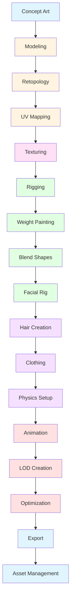

### 1.2 Software Stack

```yaml
Modeling & Sculpting:
  primary: "Blender 3.6 LTS"
  secondary: "ZBrush 2024"
  alternative: "Maya 2024"

Texturing:
  primary: "Substance Painter 2024"
  secondary: "Substance Designer"
  alternative: "Blender"

Rigging:
  primary: "Maya 2024"
  secondary: "Blender"
  alternative: "3ds Max"

Clothing:
  primary: "Marvelous Designer 12"
  secondary: "ZBrush"
  alternative: "Blender"

Animation:
  primary: "Maya 2024"
  secondary: "Blender"
  mocap: "MotionBuilder"

Game Engines:
  primary: "Unity 2023.2 LTS"
  secondary: "Unreal Engine 5.3"

Character Creators:
  - MetaHuman Creator
  - Ready Player Me
  - VRoid Studio
  - Character Creator 4

File Formats:
  interchange: "FBX 2024"
  web: "glTF 2.0"
  universal: "USD 21.08"
  apple_ar: "USDZ"
  vr: "VRM 2.0"
```

### 1.3 Production Timeline

```yaml
Team Size: 5-7 artists
Duration: 8-12 weeks per character

Breakdown:
  Concept Art: 1-2 weeks
  Modeling: 2-3 weeks
  Retopology: 1-2 weeks
  UV Mapping: 3-5 days
  Texturing: 1-2 weeks
  Rigging: 2-3 weeks
  Facial Rig: 1-2 weeks
  Hair: 1-2 weeks
  Clothing: 1-2 weeks
  Physics: 3-5 days
  Animation: 2-3 weeks
  LOD & Optimization: 1 week
  Export & Integration: 3-5 days
```

---

## 2. Concept Art

### 2.1 Purpose
Tạo cơ sở trực quan cho toàn bộ pipeline, định hình phong cách, proportions, và personality của nhân vật.

### 2.2 Deliverables

```yaml
Concept Art Package:
  mood_board:
    - Reference images
    - Color palette
    - Style references
    - Character archetypes
  
  character_sheets:
    - Front view
    - Back view
    - Side view (3/4)
    - Expression sheet (10-15 expressions)
    - Turnaround (360°)
  
  detail_sheets:
    - Facial features
    - Hair details
    - Clothing details
    - Accessories
    - Texture references
  
  color_script:
    - Primary colors
    - Secondary colors
    - Accent colors
    - Material references
```

### 2.3 Character Design Considerations

```yaml
Design Principles:
  silhouette: "Readable from distance"
  proportions: "Appealing, stylized or realistic"
  personality: "Expressed through design"
  appeal: "Emotional connection"
  
Technical Constraints:
  poly_budget: "High-poly: 100K-500K, Low-poly: 15K-50K"
  texture_resolution: "4K for hero, 2K for LODs"
  bone_count: "< 200 bones for realtime"
  blend_shapes: "< 100 for performance"
  
AR-Specific Considerations:
  scale: "Tabletop scale (10-30cm)"
  lighting: "Works in various lighting"
  readability: "Clear at small sizes"
  materials: "PBR compatible"
```

### 2.4 Tools & Techniques

```yaml
Tools:
  - Photoshop
  - Procreate
  - Krita
  - Blender (Grease Pencil)
  
Techniques:
  - Gesture drawing
  - Thumbnailing
  - Color theory
  - Shape language
  - Visual storytelling
```

### 2.5 Approval Process

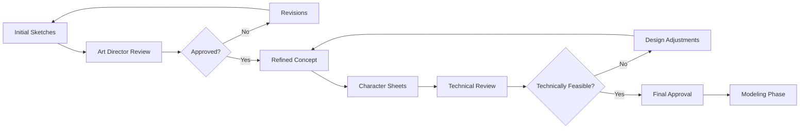

---

## 3. Modeling

### 3.1 Purpose
Tạo mesh 3D cơ bản từ concept art với correct topology cho animation và deformation.

### 3.2 High-Poly Modeling (Sculpting)

#### 3.2.1 Workflow

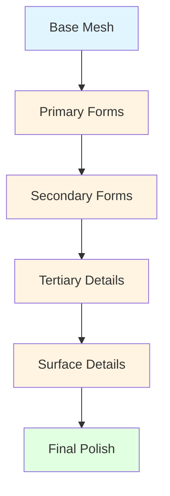

#### 3.2.2 Sculpting Stages

```yaml
Stage 1: Base Mesh (Blocking)
  objective: "Establish proportions and silhouette"
  polygon_count: "500-2,000"
  time: "1-2 days"
  focus:
    - Overall proportions
    - Silhouette
    - Major forms
    - Symmetry
  
Stage 2: Primary Forms
  objective: "Define major anatomical structures"
  polygon_count: "5,000-20,000"
  time: "2-3 days"
  focus:
    - Muscle groups
    - Bone structure
    - Major features
    - Clothing major shapes
  
Stage 3: Secondary Forms
  objective: "Add intermediate details"
  polygon_count: "50,000-100,000"
  time: "3-5 days"
  focus:
    - Facial features
    - Hair flow
    - Clothing folds
    - Accessories
  
Stage 4: Tertiary Details
  objective: "Fine details and texture prep"
  polygon_count: "500,000-2,000,000"
  time: "3-5 days"
  focus:
    - Skin pores
    - Wrinkles
    - Fabric weave
    - Surface imperfections
  
Stage 5: Surface Details
  objective: "Micro-surface details"
  polygon_count: "2,000,000-10,000,000"
  time: "2-3 days"
  focus:
    - Pores and imperfections
    - Stitching
    - Hair strands
    - Wear and tear
```

#### 3.2.3 Sculpting Tools

```yaml
ZBrush Brushes:
  primary:
    - Standard brush
    - Clay Buildup
    - Dam Standard
    - Move
    - Smooth
  
  detail:
    - Slash 3
    - TrimSmoothBorder
    - Inflate
    - Pinch
    - Crease
  
  specialized:
    - Orbital Cracks
    - Layer
    - Smooth Valleys
    - Mallet
    - Elastic

Blender Sculpting:
  brushes:
    - Draw
    - Clay Strips
    - Crease
    - Fill
    - Flatten
    - Scrape
    - Smooth
  
  modes:
    - Dyntopo
    - Multires
    - Voxel Remesher
```

#### 3.2.4 Anatomy Reference

```yaml
Head Proportions:
  - Eyes: Midline of head
  - Nose: Length equals ear height
  - Mouth: Between nose and chin
  - Ears: Top at brow line, bottom at nose base
  
Body Proportions (8 heads tall):
  - Head: 1 unit
  - Neck: 0.5 unit
  - Torso: 3 units
  - Legs: 3.5 units
  
Facial Features:
  - Eye spacing: One eye width apart
  - Face thirds: Hairline to brow, brow to nose, nose to chin
  - Lip width: Distance between pupils
```

### 3.3 Low-Poly Modeling (Game-Ready)

#### 3.3.1 Topology Guidelines

```yaml
Topology Principles:
  edge_flow: "Follows muscle and deformation lines"
  polygon_count: "15,000-50,000 for realtime"
  tri_count: "30,000-100,000 triangles"
  ngons: "Avoid all ngons"
  poles: "Minimize poles, place strategically"
  
Edge Flow Rules:
  - Around eyes: Circular flow
  - Around mouth: Radial flow
  - Joints: Concentric rings
  - Deformation areas: Uniform quads
  
Polygon Budget Allocation:
  head: "30-40%"
  torso: "25-30%"
  arms: "15-20%"
  legs: "15-20%"
  hands/feet: "5-10%"
```

#### 3.3.2 Topology Diagram

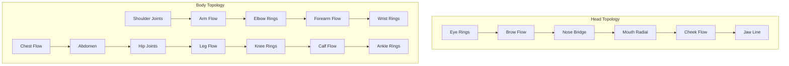

#### 3.3.3 Modeling Workflow

```yaml
Step 1: Block Out
  objective: "Rough form with correct proportions"
  tools: "Box modeling"
  time: "1-2 days"
  
Step 2: Refine Forms
  objective: "Add secondary details"
  tools: "Edge loop insertion"
  time: "2-3 days"
  
Step 3: Edge Flow
  objective: "Optimize for deformation"
  tools: "Edge slide, rotate"
  time: "2-3 days"
  
Step 4: Clean Up
  objective: "Remove ngons, fix poles"
  tools: "Clean up tools"
  time: "1-2 days"
  
Step 5: Final Polish
  objective: "Final tweaks and optimization"
  tools: "Vertex manipulation"
  time: "1 day"
```

### 3.4 Modeling Best Practices

```yaml
General:
  - Work in quads
  - Maintain uniform edge density
  - Avoid triangles in deformation areas
  - Keep mesh watertight
  - Check silhouette from all angles
  
For Animation:
  - Edge flow follows deformation
  - Adequate geometry at joints
  - No pinching when bent
  - Smooth deformation
  
For Realtime:
  - Optimize polygon count
  - Minimize hidden geometry
  - Backface culling
  - LOD-friendly topology
```

---

## 4. Retopology

### 4.1 Purpose
Tạo topology sạch, tối ưu cho animation từ high-poly sculpt.

### 4.2 Retopology Workflow

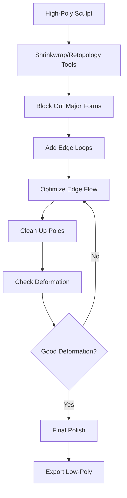

### 4.3 Retopology Tools

```yaml
Automatic:
  - ZBrush ZRemesher
  - Blender Remesh Modifier
  - Maya Quad Draw
  - TopoGun
  
Manual:
  - Blender Retopology Tools
  - Maya Quad Draw
  - 3ds Max Graphite Tools
  - Modo
  
Hybrid:
  - Automatic base
  - Manual refinement
  - Focus on deformation areas
```

### 4.4 Retopology Guidelines

```yaml
Density Guidelines:
  face: "Higher density for expressions"
  joints: "Concentric rings at joints"
  deformation: "Higher density where needed"
  static: "Lower density for static areas"
  
Edge Flow:
  eyes: "Circular flow around eyes"
  mouth: "Radial flow from mouth"
  joints: "Flow follows muscle direction"
  body: "Follows anatomical structure"
  
Pole Management:
  e_poles: "Place at vertices (5 edges)"
  n_poles: "Place at flat areas (3 edges)"
  avoid: "Poles in deformation areas"
  minimize: "Total pole count"
```

### 4.5 Retopology by Body Part

```yaml
Head:
  polygon_count: "3,000-5,000"
  focus: "Facial deformation"
  special: "Eye and mouth flow"
  
Torso:
  polygon_count: "4,000-6,000"
  focus: "Breathing, twisting"
  special: "Shoulder and hip joints"
  
Arms:
  polygon_count: "2,000-3,000 each"
  focus: "Elbow, wrist deformation"
  special: "Shoulder joint"
  
Legs:
  polygon_count: "3,000-4,000 each"
  focus: "Knee, ankle deformation"
  special: "Hip joint"
  
Hands:
  polygon_count: "1,000-2,000 each"
  focus: "Finger articulation"
  special: "Knuckle joints"
  
Feet:
  polygon_count: "500-1,000 each"
  focus: "Toe articulation"
  special: "Ankle joint"
```

---

## 5. UV Mapping

### 5.1 Purpose
Tạo UV coordinates để texture map 2D lên mesh 3D.

### 5.2 UV Mapping Workflow

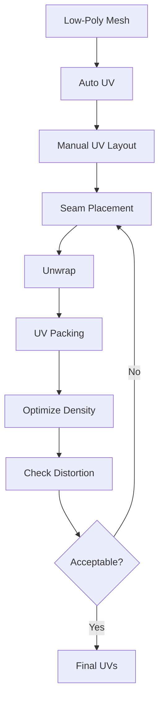

### 5.3 UV Mapping Tools

```yaml
Tools:
  - Blender UV Editor
  - Maya UV Editor
  - RizomUV
  - Headus UVLayout
  - 3ds Max UV Editor
  
Automated:
  - Blender Smart UV Project
  - Maya Automatic Mapping
  - ZBrush UV Master
  
Manual:
  - Blender Unwrap
  - Maya Unfold
  - Live UV tools
```

### 5.4 UV Layout Guidelines

```yaml
UV Space:
  - Use 0-1 UV space
  - Avoid overlapping UVs
  - Minimize stretching
  - Consistent texel density
  
Seam Placement:
  - Hide seams in natural areas
  - Under hair, behind ears
  - Inside clothing
  - Natural break points
  
Texel Density:
  face: "Higher density (important)"
  body: "Medium density"
  accessories: "Variable density"
  target: "5-10 pixels per mm"
  
UV Islands:
  - Separate by material
  - Logical grouping
  - Efficient packing
  - Minimize islands
```

### 5.5 UV Mapping by Body Part

```yaml
Head:
  uv_space: "30-40% of 0-1"
  seams: "Behind ears, top of head"
  density: "High"
  
Body:
  uv_space: "40-50% of 0-1"
  seams: "Under arms, inner legs"
  density: "Medium"
  
Hands/Feet:
  uv_space: "10-15% of 0-1"
  seams: "Between fingers, toes"
  density: "High"
  
Clothing:
  uv_space: "Separate UV set"
  seams: "Hidden locations"
  density: "Medium-High"
```

### 5.6 Multiple UV Sets

```yaml
UV Set 1: Base Color
  purpose: "Diffuse/albedo texture"
  resolution: "4K"
  
UV Set 2: Normal Map
  purpose: "Normal detail from high-poly"
  resolution: "4K"
  
UV Set 3: Roughness/Metallic
  purpose: "Material properties"
  resolution: "2K"
  
UV Set 4: AO/Cavity
  purpose: "Ambient occlusion, cavity"
  resolution: "2K"
  
UV Set 5: Lightmap
  purpose: "Baked lighting"
  resolution: "Variable"
```

---

## 6. Texturing

### 6.1 Purpose
Tạo texture maps để định hình appearance, material, và surface detail.

### 6.2 Texture Maps

```yaml
PBR Texture Set:
  base_color:
    purpose: "Albedo/diffuse color"
    format: "8-bit or 16-bit PNG"
    resolution: "4K"
    channels: "RGB"
  
  normal:
    purpose: "Surface normal detail"
    format: "16-bit PNG or TGA"
    resolution: "4K"
    channels: "RGB (tangent space)"
  
  roughness:
    purpose: "Surface roughness"
    format: "8-bit PNG"
    resolution: "2K"
    channels: "Grayscale"
  
  metallic:
    purpose: "Metallic workflow"
    format: "8-bit PNG"
    resolution: "2K"
    channels: "Grayscale"
  
  ao:
    purpose: "Ambient occlusion"
    format: "8-bit PNG"
    resolution: "2K"
    channels: "Grayscale"
  
  cavity:
    purpose: "Cavity/curvature"
    format: "8-bit PNG"
    resolution: "2K"
    channels: "Grayscale"
  
  displacement:
    purpose: "Height detail"
    format: "16-bit PNG or EXR"
    resolution: "4K"
    channels: "Grayscale"
  
  thickness:
    purpose: "Subsurface scattering"
    format: "8-bit PNG"
    resolution: "2K"
    channels: "Grayscale"
  
  emissive:
    purpose: "Self-illumination"
    format: "8-bit PNG"
    resolution: "2K"
    channels: "RGB"
```

### 6.3 Texturing Workflow

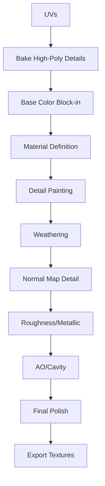

### 6.4 Texturing Tools

```yaml
Substance Painter:
  features:
    - Smart materials
    - Procedural generators
    - Baking from high-poly
    - Layer-based painting
    - Particle brushes
  
  workflow:
    - Import low-poly and high-poly
    - Bake maps
    - Apply base materials
    - Add detail layers
    - Paint unique details
    - Export maps

Substance Designer:
  features:
    - Node-based procedural
    - Material creation
    - Pattern generation
    - Texture synthesis
  
  use_cases:
    - Tiling textures
    - Material patterns
    - Complex surfaces

Blender Texture Paint:
  features:
    - 3D painting
    - Texture projection
    - Vertex painting
    - Image editing
  
  use_cases:
    - Quick touch-ups
    - Unique details
    - Vertex color work
```

### 6.5 Material Definition

```yaml
Skin Material:
  base_color: "Skin tone variation"
  roughness: "0.3-0.5"
  metallic: "0.0"
  subsurface: "Enabled"
  thickness: "From texture"
  
Hair Material:
  base_color: "Hair color with variation"
  roughness: "0.6-0.8"
  metallic: "0.0"
  anisotropic: "Enabled"
  
Clothing Material:
  base_color: "Fabric color"
  roughness: "0.7-0.9"
  metallic: "0.0"
  normal: "Fabric weave"
  
Metal Material:
  base_color: "Metal color"
  roughness: "0.2-0.4"
  metallic: "1.0"
  normal: "Scratches, wear"
  
Eye Material:
  base_color: "Iris color"
  roughness: "0.1-0.3"
  metallic: "0.0"
  subsurface: "Enabled"
  normal: "Cornea detail"
```

### 6.6 Texturing Best Practices

```yaml
General:
  - Use reference images
  - Maintain consistent texel density
  - Work from large to small
  - Use layers for non-destructive work
  - Test in engine frequently
  
PBR Accuracy:
  - Follow PBR guidelines
  - Use correct roughness values
  - Proper metallic workflow
  - Realistic material response
  
Optimization:
  - Compress textures appropriately
  - Use texture atlasing when possible
  - Consider LOD texture sizes
  - Avoid unnecessary detail
```

---

## 7. Rigging

### 7.1 Purpose
Tạo skeleton (bones) và controls để animator có thể deform mesh.

### 7.2 Rigging Workflow

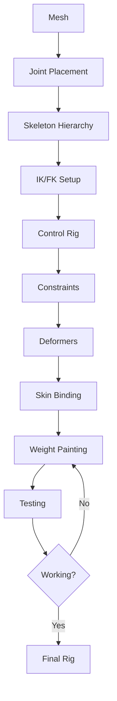

### 7.3 Skeleton Structure

```yaml
Root Hierarchy:
  root:
    - hips_root
    - hips_joint
    - spine_01
    - spine_02
    - spine_03
    - neck_01
    - neck_02
    - head_joint
  
  Arms:
    - clavicle_l
    - shoulder_l
    - elbow_l
    - wrist_l
    - hand_l
    - thumb_01_l to thumb_03_l
    - index_01_l to index_03_l
    - middle_01_l to middle_03_l
    - ring_01_l to ring_03_l
    - pinky_01_l to pinky_03_l
  
  Legs:
    - hip_joint_l
    - knee_l
    - ankle_l
    - ball_l
    - toe_l
  
  Additional:
    - breast_joints (female)
    - clothing_joints
    - accessory_joints
```

### 7.4 Rigging Systems

```yaml
IK/FK Switch:
  arms: "IK/FK blend"
  legs: "IK only"
  spine: "FK with controls"
  
Reverse Kinematics:
  purpose: "Foot planting, reaching"
  controls:
    - IK handle
    - Pole vector
    - IK/FK switch
    - Foot roll
  
Forward Kinematics:
  purpose: "Natural movement"
  controls:
    - Rotate controls
    - Local space
    - Gimbal lock prevention
  
Spine Rig:
  type: "Spline IK or FK chain"
  controls:
    - Hip control
    - Spine controls
    - Chest control
    - Neck control
    - Head control
  
Facial Rig:
  type: "Blend shapes + joints"
  controls:
    - Facial curves
    - Eye controls
    - Jaw control
    - Phoneme controls
```

### 7.5 Control Rig

```yaml
Control Hierarchy:
  global:
    - Global control (world space)
    - Root control (character space)
  
  body:
    - Hip control
    - Spine controls
    - Chest control
    - Head control
  
  arms:
    - Shoulder controls
    - Elbow controls
    - Wrist controls
    - Finger controls
    - Thumb controls
  
  legs:
    - Hip controls
    - Knee controls
    - Ankle controls
    - Foot controls
    - Toe controls
  
  facial:
    - Eye aim controls
    - Jaw control
    - Lip controls
    - Brow controls
    - Cheek controls
  
Control Shapes:
  - Distinctive shapes per control
  - Color-coded (left=blue, right=red)
  - Size indicates importance
  - Oriented for usability
```

### 7.6 Constraints

```yaml
Common Constraints:
  parent: "Parent-child relationship"
  point: "Position only"
  orient: "Rotation only"
  scale: "Scale only"
  aim: "Look at target"
  pole_vector: "IK pole vector"
  geometry: "Follow surface"
  
Constraint Setup:
  - Parent constraints for controls
  - Aim constraints for eyes
  - Pole vectors for IK
  - Scale constraints for accessories
  - Geometry constraints for props
```

### 7.7 Rigging Tools

```yaml
Maya:
  - HumanIK
  - Advanced Skeleton
  - mGear
  - Rapid Rig
  
Blender:
  - Rigify
  - Meta-Rig
  - Auto-Rig Pro
  
Unreal:
  - Control Rig
  - IK Rig
  - Animation Blueprint
```

---

## 8. Weight Painting

### 8.1 Purpose
Gán weights từ bones đến vertices để mesh deform đúng cách.

### 8.2 Weight Painting Workflow

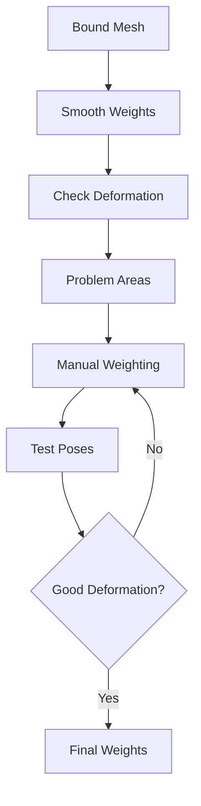

### 8.3 Weight Painting Guidelines

```yaml
Weight Distribution:
  - Smooth falloff between joints
  - No hard edges (unless intentional)
  - Sum of weights = 1.0 per vertex
  - Proper influence overlap
  
Common Problems:
  - "Candy wrapper" effect
  - Volume loss
  - Joint popping
  - Unnatural deformation
  
Solutions:
  - Smooth weights
  - Add helper joints
  - Use corrective shapes
  - Add deformation helpers
```

### 8.4 Weight Painting by Body Part

```yaml
Shoulder:
  challenge: "Complex deformation"
  solution: "Multiple joints, clavicle, scapula"
  
Elbow:
  challenge: "Volume preservation"
  solution: "3-joint setup, helper joints"
  
Hip:
  challenge: "Large deformation area"
  solution: "Pelvis joints, glute muscles"
  
Knee:
  challenge: "Volume preservation"
  solution: "3-joint setup, helper joints"
  
Fingers:
  challenge: "Many joints, small area"
  solution: "Careful weighting, collision"
  
Face:
  challenge: "Subtle deformations"
  solution: "Blend shapes primarily"
```

### 8.5 Weight Painting Tools

```yaml
Tools:
  - Smooth brush
  - Add brush
  - Subtract brush
  - Linear gradient
  - Weight query
  
Techniques:
  - Mirror weights (left/right)
  - Copy weights (similar areas)
  - Weight normalization
  - Weight locking
```

---

## 9. Blend Shapes

### 9.1 Purpose
Tạo morph targets cho facial expressions và phonemes.

### 9.2 Blend Shape Categories

```yaml
Visemes (Phonemes):
  - sil (silence)
  - pp (p, b, m)
  - ff (f, v)
  - th (th, d)
  - dd (d, t, n, l, s, z)
  - kk (k, g, ng, ch, j)
  - ee (e, i)
  - ah (a, e)
  - oh (o, u)
  - aa (a)
  
Expressions:
  neutral:
    - Neutral
    - Blink
    - Squint
  
  happy:
    - Smile
    - Laugh
    - Smirk
  
  sad:
    - Sad
    - Cry
    - Frown
  
  angry:
    - Angry
    - Rage
    - Annoyed
  
  surprised:
    - Surprised
    - Shocked
    - Amazed
  
  other:
    - Confused
    - Thinking
    - Embarrassed
    - Bored
    - Excited
  
Modifiers:
  eyes:
    - Look up/down/left/right
    - Widen
    - Squint
  
  mouth:
    - Open
    - Close
    - Smile corner
    - Frown corner
  
  brows:
    - Raise left/right
    - Lower left/right
    - Squeeze
  
  nose:
    - Flare
    - Wrinkle
  
  cheeks:
    - Puff
    - Raise
```

### 9.3 Blend Shape Creation Workflow

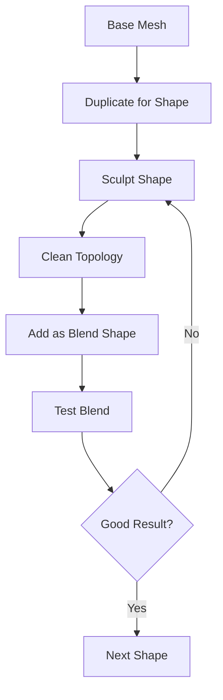

### 9.4 Blend Shape Best Practices

```yaml
General:
  - Start from neutral base
  - Work systematically
  - Keep topology consistent
  - Don't move base vertices
  - Test combinations
  
Optimization:
  - Minimize shape count
  - Use corrective shapes
  - Combine similar shapes
  - Use pose space deformations
  
Performance:
  - < 100 blend shapes total
  - < 50 facial shapes
  - Use blend shape limits
  - Optimize GPU usage
```

### 9.5 Viseme Mapping

```yaml
Phoneme to Viseme Mapping:
  A -> aa
  B -> pp
  C -> kk
  D -> dd
  E -> ee
  F -> ff
  G -> kk
  H -> aa
  I -> ee
  J -> dd
  K -> kk
  L -> dd
  M -> pp
  N -> dd
  O -> oh
  P -> pp
  Q -> kk
  R -> dd
  S -> dd
  T -> dd
  U -> oh
  V -> ff
  W -> oo
  X -> kk
  Y -> ah
  Z -> dd
```

---

## 10. Facial Rig

### 10.1 Purpose
Tạo controls để animate facial expressions và lip sync.

### 10.2 Facial Rig Approaches

```yaml
Blend Shape Based:
  advantages:
    - High quality
    - Artist-friendly
    - Subtle control
  
  disadvantages:
    - Memory intensive
    - Limited combinations
  
Joint Based:
  advantages:
    - Performance
    - Real-time friendly
  
  disadvantages:
    - Less detailed
    - Complex setup
  
Hybrid:
  advantages:
    - Best of both
    - Optimized quality
  
  disadvantages:
    - Complex setup
    - More maintenance
```

### 10.3 Facial Rig Components

```yaml
Eye Rig:
  joints:
    - Eye_L/joint
    - Eye_R/joint
    - Eyelid_Upper_L/joint
    - Eyelid_Upper_R/joint
    - Eyelid_Lower_L/joint
    - Eyelid_Lower_R/joint
  
  controls:
    - Eye_L_ctrl
    - Eye_R_ctrl
    - Eyes_ctrl (both)
    - Blink_L_ctrl
    - Blink_R_ctrl
    - Squint_L_ctrl
    - Squint_R_ctrl
  
  blend_shapes:
    - Blink_L
    - Blink_R
    - Look_Up
    - Look_Down
    - Look_Left
    - Look_Right
    - Squint_L
    - Squint_R

Mouth Rig:
  joints:
    - Jaw_joint
    - Lip_Corner_L/joint
    - Lip_Corner_R/joint
    - Lip_Upper_L/joint
    - Lip_Upper_R/joint
    - Lip_Lower_L/joint
    - Lip_Lower_R/joint
  
  controls:
    - Jaw_ctrl
    - Mouth_ctrl
    - Lip_Corner_L_ctrl
    - Lip_Corner_R_ctrl
  
  blend_shapes:
    - Jaw_Open
    - Jaw_Close
    - Smile
    - Frown
    - Lip_Corner_L_Up
    - Lip_Corner_R_Up
    - Lip_Corner_L_Down
    - Lip_Corner_R_Down

Brow Rig:
  joints:
    - Brow_Inner_L/joint
    - Brow_Inner_R/joint
    - Brow_Outer_L/joint
    - Brow_Outer_R/joint
  
  controls:
    - Brow_L_ctrl
    - Brow_R_ctrl
  
  blend_shapes:
    - Brow_Raise_L
    - Brow_Raise_R
    - Brow_Lower_L
    - Brow_Lower_R
    - Brow_Squeeze

Cheek Rig:
  blend_shapes:
    - Cheek_Puff_L
    - Cheek_Puff_R
    - Cheek_Raise_L
    - Cheek_Raise_R

Nose Rig:
  blend_shapes:
    - Nose_Flare
    - Nose_Wrinkle
```

### 10.4 Facial Rig Setup

```yaml
Step 1: Eye Setup
  - Create eye joints
  - Aim constraints for look
  - Eyelid blend shapes
  - Blink controls
  
Step 2: Jaw Setup
  - Create jaw joint
  - Jaw control
  - Jaw open/close blend shapes
  
Step 3: Mouth Setup
  - Mouth corner joints
  - Lip controls
  - Mouth blend shapes
  
Step 4: Brow Setup
  - Brow joints or blend shapes
  - Brow controls
  
Step 5: Additional Setup
  - Cheek blend shapes
  - Nose blend shapes
  - Ears if needed
```

### 10.5 Facial Rig Testing

```yaml
Test Poses:
  - Neutral
  - Blink
  - Smile
  - Frown
  - Surprised
  - Angry
  - Sad
  - All visemes
  - Expression combinations
  
Validation:
  - No mesh intersection
  - Smooth deformation
  - Natural movement
  - Correct eye direction
  - Proper jaw rotation
```

---

## 11. Hair Creation

### 11.1 Purpose
Tạo tóc thực tế với proper deformation và physics.

### 11.2 Hair Approaches

```yaml
Mesh Hair:
  advantages:
    - Performance friendly
    - Good control
    - Styling easy
  
  disadvantages:
    - Less realistic
    - Limited movement
  
Particle Hair:
  advantages:
    - Very realistic
    - Natural movement
  
  disadvantages:
    - Performance heavy
    - Complex setup
  
Hair Cards:
  advantages:
    - Balance of quality/performance
    - Industry standard
    - Good for games
  
  disadvantages:
    - Time-consuming
    - Requires skill
  
XGen/Grooming:
  advantages:
    - Film quality
    - Realistic rendering
  
  disadvantages:
    - Not realtime
    - Heavy performance
```

### 11.3 Hair Card Workflow

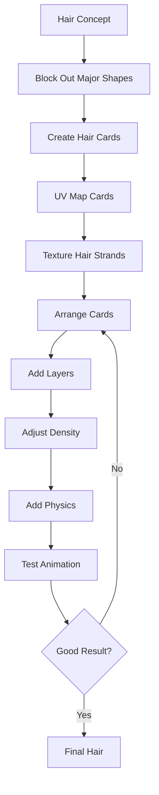

### 11.4 Hair Card Creation

```yaml
Hair Card Design:
  geometry:
    - Plane geometry
    - 2-4 vertices wide
    - 10-20 vertices high
    - Curved for natural look
  
  uv_mapping:
    - Hair strand texture
    - Proper flow
    - Minimal stretching
  
  placement:
    - Follow hair direction
    - Layered from back to front
    - Vary density by area
    - Cross-hatch for volume

Hair Texture:
  base_color:
    - Hair color gradient
    - Strand detail
    - Root to tip variation
  
  alpha:
    - Strand shape
    - Soft edges
    - Proper antialiasing
  
  normal:
    - Strand direction
    - Surface detail
  
  roughness:
    - Shininess variation
    - Highlight control
```

### 11.5 Hair Physics

```yaml
Physics Setup:
  collision:
    - Head collision
    - Body collision
    - Clothing collision
  
  constraints:
    - Root constraints
    - Stiffness
    - Damping
    - Mass
  
  simulation:
    - Wind
    - Movement
    - Gravity
  
Optimization:
  - Limit physics bones
  - Use simplified collision
  - LOD physics
  - Bake when possible
```

### 11.6 Hair Tools

```yaml
Modeling:
  - Blender Hair Cards
  - Maya XGen
  - Ornatrix
  
Grooming:
  - Blender Particle Hair
  - Maya XGen
  - Houdini Grooming
  
Texturing:
  - Substance Painter
  - Photoshop
  - Hair strand generators
```

---

## 12. Clothing

### 12.1 Purpose
Tạo quần áo với proper fitting, deformation, và physics.

### 12.2 Clothing Approaches

```yaml
Modeled Clothing:
  advantages:
    - Control
    - Specific design
    - Performance
  
  disadvantages:
    - Time-consuming
    - Less realistic
  
Marvelous Designer:
  advantages:
    - Realistic pattern
    - Natural draping
    - Fast workflow
  
  disadvantages:
    - Learning curve
    - Cleanup required
  
Hybrid:
  advantages:
    - Best of both
    - Optimized workflow
  
  disadvantages:
    - More complex
```

### 12.3 Marvelous Designer Workflow

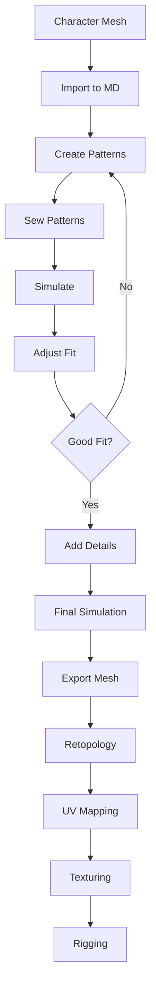

### 12.4 Clothing Components

```yaml
Pattern Creation:
  blocks:
    - Torso block
    - Sleeve block
    - Pant block
    - Skirt block
  
  tools:
    - Pattern tools
    - Measuring tools
    - Arrangement
  
  considerations:
    - Seam placement
    - Stretch allowance
    - Fitting to character
  
Simulation:
  properties:
    - Fabric type
    - Stiffness
    - Damping
    - Friction
  
  animation:
    - Walk cycle
    - Wind
    - Movement
  
  optimization:
    - Particle count
    - Simulation quality
    - Cache settings
```

### 12.5 Clothing Rigging

```yaml
Rigging Approach:
  skin_binding:
    - Weight painting
    - Joint influence
    - Collision handling
  
  simulation:
    - Cloth simulation
    - Physics bones
    - Collision objects
  
  hybrid:
    - Skin binding for tight areas
    - Simulation for loose areas
  
Special Considerations:
  - Shoulder deformation
  - Elbow/knee areas
  - Waist/belt areas
  - Clothing layers
```

### 12.6 Clothing Tools

```yaml
Pattern Making:
  - Marvelous Designer
  - CLO3D
  - Browzwear
  
Modeling:
  - Blender
  - Maya
  - ZBrush
  
Simulation:
  - Marvelous Designer
  - Maya nCloth
  - Unreal Cloth
```

---

## 13. Physics Setup

### 13.1 Purpose
Cấu hình physics cho realistic movement và interaction.

### 13.2 Physics Components

```yaml
Cloth Physics:
  settings:
    - Mass
    - Stiffness
    - Damping
    - Friction
    - Wind resistance
  
  collision:
    - Self collision
    - Body collision
    - Environment collision
  
  constraints:
    - Pin constraints
    - Sewing constraints
    - Stiffness constraints

Hair Physics:
  settings:
    - Stiffness
    - Damping
    - Mass
    - Gravity
  
  collision:
    - Head collision
    - Body collision
  
  constraints:
    - Root constraints
    - Stiffness along strand

Breast Physics:
  settings:
    - Mass
    - Stiffness
    - Damping
  
  collision:
    - Body collision
    - Clothing collision
  
  constraints:
    - Root constraints
    - Stiffness
```

### 13.3 Physics Optimization

```yaml
Optimization Strategies:
  collision:
    - Simplified collision meshes
    - Reduced collision checks
    - Spatial partitioning
  
  simulation:
    - Reduced particle count
    - LOD physics
    - Baked physics
    - Distance-based simulation
  
  performance:
    - GPU physics when possible
    - Async simulation
    - Caching
```

### 13.4 Physics Tools

```yaml
Game Engines:
  - Unity Cloth
  - Unreal Chaos Physics
  
Modeling:
  - Maya nCloth
  - Blender Cloth
  
Simulation:
  - Marvelous Designer
  - ZBrush fibers
```

---

## 14. Animation

### 14.1 Purpose
Tạo animations cho character movement và expressions.

### 14.2 Animation Categories

```yaml
Idle Animations:
  - Idle (standing)
  - Idle (sitting)
  - Idle (looking around)
  - Idle (breathing)
  - Idle (checking phone)
  
Movement:
  - Walk (forward, backward, strafe)
  - Run (forward, backward, strafe)
  - Jump (stand, run)
  - Crouch (walk, idle)
  - Climb
  - Turn (90°, 180°)
  
Interaction:
  - Wave
  - Point
  - Nod
  - Shake head
  - Thumbs up
  - Clap
  - Dance
  
Emotional:
  - Laugh
  - Cry
  - Angry gesture
  - Happy bounce
  - Sad slump
  - Surprised reaction
  
Task-based:
  - Typing
  - Reading
  - Eating
  - Drinking
  - Using phone
  - Working on computer
  
Transitions:
  - Idle to Walk
  - Walk to Run
  - Jump land
  - Sit to Stand
  - All to Idle
```

### 14.3 Animation Pipeline

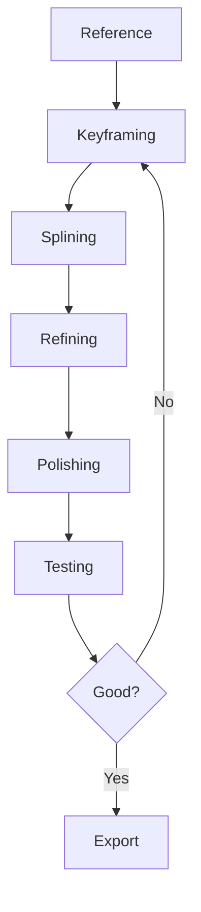

### 14.4 Animation Standards

```yaml
Frame Rate:
  - 30 FPS (games)
  - 24 FPS (film)
  - 60 FPS (high-end)
  
Naming Convention:
  format: "Character_Action_Variant"
  examples:
    - "Companion_Walk_Fwd"
    - "Companion_Idle_01"
    - "Companion_Wave_Happy"
  
Root Motion:
  - Enable for locomotion
  - Disable for in-place
  - Consistent orientation
  
Looping:
  - Seamless loops
  - Frame 1 = Frame N
  - Smooth transitions
```

### 14.5 Animation Tools

```yaml
Keyframe Animation:
  - Maya
  - Blender
  - MotionBuilder
  
Motion Capture:
  - Rokoko
  - Xsens
  - Perception Neuron
  - OptiTrack
  
Cleanup:
  - Maya
  - MotionBuilder
  - Unreal Control Rig
```

### 14.6 Animation Blending

```yaml
Blend Tree:
  idle:
    - Idle_01
    - Idle_02
    - Idle_03
  
  locomotion:
    - Walk_Fwd
    - Walk_Bwd
    - Run_Fwd
    - Run_Bwd
  
  layers:
    - Base layer (movement)
    - Additive layer (upper body)
    - Facial layer (expressions)
  
Blend Weights:
  - Smooth transitions
  - Proper fade times
  - Layer priorities
```

---

## 15. LOD Creation

### 15.1 Purpose
Tạo Level of Detail versions cho performance optimization.

### 15.2 LOD Levels

```yaml
LOD0 (Hero):
  polygon_count: "50,000-100,000"
  texture_resolution: "4K"
  use: "Close-up, main character"
  
LOD1 (High):
  polygon_count: "25,000-50,000"
  texture_resolution: "2K"
  use: "Medium distance"
  
LOD2 (Medium):
  polygon_count: "10,000-25,000"
  texture_resolution: "1K"
  use: "Far distance"
  
LOD3 (Low):
  polygon_count: "5,000-10,000"
  texture_resolution: "512"
  use: "Very far distance"
  
LOD4 (Placeholder):
  polygon_count: "1,000-5,000"
  texture_resolution: "256"
  use: "Background, extreme distance"
```

### 15.3 LOD Creation Workflow

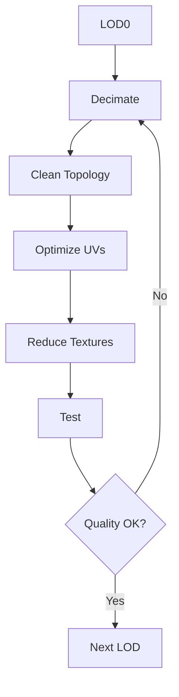

### 15.4 LOD Optimization Techniques

```yaml
Polygon Reduction:
  - Automatic decimation
  - Manual cleanup
  - Remove unseen geometry
  - Merge small details
  
Texture Optimization:
  - Reduce resolution
  - Texture atlasing
  - Channel packing
  - Compression
  
Rig Optimization:
  - Remove small bones
  - Simplify IK
  - Reduce blend shapes
  - Optimize skinning
```

### 15.5 LOD Tools

```yaml
Polygon Reduction:
  - Blender Decimate
  - Maya Reduce
  - Simplygon
  - InstaLOD
  
Texture Optimization:
  - Substance Painter
  - Photoshop
  - Texture compression tools
  
Testing:
  - Unity LOD Group
  - Unreal LOD System
  - Marmoset Toolbag
```

---

## 16. Optimization

### 16.1 Purpose
Tối ưu hóa character cho realtime performance.

### 16.2 Optimization Checklist

```yaml
Geometry:
  - Polygon count within budget
  - Clean topology
  - No ngons
  - Optimize vertex count
  - Remove hidden faces
  
Textures:
  - Proper resolution
  - Compressed formats
  - Texture atlasing
  - Channel packing
  - Mipmaps enabled
  
Rigging:
  - Bone count optimized
  - No unnecessary bones
  - Efficient IK
  - Optimized skinning
  - Blend shape count
  
Animation:
  - Optimized clip count
  - Compressed curves
  - Root motion handled
  - Looping correct
  - Transition times
  
Materials:
  - Shader complexity
  - Texture count
  - Shader variants
  - Instancing support
  - LOD materials
```

### 16.3 Performance Targets

```yaml
Desktop (Target):
  draw_calls: "< 50 per character"
  triangles: "< 100K LOD0"
  bones: "< 200"
  blend_shapes: "< 100"
  texture_memory: "< 100MB"
  
Mobile (Target):
  draw_calls: "< 20 per character"
  triangles: "< 30K LOD0"
  bones: "< 100"
  blend_shapes: "< 50"
  texture_memory: "< 50MB"
  
AR (Target):
  draw_calls: "< 30 per character"
  triangles: "< 50K LOD0"
  bones: "< 150"
  blend_shapes: "< 75"
  texture_memory: "< 75MB"
```

### 16.4 Optimization Tools

```yaml
Profiling:
  - Unity Profiler
  - Unreal Insights
  - RenderDoc
  - NVIDIA Nsight
  
Analysis:
  - Simplygon
  - InstaLOD
  - MeshLab
  - Model Analyzer
  
Testing:
  - Target hardware
  - Stress testing
  - Scene complexity
  - Multiple characters
```

---

## 17. Export

### 17.1 Purpose
Export character với định dạng phù hợp cho game engine.

### 17.2 Export Formats

```yaml
FBX (Primary):
  version: "FBX 2024"
  use: "Game engines, interchange"
  includes:
    - Mesh
    - Skeleton
    - Animations
    - Blend shapes
    - Materials
  
glTF (Web):
  version: "glTF 2.0"
  use: "Web, cross-platform"
  includes:
    - Mesh
    - Materials
    - Animations
    - Skinning
  
USD (Universal):
  version: "USD 21.08"
  use: "Pipeline, interchange"
  includes:
    - Everything
    - Variants
    - Layers
  
USDZ (Apple AR):
  version: "USDZ"
  use: "iOS AR, Apple Vision Pro"
  includes:
    - Optimized for AR
    - Compressed
  
VRM (VR):
  version: "VRM 2.0"
  use: "VR applications"
  includes:
    - VR-optimized
    - VRChat compatible
```

### 17.3 Export Settings

```yaml
FBX Settings:
  geometry:
    - Triangulate: Yes
    - Preserve edge flow: No
    - Smoothing groups: Yes
  
  animation:
    - Bake animation: Yes
    - Resample curves: Yes
    - Frame rate: 30/60
  
  units:
    - Scale: 1.0
    - Axis conversion: Y-up
    - Units: Centimeters
  
  other:
    - Embed media: Yes
    - Copy textures: Yes
    - Binary format: Yes

glTF Settings:
  geometry:
    - Indices: Yes
    - Vertex attributes: All
  
  materials:
    - PBR materials: Yes
    - Texture format: PNG/JPEG
  
  animation:
    - Sampling: Yes
    - FPS: 30
  
  compression:
    - Draco: Optional
    - Basis Universal: Optional
```

### 17.4 Export Workflow

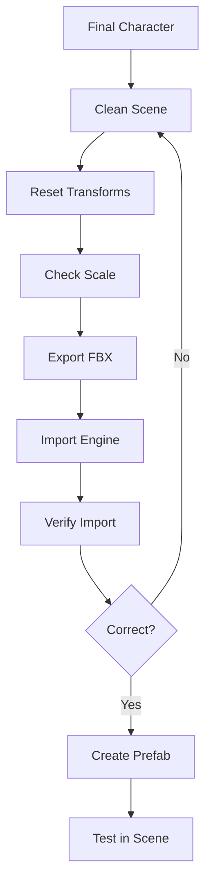

### 17.5 Export Validation

```yaml
Checklist:
  geometry:
    - Mesh intact
    - Correct scale
    - No missing parts
    - Proper orientation
  
  rigging:
    - Skeleton hierarchy
    - Bone names
    - IK/FK controls
    - Skin weights
  
  animation:
    - Clips present
    - Correct names
    - Frame rate
    - Looping
  
  materials:
    - Textures assigned
    - Materials correct
    - Shader compatible
  
  general:
    - File size reasonable
    - No errors in log
    - Performance acceptable
```

---

## 18. Asset Management

### 18.1 Purpose
Quản lý character assets trong pipeline.

### 18.2 Asset Structure

```yaml
File Structure:
  characters/
    character_name/
      source/
        concept/
        modeling/
        sculpting/
        rigging/
        animation/
      
      export/
        fbx/
        gltf/
        usd/
        usdz/
        vrm/
      
      textures/
        lod0/
        lod1/
        lod2/
        lod3/
      
      materials/
        lod0/
        lod1/
        lod2/
        lod3/
      
      previews/
        turnarounds/
        renders/
        screenshots/
  
  shared/
    textures/
    materials/
    brushes/
    scripts/
    templates/
```

### 18.3 Version Control

```yaml
Git:
  tracked:
    - Source files (.blend, .ma, .mb)
    - Scripts
    - Config files
    - Documentation
  
  ignored:
    - Exported files
    - Cache files
    - Autosaves
    - Render outputs
  
Perforce (Alternative):
  tracked:
    - Binary files
    - Large assets
    - All source files
  
  advantages:
    - Better for large files
    - Locking
    - Changelists
```

### 18.4 Naming Conventions

```yaml
Files:
  format: "AssetName_Type_Version_Date"
  examples:
    - "Companion_Modeling_v001_20240115"
    - "Companion_Rigging_v003_20240120"
    - "Companion_Texture_Face_v002_20240122"
  
  characters:
    - Use consistent case
    - No spaces
    - Use underscores
    - Descriptive names
  
Folders:
  format: "Project_Asset_Type"
  examples:
    - "AICompanion_Character_Companion_Modeling"
    - "AICompanion_Shared_Textures_Skin"
```

### 18.5 Asset Tracking

```yaml
Metadata:
  character:
    - Name
    - Version
    - Created by
    - Modified by
    - Creation date
    - Modification date
    - Status (WIP, Review, Final)
  
  technical:
    - Polygon count
    - Texture count
    - Bone count
    - Blend shape count
    - File size
  
  approval:
    - Concept approved by
    - Modeling approved by
    - Rigging approved by
    - Animation approved by
```

### 18.6 Asset Management Tools

```yaml
DAM (Digital Asset Management):
  - Shotgun
  - FTrack
  - Autodesk ShotGrid
  - Perforce Helix
  
Version Control:
  - Git
  - Perforce
  - SVN
  
Project Management:
  - Jira
  - Trello
  - Asana
  - Notion
```

---

## Conclusion

Pipeline tạo nhân vật 3D cho AI Companion bao gồm 18 bước chính từ Concept Art đến Asset Management:

1. **Concept Art**: Tạo foundation visual cho character
2. **Modeling**: Tạo mesh 3D với correct topology
3. **Retopology**: Optimize topology cho animation
4. **UV Mapping**: Tạo UV coordinates cho texturing
5. **Texturing**: Tạo PBR texture maps
6. **Rigging**: Tạo skeleton và controls
7. **Weight Painting**: Gán weights cho deformation
8. **Blend Shapes**: Tạo morph targets cho facial
9. **Facial Rig**: Tạo controls cho facial animation
10. **Hair Creation**: Tạo tóc với physics
11. **Clothing**: Tạo quần áo với proper fitting
12. **Physics Setup**: Cấu hình physics cho realistic movement
13. **Animation**: Tạo animations cho movement và expressions
14. **LOD Creation**: Tạo versions tối ưu cho performance
15. **Optimization**: Tối ưu hóa cho realtime
16. **Export**: Export với định dạng phù hợp
17. **Asset Management**: Quản lý assets trong pipeline

Pipeline này được thiết kế để:
- Sản xuất character chất lượng AAA
- Tối ưu cho realtime AR rendering
- Scaleable cho production
- Follow industry standards
- Support multiple platforms (Unity, Unreal, Web, Mobile, AR/VR)
