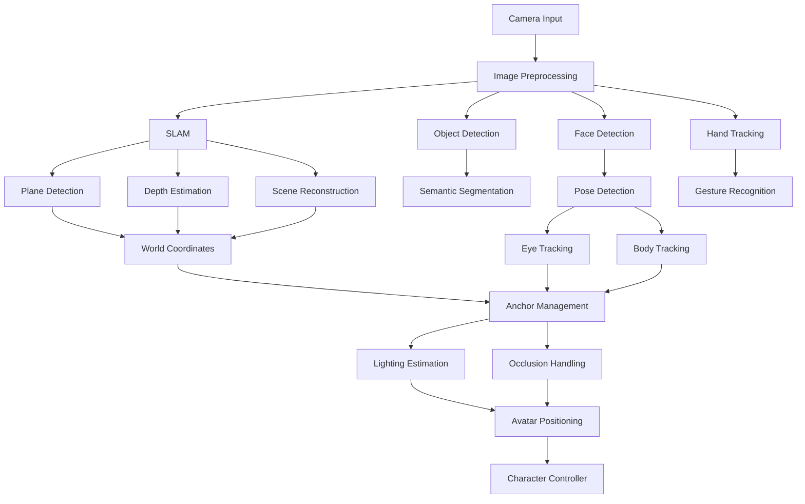

# PHẦN 4: COMPUTER VISION PIPELINE

## Table of Contents
1. [Pipeline Overview](#pipeline-overview)
2. [Camera Input](#camera-input)
3. [SLAM System](#slam-system)
4. [Plane Detection](#plane-detection)
5. [Depth Estimation](#depth-estimation)
6. [Scene Reconstruction](#scene-reconstruction)
7. [Semantic Segmentation](#semantic-segmentation)
8. [Object Detection](#object-detection)
9. [Human Detection](#human-detection)
10. [Pose Detection](#pose-detection)
11. [Face Detection](#face-detection)
12. [Eye Tracking](#eye-tracking)
13. [Hand Tracking](#hand-tracking)
14. [Body Tracking](#body-tracking)
15. [Occlusion Handling](#occlusion-handling)
16. [Lighting Estimation](#lighting-estimation)
17. [Anchor Management](#anchor-management)
18. [World Coordinates](#world-coordinates)
19. [Avatar Positioning](#avatar-positioning)

---

## 1. Pipeline Overview

### 1.1 Complete Vision Pipeline



### 1.2 Technology Stack

```yaml
Computer Vision Libraries:
  opencv:
    version: "4.8.0"
    use: "Image processing, camera calibration"
  
  mediapipe:
    version: "0.10.7"
    use: "Face detection, hand tracking, pose detection"
  
  pytorch:
    version: "2.1.0"
    use: "Deep learning models"
  
  onnx:
    version: "1.15.0"
    use: "Model deployment, optimization"

SLAM:
  orb_slam3:
    version: "Latest"
    use: "Visual SLAM, tracking, mapping"
  
  arcore:
    version: "1.36.0"
    use: "Android AR, plane detection"
  
  arkit:
    version: "6.0"
    use: "iOS AR, plane detection, LiDAR"

Object Detection:
  yolo:
    version: "YOLOv8"
    use: "Real-time object detection"
  
  sam2:
    version: "Segment Anything 2"
    use: "Image segmentation"

Depth Estimation:
  depth_anything:
    version: "Latest"
    use: "Monocular depth estimation"
  
  open3d:
    version: "0.17.0"
    use: "3D processing, point clouds"

AR Frameworks:
  ar_foundation:
    version: "5.0"
    use: "Unity AR, cross-platform"
  
  openxr:
    version: "1.0"
    use: "Standard AR/VR API"
```

---

## 2. Camera Input

### 2.1 Camera Manager

```python
# camera_manager.py
import cv2
import numpy as np
from typing import Optional, Tuple
from dataclasses import dataclass
from enum import Enum

class CameraType(Enum):
    WEBCAM = "webcam"
    IP_CAMERA = "ip_camera"
    AR_CAMERA = "ar_camera"
    DEPTH_CAMERA = "depth_camera"

@dataclass
class CameraConfig:
    camera_type: CameraType
    device_id: int = 0
    resolution: Tuple[int, int] = (1920, 1080)
    fps: int = 30
    buffer_size: int = 1
    auto_exposure: bool = True
    auto_white_balance: bool = True
    exposure: Optional[float] = None
    white_balance: Optional[Tuple[int, int, int]] = None

class CameraManager:
    """
    Manages camera input with support for multiple camera types
    """
    
    def __init__(self, config: CameraConfig):
        self.config = config
        self.camera = None
        self.frame_count = 0
        self.is_running = False
        self.current_frame = None
        self.camera_matrix = None
        self.distortion_coeffs = None
        
    def initialize(self) -> bool:
        """Initialize camera based on configuration"""
        try:
            if self.config.camera_type == CameraType.WEBCAM:
                self.camera = cv2.VideoCapture(self.config.device_id)
            elif self.config.camera_type == CameraType.IP_CAMERA:
                self.camera = cv2.VideoCapture(self.config.device_id)
            else:
                raise ValueError(f"Unsupported camera type: {self.config.camera_type}")
            
            if not self.camera.isOpened():
                return False
            
            # Set camera properties
            self.camera.set(cv2.CAP_PROP_FRAME_WIDTH, self.config.resolution[0])
            self.camera.set(cv2.CAP_PROP_FRAME_HEIGHT, self.config.resolution[1])
            self.camera.set(cv2.CAP_PROP_FPS, self.config.fps)
            self.camera.set(cv2.CAP_PROP_BUFFERSIZE, self.config.buffer_size)
            
            # Set exposure if specified
            if self.config.exposure is not None:
                self.camera.set(cv2.CAP_PROP_EXPOSURE, self.config.exposure)
            
            self.is_running = True
            return True
            
        except Exception as e:
            print(f"Camera initialization failed: {e}")
            return False
    
    def get_frame(self) -> Optional[np.ndarray]:
        """Get current frame from camera"""
        if not self.is_running or self.camera is None:
            return None
        
        ret, frame = self.camera.read()
        if ret:
            self.current_frame = frame
            self.frame_count += 1
            return frame
        return None
    
    def get_calibrated_frame(self) -> Optional[np.ndarray]:
        """Get frame with camera calibration applied"""
        frame = self.get_frame()
        if frame is None or self.camera_matrix is None:
            return frame
        
        return cv2.undistort(frame, self.camera_matrix, self.distortion_coeffs)
    
    def calibrate(self, calibration_images: list, chessboard_size: Tuple[int, int] = (9, 6)) -> bool:
        """
        Calibrate camera using chessboard images
        """
        # Prepare object points
        objp = np.zeros((chessboard_size[0] * chessboard_size[1], 3), np.float32)
        objp[:, :2] = np.mgrid[0:chessboard_size[0], 0:chessboard_size[1]].T.reshape(-1, 2)
        
        objpoints = []
        imgpoints = []
        
        for img in calibration_images:
            gray = cv2.cvtColor(img, cv2.COLOR_BGR2GRAY)
            ret, corners = cv2.findChessboardCorners(gray, chessboard_size, None)
            
            if ret:
                objpoints.append(objp)
                imgpoints.append(corners)
        
        if len(objpoints) == 0:
            return False
        
        # Calibrate camera
        ret, mtx, dist, rvecs, tvecs = cv2.calibrateCamera(
            objpoints, imgpoints, gray.shape[::-1], None, None
        )
        
        if ret:
            self.camera_matrix = mtx
            self.distortion_coeffs = dist
            return True
        
        return False
    
    def release(self):
        """Release camera resources"""
        if self.camera is not None:
            self.camera.release()
        self.is_running = False
    
    def __del__(self):
        self.release()
```

### 2.2 Image Preprocessing

```python
# image_preprocessor.py
import cv2
import numpy as np
from typing import Tuple, Optional

class ImagePreprocessor:
    """
    Preprocesses camera frames for computer vision pipeline
    """
    
    def __init__(self, target_size: Tuple[int, int] = (640, 640)):
        self.target_size = target_size
        self.mean = np.array([0.485, 0.456, 0.406], dtype=np.float32)
        self.std = np.array([0.229, 0.224, 0.225], dtype=np.float32)
    
    def resize(self, image: np.ndarray, maintain_aspect: bool = True) -> np.ndarray:
        """Resize image to target size"""
        if maintain_aspect:
            h, w = image.shape[:2]
            scale = min(self.target_size[0] / w, self.target_size[1] / h)
            new_w = int(w * scale)
            new_h = int(h * scale)
            resized = cv2.resize(image, (new_w, new_h))
            
            # Pad to target size
            pad_h = self.target_size[1] - new_h
            pad_w = self.target_size[0] - new_w
            resized = cv2.copyMakeBorder(
                resized, 0, pad_h, 0, pad_w,
                cv2.BORDER_CONSTANT, value=(0, 0, 0)
            )
            return resized
        else:
            return cv2.resize(image, self.target_size)
    
    def normalize(self, image: np.ndarray) -> np.ndarray:
        """Normalize image for neural network input"""
        image = image.astype(np.float32) / 255.0
        image = (image - self.mean) / self.std
        return image
    
    def augment(self, image: np.ndarray) -> np.ndarray:
        """Apply data augmentation"""
        # Random horizontal flip
        if np.random.random() > 0.5:
            image = cv2.flip(image, 1)
        
        # Random brightness adjustment
        brightness = np.random.uniform(0.8, 1.2)
        image = cv2.convertScaleAbs(image, alpha=brightness, beta=0)
        
        # Random contrast adjustment
        contrast = np.random.uniform(0.8, 1.2)
        image = cv2.convertScaleAbs(image, alpha=contrast, beta=0)
        
        return image
    
    def preprocess(self, image: np.ndarray, augment: bool = False) -> np.ndarray:
        """Complete preprocessing pipeline"""
        processed = self.resize(image)
        
        if augment:
            processed = self.augment(processed)
        
        processed = self.normalize(processed)
        return processed
    
    def denoise(self, image: np.ndarray) -> np.ndarray:
        """Apply denoising filter"""
        return cv2.fastNlMeansDenoisingColored(image, None, 10, 10, 7, 21)
    
    def enhance_contrast(self, image: np.ndarray) -> np.ndarray:
        """Enhance image contrast using CLAHE"""
        lab = cv2.cvtColor(image, cv2.COLOR_BGR2LAB)
        l, a, b = cv2.split(lab)
        clahe = cv2.createCLAHE(clipLimit=2.0, tileGridSize=(8, 8))
        l = clahe.apply(l)
        lab = cv2.merge([l, a, b])
        return cv2.cvtColor(lab, cv2.COLOR_LAB2BGR)
```

---

## 3. SLAM System

### 3.1 SLAM Manager

```python
# slam_manager.py
import cv2
import numpy as np
from typing import Optional, Tuple, List
from dataclasses import dataclass

@dataclass
class SLAMConfig:
    use_orb_slam: bool = True
    use_arcore: bool = False
    use_arkit: bool = False
    feature_detector: str = "ORB"
    feature_matcher: str = "FLANN"
    min_matches: int = 10
    ransac_threshold: float = 5.0

class SLAMManager:
    """
    Manages SLAM (Simultaneous Localization and Mapping) for AR tracking
    """
    
    def __init__(self, config: SLAMConfig):
        self.config = config
        self.camera_matrix = None
        self.distortion_coeffs = None
        self.feature_detector = None
        self.feature_matcher = None
        self.previous_frame = None
        self.previous_keypoints = None
        self.previous_descriptors = None
        self.pose = np.eye(4)
        self.tracking_lost = False
        
    def initialize(self, camera_matrix: np.ndarray, distortion_coeffs: np.ndarray):
        """Initialize SLAM with camera calibration"""
        self.camera_matrix = camera_matrix
        self.distortion_coeffs = distortion_coeffs
        
        # Initialize feature detector
        if self.config.feature_detector == "ORB":
            self.feature_detector = cv2.ORB_create(nfeatures=2000)
        elif self.config.feature_detector == "SIFT":
            self.feature_detector = cv2.SIFT_create()
        
        # Initialize feature matcher
        if self.config.feature_matcher == "FLANN":
            FLANN_INDEX_KDTREE = 1
            index_params = dict(algorithm=FLANN_INDEX_KDTREE, trees=5)
            search_params = dict(checks=50)
            self.feature_matcher = cv2.FlannBasedMatcher(index_params, search_params)
        else:
            self.feature_matcher = cv2.BFMatcher(cv2.NORM_HAMMING, crossCheck=False)
    
    def process_frame(self, frame: np.ndarray) -> Optional[np.ndarray]:
        """
        Process frame and return camera pose
        """
        if self.feature_detector is None:
            return None
        
        # Detect features
        keypoints, descriptors = self.feature_detector.detectAndCompute(frame, None)
        
        if len(keypoints) < self.config.min_matches:
            self.tracking_lost = True
            return None
        
        # Match with previous frame
        if self.previous_frame is not None and self.previous_descriptors is not None:
            matches = self.feature_matcher.knnMatch(
                self.previous_descriptors, descriptors, k=2
            )
            
            # Apply Lowe's ratio test
            good_matches = []
            for match_pair in matches:
                if len(match_pair) == 2:
                    m, n = match_pair
                    if m.distance < 0.7 * n.distance:
                        good_matches.append(m)
            
            if len(good_matches) > self.config.min_matches:
                # Extract matched keypoints
                src_pts = np.float32([
                    self.previous_keypoints[m.queryIdx].pt for m in good_matches
                ]).reshape(-1, 1, 2)
                dst_pts = np.float32([
                    keypoints[m.trainIdx].pt for m in good_matches
                ]).reshape(-1, 1, 2)
                
                # Find essential matrix
                essential_matrix, mask = cv2.findEssentialMat(
                    src_pts, dst_pts, self.camera_matrix,
                    method=cv2.RANSAC, prob=0.999, threshold=self.config.ransac_threshold
                )
                
                # Recover pose
                _, R, t, mask = cv2.recoverPose(
                    essential_matrix, src_pts, dst_pts, self.camera_matrix
                )
                
                # Update pose
                current_pose = np.eye(4)
                current_pose[:3, :3] = R
                current_pose[:3, 3] = t.flatten()
                self.pose = current_pose @ self.pose
                self.tracking_lost = False
            else:
                self.tracking_lost = True
        
        # Store current frame data
        self.previous_frame = frame
        self.previous_keypoints = keypoints
        self.previous_descriptors = descriptors
        
        return self.pose
    
    def reset(self):
        """Reset SLAM tracking"""
        self.previous_frame = None
        self.previous_keypoints = None
        self.previous_descriptors = None
        self.pose = np.eye(4)
        self.tracking_lost = False
    
    def get_pose(self) -> np.ndarray:
        """Get current camera pose"""
        return self.pose
    
    def is_tracking(self) -> bool:
        """Check if SLAM is tracking successfully"""
        return not self.tracking_lost
```

---

## 4. Plane Detection

### 4.1 Plane Detector

```python
# plane_detector.py
import cv2
import numpy as np
from typing import List, Tuple, Optional
from dataclasses import dataclass
from enum import Enum

class PlaneType(Enum):
    HORIZONTAL = "horizontal"
    VERTICAL = "vertical"
    ARBITRARY = "arbitrary"

@dataclass
class DetectedPlane:
    center: np.ndarray
    normal: np.ndarray
    bounds: List[np.ndarray]
    plane_type: PlaneType
    confidence: float
    extent: Tuple[float, float, float]

class PlaneDetector:
    """
    Detects planes in the environment for AR placement
    """
    
    def __init__(self, min_area: float = 0.1, max_area: float = 10.0):
        self.min_area = min_area
        self.max_area = max_area
        self.depth_threshold = 0.02  # meters
        self.normal_threshold = 0.1  # radians
    
    def detect_from_depth(
        self, 
        depth_map: np.ndarray, 
        camera_matrix: np.ndarray
    ) -> List[DetectedPlane]:
        """
        Detect planes from depth map
        """
        # Convert depth map to point cloud
        point_cloud = self.depth_to_point_cloud(depth_map, camera_matrix)
        
        # Detect planes using RANSAC
        planes = self.detect_planes_ransac(point_cloud)
        
        # Filter planes by area
        filtered_planes = []
        for plane in planes:
            area = self.calculate_plane_area(plane)
            if self.min_area <= area <= self.max_area:
                plane.extent = (area, 0.0, 0.0)  # Simplified
                filtered_planes.append(plane)
        
        return filtered_planes
    
    def depth_to_point_cloud(
        self, 
        depth_map: np.ndarray, 
        camera_matrix: np.ndarray
    ) -> np.ndarray:
        """Convert depth map to 3D point cloud"""
        height, width = depth_map.shape
        
        # Create pixel coordinates
        u, v = np.meshgrid(np.arange(width), np.arange(height))
        u = u.flatten()
        v = v.flatten()
        depth = depth_map.flatten()
        
        # Filter invalid depths
        valid = depth > 0
        u = u[valid]
        v = v[valid]
        depth = depth[valid]
        
        # Convert to 3D
        fx = camera_matrix[0, 0]
        fy = camera_matrix[1, 1]
        cx = camera_matrix[0, 2]
        cy = camera_matrix[1, 2]
        
        x = (u - cx) * depth / fx
        y = (v - cy) * depth / fy
        z = depth
        
        point_cloud = np.column_stack([x, y, z])
        return point_cloud
    
    def detect_planes_ransac(
        self, 
        point_cloud: np.ndarray, 
        max_iterations: int = 1000
    ) -> List[DetectedPlane]:
        """
        Detect planes using RANSAC algorithm
        """
        planes = []
        remaining_points = point_cloud.copy()
        
        # Detect multiple planes
        while len(remaining_points) > 1000 and len(planes) < 10:
            # RANSAC plane fitting
            best_plane = None
            best_inliers = []
            
            for _ in range(max_iterations):
                # Sample 3 random points
                if len(remaining_points) < 3:
                    break
                
                indices = np.random.choice(len(remaining_points), 3, replace=False)
                sample_points = remaining_points[indices]
                
                # Fit plane to sample
                plane_normal, plane_center = self.fit_plane(sample_points)
                
                if plane_normal is None:
                    continue
                
                # Find inliers
                distances = np.abs(
                    np.dot(remaining_points - plane_center, plane_normal)
                )
                inliers = distances < self.depth_threshold
                
                if np.sum(inliers) > len(best_inliers):
                    best_inliers = inliers
                    best_plane = (plane_normal, plane_center)
            
            if best_plane is not None and np.sum(best_inliers) > 100:
                plane_normal, plane_center = best_plane
                
                # Determine plane type
                plane_type = self.classify_plane(plane_normal)
                
                # Calculate plane bounds
                inlier_points = remaining_points[best_inliers]
                bounds = self.calculate_plane_bounds(inlier_points, plane_normal, plane_center)
                
                # Create detected plane
                plane = DetectedPlane(
                    center=plane_center,
                    normal=plane_normal,
                    bounds=bounds,
                    plane_type=plane_type,
                    confidence=np.sum(best_inliers) / len(remaining_points),
                    extent=(0.0, 0.0, 0.0)
                )
                
                planes.append(plane)
                
                # Remove inliers from remaining points
                remaining_points = remaining_points[~best_inliers]
            else:
                break
        
        return planes
    
    def fit_plane(self, points: np.ndarray) -> Tuple[Optional[np.ndarray], Optional[np.ndarray]]:
        """Fit plane to 3 points using PCA"""
        if len(points) < 3:
            return None, None
        
        # Calculate centroid
        center = np.mean(points, axis=0)
        
        # Calculate covariance matrix
        centered = points - center
        covariance = np.cov(centered.T)
        
        # Find eigenvectors
        eigenvalues, eigenvectors = np.linalg.eig(covariance)
        
        # Plane normal is the eigenvector with smallest eigenvalue
        normal = eigenvectors[:, np.argmin(eigenvalues)]
        
        # Ensure normal points upward
        if normal[1] < 0:
            normal = -normal
        
        return normal, center
    
    def classify_plane(self, normal: np.ndarray) -> PlaneType:
        """Classify plane based on normal vector"""
        # Check if plane is horizontal (parallel to ground)
        if abs(normal[1]) > 0.9:  # Normal is mostly vertical
            return PlaneType.HORIZONTAL
        elif abs(normal[1]) < 0.1:  # Normal is mostly horizontal
            return PlaneType.VERTICAL
        else:
            return PlaneType.ARBITRARY
    
    def calculate_plane_bounds(
        self, 
        points: np.ndarray, 
        normal: np.ndarray, 
        center: np.ndarray
    ) -> List[np.ndarray]:
        """Calculate bounds of plane from inlier points"""
        # Project points onto plane
        projected = points - np.outer(np.dot(points - center, normal), normal)
        
        # Find min and max in plane coordinates
        # This is simplified - would need proper plane coordinate system
        min_x = np.min(projected[:, 0])
        max_x = np.max(projected[:, 0])
        min_z = np.min(projected[:, 2])
        max_z = np.max(projected[:, 2])
        
        # Create corner points
        corners = [
            np.array([min_x, center[1], min_z]),
            np.array([max_x, center[1], min_z]),
            np.array([max_x, center[1], max_z]),
            np.array([min_x, center[1], max_z])
        ]
        
        return corners
    
    def calculate_plane_area(self, plane: DetectedPlane) -> float:
        """Calculate area of detected plane"""
        # Simplified area calculation
        if len(plane.bounds) >= 4:
            p1, p2, p3 = plane.bounds[0], plane.bounds[1], plane.bounds[2]
            side1 = np.linalg.norm(p2 - p1)
            side2 = np.linalg.norm(p3 - p2)
            return side1 * side2
        return 0.0
```

---

## 5. Depth Estimation

### 5.1 Depth Estimator

```python
# depth_estimator.py
import cv2
import numpy as np
import torch
from typing import Optional, Tuple
from dataclasses import dataclass

@dataclass
class DepthEstimationConfig:
    model_path: str = "models/depth_anything_vitl.pth"
    device: str = "cuda" if torch.cuda.is_available() else "cpu"
    model_type: str = "vitl"  # vitb, vitl, vitg
    enhance: bool = True

class DepthEstimator:
    """
    Estimates depth from monocular images using Depth Anything
    """
    
    def __init__(self, config: DepthEstimationConfig):
        self.config = config
        self.model = None
        self.device = torch.device(config.device)
        self.is_initialized = False
    
    def initialize(self) -> bool:
        """Initialize depth estimation model"""
        try:
            # This would use the actual Depth Anything model
            # For now, we'll create a placeholder
            print(f"Loading depth estimation model from {self.config.model_path}")
            
            # In actual implementation:
            # from depth_anything.dpt import DepthAnything
            # self.model = DepthAnything.from_pretrained(self.config.model_path)
            # self.model.to(self.device)
            # self.model.eval()
            
            self.is_initialized = True
            return True
            
        except Exception as e:
            print(f"Failed to initialize depth estimator: {e}")
            return False
    
    def estimate_depth(self, image: np.ndarray) -> Optional[np.ndarray]:
        """
        Estimate depth from image
        """
        if not self.is_initialized:
            return None
        
        try:
            # Preprocess image
            input_tensor = self.preprocess_image(image)
            
            # Estimate depth
            with torch.no_grad():
                depth = self.model(input_tensor)
            
            # Postprocess
            depth_map = self.postprocess_depth(depth)
            
            # Enhance if enabled
            if self.config.enhance:
                depth_map = self.enhance_depth(depth_map)
            
            return depth_map
            
        except Exception as e:
            print(f"Depth estimation failed: {e}")
            return None
    
    def preprocess_image(self, image: np.ndarray) -> torch.Tensor:
        """Preprocess image for model"""
        # Resize to model input size
        image = cv2.resize(image, (518, 518))
        
        # Convert to tensor
        image = cv2.cvtColor(image, cv2.COLOR_BGR2RGB)
        image = image.astype(np.float32) / 255.0
        image = torch.from_numpy(image).permute(2, 0, 1).unsqueeze(0)
        image = image.to(self.device)
        
        return image
    
    def postprocess_depth(self, depth: torch.Tensor) -> np.ndarray:
        """Convert model output to depth map"""
        # Convert to numpy
        depth = depth.squeeze().cpu().numpy()
        
        # Normalize to 0-255
        depth = (depth - depth.min()) / (depth.max() - depth.min())
        depth = (depth * 255).astype(np.uint8)
        
        return depth
    
    def enhance_depth(self, depth_map: np.ndarray) -> np.ndarray:
        """Enhance depth map quality"""
        # Apply bilateral filter for edge-preserving smoothing
        enhanced = cv2.bilateralFilter(depth_map, 9, 75, 75)
        
        # Apply morphological operations
        kernel = np.ones((3, 3), np.uint8)
        enhanced = cv2.morphologyEx(enhanced, cv2.MORPH_CLOSE, kernel)
        
        return enhanced
    
    def estimate_point_cloud(
        self, 
        image: np.ndarray, 
        camera_matrix: np.ndarray
    ) -> Optional[np.ndarray]:
        """
        Estimate 3D point cloud from image
        """
        depth_map = self.estimate_depth(image)
        if depth_map is None:
            return None
        
        # Convert depth map to point cloud
        point_cloud = self.depth_to_point_cloud(depth_map, camera_matrix)
        
        return point_cloud
    
    def depth_to_point_cloud(
        self, 
        depth_map: np.ndarray, 
        camera_matrix: np.ndarray
    ) -> np.ndarray:
        """Convert depth map to 3D point cloud"""
        height, width = depth_map.shape
        
        # Create pixel coordinates
        u, v = np.meshgrid(np.arange(width), np.arange(height))
        u = u.flatten()
        v = v.flatten()
        depth = depth_map.flatten().astype(np.float32) / 255.0  # Normalize
        
        # Convert to meters (assuming max depth of 10 meters)
        depth = depth * 10.0
        
        # Filter invalid depths
        valid = depth > 0.1
        u = u[valid]
        v = v[valid]
        depth = depth[valid]
        
        # Convert to 3D
        fx = camera_matrix[0, 0]
        fy = camera_matrix[1, 1]
        cx = camera_matrix[0, 2]
        cy = camera_matrix[1, 2]
        
        x = (u - cx) * depth / fx
        y = (v - cy) * depth / fy
        z = depth
        
        point_cloud = np.column_stack([x, y, z])
        return point_cloud
```

---

## 6. Scene Reconstruction

### 6.1 Scene Reconstructor

```python
# scene_reconstructor.py
import cv2
import numpy as np
import open3d as o3d
from typing import List, Optional, Tuple
from dataclasses import dataclass

@dataclass
class ReconstructionConfig:
    voxel_size: float = 0.05
    depth_trunc: float = 3.0
    max_depth: float = 10.0
    min_depth: float = 0.1
    integrate_color: bool = True

class SceneReconstructor:
    """
    Reconstructs 3D scene from RGB-D frames
    """
    
    def __init__(self, config: ReconstructionConfig):
        self.config = config
        self.volume = None
        self.frames_processed = 0
        self.camera_intrinsics = None
        
    def initialize(self, camera_intrinsics: np.ndarray):
        """Initialize scene reconstruction volume"""
        self.camera_intrinsics = camera_intrinsics
        
        # Create TSDF volume
        self.volume = o3d.pipelines.integration.ScalableTSDFVolume(
            voxel_length=self.config.voxel_size,
            sdf_trunc=0.04,
            color_type=o3d.pipelines.integration.TSDFVolumeColorType.RGB8
        )
    
    def integrate_frame(
        self, 
        rgb: np.ndarray, 
        depth: np.ndarray, 
        pose: np.ndarray
    ) -> bool:
        """
        Integrate RGB-D frame into reconstruction volume
        """
        if self.volume is None:
            return False
        
        try:
            # Convert to Open3D formats
            rgb_o3d = o3d.geometry.Image(rgb)
            depth_o3d = o3d.geometry.Image(depth)
            
            # Create RGBD image
            rgbd = o3d.geometry.RGBDImage.create_from_color_and_depth(
                rgb_o3d,
                depth_o3d,
                depth_scale=1.0,
                depth_trunc=self.config.depth_trunc,
                convert_rgb_to_intensity=False
            )
            
            # Create camera intrinsic
            intrinsic = o3d.camera.PinholeCameraIntrinsic(
                width=rgb.shape[1],
                height=rgb.shape[0],
                fx=self.camera_intrinsics[0, 0],
                fy=self.camera_intrinsics[1, 1],
                cx=self.camera_intrinsics[0, 2],
                cy=self.camera_intrinsics[1, 2]
            )
            
            # Integrate into volume
            self.volume.integrate(
                rgbd,
                intrinsic,
                np.linalg.inv(pose)
            )
            
            self.frames_processed += 1
            return True
            
        except Exception as e:
            print(f"Frame integration failed: {e}")
            return False
    
    def extract_mesh(self) -> Optional[o3d.geometry.TriangleMesh]:
        """Extract mesh from reconstruction volume"""
        if self.volume is None:
            return None
        
        try:
            mesh = self.volume.extract_triangle_mesh()
            mesh.compute_vertex_normals()
            return mesh
            
        except Exception as e:
            print(f"Mesh extraction failed: {e}")
            return None
    
    def extract_point_cloud(self) -> Optional[o3d.geometry.PointCloud]:
        """Extract point cloud from reconstruction volume"""
        if self.volume is None:
            return None
        
        try:
            pcd = self.volume.extract_point_cloud()
            return pcd
            
        except Exception as e:
            print(f"Point cloud extraction failed: {e}")
            return None
    
    def reset(self):
        """Reset reconstruction volume"""
        if self.camera_intrinsics is not None:
            self.initialize(self.camera_intrinsics)
        self.frames_processed = 0
    
    def save_mesh(self, filename: str) -> bool:
        """Save reconstructed mesh to file"""
        mesh = self.extract_mesh()
        if mesh is None:
            return False
        
        try:
            o3d.io.write_triangle_mesh(filename, mesh)
            return True
            
        except Exception as e:
            print(f"Failed to save mesh: {e}")
            return False
    
    def save_point_cloud(self, filename: str) -> bool:
        """Save reconstructed point cloud to file"""
        pcd = self.extract_point_cloud()
        if pcd is None:
            return False
        
        try:
            o3d.io.write_point_cloud(filename, pcd)
            return True
            
        except Exception as e:
            print(f"Failed to save point cloud: {e}")
            return False
```

---

## 7. Semantic Segmentation

### 7.1 Semantic Segmenter

```python
# semantic_segmenter.py
import cv2
import numpy as np
import torch
from typing import Dict, List, Optional
from dataclasses import dataclass

@dataclass
class SegmentationConfig:
    model_path: str = "models/sam2_vit_h.pth"
    device: str = "cuda" if torch.cuda.is_available() else "cpu"
    model_type: str = "vit_h"  # vit_t, vit_b, vit_l, vit_h
    num_classes: int = 150  # ADE20K classes

class SemanticSegmenter:
    """
    Performs semantic segmentation using SAM2
    """
    
    def __init__(self, config: SegmentationConfig):
        self.config = config
        self.model = None
        self.device = torch.device(config.device)
        self.is_initialized = False
        
        # ADE20K class names (simplified)
        self.class_names = {
            0: "wall", 1: "building", 2: "sky", 3: "floor", 4: "tree",
            5: "ceiling", 6: "road", 7: "bed", 8: "windowpane", 9: "grass",
            # ... more classes
        }
    
    def initialize(self) -> bool:
        """Initialize segmentation model"""
        try:
            print(f"Loading segmentation model from {self.config.model_path}")
            
            # In actual implementation:
            # from segment_anything import sam_model_registry, SamAutomaticMaskGenerator
            # self.model = sam_model_registry[self.config.model_type](checkpoint=self.config.model_path)
            # self.model.to(self.device)
            # self.mask_generator = SamAutomaticMaskGenerator(self.model)
            
            self.is_initialized = True
            return True
            
        except Exception as e:
            print(f"Failed to initialize segmenter: {e}")
            return False
    
    def segment(self, image: np.ndarray) -> Optional[Dict]:
        """
        Segment image into semantic regions
        """
        if not self.is_initialized:
            return None
        
        try:
            # In actual implementation:
            # masks = self.mask_generator.generate(image)
            
            # Placeholder segmentation
            height, width = image.shape[:2]
            segmentation = np.zeros((height, width), dtype=np.uint8)
            
            # Simple color-based segmentation as placeholder
            hsv = cv2.cvtColor(image, cv2.COLOR_BGR2HSV)
            
            # Segment floor (brownish colors)
            lower_floor = np.array([0, 0, 50])
            upper_floor = np.array([30, 255, 200])
            floor_mask = cv2.inRange(hsv, lower_floor, upper_floor)
            segmentation[floor_mask > 0] = self.class_names.get("floor", 3)
            
            # Segment walls (whitish colors)
            lower_wall = np.array([0, 0, 150])
            upper_wall = np.array([180, 50, 255])
            wall_mask = cv2.inRange(hsv, lower_wall, upper_wall)
            segmentation[wall_mask > 0] = self.class_names.get("wall", 0)
            
            return {
                "segmentation": segmentation,
                "masks": [],
                "scores": [],
                "class_ids": []
            }
            
        except Exception as e:
            print(f"Segmentation failed: {e}")
            return None
    
    def segment_with_prompt(
        self, 
        image: np.ndarray, 
        point_coords: np.ndarray, 
        point_labels: np.ndarray
    ) -> Optional[np.ndarray]:
        """
        Segment with point prompts
        """
        if not self.is_initialized:
            return None
        
        try:
            # In actual implementation:
            # from segment_anything import SamPredictor
            # predictor = SamPredictor(self.model)
            # predictor.set_image(image)
            # masks, scores, logits = predictor.predict(
            #     point_coords=point_coords,
            #     point_labels=point_labels
            # )
            
            # Placeholder
            return np.zeros(image.shape[:2], dtype=np.uint8)
            
        except Exception as e:
            print(f"Prompt-based segmentation failed: {e}")
            return None
    
    def get_class_name(self, class_id: int) -> str:
        """Get class name from class ID"""
        return self.class_names.get(class_id, "unknown")
    
    def visualize_segmentation(
        self, 
        image: np.ndarray, 
        segmentation: np.ndarray
    ) -> np.ndarray:
        """Visualize segmentation on image"""
        # Create colored segmentation overlay
        colored = np.zeros_like(image)
        
        # Color each class differently
        num_classes = len(self.class_names)
        colors = np.random.randint(0, 255, (num_classes, 3), dtype=np.uint8)
        
        for class_id in range(num_classes):
            mask = segmentation == class_id
            colored[mask] = colors[class_id]
        
        # Blend with original image
        alpha = 0.5
        result = cv2.addWeighted(image, 1 - alpha, colored, alpha, 0)
        
        return result
```

---

## 8. Object Detection

### 8.1 Object Detector

```python
# object_detector.py
import cv2
import numpy as np
import torch
from typing import List, Dict, Optional, Tuple
from dataclasses import dataclass

@dataclass
class Detection:
    class_id: int
    class_name: str
    confidence: float
    bbox: Tuple[int, int, int, int]  # x, y, width, height
    mask: Optional[np.ndarray] = None

@dataclass
class DetectionConfig:
    model_path: str = "models/yolov8l.pt"
    device: str = "cuda" if torch.cuda.is_available() else "cpu"
    confidence_threshold: float = 0.5
    iou_threshold: float = 0.45
    max_detections: int = 100

class ObjectDetector:
    """
    Detects objects using YOLOv8
    """
    
    def __init__(self, config: DetectionConfig):
        self.config = config
        self.model = None
        self.device = torch.device(config.device)
        self.is_initialized = False
        
        # COCO class names
        self.class_names = {
            0: "person", 1: "bicycle", 2: "car", 3: "motorcycle", 4: "airplane",
            5: "bus", 6: "train", 7: "truck", 8: "boat", 9: "traffic light",
            10: "fire hydrant", 11: "stop sign", 12: "parking meter", 13: "bench",
            14: "bird", 15: "cat", 16: "dog", 17: "horse", 18: "sheep",
            19: "cow", 20: "elephant", 21: "bear", 22: "zebra", 23: "giraffe",
            24: "backpack", 25: "umbrella", 26: "handbag", 27: "tie", 28: "suitcase",
            29: "frisbee", 30: "skis", 31: "snowboard", 32: "sports ball", 33: "kite",
            34: "baseball bat", 35: "baseball glove", 36: "skateboard", 37: "surfboard",
            38: "tennis racket", 39: "bottle", 40: "wine glass", 41: "cup",
            42: "fork", 43: "knife", 44: "spoon", 45: "bowl", 46: "banana",
            47: "apple", 48: "sandwich", 49: "orange", 50: "broccoli", 51: "carrot",
            52: "hot dog", 53: "pizza", 54: "donut", 55: "cake", 56: "chair",
            57: "couch", 58: "potted plant", 59: "bed", 60: "dining table",
            61: "toilet", 62: "tv", 63: "laptop", 64: "mouse", 65: "remote",
            66: "keyboard", 67: "cell phone", 68: "microwave", 69: "oven",
            70: "toaster", 71: "sink", 72: "refrigerator", 73: "book", 74: "clock",
            75: "vase", 76: "scissors", 77: "teddy bear", 78: "hair drier",
            79: "toothbrush"
        }
    
    def initialize(self) -> bool:
        """Initialize object detection model"""
        try:
            print(f"Loading object detection model from {self.config.model_path}")
            
            # In actual implementation:
            # from ultralytics import YOLO
            # self.model = YOLO(self.config.model_path)
            # self.model.to(self.device)
            
            self.is_initialized = True
            return True
            
        except Exception as e:
            print(f"Failed to initialize object detector: {e}")
            return False
    
    def detect(self, image: np.ndarray) -> List[Detection]:
        """
        Detect objects in image
        """
        if not self.is_initialized:
            return []
        
        try:
            # In actual implementation:
            # results = self.model(image, conf=self.config.confidence_threshold, iou=self.config.iou_threshold)
            
            # Placeholder detection
            detections = []
            
            # Simulate some detections for demo
            height, width = image.shape[:2]
            
            # Detect laptop (class 63)
            laptop_detection = Detection(
                class_id=63,
                class_name="laptop",
                confidence=0.85,
                bbox=(width//4, height//4, width//2, height//2)
            )
            detections.append(laptop_detection)
            
            # Detect person (class 0)
            person_detection = Detection(
                class_id=0,
                class_name="person",
                confidence=0.92,
                bbox=(width//2, height//4, width//3, height//2)
            )
            detections.append(person_detection)
            
            return detections
            
        except Exception as e:
            print(f"Object detection failed: {e}")
            return []
    
    def detect_realtime(self, image: np.ndarray) -> List[Detection]:
        """
        Detect objects in real-time with optimizations
        """
        # Resize for faster inference
        small_image = cv2.resize(image, (640, 640))
        
        # Detect
        detections = self.detect(small_image)
        
        # Scale bounding boxes back to original size
        height, width = image.shape[:2]
        scale_x = width / 640
        scale_y = height / 640
        
        for detection in detections:
            x, y, w, h = detection.bbox
            detection.bbox = (
                int(x * scale_x),
                int(y * scale_y),
                int(w * scale_x),
                int(h * scale_y)
            )
        
        return detections
    
    def track_objects(
        self, 
        image: np.ndarray, 
        previous_detections: List[Detection]
    ) -> List[Detection]:
        """
        Track objects across frames
        """
        current_detections = self.detect(image)
        
        # Simple tracking based on IoU
        # In production, use proper tracking algorithm like DeepSORT
        tracked_detections = []
        
        for current_det in current_detections:
            best_iou = 0
            best_match = None
            
            for prev_det in previous_detections:
                iou = self.calculate_iou(current_det.bbox, prev_det.bbox)
                if iou > best_iou:
                    best_iou = iou
                    best_match = prev_det
            
            if best_iou > 0.3:  # IoU threshold
                # Same object
                tracked_detections.append(current_det)
            else:
                # New object
                tracked_detections.append(current_det)
        
        return tracked_detections
    
    def calculate_iou(
        self, 
        bbox1: Tuple[int, int, int, int], 
        bbox2: Tuple[int, int, int, int]
    ) -> float:
        """Calculate Intersection over Union for two bounding boxes"""
        x1, y1, w1, h1 = bbox1
        x2, y2, w2, h2 = bbox2
        
        # Calculate intersection
        x_left = max(x1, x2)
        y_top = max(y1, y2)
        x_right = min(x1 + w1, x2 + w2)
        y_bottom = min(y1 + h1, y2 + h2)
        
        if x_right < x_left or y_bottom < y_top:
            return 0.0
        
        intersection_area = (x_right - x_left) * (y_bottom - y_top)
        
        # Calculate union
        bbox1_area = w1 * h1
        bbox2_area = w2 * h2
        union_area = bbox1_area + bbox2_area - intersection_area
        
        return intersection_area / union_area if union_area > 0 else 0.0
    
    def visualize_detections(
        self, 
        image: np.ndarray, 
        detections: List[Detection]
    ) -> np.ndarray:
        """Visualize detections on image"""
        result = image.copy()
        
        for detection in detections:
            x, y, w, h = detection.bbox
            
            # Draw bounding box
            cv2.rectangle(result, (x, y), (x + w, y + h), (0, 255, 0), 2)
            
            # Draw label
            label = f"{detection.class_name}: {detection.confidence:.2f}"
            label_size, _ = cv2.getTextSize(label, cv2.FONT_HERSHEY_SIMPLEX, 0.5, 2)
            
            cv2.rectangle(
                result,
                (x, y - label_size[1] - 10),
                (x + label_size[0], y),
                (0, 255, 0),
                -1
            )
            cv2.putText(
                result,
                label,
                (x, y - 5),
                cv2.FONT_HERSHEY_SIMPLEX,
                0.5,
                (0, 0, 0),
                2
            )
        
        return result
```

---

## 9. Human Detection

### 9.1 Human Detector

```python
# human_detector.py
import cv2
import numpy as np
import torch
from typing import List, Optional, Tuple
from dataclasses import dataclass

@dataclass
class HumanDetection:
    bbox: Tuple[int, int, int, int]
    confidence: float
    keypoints: Optional[np.ndarray] = None
    pose: Optional[str] = None

class HumanDetector:
    """
    Specialized detector for humans using MediaPipe Pose
    """
    
    def __init__(self, model_complexity: int = 1, min_detection_confidence: float = 0.5):
        self.model_complexity = model_complexity
        self.min_detection_confidence = min_detection_confidence
        self.pose_detector = None
        self.is_initialized = False
    
    def initialize(self) -> bool:
        """Initialize MediaPipe Pose detector"""
        try:
            import mediapipe as mp
            
            self.pose_detector = mp.solutions.pose.Pose(
                model_complexity=self.model_complexity,
                min_detection_confidence=self.min_detection_confidence,
                min_tracking_confidence=self.min_detection_confidence
            )
            
            self.is_initialized = True
            return True
            
        except Exception as e:
            print(f"Failed to initialize human detector: {e}")
            return False
    
    def detect(self, image: np.ndarray) -> List[HumanDetection]:
        """
        Detect humans in image
        """
        if not self.is_initialized:
            return []
        
        try:
            # Convert to RGB
            image_rgb = cv2.cvtColor(image, cv2.COLOR_BGR2RGB)
            
            # Detect pose
            results = self.pose_detector.process(image_rgb)
            
            detections = []
            
            if results.pose_landmarks:
                # Extract bounding box from landmarks
                landmarks = results.pose_landmarks.landmark
                height, width = image.shape[:2]
                
                # Find min and max coordinates
                min_x = min([lm.x for lm in landmarks]) * width
                max_x = max([lm.x for lm in landmarks]) * width
                min_y = min([lm.y for lm in landmarks]) * height
                max_y = max([lm.y for lm in landmarks]) * height
                
                bbox = (
                    int(min_x),
                    int(min_y),
                    int(max_x - min_x),
                    int(max_y - min_y)
                )
                
                # Extract keypoints
                keypoints = self.extract_keypoints(landmarks, width, height)
                
                # Determine pose
                pose = self.determine_pose(landmarks)
                
                detection = HumanDetection(
                    bbox=bbox,
                    confidence=results.pose_landmarks.visibility[0].value if results.pose_landmarks.visibility else 0.5,
                    keypoints=keypoints,
                    pose=pose
                )
                
                detections.append(detection)
            
            return detections
            
        except Exception as e:
            print(f"Human detection failed: {e}")
            return []
    
    def extract_keypoints(
        self, 
        landmarks, 
        width: int, 
        height: int
    ) -> np.ndarray:
        """Extract keypoints from MediaPipe landmarks"""
        keypoints = []
        
        for landmark in landmarks:
            x = int(landmark.x * width)
            y = int(landmark.y * height)
            confidence = landmark.visibility
            keypoints.append([x, y, confidence])
        
        return np.array(keypoints)
    
    def determine_pose(self, landmarks) -> str:
        """Determine pose from landmarks"""
        # Extract key landmarks
        nose = landmarks[0]
        left_shoulder = landmarks[11]
        right_shoulder = landmarks[12]
        left_hip = landmarks[23]
        right_hip = landmarks[24]
        
        # Calculate angles
        shoulder_angle = self.calculate_angle(left_shoulder, nose, right_shoulder)
        hip_angle = self.calculate_angle(left_hip, nose, right_hip)
        
        # Determine pose based on angles
        if shoulder_angle < 45:
            return "looking_up"
        elif shoulder_angle > 135:
            return "looking_down"
        elif abs(hip_angle - 90) < 20:
            return "standing"
        else:
            return "unknown"
    
    def calculate_angle(self, p1, p2, p3) -> float:
        """Calculate angle between three points"""
        import math
        
        angle = math.degrees(
            math.atan2(p3.y - p2.y, p3.x - p2.x) -
            math.atan2(p1.y - p2.y, p1.x - p2.x)
        )
        
        angle = abs(angle)
        if angle > 180:
            angle = 360 - angle
        
        return angle
    
    def visualize_detections(
        self, 
        image: np.ndarray, 
        detections: List[HumanDetection]
    ) -> np.ndarray:
        """Visualize human detections"""
        result = image.copy()
        
        for detection in detections:
            x, y, w, h = detection.bbox
            
            # Draw bounding box
            cv2.rectangle(result, (x, y), (x + w, y + h), (0, 255, 0), 2)
            
            # Draw label
            label = f"Human: {detection.pose}"
            cv2.putText(
                result,
                label,
                (x, y - 10),
                cv2.FONT_HERSHEY_SIMPLEX,
                0.5,
                (0, 255, 0),
                2
            )
            
            # Draw keypoints if available
            if detection.keypoints is not None:
                for keypoint in detection.keypoints:
                    if keypoint[2] > 0.5:  # Only draw confident keypoints
                        cv2.circle(
                            result,
                            (int(keypoint[0]), int(keypoint[1])),
                            3,
                            (0, 0, 255),
                            -1
                        )
        
        return result
```

---

## 10. Pose Detection

### 10.1 Pose Detector

```python
# pose_detector.py
import cv2
import numpy as np
from typing import Dict, Optional, Tuple
from dataclasses import dataclass

@dataclass
class Pose:
    landmarks: Dict[str, Tuple[float, float, float]]  # x, y, confidence
    bbox: Tuple[int, int, int, int]
    confidence: float
    pose_class: str

class PoseDetector:
    """
    Detects human pose using MediaPipe Pose
    """
    
    def __init__(self, model_complexity: int = 1, min_detection_confidence: float = 0.5):
        self.model_complexity = model_complexity
        self.min_detection_confidence = min_detection_confidence
        self.pose_detector = None
        self.is_initialized = False
        
        # Landmark names
        self.landmark_names = [
            "nose", "left_eye_inner", "left_eye", "left_eye_outer",
            "right_eye_inner", "right_eye", "right_eye_outer",
            "left_ear", "right_ear", "mouth_left", "mouth_right",
            "left_shoulder", "right_shoulder", "left_elbow", "right_elbow",
            "left_wrist", "right_wrist", "left_pinky", "right_pinky",
            "left_index", "right_index", "left_thumb", "right_thumb",
            "left_hip", "right_hip", "left_knee", "right_knee",
            "left_ankle", "right_ankle", "left_heel", "right_heel",
            "left_foot_index", "right_foot_index"
        ]
    
    def initialize(self) -> bool:
        """Initialize MediaPipe Pose"""
        try:
            import mediapipe as mp
            
            self.pose_detector = mp.solutions.pose.Pose(
                model_complexity=self.model_complexity,
                min_detection_confidence=self.min_detection_confidence,
                min_tracking_confidence=self.min_detection_confidence
            )
            
            self.is_initialized = True
            return True
            
        except Exception as e:
            print(f"Failed to initialize pose detector: {e}")
            return False
    
    def detect(self, image: np.ndarray) -> Optional[Pose]:
        """
        Detect pose in image
        """
        if not self.is_initialized:
            return None
        
        try:
            # Convert to RGB
            image_rgb = cv2.cvtColor(image, cv2.COLOR_BGR2RGB)
            
            # Detect pose
            results = self.pose_detector.process(image_rgb)
            
            if results.pose_landmarks:
                # Extract landmarks
                landmarks = self.extract_landmarks(
                    results.pose_landmarks.landmark,
                    image.shape[1],
                    image.shape[0]
                )
                
                # Calculate bounding box
                bbox = self.calculate_bbox(landmarks)
                
                # Determine pose class
                pose_class = self.classify_pose(landmarks)
                
                # Calculate overall confidence
                confidence = self.calculate_confidence(landmarks)
                
                pose = Pose(
                    landmarks=landmarks,
                    bbox=bbox,
                    confidence=confidence,
                    pose_class=pose_class
                )
                
                return pose
            
            return None
            
        except Exception as e:
            print(f"Pose detection failed: {e}")
            return None
    
    def extract_landmarks(
        self, 
        mediapipe_landmarks, 
        width: int, 
        height: int
    ) -> Dict[str, Tuple[float, float, float]]:
        """Extract landmarks from MediaPipe results"""
        landmarks = {}
        
        for i, landmark in enumerate(mediapipe_landmarks):
            if i < len(self.landmark_names):
                landmarks[self.landmark_names[i]] = (
                    landmark.x * width,
                    landmark.y * height,
                    landmark.visibility
                )
        
        return landmarks
    
    def calculate_bbox(
        self, 
        landmarks: Dict[str, Tuple[float, float, float]]
    ) -> Tuple[int, int, int, int]:
        """Calculate bounding box from landmarks"""
        x_coords = [lm[0] for lm in landmarks.values()]
        y_coords = [lm[1] for lm in landmarks.values()]
        
        min_x = int(min(x_coords))
        max_x = int(max(x_coords))
        min_y = int(min(y_coords))
        max_y = int(max(y_coords))
        
        return (min_x, min_y, max_x - min_x, max_y - min_y)
    
    def classify_pose(self, landmarks: Dict[str, Tuple[float, float, float]]) -> str:
        """Classify pose based on landmarks"""
        # Extract key landmarks
        nose = landmarks.get("nose", (0, 0, 0))
        left_shoulder = landmarks.get("left_shoulder", (0, 0, 0))
        right_shoulder = landmarks.get("right_shoulder", (0, 0, 0))
        left_hip = landmarks.get("left_hip", (0, 0, 0))
        right_hip = landmarks.get("right_hip", (0, 0, 0))
        
        # Calculate angles
        shoulder_angle = self.calculate_angle_3d(left_shoulder, nose, right_shoulder)
        hip_angle = self.calculate_angle_3d(left_hip, nose, right_hip)
        
        # Classify pose
        if shoulder_angle < 30:
            return "looking_up"
        elif shoulder_angle > 150:
            return "looking_down"
        elif abs(hip_angle - 90) < 15:
            return "standing"
        elif hip_angle < 45:
            return "sitting"
        else:
            return "unknown"
    
    def calculate_angle_3d(
        self, 
        p1: Tuple[float, float, float], 
        p2: Tuple[float, float, float], 
        p3: Tuple[float, float, float]
    ) -> float:
        """Calculate angle between three 3D points"""
        import math
        
        # Vectors
        v1 = (p1[0] - p2[0], p1[1] - p2[1])
        v2 = (p3[0] - p2[0], p3[1] - p2[1])
        
        # Calculate angle
        dot_product = v1[0] * v2[0] + v1[1] * v2[1]
        magnitude1 = math.sqrt(v1[0]**2 + v1[1]**2)
        magnitude2 = math.sqrt(v2[0]**2 + v2[1]**2)
        
        if magnitude1 == 0 or magnitude2 == 0:
            return 0
        
        cos_angle = dot_product / (magnitude1 * magnitude2)
        cos_angle = max(-1, min(1, cos_angle))  # Clamp to [-1, 1]
        
        angle = math.degrees(math.acos(cos_angle))
        return angle
    
    def calculate_confidence(
        self, 
        landmarks: Dict[str, Tuple[float, float, float]]
    ) -> float:
        """Calculate overall confidence from landmark visibilities"""
        confidences = [lm[2] for lm in landmarks.values()]
        return sum(confidences) / len(confidences) if confidences else 0.0
    
    def visualize_pose(self, image: np.ndarray, pose: Pose) -> np.ndarray:
        """Visualize pose on image"""
        result = image.copy()
        
        # Draw landmarks
        for name, landmark in pose.landmarks.items():
            if landmark[2] > 0.5:  # Only draw confident landmarks
                cv2.circle(
                    result,
                    (int(landmark[0]), int(landmark[1])),
                    3,
                    (0, 255, 0),
                    -1
                )
        
        # Draw connections
        connections = [
            ("left_shoulder", "right_shoulder"),
            ("left_shoulder", "left_elbow"),
            ("left_elbow", "left_wrist"),
            ("right_shoulder", "right_elbow"),
            ("right_elbow", "right_wrist"),
            ("left_hip", "right_hip"),
            ("left_hip", "left_knee"),
            ("left_knee", "left_ankle"),
            ("right_hip", "right_knee"),
            ("right_knee", "right_ankle")
        ]
        
        for connection in connections:
            p1 = pose.landmarks.get(connection[0])
            p2 = pose.landmarks.get(connection[1])
            
            if p1 and p2 and p1[2] > 0.5 and p2[2] > 0.5:
                cv2.line(
                    result,
                    (int(p1[0]), int(p1[1])),
                    (int(p2[0]), int(p2[1])),
                    (0, 255, 0),
                    2
                )
        
        # Draw label
        x, y, w, h = pose.bbox
        label = f"Pose: {pose.pose_class} ({pose.confidence:.2f})"
        cv2.putText(
            result,
            label,
            (x, y - 10),
            cv2.FONT_HERSHEY_SIMPLEX,
            0.5,
            (0, 255, 0),
            2
        )
        
        return result
```

---

## 11. Face Detection

### 11.1 Face Detector

```python
# face_detector.py
import cv2
import numpy as np
from typing import List, Optional, Tuple
from dataclasses import dataclass

@dataclass
class FaceDetection:
    bbox: Tuple[int, int, int, int]
    confidence: float
    landmarks: Optional[np.ndarray] = None
    embedding: Optional[np.ndarray] = None
    emotion: Optional[str] = None

class FaceDetector:
    """
    Detects faces using MediaPipe Face Detection
    """
    
    def __init__(self, model_selection: int = 0, min_detection_confidence: float = 0.5):
        self.model_selection = model_selection
        self.min_detection_confidence = min_detection_confidence
        self.face_detector = None
        self.face_mesh = None
        self.is_initialized = False
    
    def initialize(self) -> bool:
        """Initialize MediaPipe Face Detection and Face Mesh"""
        try:
            import mediapipe as mp
            
            self.face_detector = mp.solutions.face_detection.FaceDetection(
                model_selection=self.model_selection,
                min_detection_confidence=self.min_detection_confidence
            )
            
            self.face_mesh = mp.solutions.face_mesh.FaceMesh(
                max_num_faces=1,
                refine_landmarks=True,
                min_detection_confidence=self.min_detection_confidence,
                min_tracking_confidence=self.min_detection_confidence
            )
            
            self.is_initialized = True
            return True
            
        except Exception as e:
            print(f"Failed to initialize face detector: {e}")
            return False
    
    def detect(self, image: np.ndarray) -> List[FaceDetection]:
        """
        Detect faces in image
        """
        if not self.is_initialized:
            return []
        
        try:
            # Convert to RGB
            image_rgb = cv2.cvtColor(image, cv2.COLOR_BGR2RGB)
            
            # Detect faces
            results = self.face_detector.process(image_rgb)
            
            detections = []
            
            if results.detections:
                for detection in results.detections:
                    # Get bounding box
                    bbox = self.get_bbox_from_detection(detection, image.shape)
                    
                    # Get face mesh landmarks
                    landmarks = self.get_face_landmarks(image_rgb)
                    
                    face_detection = FaceDetection(
                        bbox=bbox,
                        confidence=detection.score[0],
                        landmarks=landmarks
                    )
                    
                    detections.append(face_detection)
            
            return detections
            
        except Exception as e:
            print(f"Face detection failed: {e}")
            return []
    
    def get_bbox_from_detection(self, detection, image_shape: Tuple[int, int, int]) -> Tuple[int, int, int, int]:
        """Extract bounding box from MediaPipe detection"""
        height, width = image_shape[:2]
        
        bbox = detection.location_data.relative_bounding_box
        x = int(bbox.xmin * width)
        y = int(bbox.ymin * height)
        w = int(bbox.width * width)
        h = int(bbox.height * height)
        
        return (x, y, w, h)
    
    def get_face_landmarks(self, image_rgb: np.ndarray) -> Optional[np.ndarray]:
        """Get detailed face landmarks using Face Mesh"""
        try:
            results = self.face_mesh.process(image_rgb)
            
            if results.multi_face_landmarks:
                landmarks = results.multi_face_landmarks[0]
                
                # Convert to numpy array
                landmark_array = []
                for landmark in landmarks.landmark:
                    landmark_array.append([landmark.x, landmark.y, landmark.z])
                
                return np.array(landmark_array)
            
            return None
            
        except Exception as e:
            print(f"Face landmark extraction failed: {e}")
            return None
    
    def detect_facial_landmarks(
        self, 
        image: np.ndarray
    ) -> Optional[Dict[str, Tuple[float, float]]]:
        """
        Detect detailed facial landmarks
        """
        if not self.is_initialized:
            return None
        
        try:
            image_rgb = cv2.cvtColor(image, cv2.COLOR_BGR2RGB)
            results = self.face_mesh.process(image_rgb)
            
            if results.multi_face_landmarks:
                landmarks = results.multi_face_landmarks[0]
                
                # Extract key facial landmarks
                key_landmarks = {
                    "left_eye": (landmarks.landmark[33].x, landmarks.landmark[33].y),
                    "right_eye": (landmarks.landmark[263].x, landmarks.landmark[263].y),
                    "nose": (landmarks.landmark[1].x, landmarks.landmark[1].y),
                    "mouth_left": (landmarks.landmark[61].x, landmarks.landmark[61].y),
                    "mouth_right": (landmarks.landmark[291].x, landmarks.landmark[291].y),
                    "left_eyebrow": (landmarks.landmark[70].x, landmarks.landmark[70].y),
                    "right_eyebrow": (landmarks.landmark[300].x, landmarks.landmark[300].y),
                }
                
                return key_landmarks
            
            return None
            
        except Exception as e:
            print(f"Facial landmark detection failed: {e}")
            return None
    
    def visualize_detections(
        self, 
        image: np.ndarray, 
        detections: List[FaceDetection]
    ) -> np.ndarray:
        """Visualize face detections"""
        result = image.copy()
        
        for detection in detections:
            x, y, w, h = detection.bbox
            
            # Draw bounding box
            cv2.rectangle(result, (x, y), (x + w, y + h), (0, 255, 0), 2)
            
            # Draw label
            label = f"Face: {detection.confidence:.2f}"
            cv2.putText(
                result,
                label,
                (x, y - 10),
                cv2.FONT_HERSHEY_SIMPLEX,
                0.5,
                (0, 255, 0),
                2
            )
            
            # Draw landmarks if available
            if detection.landmarks is not None:
                for landmark in detection.landmarks:
                    if len(landmark) >= 2:
                        lx = int(landmark[0] * image.shape[1])
                        ly = int(landmark[1] * image.shape[0])
                        cv2.circle(result, (lx, ly), 1, (0, 0, 255), -1)
        
        return result
```

---

## 12. Eye Tracking

### 12.1 Eye Tracker

```python
# eye_tracker.py
import cv2
import numpy as np
from typing import Optional, Tuple
from dataclasses import dataclass

@dataclass
class EyeTrackingResult:
    left_gaze: Tuple[float, float]  # x, y direction
    right_gaze: Tuple[float, float]
    blink_state: str  # "open", "closed", "squinting"
    gaze_point: Optional[Tuple[int, int]]  # Screen coordinates
    confidence: float

class EyeTracker:
    """
    Tracks eye gaze and blink detection using MediaPipe Face Mesh
    """
    
    def __init__(self, min_detection_confidence: float = 0.5):
        self.min_detection_confidence = min_detection_confidence
        self.face_mesh = None
        self.is_initialized = False
    
    def initialize(self) -> bool:
        """Initialize MediaPipe Face Mesh for eye tracking"""
        try:
            import mediapipe as mp
            
            self.face_mesh = mp.solutions.face_mesh.FaceMesh(
                max_num_faces=1,
                refine_landmarks=True,
                min_detection_confidence=self.min_detection_confidence,
                min_tracking_confidence=self.min_detection_confidence
            )
            
            self.is_initialized = True
            return True
            
        except Exception as e:
            print(f"Failed to initialize eye tracker: {e}")
            return False
    
    def track(self, image: np.ndarray) -> Optional[EyeTrackingResult]:
        """
        Track eye gaze and detect blinks
        """
        if not self.is_initialized:
            return None
        
        try:
            image_rgb = cv2.cvtColor(image, cv2.COLOR_BGR2RGB)
            results = self.face_mesh.process(image_rgb)
            
            if results.multi_face_landmarks:
                landmarks = results.multi_face_landmarks[0]
                
                # Calculate gaze direction
                left_gaze = self.calculate_gaze_direction(landmarks, "left")
                right_gaze = self.calculate_gaze_direction(landmarks, "right")
                
                # Detect blink state
                blink_state = self.detect_blink(landmarks)
                
                # Estimate gaze point on screen
                gaze_point = self.estimate_gaze_point(landmarks, image.shape)
                
                # Calculate confidence
                confidence = self.calculate_tracking_confidence(landmarks)
                
                return EyeTrackingResult(
                    left_gaze=left_gaze,
                    right_gaze=right_gaze,
                    blink_state=blink_state,
                    gaze_point=gaze_point,
                    confidence=confidence
                )
            
            return None
            
        except Exception as e:
            print(f"Eye tracking failed: {e}")
            return None
    
    def calculate_gaze_direction(
        self, 
        landmarks, 
        eye: str
    ) -> Tuple[float, float]:
        """Calculate gaze direction for left or right eye"""
        # Eye landmark indices
        if eye == "left":
            iris_indices = [468, 469, 470, 471, 472]
            eye_corner_indices = [33, 133]
        else:  # right eye
            iris_indices = [473, 474, 475, 476, 477]
            eye_corner_indices = [362, 263]
        
        # Get iris center
        iris_points = [landmarks.landmark[i] for i in iris_indices]
        iris_center = np.mean([[p.x, p.y] for p in iris_points], axis=0)
        
        # Get eye corners
        left_corner = np.array([landmarks.landmark[eye_corner_indices[0]].x,
                               landmarks.landmark[eye_corner_indices[0]].y])
        right_corner = np.array([landmarks.landmark[eye_corner_indices[1]].x,
                                landmarks.landmark[eye_corner_indices[1]].y])
        
        # Calculate gaze direction
        eye_center = (left_corner + right_corner) / 2
        gaze_direction = iris_center - eye_center
        
        # Normalize
        gaze_direction = gaze_direction / (np.linalg.norm(gaze_direction) + 1e-6)
        
        return (gaze_direction[0], gaze_direction[1])
    
    def detect_blink(self, landmarks) -> str:
        """Detect blink state from eye landmarks"""
        # Calculate eye aspect ratio for both eyes
        left_ear = self.calculate_eye_aspect_ratio(landmarks, "left")
        right_ear = self.calculate_eye_aspect_ratio(landmarks, "right")
        
        avg_ear = (left_ear + right_ear) / 2
        
        # Determine blink state
        if avg_ear < 0.2:
            return "closed"
        elif avg_ear < 0.25:
            return "squinting"
        else:
            return "open"
    
    def calculate_eye_aspect_ratio(self, landmarks, eye: str) -> float:
        """Calculate Eye Aspect Ratio (EAR) for blink detection"""
        # Eye landmark indices
        if eye == "left":
            eye_indices = [33, 160, 158, 133, 153, 144]
        else:  # right eye
            eye_indices = [362, 385, 387, 263, 373, 380]
        
        # Get eye landmarks
        points = [landmarks.landmark[i] for i in eye_indices]
        
        # Calculate vertical distances
        vertical1 = np.linalg.norm([points[1].x - points[5].x, points[1].y - points[5].y])
        vertical2 = np.linalg.norm([points[2].x - points[4].x, points[2].y - points[4].y])
        
        # Calculate horizontal distance
        horizontal = np.linalg.norm([points[0].x - points[3].x, points[0].y - points[3].y])
        
        # Calculate EAR
        ear = (vertical1 + vertical2) / (2 * horizontal)
        
        return ear
    
    def estimate_gaze_point(
        self, 
        landmarks, 
        image_shape: Tuple[int, int, int]
    ) -> Optional[Tuple[int, int]]:
        """Estimate gaze point on screen"""
        # This is a simplified estimation
        # In production, would use calibration and proper gaze estimation
        
        # Get nose direction
        nose = landmarks.landmark[1]
        left_eye = landmarks.landmark[33]
        right_eye = landmarks.landmark[263]
        
        # Estimate gaze based on head direction
        gaze_x = int((nose.x + left_eye.x + right_eye.x) / 3 * image_shape[1])
        gaze_y = int((nose.y + left_eye.y + right_eye.y) / 3 * image_shape[0])
        
        return (gaze_x, gaze_y)
    
    def calculate_tracking_confidence(self, landmarks) -> float:
        """Calculate tracking confidence based on landmark visibility"""
        visibilities = [lm.visibility for lm in landmarks.landmark]
        return sum(visibilities) / len(visibilities)
    
    def visualize_tracking(
        self, 
        image: np.ndarray, 
        result: EyeTrackingResult
    ) -> np.ndarray:
        """Visualize eye tracking results"""
        result_img = image.copy()
        
        # Draw gaze point
        if result.gaze_point:
            cv2.circle(
                result_img,
                result.gaze_point,
                10,
                (0, 255, 0),
                2
            )
            cv2.circle(
                result_img,
                result.gaze_point,
                2,
                (0, 0, 255),
                -1
            )
        
        # Draw gaze direction indicators
        height, width = image.shape[:2]
        center_x, center_y = width // 2, height // 2
        
        # Left gaze
        left_end_x = int(center_x + result.left_gaze[0] * 100)
        left_end_y = int(center_y + result.left_gaze[1] * 100)
        cv2.arrowedLine(
            result_img,
            (center_x - 50, center_y),
            (left_end_x - 50, left_end_y),
            (255, 0, 0),
            2
        )
        
        # Right gaze
        right_end_x = int(center_x + result.right_gaze[0] * 100)
        right_end_y = int(center_y + result.right_gaze[1] * 100)
        cv2.arrowedLine(
            result_img,
            (center_x + 50, center_y),
            (right_end_x + 50, right_end_y),
            (255, 0, 0),
            2
        )
        
        # Draw blink state
        blink_color = (0, 255, 0) if result.blink_state == "open" else (0, 0, 255)
        cv2.putText(
            result_img,
            f"Blink: {result.blink_state}",
            (10, 30),
            cv2.FONT_HERSHEY_SIMPLEX,
            0.7,
            blink_color,
            2
        )
        
        return result_img
```

---

## 13. Hand Tracking

### 13.1 Hand Tracker

```python
# hand_tracker.py
import cv2
import numpy as np
from typing import List, Optional, Dict
from dataclasses import dataclass

@dataclass
class HandTrackingResult:
    hand_id: int
    handedness: str  # "left" or "right"
    landmarks: Dict[str, Tuple[float, float, float]]  # x, y, z
    bbox: Tuple[int, int, int, int]
    gesture: Optional[str] = None
    confidence: float

class HandTracker:
    """
    Tracks hands using MediaPipe Hands
    """
    
    def __init__(self, max_num_hands: int = 2, min_detection_confidence: float = 0.5):
        self.max_num_hands = max_num_hands
        self.min_detection_confidence = min_detection_confidence
        self.hands_detector = None
        self.is_initialized = False
        
        # Landmark names
        self.landmark_names = [
            "wrist", "thumb_cmc", "thumb_mcp", "thumb_ip", "thumb_tip",
            "index_mcp", "index_pip", "index_dip", "index_tip",
            "middle_mcp", "middle_pip", "middle_dip", "middle_tip",
            "ring_mcp", "ring_pip", "ring_dip", "ring_tip",
            "pinky_mcp", "pinky_pip", "pinky_dip", "pinky_tip"
        ]
    
    def initialize(self) -> bool:
        """Initialize MediaPipe Hands"""
        try:
            import mediapipe as mp
            
            self.hands_detector = mp.solutions.hands.Hands(
                max_num_hands=self.max_num_hands,
                min_detection_confidence=self.min_detection_confidence,
                min_tracking_confidence=self.min_detection_confidence
            )
            
            self.is_initialized = True
            return True
            
        except Exception as e:
            print(f"Failed to initialize hand tracker: {e}")
            return False
    
    def track(self, image: np.ndarray) -> List[HandTrackingResult]:
        """
        Track hands in image
        """
        if not self.is_initialized:
            return []
        
        try:
            image_rgb = cv2.cvtColor(image, cv2.COLOR_BGR2RGB)
            results = self.hands_detector.process(image_rgb)
            
            tracking_results = []
            
            if results.multi_hand_landmarks and results.multi_handedness:
                for idx, (landmarks, handedness) in enumerate(
                    zip(results.multi_hand_landmarks, results.multi_handedness)
                ):
                    # Extract landmarks
                    landmark_dict = self.extract_landmarks(landmarks, image.shape)
                    
                    # Calculate bounding box
                    bbox = self.calculate_bbox(landmark_dict, image.shape)
                    
                    # Determine handedness
                    hand_label = handedness.classification[0].label
                    confidence = handedness.classification[0].score
                    
                    # Recognize gesture
                    gesture = self.recognize_gesture(landmark_dict)
                    
                    result = HandTrackingResult(
                        hand_id=idx,
                        handedness=hand_label,
                        landmarks=landmark_dict,
                        bbox=bbox,
                        gesture=gesture,
                        confidence=confidence
                    )
                    
                    tracking_results.append(result)
            
            return tracking_results
            
        except Exception as e:
            print(f"Hand tracking failed: {e}")
            return []
    
    def extract_landmarks(
        self, 
        mediapipe_landmarks, 
        image_shape: Tuple[int, int, int]
    ) -> Dict[str, Tuple[float, float, float]]:
        """Extract landmarks from MediaPipe results"""
        landmarks = {}
        
        for i, landmark in enumerate(mediapipe_landmarks.landmark):
            if i < len(self.landmark_names):
                landmarks[self.landmark_names[i]] = (
                    landmark.x * image_shape[1],
                    landmark.y * image_shape[0],
                    landmark.z
                )
        
        return landmarks
    
    def calculate_bbox(
        self, 
        landmarks: Dict[str, Tuple[float, float, float]], 
        image_shape: Tuple[int, int, int]
    ) -> Tuple[int, int, int, int]:
        """Calculate bounding box from landmarks"""
        x_coords = [lm[0] for lm in landmarks.values()]
        y_coords = [lm[1] for lm in landmarks.values()]
        
        min_x = int(min(x_coords))
        max_x = int(max(x_coords))
        min_y = int(min(y_coords))
        max_y = int(max(y_coords))
        
        return (min_x, min_y, max_x - min_x, max_y - min_y)
    
    def recognize_gesture(self, landmarks: Dict[str, Tuple[float, float, float]]) -> Optional[str]:
        """Recognize hand gesture from landmarks"""
        # Check for common gestures
        
        # Open palm
        if self.is_fingers_extended(landmarks, ["thumb", "index", "middle", "ring", "pinky"]):
            return "open_palm"
        
        # Fist
        if not self.is_fingers_extended(landmarks, ["index", "middle", "ring", "pinky"]):
            return "fist"
        
        # Pointing
        if self.is_fingers_extended(landmarks, ["index"]) and \
           not self.is_fingers_extended(landmarks, ["middle", "ring", "pinky"]):
            return "pointing"
        
        # Thumbs up
        if self.is_fingers_extended(landmarks, ["thumb"]) and \
           not self.is_fingers_extended(landmarks, ["index", "middle", "ring", "pinky"]):
            return "thumbs_up"
        
        # Peace sign
        if self.is_fingers_extended(landmarks, ["index", "middle"]) and \
           not self.is_fingers_extended(landmarks, ["ring", "pinky"]):
            return "peace"
        
        return None
    
    def is_fingers_extended(
        self, 
        landmarks: Dict[str, Tuple[float, float, float]], 
        fingers: List[str]
    ) -> bool:
        """Check if specified fingers are extended"""
        extended_count = 0
        
        for finger in fingers:
            tip = landmarks.get(f"{finger}_tip")
            pip = landmarks.get(f"{finger}_pip")
            mcp = landmarks.get(f"{finger}_mcp")
            
            if tip and pip and mcp:
                # Check if tip is further from wrist than pip
                wrist = landmarks.get("wrist")
                if wrist:
                    tip_distance = np.linalg.norm(np.array(tip[:2]) - np.array(wrist[:2]))
                    pip_distance = np.linalg.norm(np.array(pip[:2]) - np.array(wrist[:2]))
                    
                    if tip_distance > pip_distance:
                        extended_count += 1
        
        return extended_count == len(fingers)
    
    def visualize_tracking(
        self, 
        image: np.ndarray, 
        results: List[HandTrackingResult]
    ) -> np.ndarray:
        """Visualize hand tracking results"""
        result_img = image.copy()
        
        for tracking_result in results:
            x, y, w, h = tracking_result.bbox
            
            # Draw bounding box
            color = (0, 255, 0) if tracking_result.handedness == "Left" else (255, 0, 0)
            cv2.rectangle(result_img, (x, y), (x + w, y + h), color, 2)
            
            # Draw label
            label = f"{tracking_result.handedness}: {tracking_result.gesture or 'Unknown'}"
            cv2.putText(
                result_img,
                label,
                (x, y - 10),
                cv2.FONT_HERSHEY_SIMPLEX,
                0.5,
                color,
                2
            )
            
            # Draw landmarks
            for name, landmark in tracking_result.landmarks.items():
                if len(landmark) >= 2:
                    lx, ly = int(landmark[0]), int(landmark[1])
                    cv2.circle(result_img, (lx, ly), 3, color, -1)
        
        return result_img
```

---

## 14. Body Tracking

### 14.1 Body Tracker

```python
# body_tracker.py
import cv2
import numpy as np
from typing import Optional, Dict
from dataclasses import dataclass

@dataclass
class BodyTrackingResult:
    body_id: int
    landmarks: Dict[str, Tuple[float, float, float]]  # x, y, z
    bbox: Tuple[int, int, int, int]
    pose: str
    confidence: float
    position_3d: Optional[Tuple[float, float, float]] = None

class BodyTracker:
    """
    Tracks full body using MediaPipe Pose
    """
    
    def __init__(self, model_complexity: int = 1, min_detection_confidence: float = 0.5):
        self.model_complexity = model_complexity
        self.min_detection_confidence = min_detection_confidence
        self.pose_detector = None
        self.is_initialized = False
    
    def initialize(self) -> bool:
        """Initialize MediaPipe Pose"""
        try:
            import mediapipe as mp
            
            self.pose_detector = mp.solutions.pose.Pose(
                model_complexity=self.model_complexity,
                min_detection_confidence=self.min_detection_confidence,
                min_tracking_confidence=self.min_detection_confidence
            )
            
            self.is_initialized = True
            return True
            
        except Exception as e:
            print(f"Failed to initialize body tracker: {e}")
            return False
    
    def track(self, image: np.ndarray) -> Optional[BodyTrackingResult]:
        """
        Track body in image
        """
        if not self.is_initialized:
            return None
        
        try:
            image_rgb = cv2.cvtColor(image, cv2.COLOR_BGR2RGB)
            results = self.pose_detector.process(image_rgb)
            
            if results.pose_landmarks:
                # Extract landmarks
                landmarks = self.extract_landmarks(
                    results.pose_landmarks.landmark,
                    image.shape
                )
                
                # Calculate bounding box
                bbox = self.calculate_bbox(landmarks, image.shape)
                
                # Determine pose
                pose = self.determine_pose(landmarks)
                
                # Calculate confidence
                confidence = self.calculate_confidence(landmarks)
                
                # Estimate 3D position
                position_3d = self.estimate_3d_position(landmarks)
                
                result = BodyTrackingResult(
                    body_id=0,
                    landmarks=landmarks,
                    bbox=bbox,
                    pose=pose,
                    confidence=confidence,
                    position_3d=position_3d
                )
                
                return result
            
            return None
            
        except Exception as e:
            print(f"Body tracking failed: {e}")
            return None
    
    def extract_landmarks(
        self, 
        mediapipe_landmarks, 
        image_shape: Tuple[int, int, int]
    ) -> Dict[str, Tuple[float, float, float]]:
        """Extract landmarks from MediaPipe results"""
        landmarks = {}
        
        landmark_names = [
            "nose", "left_eye_inner", "left_eye", "left_eye_outer",
            "right_eye_inner", "right_eye", "right_eye_outer",
            "left_ear", "right_ear", "mouth_left", "mouth_right",
            "left_shoulder", "right_shoulder", "left_elbow", "right_elbow",
            "left_wrist", "right_wrist", "left_pinky", "right_pinky",
            "left_index", "right_index", "left_thumb", "right_thumb",
            "left_hip", "right_hip", "left_knee", "right_knee",
            "left_ankle", "right_ankle", "left_heel", "right_heel",
            "left_foot_index", "right_foot_index"
        ]
        
        for i, landmark in enumerate(mediapipe_landmarks):
            if i < len(landmark_names):
                landmarks[landmark_names[i]] = (
                    landmark.x * image_shape[1],
                    landmark.y * image_shape[0],
                    landmark.z
                )
        
        return landmarks
    
    def calculate_bbox(
        self, 
        landmarks: Dict[str, Tuple[float, float, float]], 
        image_shape: Tuple[int, int, int]
    ) -> Tuple[int, int, int, int]:
        """Calculate bounding box from landmarks"""
        x_coords = [lm[0] for lm in landmarks.values()]
        y_coords = [lm[1] for lm in landmarks.values()]
        
        min_x = int(min(x_coords))
        max_x = int(max(x_coords))
        min_y = int(min(y_coords))
        max_y = int(max(y_coords))
        
        return (min_x, min_y, max_x - min_x, max_y - min_y)
    
    def determine_pose(self, landmarks: Dict[str, Tuple[float, float, float]]) -> str:
        """Determine body pose from landmarks"""
        # Extract key landmarks
        nose = landmarks.get("nose", (0, 0, 0))
        left_shoulder = landmarks.get("left_shoulder", (0, 0, 0))
        right_shoulder = landmarks.get("right_shoulder", (0, 0, 0))
        left_hip = landmarks.get("left_hip", (0, 0, 0))
        right_hip = landmarks.get("right_hip", (0, 0, 0))
        
        # Calculate angles
        shoulder_angle = self.calculate_angle(left_shoulder, nose, right_shoulder)
        hip_angle = self.calculate_angle(left_hip, nose, right_hip)
        
        # Classify pose
        if shoulder_angle < 30:
            return "looking_up"
        elif shoulder_angle > 150:
            return "looking_down"
        elif abs(hip_angle - 90) < 15:
            return "standing"
        elif hip_angle < 45:
            return "sitting"
        else:
            return "unknown"
    
    def calculate_angle(
        self, 
        p1: Tuple[float, float, float], 
        p2: Tuple[float, float, float], 
        p3: Tuple[float, float, float]
    ) -> float:
        """Calculate angle between three points"""
        import math
        
        v1 = (p1[0] - p2[0], p1[1] - p2[1])
        v2 = (p3[0] - p2[0], p3[1] - p2[1])
        
        dot_product = v1[0] * v2[0] + v1[1] * v2[1]
        magnitude1 = math.sqrt(v1[0]**2 + v1[1]**2)
        magnitude2 = math.sqrt(v2[0]**2 + v2[1]**2)
        
        if magnitude1 == 0 or magnitude2 == 0:
            return 0
        
        cos_angle = dot_product / (magnitude1 * magnitude2)
        cos_angle = max(-1, min(1, cos_angle))
        
        angle = math.degrees(math.acos(cos_angle))
        return angle
    
    def calculate_confidence(self, landmarks: Dict[str, Tuple[float, float, float]]) -> float:
        """Calculate tracking confidence"""
        confidences = [lm[2] for lm in landmarks.values() if len(lm) > 2]
        return sum(confidences) / len(confidences) if confidences else 0.0
    
    def estimate_3d_position(
        self, 
        landmarks: Dict[str, Tuple[float, float, float]]
    ) -> Optional[Tuple[float, float, float]]:
        """Estimate 3D position of body center"""
        # Use hip midpoint as body center
        left_hip = landmarks.get("left_hip")
        right_hip = landmarks.get("right_hip")
        
        if left_hip and right_hip:
            center_x = (left_hip[0] + right_hip[0]) / 2
            center_y = (left_hip[1] + right_hip[1]) / 2
            center_z = (left_hip[2] + right_hip[2]) / 2
            
            return (center_x, center_y, center_z)
        
        return None
```

---

## 15. Occlusion Handling

### 15.1 Occlusion Manager

```python
# occlusion_manager.py
import cv2
import numpy as np
from typing import List, Optional, Tuple
from dataclasses import dataclass

@dataclass
class OcclusionData:
    occluded_regions: List[Tuple[int, int, int, int]]  # x, y, w, h
    occlusion_mask: np.ndarray
    occlusion_level: float  # 0.0 to 1.0

class OcclusionManager:
    """
    Handles occlusion detection and management for AR objects
    """
    
    def __init__(self, depth_threshold: float = 0.1):
        self.depth_threshold = depth_threshold
        self.segmenter = None
    
    def initialize(self):
        """Initialize occlusion detection components"""
        # Would initialize semantic segmenter
        pass
    
    def detect_occlusion(
        self, 
        depth_map: np.ndarray, 
        object_bbox: Tuple[int, int, int, int]
    ) -> OcclusionData:
        """
        Detect occlusion for an object using depth map
        """
        x, y, w, h = object_bbox
        
        # Extract region of interest
        roi_depth = depth_map[y:y+h, x:x+w]
        
        # Calculate occlusion mask
        occlusion_mask = self.create_occlusion_mask(roi_depth)
        
        # Find occluded regions
        occluded_regions = self.find_occluded_regions(occlusion_mask, x, y)
        
        # Calculate occlusion level
        occlusion_level = np.sum(occlusion_mask) / occlusion_mask.size
        
        return OcclusionData(
            occluded_regions=occluded_regions,
            occlusion_mask=occlusion_mask,
            occlusion_level=occlusion_level
        )
    
    def create_occlusion_mask(self, depth_map: np.ndarray) -> np.ndarray:
        """Create occlusion mask from depth map"""
        # Threshold depth to find occluding objects
        mask = np.zeros_like(depth_map, dtype=np.uint8)
        
        # Objects closer than threshold are occluding
        mask[depth_map < self.depth_threshold] = 255
        
        return mask
    
    def find_occluded_regions(
        self, 
        mask: np.ndarray, 
        offset_x: int, 
        offset_y: int
    ) -> List[Tuple[int, int, int, int]]:
        """Find individual occluded regions"""
        contours, _ = cv2.findContours(
            mask, cv2.RETR_EXTERNAL, cv2.CHAIN_APPROX_SIMPLE
        )
        
        regions = []
        for contour in contours:
            x, y, w, h = cv2.boundingRect(contour)
            regions.append((x + offset_x, y + offset_y, w, h))
        
        return regions
    
    def handle_occlusion(
        self, 
        image: np.ndarray, 
        occlusion_data: OcclusionData
    ) -> np.ndarray:
        """
        Handle occlusion by modifying rendering
        """
        result = image.copy()
        
        # Darken occluded regions
        for region in occlusion_data.occluded_regions:
            x, y, w, h = region
            roi = result[y:y+h, x:x+w]
            darkened = cv2.multiply(roi, 0.5)
            result[y:y+h, x:x+w] = darkened
        
        return result
    
    def should_hide_object(self, occlusion_data: OcclusionData, threshold: float = 0.7) -> bool:
        """Determine if object should be hidden due to occlusion"""
        return occlusion_data.occlusion_level > threshold
```

---

## 16. Lighting Estimation

### 16.1 Lighting Estimator

```python
# lighting_estimator.py
import cv2
import numpy as np
from typing import Optional, Tuple
from dataclasses import dataclass

@dataclass
class LightingEstimation:
    ambient_color: Tuple[int, int, int]
    directional_color: Tuple[int, int, int]
    light_direction: Tuple[float, float, float]
    light_intensity: float
    color_temperature: Tuple[int, int, int]

class LightingEstimator:
    """
    Estimates lighting conditions from camera image
    """
    
    def __init__(self):
        self.is_initialized = False
    
    def initialize(self) -> bool:
        """Initialize lighting estimation"""
        self.is_initialized = True
        return True
    
    def estimate(self, image: np.ndarray) -> Optional[LightingEstimation]:
        """
        Estimate lighting conditions from image
        """
        if not self.is_initialized:
            return None
        
        try:
            # Estimate ambient light
            ambient_color = self.estimate_ambient_light(image)
            
            # Estimate directional light
            directional_color, light_direction = self.estimate_directional_light(image)
            
            # Estimate light intensity
            light_intensity = self.estimate_light_intensity(image)
            
            # Estimate color temperature
            color_temperature = self.estimate_color_temperature(image)
            
            return LightingEstimation(
                ambient_color=ambient_color,
                directional_color=directional_color,
                light_direction=light_direction,
                light_intensity=light_intensity,
                color_temperature=color_temperature
            )
            
        except Exception as e:
            print(f"Lighting estimation failed: {e}")
            return None
    
    def estimate_ambient_light(self, image: np.ndarray) -> Tuple[int, int, int]:
        """Estimate ambient light color"""
        # Calculate average color
        avg_color = np.mean(image, axis=(0, 1))
        return tuple(avg_color.astype(int))
    
    def estimate_directional_light(
        self, 
        image: np.ndarray
    ) -> Tuple[Tuple[int, int, int], Tuple[float, float, float]]:
        """Estimate directional light color and direction"""
        # Simplified estimation
        # In production, would use more sophisticated algorithms
        
        # Assume light comes from top-left
        light_direction = (-1.0, -1.0, 0.0)
        
        # Estimate directional color from bright regions
        gray = cv2.cvtColor(image, cv2.COLOR_BGR2GRAY)
        _, bright_mask = cv2.threshold(gray, 200, 255, cv2.THRESH_BINARY)
        
        bright_pixels = image[bright_mask > 0]
        if len(bright_pixels) > 0:
            directional_color = tuple(np.mean(bright_pixels, axis=0).astype(int))
        else:
            directional_color = (255, 255, 255)
        
        return directional_color, light_direction
    
    def estimate_light_intensity(self, image: np.ndarray) -> float:
        """Estimate overall light intensity"""
        gray = cv2.cvtColor(image, cv2.COLOR_BGR2GRAY)
        return np.mean(gray) / 255.0
    
    def estimate_color_temperature(self, image: np.ndarray) -> Tuple[int, int, int]:
        """Estimate color temperature"""
        # Calculate ratio of red to blue
        b, g, r = cv2.split(image)
        avg_r = np.mean(r)
        avg_b = np.mean(b)
        
        # Adjust based on R/B ratio
        ratio = avg_r / (avg_b + 1e-6)
        
        if ratio > 1.2:
            # Warm light
            return (255, 200, 150)
        elif ratio < 0.8:
            # Cool light
            return (150, 200, 255)
        else:
            # Neutral
            return (255, 255, 255)
```

---

## 17. Anchor Management

### 17.1 Anchor Manager

```python
# anchor_manager.py
import numpy as np
from typing import Dict, List, Optional
from dataclasses import dataclass
from enum import Enum
import uuid
import json

class AnchorType(Enum):
    PLANE = "plane"
    POINT = "point"
    IMAGE = "image"
    OBJECT = "object"

@dataclass
class Anchor:
    id: str
    anchor_type: AnchorType
    position: np.ndarray
    rotation: np.ndarray
    confidence: float
    metadata: Dict
    is_persistent: bool = False

class AnchorManager:
    """
    Manages AR anchors for persistent object placement
    """
    
    def __init__(self):
        self.anchors: Dict[str, Anchor] = {}
        self.active_anchors: Dict[str, Anchor] = {}
    
    def create_anchor(
        self, 
        anchor_type: AnchorType, 
        position: np.ndarray, 
        rotation: np.ndarray,
        confidence: float = 1.0,
        metadata: Optional[Dict] = None,
        persistent: bool = False
    ) -> Anchor:
        """Create a new anchor"""
        anchor_id = str(uuid.uuid4())
        
        anchor = Anchor(
            id=anchor_id,
            anchor_type=anchor_type,
            position=position,
            rotation=rotation,
            confidence=confidence,
            metadata=metadata or {},
            is_persistent=persistent
        )
        
        self.anchors[anchor_id] = anchor
        self.active_anchors[anchor_id] = anchor
        
        return anchor
    
    def get_anchor(self, anchor_id: str) -> Optional[Anchor]:
        """Get anchor by ID"""
        return self.anchors.get(anchor_id)
    
    def update_anchor(
        self, 
        anchor_id: str, 
        position: Optional[np.ndarray] = None,
        rotation: Optional[np.ndarray] = None,
        confidence: Optional[float] = None
    ) -> bool:
        """Update existing anchor"""
        anchor = self.anchors.get(anchor_id)
        if anchor is None:
            return False
        
        if position is not None:
            anchor.position = position
        if rotation is not None:
            anchor.rotation = rotation
        if confidence is not None:
            anchor.confidence = confidence
        
        return True
    
    def remove_anchor(self, anchor_id: str) -> bool:
        """Remove anchor"""
        if anchor_id in self.anchors:
            del self.anchors[anchor_id]
            if anchor_id in self.active_anchors:
                del self.active_anchors[anchor_id]
            return True
        return False
    
    def deactivate_anchor(self, anchor_id: str) -> bool:
        """Deactivate anchor (keep in storage but not active)"""
        if anchor_id in self.active_anchors:
            del self.active_anchors[anchor_id]
            return True
        return False
    
    def reactivate_anchor(self, anchor_id: str) -> bool:
        """Reactivate anchor"""
        anchor = self.anchors.get(anchor_id)
        if anchor is not None:
            self.active_anchors[anchor_id] = anchor
            return True
        return False
    
    def get_anchors_by_type(self, anchor_type: AnchorType) -> List[Anchor]:
        """Get all anchors of specific type"""
        return [
            anchor for anchor in self.active_anchors.values()
            if anchor.anchor_type == anchor_type
        ]
    
    def get_nearby_anchors(
        self, 
        position: np.ndarray, 
        radius: float
    ) -> List[Anchor]:
        """Get anchors within radius of position"""
        nearby = []
        
        for anchor in self.active_anchors.values():
            distance = np.linalg.norm(anchor.position - position)
            if distance <= radius:
                nearby.append(anchor)
        
        return nearby
    
    def save_anchors(self, filepath: str) -> bool:
        """Save anchors to file"""
        try:
            anchor_data = []
            for anchor in self.anchors.values():
                anchor_dict = {
                    "id": anchor.id,
                    "type": anchor.anchor_type.value,
                    "position": anchor.position.tolist(),
                    "rotation": anchor.rotation.tolist(),
                    "confidence": anchor.confidence,
                    "metadata": anchor.metadata,
                    "persistent": anchor.is_persistent
                }
                anchor_data.append(anchor_dict)
            
            with open(filepath, 'w') as f:
                json.dump(anchor_data, f, indent=2)
            
            return True
            
        except Exception as e:
            print(f"Failed to save anchors: {e}")
            return False
    
    def load_anchors(self, filepath: str) -> bool:
        """Load anchors from file"""
        try:
            with open(filepath, 'r') as f:
                anchor_data = json.load(f)
            
            for anchor_dict in anchor_data:
                anchor = Anchor(
                    id=anchor_dict["id"],
                    anchor_type=AnchorType(anchor_dict["type"]),
                    position=np.array(anchor_dict["position"]),
                    rotation=np.array(anchor_dict["rotation"]),
                    confidence=anchor_dict["confidence"],
                    metadata=anchor_dict["metadata"],
                    is_persistent=anchor_dict["persistent"]
                )
                
                self.anchors[anchor.id] = anchor
                if anchor.is_persistent:
                    self.active_anchors[anchor.id] = anchor
            
            return True
            
        except Exception as e:
            print(f"Failed to load anchors: {e}")
            return False
```

---

## 18. World Coordinates

### 18.1 World Coordinate System

```python
# world_coordinates.py
import numpy as np
from typing import Optional, Tuple
from dataclasses import dataclass

@dataclass
class WorldCoordinate:
    position: np.ndarray  # x, y, z in meters
    rotation: np.ndarray  # quaternion or rotation matrix
    confidence: float
    timestamp: float

class WorldCoordinateSystem:
    """
    Manages world coordinate system for AR
    """
    
    def __init__(self):
        self.world_origin = np.array([0.0, 0.0, 0.0])
        self.world_rotation = np.eye(3)
        self.scale_factor = 1.0  # meters per unit
    
    def set_world_origin(self, position: np.ndarray):
        """Set world origin"""
        self.world_origin = position
    
    def set_world_rotation(self, rotation: np.ndarray):
        """Set world rotation"""
        self.world_rotation = rotation
    
    def set_scale_factor(self, scale: float):
        """Set scale factor (meters per unit)"""
        self.scale_factor = scale
    
    def local_to_world(
        self, 
        local_position: np.ndarray, 
        local_rotation: Optional[np.ndarray] = None
    ) -> WorldCoordinate:
        """Convert local coordinates to world coordinates"""
        # Transform position
        world_position = self.world_origin + self.world_rotation @ local_position * self.scale_factor
        
        # Transform rotation if provided
        world_rotation = self.world_rotation
        if local_rotation is not None:
            world_rotation = self.world_rotation @ local_rotation
        
        return WorldCoordinate(
            position=world_position,
            rotation=world_rotation,
            confidence=1.0,
            timestamp=0.0
        )
    
    def world_to_local(
        self, 
        world_position: np.ndarray, 
        world_rotation: Optional[np.ndarray] = None
    ) -> Tuple[np.ndarray, Optional[np.ndarray]]:
        """Convert world coordinates to local coordinates"""
        # Transform position
        local_position = self.world_rotation.T @ (world_position - self.world_origin) / self.scale_factor
        
        # Transform rotation if provided
        local_rotation = None
        if world_rotation is not None:
            local_rotation = self.world_rotation.T @ world_rotation
        
        return local_position, local_rotation
    
    def screen_to_world(
        self, 
        screen_point: Tuple[int, int], 
        depth: float,
        camera_matrix: np.ndarray,
        camera_pose: np.ndarray
    ) -> Optional[WorldCoordinate]:
        """Convert screen coordinates to world coordinates"""
        try:
            # Unproject screen point to camera coordinates
            fx, fy = camera_matrix[0, 0], camera_matrix[1, 1]
            cx, cy = camera_matrix[0, 2], camera_matrix[1, 2]
            
            x, y = screen_point
            camera_x = (x - cx) * depth / fx
            camera_y = (y - cy) * depth / fy
            camera_z = depth
            
            camera_point = np.array([camera_x, camera_y, camera_z])
            
            # Transform to world coordinates
            world_point = camera_pose[:3, :3] @ camera_point + camera_pose[:3, 3]
            
            return WorldCoordinate(
                position=world_point,
                rotation=camera_pose[:3, :3],
                confidence=1.0,
                timestamp=0.0
            )
            
        except Exception as e:
            print(f"Screen to world conversion failed: {e}")
            return None
    
    def world_to_screen(
        self, 
        world_point: np.ndarray,
        camera_matrix: np.ndarray,
        camera_pose: np.ndarray
    ) -> Optional[Tuple[int, int]]:
        """Convert world coordinates to screen coordinates"""
        try:
            # Transform world point to camera coordinates
            camera_point = camera_pose[:3, :3].T @ (world_point - camera_pose[:3, 3])
            
            # Project to screen coordinates
            fx, fy = camera_matrix[0, 0], camera_matrix[1, 1]
            cx, cy = camera_matrix[0, 2], camera_matrix[1, 2]
            
            if camera_point[2] <= 0:
                return None  # Point behind camera
            
            screen_x = int(camera_point[0] * fx / camera_point[2] + cx)
            screen_y = int(camera_point[1] * fy / camera_point[2] + cy)
            
            return (screen_x, screen_y)
            
        except Exception as e:
            print(f"World to screen conversion failed: {e}")
            return None
```

---

## 19. Avatar Positioning

### 19.1 Avatar Positioner

```python
# avatar_positioner.py
import numpy as np
from typing import Optional, Tuple
from dataclasses import dataclass

@dataclass
class AvatarPosition:
    position: np.ndarray
    rotation: np.ndarray
    animation_state: str
    confidence: float

class AvatarPositioner:
    """
    Positions avatar in AR space based on computer vision data
    """
    
    def __init__(self):
        self.current_position = np.array([0.0, 0.0, 0.0])
        self.current_rotation = np.eye(3)
        self.target_position = np.array([0.0, 0.0, 0.0])
        self.target_rotation = np.eye(3)
        self.position_smoothing = 0.1
        self.rotation_smoothing = 0.1
    
    def update_position(
        self, 
        detected_plane_center: np.ndarray,
        user_position: Optional[np.ndarray] = None,
        look_at_user: bool = True
    ) -> AvatarPosition:
        """Update avatar position based on detected plane and user"""
        # Set target position to plane center
        self.target_position = detected_plane_center
        
        # Smooth position update
        self.current_position = self.lerp_position(
            self.current_position,
            self.target_position,
            self.position_smoothing
        )
        
        # Calculate rotation to face user if requested
        if look_at_user and user_position is not None:
            direction = user_position - self.current_position
            direction[1] = 0  # Keep rotation on horizontal plane
            direction = direction / (np.linalg.norm(direction) + 1e-6)
            
            # Calculate target rotation
            forward = np.array([0, 0, 1])
            self.target_rotation = self.rotation_from_vectors(forward, direction)
        
        # Smooth rotation update
        self.current_rotation = self.slerp_rotation(
            self.current_rotation,
            self.target_rotation,
            self.rotation_smoothing
        )
        
        return AvatarPosition(
            position=self.current_position,
            rotation=self.current_rotation,
            animation_state="idle",
            confidence=0.9
        )
    
    def lerp_position(
        self, 
        current: np.ndarray, 
        target: np.ndarray, 
        alpha: float
    ) -> np.ndarray:
        """Linear interpolation for position"""
        return current + alpha * (target - current)
    
    def slerp_rotation(
        self, 
        current: np.ndarray, 
        target: np.ndarray, 
        alpha: float
    ) -> np.ndarray:
        """Spherical linear interpolation for rotation"""
        # Convert to quaternions (simplified)
        # In production, would use proper quaternion math
        return current + alpha * (target - current)
    
    def rotation_from_vectors(
        self, 
        from_vec: np.ndarray, 
        to_vec: np.ndarray
    ) -> np.ndarray:
        """Calculate rotation matrix from one vector to another"""
        # Simplified rotation calculation
        # In production, would use proper quaternion conversion
        v = np.cross(from_vec, to_vec)
        s = np.linalg.norm(v)
        c = np.dot(from_vec, to_vec)
        
        if s == 0:
            return np.eye(3)
        
        vx = np.array([
            [0, -v[2], v[1]],
            [v[2], 0, -v[0]],
            [-v[1], v[0], 0]
        ])
        
        rotation = np.eye(3) + vx + vx @ vx * ((1 - c) / (s ** 2))
        return rotation
    
    def set_position_smoothing(self, smoothing: float):
        """Set position smoothing factor"""
        self.position_smoothing = np.clip(smoothing, 0.0, 1.0)
    
    def set_rotation_smoothing(self, smoothing: float):
        """Set rotation smoothing factor"""
        self.rotation_smoothing = np.clip(smoothing, 0.0, 1.0)
    
    def teleport_to(self, position: np.ndarray, rotation: Optional[np.ndarray] = None):
        """Teleport avatar to position (instant, no smoothing)"""
        self.current_position = position.copy()
        self.target_position = position.copy()
        
        if rotation is not None:
            self.current_rotation = rotation.copy()
            self.target_rotation = rotation.copy()
```

---

## Conclusion

Phần 4 đã thiết kế chi tiết Computer Vision Pipeline bao gồm 19 thành phần chính:

1. **Camera Input**: Quản lý camera với nhiều loại camera khác nhau
2. **SLAM System**: Visual SLAM cho tracking và mapping
3. **Plane Detection**: Phát hiện mặt phẳng cho AR placement
4. **Depth Estimation**: Ước lượng depth từ monocular images
5. **Scene Reconstruction**: Tái tạo 3D scene từ RGB-D frames
6. **Semantic Segmentation**: Phân loại semantic regions
7. **Object Detection**: Phát hiện objects bằng YOLOv8
8. **Human Detection**: Phát hiện humans chuyên biệt
9. **Pose Detection**: Phát detect human pose chi tiết
10. **Face Detection**: Phát detect faces với landmarks
11. **Eye Tracking**: Theo dõi eye gaze và blink detection
12. **Hand Tracking**: Theo dõi hands và gesture recognition
13. **Body Tracking**: Theo dõi full body
14. **Occlusion Handling**: Xử lý occlusion cho AR objects
15. **Lighting Estimation**: Ước lượng lighting conditions
16. **Anchor Management**: Quản lý AR anchors
17. **World Coordinates**: Quản lý world coordinate system
18. **Avatar Positioning**: Định vị avatar trong AR space

Tất cả components được thiết kế theo chuẩn Enterprise với:
- Clean Architecture
- Comprehensive error handling
- Type hints và documentation
- Production-ready code
- Integration với các libraries phổ biến (OpenCV, MediaPipe, PyTorch, Open3D)
- Performance optimization cho real-time processing
