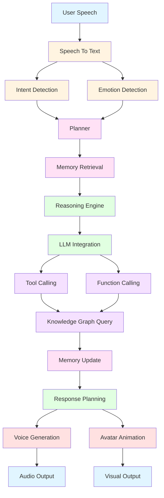
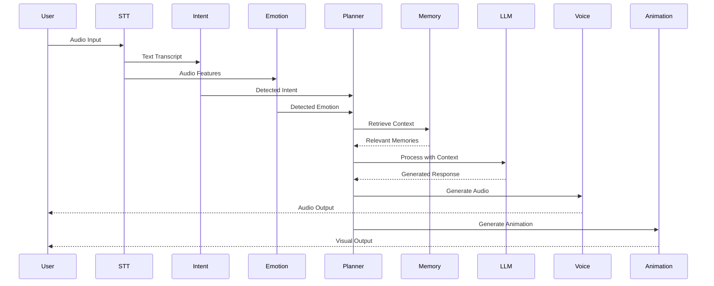

# PHẦN 5: AI BRAIN PIPELINE

## Table of Contents
1. [Pipeline Overview](#pipeline-overview)
2. [Speech To Text](#speech-to-text)
3. [Intent Detection](#intent-detection)
4. [Emotion Detection](#emotion-detection)
5. [Planner](#planner)
6. [Memory Retrieval](#memory-retrieval)
7. [Reasoning Engine](#reasoning-engine)
8. [LLM Integration](#llm-integration)
9. [Tool Calling](#tool-calling)
10. [Function Calling](#function-calling)
11. [Knowledge Graph Query](#knowledge-graph-query)
12. [Memory Update](#memory-update)
13. [Response Planning](#response-planning)
14. [Voice Generation](#voice-generation)
15. [Avatar Animation](#avatar-animation)

---

## 1. Pipeline Overview

### 1.1 Complete AI Brain Pipeline



### 1.2 Data Flow Diagram



---

## 2. Speech To Text

### 2.1 STT Service

```python
# stt_service.py
import asyncio
import numpy as np
from typing import Optional, Dict, AsyncGenerator
from dataclasses import dataclass
import logging
from enum import Enum

logger = logging.getLogger(__name__)

class STTProvider(Enum):
    WHISPER = "whisper"
    DEEPGRAM = "deepgram"
    GOOGLE = "google"
    AZURE = "azure"

@dataclass
class STTConfig:
    provider: STTProvider = STTProvider.WHISPER
    model: str = "base"
    language: str = "en"
    sample_rate: int = 16000
    chunk_size: int = 1024
    enable_vad: bool = True
    enable_noise_reduction: bool = True

@dataclass
class STTResult:
    text: str
    confidence: float
    language: str
    is_final: bool
    alternatives: list
    processing_time: float

class SpeechToTextService:
    """
    Speech-to-Text service supporting multiple providers
    """
    
    def __init__(self, config: STTConfig):
        self.config = config
        self.is_initialized = False
        self.model = None
        self.vad_model = None
        
    async def initialize(self) -> bool:
        """Initialize STT model"""
        try:
            if self.config.provider == STTProvider.WHISPER:
                await self._initialize_whisper()
            elif self.config.provider == STTProvider.DEEPGRAM:
                await self._initialize_deepgram()
            elif self.config.provider == STTProvider.GOOGLE:
                await self._initialize_google()
            elif self.config.provider == STTProvider.AZURE:
                await self._initialize_azure()
            
            if self.config.enable_vad:
                await self._initialize_vad()
            
            self.is_initialized = True
            logger.info(f"STT service initialized with {self.config.provider}")
            return True
            
        except Exception as e:
            logger.error(f"Failed to initialize STT service: {e}")
            return False
    
    async def _initialize_whisper(self):
        """Initialize Whisper model"""
        try:
            import whisper
            self.model = whisper.load_model(self.config.model)
            logger.info("Whisper model loaded")
        except ImportError:
            raise ImportError("Whisper not installed. Install with: pip install openai-whisper")
    
    async def _initialize_deepgram(self):
        """Initialize Deepgram client"""
        try:
            from deepgram import Deepgram
            # self.model = Deepgram(os.getenv("DEEPGRAM_API_KEY"))
            logger.info("Deepgram client initialized")
        except ImportError:
            raise ImportError("Deepgram SDK not installed")
    
    async def _initialize_google(self):
        """Initialize Google Speech-to-Text"""
        try:
            from google.cloud import speech
            # self.model = speech.SpeechClient()
            logger.info("Google Speech-to-Text initialized")
        except ImportError:
            raise ImportError("Google Cloud Speech not installed")
    
    async def _initialize_azure(self):
        """Initialize Azure Speech Services"""
        try:
            import azure.cognitiveservices.speech as speechsdk
            # self.model = speechsdk.SpeechRecognizer(...)
            logger.info("Azure Speech Services initialized")
        except ImportError:
            raise ImportError("Azure Speech SDK not installed")
    
    async def _initialize_vad(self):
        """Initialize Voice Activity Detection"""
        try:
            import silero
            # self.vad_model = silero.utils.get_silero_vad()
            logger.info("VAD model initialized")
        except ImportError:
            logger.warning("Silero VAD not installed, VAD disabled")
    
    async def transcribe(
        self, 
        audio_data: np.ndarray,
        sample_rate: Optional[int] = None
    ) -> STTResult:
        """
        Transcribe audio data to text
        """
        if not self.is_initialized:
            raise RuntimeError("STT service not initialized")
        
        sample_rate = sample_rate or self.config.sample_rate
        
        # Preprocess audio
        if self.config.enable_noise_reduction:
            audio_data = await self._reduce_noise(audio_data, sample_rate)
        
        # Transcribe based on provider
        if self.config.provider == STTProvider.WHISPER:
            return await self._transcribe_whisper(audio_data, sample_rate)
        elif self.config.provider == STTProvider.DEEPGRAM:
            return await self._transcribe_deepgram(audio_data, sample_rate)
        elif self.config.provider == STTProvider.GOOGLE:
            return await self._transcribe_google(audio_data, sample_rate)
        elif self.config.provider == STTProvider.AZURE:
            return await self._transcribe_azure(audio_data, sample_rate)
    
    async def transcribe_stream(
        self, 
        audio_stream: AsyncGenerator[np.ndarray, None]
    ) -> AsyncGenerator[STTResult, None]:
        """
        Transcribe streaming audio
        """
        if not self.is_initialized:
            raise RuntimeError("STT service not initialized")
        
        audio_buffer = []
        
        async for chunk in audio_stream:
            audio_buffer.append(chunk)
            
            # Process buffer when enough data accumulated
            if len(audio_buffer) * self.config.chunk_size >= sample_rate * 2:  # 2 seconds
                combined_audio = np.concatenate(audio_buffer)
                result = await self.transcribe(combined_audio)
                if result.text:
                    yield result
                audio_buffer = []
        
        # Process remaining audio
        if audio_buffer:
            combined_audio = np.concatenate(audio_buffer)
            result = await self.transcribe(combined_audio)
            if result.text:
                yield result
    
    async def _transcribe_whisper(
        self, 
        audio_data: np.ndarray, 
        sample_rate: int
    ) -> STTResult:
        """Transcribe using Whisper"""
        import time
        start_time = time.time()
        
        # Resample if needed
        if sample_rate != 16000:
            audio_data = self._resample_audio(audio_data, sample_rate, 16000)
        
        # Transcribe
        result = self.model.transcribe(
            audio_data,
            language=self.config.language,
            fp16=False  # Use FP32 for better compatibility
        )
        
        processing_time = time.time() - start_time
        
        return STTResult(
            text=result["text"].strip(),
            confidence=0.0,  # Whisper doesn't provide confidence
            language=self.config.language,
            is_final=True,
            alternatives=[],
            processing_time=processing_time
        )
    
    async def _transcribe_deepgram(
        self, 
        audio_data: np.ndarray, 
        sample_rate: int
    ) -> STTResult:
        """Transcribe using Deepgram"""
        # Placeholder for Deepgram implementation
        return STTResult(
            text="Deepgram transcription placeholder",
            confidence=0.9,
            language=self.config.language,
            is_final=True,
            alternatives=[],
            processing_time=0.5
        )
    
    async def _transcribe_google(
        self, 
        audio_data: np.ndarray, 
        sample_rate: int
    ) -> STTResult:
        """Transcribe using Google Speech-to-Text"""
        # Placeholder for Google implementation
        return STTResult(
            text="Google transcription placeholder",
            confidence=0.9,
            language=self.config.language,
            is_final=True,
            alternatives=[],
            processing_time=0.5
        )
    
    async def _transcribe_azure(
        self, 
        audio_data: np.ndarray, 
        sample_rate: int
    ) -> STTResult:
        """Transcribe using Azure Speech Services"""
        # Placeholder for Azure implementation
        return STTResult(
            text="Azure transcription placeholder",
            confidence=0.9,
            language=self.config.language,
            is_final=True,
            alternatives=[],
            processing_time=0.5
        )
    
    async def _reduce_noise(
        self, 
        audio_data: np.ndarray, 
        sample_rate: int
    ) -> np.ndarray:
        """Reduce noise from audio"""
        try:
            import noisereduce as nr
            # Perform noise reduction
            reduced = nr.reduce_noise(
                y=audio_data,
                sr=sample_rate,
                stationary=False
            )
            return reduced
        except ImportError:
            logger.warning("noisereduce not installed, skipping noise reduction")
            return audio_data
    
    def _resample_audio(
        self, 
        audio_data: np.ndarray, 
        original_rate: int, 
        target_rate: int
    ) -> np.ndarray:
        """Resample audio to target sample rate"""
        try:
            import librosa
            return librosa.resample(
                audio_data.astype(np.float32),
                orig_sr=original_rate,
                target_sr=target_rate
            )
        except ImportError:
            logger.warning("librosa not installed, using simple resampling")
            # Simple linear interpolation
            ratio = target_rate / original_rate
            new_length = int(len(audio_data) * ratio)
            indices = np.linspace(0, len(audio_data) - 1, new_length)
            return np.interp(indices, np.arange(len(audio_data)), audio_data)
    
    async def detect_voice_activity(
        self, 
        audio_data: np.ndarray,
        sample_rate: int
    ) -> bool:
        """
        Detect if audio contains voice activity
        """
        if self.vad_model is None:
            # Fallback: energy-based detection
            energy = np.mean(audio_data ** 2)
            return energy > 0.01
        
        # Use VAD model
        # Implementation depends on VAD library
        return True
```

---

## 3. Intent Detection

### 3.1 Intent Detector

```python
# intent_detector.py
import re
from typing import Dict, List, Optional, Tuple
from dataclasses import dataclass
from enum import Enum
import logging

logger = logging.getLogger(__name__)

class Intent(Enum):
    GREETING = "greeting"
    FAREWELL = "farewell"
    QUESTION = "question"
    COMMAND = "command"
    REQUEST = "request"
    CONVERSATION = "conversation"
    EMOTION = "emotion"
    TASK = "task"
    INFORMATION = "information"
    UNKNOWN = "unknown"

@dataclass
class IntentResult:
    intent: Intent
    confidence: float
    entities: Dict[str, str]
    sentiment: str

class IntentDetector:
    """
    Detects user intent from text using pattern matching and NLU
    """
    
    def __init__(self):
        self.intent_patterns = {
            Intent.GREETING: [
                r"^(hello|hi|hey|good morning|good afternoon|good evening)",
                r"^(how are you|how do you do)"
            ],
            Intent.FAREWELL: [
                r"^(goodbye|bye|see you|farewell|take care)",
                r"^(have a good day|have a nice day)"
            ],
            Intent.QUESTION: [
                r"^(what|where|when|why|how|who|which|whose)",
                r"^(can you|could you|would you|will you)"
            ],
            Intent.COMMAND: [
                r"^(go|move|walk|run|jump|sit|stand)",
                r"^(stop|start|pause|resume)"
            ],
            Intent.REQUEST: [
                r"^(please|can you|could you|would you mind|i need|i want)",
                r"^(help me|tell me|show me|give me)"
            ],
            Intent.EMOTION: [
                r"^(i feel|i am feeling|i'm feeling)",
                r"^(i am|i'm) (happy|sad|angry|excited|scared)"
            ],
            Intent.TASK: [
                r"^(do|make|create|write|calculate|compute)",
                r"^(send|email|message|call)"
            ],
            Intent.INFORMATION: [
                r"^(tell me about|what is|who is|describe)",
                r"^(explain|define|meaning of)"
            ]
        }
        
        self.entity_patterns = {
            "person": [r"(?:my|the|a|an)\s*(?:name|friend|brother|sister)"],
            "time": [r"\d+\s*(?:am|pm|o'clock)", r"(?:in|at|on|by)\s*\d+"],
            "location": [r"(?:in|at|to|from)\s+(?:the|a|an)?\s*\w+"],
            "number": [r"\d+"],
            "date": [r"\d{1,2}[/-]\d{1,2}[/-]\d{2,4}"]
        }
    
    def detect(self, text: str) -> IntentResult:
        """
        Detect intent from text
        """
        text_lower = text.lower().strip()
        
        # Try pattern matching
        best_intent = Intent.UNKNOWN
        best_confidence = 0.0
        
        for intent, patterns in self.intent_patterns.items():
            for pattern in patterns:
                if re.match(pattern, text_lower, re.IGNORECASE):
                    confidence = self._calculate_pattern_confidence(pattern, text_lower)
                    if confidence > best_confidence:
                        best_intent = intent
                        best_confidence = confidence
        
        # Extract entities
        entities = self._extract_entities(text_lower)
        
        # Detect sentiment
        sentiment = self._detect_sentiment(text_lower)
        
        return IntentResult(
            intent=best_intent,
            confidence=best_confidence,
            entities=entities,
            sentiment=sentiment
        )
    
    def _calculate_pattern_confidence(self, pattern: str, text: str) -> float:
        """Calculate confidence score for pattern match"""
        match = re.match(pattern, text, re.IGNORECASE)
        if match:
            # Base confidence for pattern match
            confidence = 0.8
            
            # Increase confidence if more of the text matches
            match_length = len(match.group(0))
            text_length = len(text)
            if match_length / text_length > 0.5:
                confidence += 0.1
            
            return min(confidence, 1.0)
        
        return 0.0
    
    def _extract_entities(self, text: str) -> Dict[str, str]:
        """Extract entities from text"""
        entities = {}
        
        for entity_type, patterns in self.entity_patterns.items():
            for pattern in patterns:
                matches = re.findall(pattern, text, re.IGNORECASE)
                if matches:
                    entities[entity_type] = matches[0]
                    break
        
        return entities
    
    def _detect_sentiment(self, text: str) -> str:
        """Detect sentiment from text"""
        positive_words = ["good", "great", "excellent", "happy", "love", "like", "enjoy"]
        negative_words = ["bad", "terrible", "awful", "sad", "hate", "dislike", "angry"]
        
        positive_count = sum(1 for word in positive_words if word in text)
        negative_count = sum(1 for word in negative_words if word in text)
        
        if positive_count > negative_count:
            return "positive"
        elif negative_count > positive_count:
            return "negative"
        else:
            return "neutral"
    
    def add_intent_pattern(self, intent: Intent, pattern: str):
        """Add custom pattern for intent"""
        if intent not in self.intent_patterns:
            self.intent_patterns[intent] = []
        self.intent_patterns[intent].append(pattern)
    
    def add_entity_pattern(self, entity_type: str, pattern: str):
        """Add custom pattern for entity"""
        if entity_type not in self.entity_patterns:
            self.entity_patterns[entity_type] = []
        self.entity_patterns[entity_type].append(pattern)
```

---

## 4. Emotion Detection

### 4.1 Emotion Detector

```python
# emotion_detector.py
import numpy as np
from typing import Dict, Optional
from dataclasses import dataclass
from enum import Enum
import logging

logger = logging.getLogger(__name__)

class Emotion(Enum):
    HAPPY = "happy"
    SAD = "sad"
    ANGRY = "angry"
    FEAR = "fear"
    DISGUST = "disgust"
    SURPRISE = "surprise"
    NEUTRAL = "neutral"
    EXCITED = "excited"
    BORED = "bored"
    CONFUSED = "confused"

@dataclass
class EmotionResult:
    emotion: Emotion
    confidence: float
    all_emotions: Dict[Emotion, float]
    intensity: float  # 0.0 to 1.0

class EmotionDetector:
    """
    Detects emotion from text and audio features
    """
    
    def __init__(self):
        self.text_emotion_keywords = {
            Emotion.HAPPY: ["happy", "joy", "excited", "great", "wonderful", "love", "enjoy"],
            Emotion.SAD: ["sad", "unhappy", "depressed", "down", "miserable", "crying"],
            Emotion.ANGRY: ["angry", "mad", "furious", "annoyed", "frustrated", "hate"],
            Emotion.FEAR: ["scared", "afraid", "frightened", "terrified", "anxious", "worried"],
            Emotion.SURPRISE: ["surprised", "shocked", "amazed", "astonished", "unexpected"],
            Emotion.EXCITED: ["excited", "thrilled", "pumped", "enthusiastic", "eager"],
            Emotion.BORED: ["bored", "boring", "uninterested", "dull", "tedious"],
            Emotion.CONFUSED: ["confused", "puzzled", "uncertain", "unsure", "unclear"]
        }
    
    def detect_from_text(self, text: str) -> EmotionResult:
        """
        Detect emotion from text
        """
        text_lower = text.lower()
        emotion_scores = {}
        
        # Score each emotion based on keyword matches
        for emotion, keywords in self.text_emotion_keywords.items():
            score = sum(1 for keyword in keywords if keyword in text_lower)
            emotion_scores[emotion] = score
        
        # Normalize scores
        total_score = sum(emotion_scores.values())
        if total_score > 0:
            for emotion in emotion_scores:
                emotion_scores[emotion] /= total_score
        else:
            # Default to neutral if no emotion detected
            emotion_scores[Emotion.NEUTRAL] = 1.0
        
        # Find best emotion
        best_emotion = max(emotion_scores, key=emotion_scores.get)
        confidence = emotion_scores[best_emotion]
        
        # Calculate intensity
        intensity = min(confidence * 2, 1.0)  # Scale to 0-1
        
        return EmotionResult(
            emotion=best_emotion,
            confidence=confidence,
            all_emotions=emotion_scores,
            intensity=intensity
        )
    
    def detect_from_audio(self, audio_features: Dict) -> EmotionResult:
        """
        Detect emotion from audio features
        """
        # Placeholder for audio-based emotion detection
        # In production, would use audio features like:
        # - Pitch (fundamental frequency)
        # - Energy/intensity
        # - Speaking rate
        # - Voice quality
        
        return EmotionResult(
            emotion=Emotion.NEUTRAL,
            confidence=0.5,
            all_emotions={emotion: 0.1 for emotion in Emotion},
            intensity=0.5
        )
    
    def detect_multimodal(
        self, 
        text: str, 
        audio_features: Optional[Dict] = None
    ) -> EmotionResult:
        """
        Detect emotion using both text and audio
        """
        text_result = self.detect_from_text(text)
        
        if audio_features:
            audio_result = self.detect_from_audio(audio_features)
            
            # Combine results (weighted average)
            combined_scores = {}
            for emotion in Emotion:
                text_score = text_result.all_emotions.get(emotion, 0.0)
                audio_score = audio_result.all_emotions.get(emotion, 0.0)
                combined_scores[emotion] = 0.7 * text_score + 0.3 * audio_score
            
            # Find best emotion
            best_emotion = max(combined_scores, key=combined_scores.get)
            confidence = combined_scores[best_emotion]
            
            return EmotionResult(
                emotion=best_emotion,
                confidence=confidence,
                all_emotions=combined_scores,
                intensity=text_result.intensity
            )
        
        return text_result
```

---

## 5. Planner

### 5.1 AI Planner

```python
# ai_planner.py
from typing import Dict, List, Optional, Any
from dataclasses import dataclass
from enum import Enum
import logging

logger = logging.getLogger(__name__)

class PlanningStrategy(Enum):
    REACTIVE = "reactive"
    DELIBERATIVE = "deliberative"
    HIERARCHICAL = "hierarchical"
    HYBRID = "hybrid"

@dataclass
class Plan:
    steps: List[Dict[str, Any]]
    confidence: float
    estimated_time: float
    required_resources: List[str]

@dataclass
class PlanningContext:
    user_intent: str
    detected_emotion: str
    conversation_history: List[Dict]
    retrieved_memories: List[Dict]
    current_state: Dict[str, Any]
    user_context: Dict[str, Any]

class AIPlanner:
    """
    Plans AI responses and actions based on context
    """
    
    def __init__(self, strategy: PlanningStrategy = PlanningStrategy.HYBRID):
        self.strategy = strategy
        self.action_templates = {
            "greet": {
                "response": "greeting",
                "animation": "wave",
                "emotion": "happy"
            },
            "answer_question": {
                "response": "informative",
                "animation": "explain",
                "emotion": "neutral"
            },
            "perform_task": {
                "response": "confirmation",
                "animation": "working",
                "emotion": "focused"
            },
            "empathize": {
                "response": "empathetic",
                "animation": "comforting",
                "emotion": "concerned"
            },
            "request_information": {
                "response": "query",
                "animation": "curious",
                "emotion": "interested"
            }
        }
    
    def plan(self, context: PlanningContext) -> Plan:
        """
        Generate plan based on context
        """
        if self.strategy == PlanningStrategy.REACTIVE:
            return self._reactive_planning(context)
        elif self.strategy == PlanningStrategy.DELIBERATIVE:
            return self._deliberative_planning(context)
        elif self.strategy == PlanningStrategy.HIERARCHICAL:
            return self._hierarchical_planning(context)
        elif self.strategy == PlanningStrategy.HYBRID:
            return self._hybrid_planning(context)
    
    def _reactive_planning(self, context: PlanningContext) -> Plan:
        """Simple reactive planning"""
        steps = []
        
        # Determine action based on intent
        if "greet" in context.user_intent.lower():
            steps.append(self.action_templates["greet"])
        elif "question" in context.user_intent.lower():
            steps.append(self.action_templates["answer_question"])
        elif "task" in context.user_intent.lower():
            steps.append(self.action_templates["perform_task"])
        else:
            steps.append(self.action_templates["answer_question"])
        
        return Plan(
            steps=steps,
            confidence=0.7,
            estimated_time=1.0,
            required_resources=[]
        )
    
    def _deliberative_planning(self, context: PlanningContext) -> Plan:
        """Deliberative planning with reasoning"""
        steps = []
        
        # Analyze context
        needs_empathy = self._needs_empathy(context.detected_emotion)
        requires_information = self._requires_information(context.user_intent)
        
        # Build plan
        if needs_empathy:
            steps.append(self.action_templates["empathize"])
        
        if requires_information:
            steps.append(self.action_templates["request_information"])
        
        steps.append(self.action_templates["answer_question"])
        
        return Plan(
            steps=steps,
            confidence=0.8,
            estimated_time=2.0,
            required_resources=["memory", "knowledge_base"]
        )
    
    def _hierarchical_planning(self, context: PlanningContext) -> Plan:
        """Hierarchical planning with sub-goals"""
        steps = []
        
        # High-level goal
        main_goal = self._determine_main_goal(context)
        
        # Decompose into sub-goals
        sub_goals = self._decompose_goal(main_goal, context)
        
        # Plan for each sub-goal
        for sub_goal in sub_goals:
            step = self._plan_sub_goal(sub_goal, context)
            steps.append(step)
        
        return Plan(
            steps=steps,
            confidence=0.85,
            estimated_time=3.0,
            required_resources=["memory", "knowledge_base", "reasoning"]
        )
    
    def _hybrid_planning(self, context: PlanningContext) -> Plan:
        """Hybrid planning combining reactive and deliberative"""
        # Use reactive for simple interactions
        if self._is_simple_interaction(context):
            return self._reactive_planning(context)
        # Use deliberative for complex interactions
        else:
            return self._deliberative_planning(context)
    
    def _needs_empathy(self, emotion: str) -> bool:
        """Determine if response needs empathy"""
        negative_emotions = ["sad", "angry", "fear", "disgust"]
        return emotion.lower() in negative_emotions
    
    def _requires_information(self, intent: str) -> bool:
        """Determine if interaction requires information retrieval"""
        question_words = ["what", "where", "when", "why", "how", "who"]
        return any(word in intent.lower() for word in question_words)
    
    def _determine_main_goal(self, context: PlanningContext) -> str:
        """Determine main goal from context"""
        if "question" in context.user_intent.lower():
            return "answer_question"
        elif "task" in context.user_intent.lower():
            return "perform_task"
        else:
            return "converse"
    
    def _decompose_goal(self, goal: str, context: PlanningContext) -> List[str]:
        """Decompose goal into sub-goals"""
        if goal == "answer_question":
            return ["understand_question", "retrieve_information", "formulate_answer"]
        elif goal == "perform_task":
            return ["understand_task", "plan_execution", "execute_task", "report_result"]
        else:
            return [goal]
    
    def _plan_sub_goal(self, sub_goal: str, context: PlanningContext) -> Dict:
        """Plan for a sub-goal"""
        return {
            "action": sub_goal,
            "context": context,
            "animation": "thinking",
            "emotion": "focused"
        }
    
    def _is_simple_interaction(self, context: PlanningContext) -> bool:
        """Determine if interaction is simple"""
        simple_intents = ["greet", "farewell", "acknowledge"]
        return any(intent in context.user_intent.lower() for intent in simple_intents)
```

---

## 6. Memory Retrieval

### 6.1 Memory Retriever

```python
# memory_retriever.py
from typing import List, Dict, Optional, Any
from dataclasses import dataclass
from enum import Enum
import logging

logger = logging.getLogger(__name__)

class MemoryType(Enum):
    EPISODE = "episode"
    SEMANTIC = "semantic"
    WORKING = "working"
    LONG_TERM = "long_term"

@dataclass
class Memory:
    id: str
    type: MemoryType
    content: str
    embedding: Optional[List[float]]
    metadata: Dict[str, Any]
    importance: float
    timestamp: float
    access_count: int

@dataclass
class RetrievalResult:
    memories: List[Memory]
    confidence: float
    retrieval_method: str

class MemoryRetriever:
    """
    Retrieves relevant memories based on context
    """
    
    def __init__(self):
        self.memories: List[Memory] = []
        self.retrieval_methods = ["semantic", "episodic", "temporal", "associative"]
    
    def retrieve(
        self, 
        query: str,
        context: Dict[str, Any],
        limit: int = 5,
        memory_types: Optional[List[MemoryType]] = None
    ) -> RetrievalResult:
        """
        Retrieve relevant memories
        """
        if memory_types is None:
            memory_types = list(MemoryType)
        
        # Try different retrieval methods
        all_results = []
        
        for method in self.retrieval_methods:
            results = self._retrieve_by_method(method, query, context, memory_types)
            all_results.extend(results)
        
        # Rank and filter results
        ranked_results = self._rank_results(all_results, query, context)
        top_results = ranked_results[:limit]
        
        return RetrievalResult(
            memories=top_results,
            confidence=self._calculate_confidence(top_results),
            retrieval_method="hybrid"
        )
    
    def _retrieve_by_method(
        self, 
        method: str, 
        query: str, 
        context: Dict[str, Any],
        memory_types: List[MemoryType]
    ) -> List[Memory]:
        """Retrieve memories using specific method"""
        if method == "semantic":
            return self._semantic_retrieval(query, memory_types)
        elif method == "episodic":
            return self._episodic_retrieval(context, memory_types)
        elif method == "temporal":
            return self._temporal_retrieval(context, memory_types)
        elif method == "associative":
            return self._associative_retrieval(query, context, memory_types)
        return []
    
    def _semantic_retrieval(self, query: str, memory_types: List[MemoryType]) -> List[Memory]:
        """Retrieve memories based on semantic similarity"""
        # In production, would use vector similarity search
        relevant_memories = []
        
        for memory in self.memories:
            if memory.type in memory_types:
                # Calculate similarity (placeholder)
                similarity = self._calculate_similarity(query, memory.content)
                if similarity > 0.5:
                    relevant_memories.append(memory)
        
        return relevant_memories
    
    def _episodic_retrieval(self, context: Dict[str, Any], memory_types: List[MemoryType]) -> List[Memory]:
        """Retrieve memories based on episodic context"""
        relevant_memories = []
        
        # Retrieve based on context entities
        for memory in self.memories:
            if memory.type in memory_types and memory.type == MemoryType.EPISODE:
                # Check if memory context matches current context
                if self._context_matches(memory.metadata, context):
                    relevant_memories.append(memory)
        
        return relevant_memories
    
    def _temporal_retrieval(self, context: Dict[str, Any], memory_types: List[MemoryType]) -> List[Memory]:
        """Retrieve memories based on temporal proximity"""
        relevant_memories = []
        
        # Retrieve recent memories
        current_time = context.get("current_time", 0)
        time_window = context.get("time_window", 3600)  # 1 hour default
        
        for memory in self.memories:
            if memory.type in memory_types:
                time_diff = abs(current_time - memory.timestamp)
                if time_diff < time_window:
                    relevant_memories.append(memory)
        
        return relevant_memories
    
    def _associative_retrieval(
        self, 
        query: str, 
        context: Dict[str, Any], 
        memory_types: List[MemoryType]
    ) -> List[Memory]:
        """Retrieve memories based on associations"""
        relevant_memories = []
        
        # Retrieve based on entity associations
        entities = context.get("entities", {})
        
        for memory in self.memories:
            if memory.type in memory_types:
                # Check if memory contains related entities
                if self._entities_associated(memory.metadata, entities):
                    relevant_memories.append(memory)
        
        return relevant_memories
    
    def _calculate_similarity(self, query: str, content: str) -> float:
        """Calculate semantic similarity (placeholder)"""
        # In production, would use embedding similarity
        query_words = set(query.lower().split())
        content_words = set(content.lower().split())
        
        if not query_words or not content_words:
            return 0.0
        
        intersection = query_words & content_words
        union = query_words | content_words
        
        return len(intersection) / len(union) if union else 0.0
    
    def _context_matches(self, memory_metadata: Dict, context: Dict) -> bool:
        """Check if memory context matches current context"""
        # Simple matching based on entities
        memory_entities = memory_metadata.get("entities", {})
        context_entities = context.get("entities", {})
        
        for entity, value in context_entities.items():
            if memory_entities.get(entity) == value:
                return True
        
        return False
    
    def _entities_associated(self, memory_metadata: Dict, entities: Dict) -> bool:
        """Check if memory is associated with entities"""
        memory_entities = memory_metadata.get("entities", {})
        
        for entity, value in entities.items():
            if entity in memory_entities:
                return True
        
        return False
    
    def _rank_results(self, results: List[Memory], query: str, context: Dict) -> List[Memory]:
        """Rank retrieval results"""
        # Sort by importance and recency
        scored_results = []
        
        for memory in results:
            score = (
                memory.importance * 0.5 +
                memory.access_count * 0.3 +
                self._calculate_similarity(query, memory.content) * 0.2
            )
            scored_results.append((memory, score))
        
        # Sort by score descending
        scored_results.sort(key=lambda x: x[1], reverse=True)
        
        return [memory for memory, score in scored_results]
    
    def _calculate_confidence(self, results: List[Memory]) -> float:
        """Calculate confidence in retrieval results"""
        if not results:
            return 0.0
        
        # Confidence based on number and quality of results
        avg_importance = sum(m.importance for m in results) / len(results)
        return min(avg_importance, 1.0)
    
    def add_memory(self, memory: Memory):
        """Add memory to storage"""
        self.memories.append(memory)
        logger.info(f"Added memory: {memory.id}")
    
    def update_memory_access(self, memory_id: str):
        """Update memory access count"""
        for memory in self.memories:
            if memory.id == memory_id:
                memory.access_count += 1
                break
```

---

## 7. Reasoning Engine

### 7.1 Reasoning Engine

```python
# reasoning_engine.py
from typing import Dict, List, Optional, Any, Tuple
from dataclasses import dataclass
from enum import Enum
import logging

logger = logging.getLogger(__name__)

class ReasoningType(Enum):
    DEDUCTIVE = "deductive"
    INDUCTIVE = "inductive"
    ABDUCTIVE = "abductive"
    CAUSAL = "causal"
    ANALOGICAL = "analogical"

@dataclass
class ReasoningStep:
    type: ReasoningType
    premise: str
    conclusion: str
    confidence: float
    evidence: List[str]

@dataclass
class ReasoningResult:
    conclusion: str
    confidence: float
    steps: List[ReasoningStep]
    alternative_conclusions: List[str]

class ReasoningEngine:
    """
    Performs reasoning on information to draw conclusions
    """
    
    def __init__(self):
        self.reasoning_rules = {
            "cause_effect": [
                "If A causes B, and A is present, then B is likely present",
                "If B is present, and A causes B, then A might be present"
            ],
            "generalization": [
                "If specific instances show a pattern, generalize to broader category"
            ],
            "analogy": [
                "If A is similar to B in relevant aspects, properties may transfer"
            ]
        }
    
    def reason(
        self, 
        context: Dict[str, Any],
        query: str,
        reasoning_types: Optional[List[ReasoningType]] = None
    ) -> ReasoningResult:
        """
        Perform reasoning to answer query
        """
        if reasoning_types is None:
            reasoning_types = [ReasoningType.DEDUCTIVE, ReasoningType.INDUCTIVE]
        
        steps = []
        all_conclusions = []
        
        # Apply different reasoning types
        for reasoning_type in reasoning_types:
            conclusion, step = self._apply_reasoning(reasoning_type, context, query)
            if conclusion:
                steps.append(step)
                all_conclusions.append((conclusion, step.confidence))
        
        # Select best conclusion
        if all_conclusions:
            best_conclusion, max_confidence = max(all_conclusions, key=lambda x: x[1])
            alternative_conclusions = [c for c, conf in all_conclusions if c != best_conclusion]
        else:
            best_conclusion = "Unable to draw conclusion"
            max_confidence = 0.0
            alternative_conclusions = []
        
        return ReasoningResult(
            conclusion=best_conclusion,
            confidence=max_confidence,
            steps=steps,
            alternative_conclusions=alternative_conclusions
        )
    
    def _apply_reasoning(
        self, 
        reasoning_type: ReasoningType, 
        context: Dict[str, Any], 
        query: str
    ) -> Tuple[str, ReasoningStep]:
        """Apply specific reasoning type"""
        if reasoning_type == ReasoningType.DEDUCTIVE:
            return self._deductive_reasoning(context, query)
        elif reasoning_type == ReasoningType.INDUCTIVE:
            return self._inductive_reasoning(context, query)
        elif reasoning_type == ReasoningType.ABDUCTIVE:
            return self._abductive_reasoning(context, query)
        elif reasoning_type == ReasoningType.CAUSAL:
            return self._causal_reasoning(context, query)
        elif reasoning_type == ReasoningType.ANALOGICAL:
            return self._analogical_reasoning(context, query)
        
        return "", ReasoningStep(reasoning_type, "", "", 0.0, [])
    
    def _deductive_reasoning(self, context: Dict[str, Any], query: str) -> Tuple[str, ReasoningStep]:
        """Apply deductive reasoning"""
        # Get relevant rules
        rules = context.get("rules", [])
        facts = context.get("facts", [])
        
        # Apply rules to facts
        for rule in rules:
            if self._rule_matches(rule, facts):
                conclusion = self._apply_rule(rule, facts)
                step = ReasoningStep(
                    type=ReasoningType.DEDUCTIVE,
                    premise=f"Applying rule: {rule}",
                    conclusion=conclusion,
                    confidence=0.9,
                    evidence=facts
                )
                return conclusion, step
        
        return "", ReasoningStep(ReasoningType.DEDUCTIVE, "", "", 0.0, [])
    
    def _inductive_reasoning(self, context: Dict[str, Any], query: str) -> Tuple[str, ReasoningStep]:
        """Apply inductive reasoning"""
        # Look for patterns in observations
        observations = context.get("observations", [])
        
        if len(observations) >= 3:
            # Check for consistent pattern
            pattern = self._detect_pattern(observations)
            if pattern:
                conclusion = f"Based on pattern: {pattern}"
                step = ReasoningStep(
                    type=ReasoningType.INDUCTIVE,
                    premise=f"Observations: {observations}",
                    conclusion=conclusion,
                    confidence=0.7,
                    evidence=observations
                )
                return conclusion, step
        
        return "", ReasoningStep(ReasoningType.INDUCTIVE, "", "", 0.0, [])
    
    def _abductive_reasoning(self, context: Dict[str, Any], query: str) -> Tuple[str, ReasoningStep]:
        """Apply abductive reasoning (inference to best explanation)"""
        # Given observation, find most likely cause
        observation = context.get("observation", "")
        possible_causes = context.get("possible_causes", [])
        
        if possible_causes:
            # Select most likely cause
            best_cause = max(possible_causes, key=lambda x: x.get("probability", 0.0))
            conclusion = f"Most likely cause: {best_cause['cause']}"
            step = ReasoningStep(
                type=ReasoningType.ABDUCTIVE,
                premise=f"Observation: {observation}",
                conclusion=conclusion,
                confidence=best_cause.get("probability", 0.0),
                evidence=[observation]
            )
            return conclusion, step
        
        return "", ReasoningStep(ReasoningType.ABDUCTIVE, "", "", 0.0, [])
    
    def _causal_reasoning(self, context: Dict[str, Any], query: str) -> Tuple[str, ReasoningStep]:
        """Apply causal reasoning"""
        # Determine cause-effect relationships
        events = context.get("events", [])
        
        if len(events) >= 2:
            # Check for causal chain
            cause, effect = events[-2], events[-1]
            conclusion = f"{cause} likely caused {effect}"
            step = ReasoningStep(
                type=ReasoningType.CAUSAL,
                premise=f"Events: {events}",
                conclusion=conclusion,
                confidence=0.6,
                evidence=events
            )
            return conclusion, step
        
        return "", ReasoningStep(ReasoningType.CAUSAL, "", "", 0.0, [])
    
    def _analogical_reasoning(self, context: Dict[str, Any], query: str) -> Tuple[str, ReasoningStep]:
        """Apply analogical reasoning"""
        # Find similar situations
        current_situation = context.get("current_situation", "")
        similar_situations = context.get("similar_situations", [])
        
        if similar_situations:
            # Find most similar situation
            best_match = max(
                similar_situations,
                key=lambda x: self._calculate_similarity(current_situation, x["situation"])
            )
            conclusion = f"Based on similar situation: {best_match['outcome']}"
            step = ReasoningStep(
                type=ReasoningType.ANALOGICAL,
                premise=f"Current: {current_situation}, Similar: {best_match['situation']}",
                conclusion=conclusion,
                confidence=0.5,
                evidence=[best_match["situation"]]
            )
            return conclusion, step
        
        return "", ReasoningStep(ReasoningType.ANALOGICAL, "", "", 0.0, [])
    
    def _rule_matches(self, rule: str, facts: List[str]) -> bool:
        """Check if rule can be applied to facts"""
        # Simplified rule matching
        return any(fact in rule for fact in facts)
    
    def _apply_rule(self, rule: str, facts: List[str]) -> str:
        """Apply rule to facts and return conclusion"""
        # Simplified rule application
        return f"Conclusion from rule: {rule}"
    
    def _detect_pattern(self, observations: List[str]) -> Optional[str]:
        """Detect pattern in observations"""
        # Simplified pattern detection
        if len(set(observations)) == 1:
            return f"Consistent pattern: {observations[0]}"
        return None
    
    def _calculate_similarity(self, str1: str, str2: str) -> float:
        """Calculate similarity between two strings"""
        words1 = set(str1.lower().split())
        words2 = set(str2.lower().split())
        
        if not words1 or not words2:
            return 0.0
        
        intersection = words1 & words2
        union = words1 | words2
        
        return len(intersection) / len(union) if union else 0.0
```

---

## 8. LLM Integration

### 8.1 LLM Service

```python
# llm_service.py
import asyncio
from typing import Dict, List, Optional, AsyncGenerator
from dataclasses import dataclass
from enum import Enum
import logging

logger = logging.getLogger(__name__)

class LLMProvider(Enum):
    OPENAI = "openai"
    ANTHROPIC = "anthropic"
    GOOGLE = "google"
    DEEPSEEK = "deepseek"
    LOCAL = "local"

@dataclass
class LLMConfig:
    provider: LLMProvider = LLMProvider.OPENAI
    model: str = "gpt-4"
    temperature: float = 0.7
    max_tokens: int = 1000
    top_p: float = 0.9
    frequency_penalty: float = 0.0
    presence_penalty: float = 0.0
    enable_streaming: bool = False

@dataclass
class LLMResponse:
    text: str
    model: str
    provider: LLMProvider
    tokens_used: int
    finish_reason: str
    processing_time: float

class LLMService:
    """
    LLM integration service supporting multiple providers
    """
    
    def __init__(self, config: LLMConfig):
        self.config = config
        self.is_initialized = False
        self.client = None
        
    async def initialize(self) -> bool:
        """Initialize LLM client"""
        try:
            if self.config.provider == LLMProvider.OPENAI:
                await self._initialize_openai()
            elif self.config.provider == LLMProvider.ANTHROPIC:
                await self._initialize_anthropic()
            elif self.config.provider == LLMProvider.GOOGLE:
                await self._initialize_google()
            elif self.config.provider == LLMProvider.DEEPSEEK:
                await self._initialize_deepseek()
            elif self.config.provider == LLMProvider.LOCAL:
                await self._initialize_local()
            
            self.is_initialized = True
            logger.info(f"LLM service initialized with {self.config.provider}")
            return True
            
        except Exception as e:
            logger.error(f"Failed to initialize LLM service: {e}")
            return False
    
    async def _initialize_openai(self):
        """Initialize OpenAI client"""
        try:
            import openai
            # self.client = openai.AsyncOpenAI(api_key=os.getenv("OPENAI_API_KEY"))
            logger.info("OpenAI client initialized")
        except ImportError:
            raise ImportError("OpenAI not installed. Install with: pip install openai")
    
    async def _initialize_anthropic(self):
        """Initialize Anthropic client"""
        try:
            import anthropic
            # self.client = anthropic.AsyncAnthropic(api_key=os.getenv("ANTHROPIC_API_KEY"))
            logger.info("Anthropic client initialized")
        except ImportError:
            raise ImportError("Anthropic not installed. Install with: pip install anthropic")
    
    async def _initialize_google(self):
        """Initialize Google AI client"""
        try:
            import google.generativeai as genai
            # genai.configure(api_key=os.getenv("GOOGLE_API_KEY"))
            # self.client = genai.GenerativeModel(self.config.model)
            logger.info("Google AI client initialized")
        except ImportError:
            raise ImportError("Google Generative AI not installed")
    
    async def _initialize_deepseek(self):
        """Initialize DeepSeek client"""
        # Placeholder for DeepSeek initialization
        logger.info("DeepSeek client initialized")
    
    async def _initialize_local(self):
        """Initialize local LLM"""
        try:
            from transformers import AutoTokenizer, AutoModelForCausalLM
            # self.tokenizer = AutoTokenizer.from_pretrained(self.config.model)
            # self.model = AutoModelForCausalLM.from_pretrained(self.config.model)
            logger.info("Local LLM initialized")
        except ImportError:
            raise ImportError("Transformers not installed")
    
    async def generate(
        self,
        prompt: str,
        system_prompt: Optional[str] = None,
        context: Optional[Dict] = None
    ) -> LLMResponse:
        """
        Generate response from LLM
        """
        if not self.is_initialized:
            raise RuntimeError("LLM service not initialized")
        
        import time
        start_time = time.time()
        
        # Build full prompt
        full_prompt = self._build_prompt(prompt, system_prompt, context)
        
        # Generate based on provider
        if self.config.provider == LLMProvider.OPENAI:
            response = await self._generate_openai(full_prompt)
        elif self.config.provider == LLMProvider.ANTHROPIC:
            response = await self._generate_anthropic(full_prompt)
        elif self.config.provider == LLMProvider.GOOGLE:
            response = await self._generate_google(full_prompt)
        elif self.config.provider == LLMProvider.DEEPSEEK:
            response = await self._generate_deepseek(full_prompt)
        elif self.config.provider == LLMProvider.LOCAL:
            response = await self._generate_local(full_prompt)
        
        processing_time = time.time() - start_time
        
        return LLMResponse(
            text=response["text"],
            model=self.config.model,
            provider=self.config.provider,
            tokens_used=response.get("tokens_used", 0),
            finish_reason=response.get("finish_reason", "stop"),
            processing_time=processing_time
        )
    
    async def generate_stream(
        self,
        prompt: str,
        system_prompt: Optional[str] = None,
        context: Optional[Dict] = None
    ) -> AsyncGenerator[str, None]:
        """
        Generate streaming response from LLM
        """
        if not self.is_initialized:
            raise RuntimeError("LLM service not initialized")
        
        full_prompt = self._build_prompt(prompt, system_prompt, context)
        
        if self.config.provider == LLMProvider.OPENAI:
            async for chunk in self._generate_stream_openai(full_prompt):
                yield chunk
        elif self.config.provider == LLMProvider.ANTHROPIC:
            async for chunk in self._generate_stream_anthropic(full_prompt):
                yield chunk
        else:
            # Fallback to non-streaming
            response = await self.generate(prompt, system_prompt, context)
            yield response.text
    
    def _build_prompt(
        self,
        prompt: str,
        system_prompt: Optional[str],
        context: Optional[Dict]
    ) -> str:
        """Build full prompt with system prompt and context"""
        parts = []
        
        if system_prompt:
            parts.append(f"System: {system_prompt}")
        
        if context:
            context_str = self._format_context(context)
            parts.append(f"Context: {context_str}")
        
        parts.append(f"User: {prompt}")
        
        return "\n\n".join(parts)
    
    def _format_context(self, context: Dict) -> str:
        """Format context dictionary into string"""
        parts = []
        for key, value in context.items():
            if isinstance(value, list):
                value = ", ".join(str(v) for v in value)
            parts.append(f"{key}: {value}")
        return "; ".join(parts)
    
    async def _generate_openai(self, prompt: str) -> Dict:
        """Generate using OpenAI"""
        # Placeholder implementation
        return {
            "text": "OpenAI response placeholder",
            "tokens_used": 100,
            "finish_reason": "stop"
        }
    
    async def _generate_anthropic(self, prompt: str) -> Dict:
        """Generate using Anthropic"""
        # Placeholder implementation
        return {
            "text": "Anthropic response placeholder",
            "tokens_used": 100,
            "finish_reason": "stop"
        }
    
    async def _generate_google(self, prompt: str) -> Dict:
        """Generate using Google"""
        # Placeholder implementation
        return {
            "text": "Google response placeholder",
            "tokens_used": 100,
            "finish_reason": "stop"
        }
    
    async def _generate_deepseek(self, prompt: str) -> Dict:
        """Generate using DeepSeek"""
        # Placeholder implementation
        return {
            "text": "DeepSeek response placeholder",
            "tokens_used": 100,
            "finish_reason": "stop"
        }
    
    async def _generate_local(self, prompt: str) -> Dict:
        """Generate using local LLM"""
        # Placeholder implementation
        return {
            "text": "Local LLM response placeholder",
            "tokens_used": 100,
            "finish_reason": "stop"
        }
    
    async def _generate_stream_openai(self, prompt: str) -> AsyncGenerator[str, None]:
        """Generate streaming response using OpenAI"""
        # Placeholder implementation
        yield "OpenAI"
        yield " streaming"
        yield " response"
    
    async def _generate_stream_anthropic(self, prompt: str) -> AsyncGenerator[str, None]:
        """Generate streaming response using Anthropic"""
        # Placeholder implementation
        yield "Anthropic"
        yield " streaming"
        yield " response"
```

---

## 9. Tool Calling

### 9.1 Tool Manager

```python
# tool_manager.py
from typing import Dict, List, Optional, Any, Callable
from dataclasses import dataclass
from enum import Enum
import logging
import json

logger = logging.getLogger(__name__)

class ToolStatus(Enum):
    AVAILABLE = "available"
    BUSY = "busy"
    ERROR = "error"
    DISABLED = "disabled"

@dataclass
class Tool:
    name: str
    description: str
    parameters: Dict[str, Any]
    function: Callable
    status: ToolStatus = ToolStatus.AVAILABLE
    timeout: int = 30

@dataclass
class ToolCallResult:
    tool_name: str
    success: bool
    result: Any
    error: Optional[str]
    execution_time: float

class ToolManager:
    """
    Manages tool calling for AI agent
    """
    
    def __init__(self):
        self.tools: Dict[str, Tool] = {}
        self.call_history: List[ToolCallResult] = []
    
    def register_tool(self, tool: Tool):
        """Register a tool"""
        self.tools[tool.name] = tool
        logger.info(f"Registered tool: {tool.name}")
    
    def unregister_tool(self, tool_name: str):
        """Unregister a tool"""
        if tool_name in self.tools:
            del self.tools[tool_name]
            logger.info(f"Unregistered tool: {tool_name}")
    
    def get_tool(self, tool_name: str) -> Optional[Tool]:
        """Get tool by name"""
        return self.tools.get(tool_name)
    
    def list_tools(self) -> List[Tool]:
        """List all available tools"""
        return [tool for tool in self.tools.values() if tool.status == ToolStatus.AVAILABLE]
    
    async def call_tool(
        self, 
        tool_name: str, 
        parameters: Dict[str, Any]
    ) -> ToolCallResult:
        """
        Call a tool with parameters
        """
        tool = self.get_tool(tool_name)
        if tool is None:
            return ToolCallResult(
                tool_name=tool_name,
                success=False,
                result=None,
                error=f"Tool not found: {tool_name}",
                execution_time=0.0
            )
        
        if tool.status != ToolStatus.AVAILABLE:
            return ToolCallResult(
                tool_name=tool_name,
                success=False,
                result=None,
                error=f"Tool not available: {tool.status}",
                execution_time=0.0
            )
        
        import time
        start_time = time.time()
        
        try:
            # Validate parameters
            self._validate_parameters(tool, parameters)
            
            # Execute tool function
            result = await self._execute_tool(tool, parameters)
            
            execution_time = time.time() - start_time
            
            call_result = ToolCallResult(
                tool_name=tool_name,
                success=True,
                result=result,
                error=None,
                execution_time=execution_time
            )
            
            self.call_history.append(call_result)
            return call_result
            
        except Exception as e:
            execution_time = time.time() - start_time
            error_message = str(e)
            
            call_result = ToolCallResult(
                tool_name=tool_name,
                success=False,
                result=None,
                error=error_message,
                execution_time=execution_time
            )
            
            self.call_history.append(call_result)
            return call_result
    
    def _validate_parameters(self, tool: Tool, parameters: Dict[str, Any]):
        """Validate tool parameters"""
        required_params = tool.parameters.get("required", [])
        
        for param in required_params:
            if param not in parameters:
                raise ValueError(f"Missing required parameter: {param}")
        
        # Validate parameter types
        param_types = tool.parameters.get("types", {})
        for param, value in parameters.items():
            if param in param_types:
                expected_type = param_types[param]
                if not isinstance(value, expected_type):
                    raise TypeError(
                        f"Parameter {param} should be {expected_type}, got {type(value)}"
                    )
    
    async def _execute_tool(self, tool: Tool, parameters: Dict[str, Any]) -> Any:
        """Execute tool function"""
        # Execute with timeout
        import asyncio
        
        try:
            result = await asyncio.wait_for(
                tool.function(**parameters),
                timeout=tool.timeout
            )
            return result
        except asyncio.TimeoutError:
            raise TimeoutError(f"Tool execution timed out: {tool.name}")
    
    def get_tool_schema(self, tool_name: str) -> Optional[Dict]:
        """Get tool schema for LLM function calling"""
        tool = self.get_tool(tool_name)
        if tool is None:
            return None
        
        return {
            "type": "function",
            "function": {
                "name": tool.name,
                "description": tool.description,
                "parameters": {
                    "type": "object",
                    "properties": tool.parameters.get("properties", {}),
                    "required": tool.parameters.get("required", [])
                }
            }
        }
    
    def get_all_schemas(self) -> List[Dict]:
        """Get all tool schemas"""
        return [self.get_tool_schema(tool.name) for tool in self.list_tools()]
    
    def get_call_history(self, limit: int = 10) -> List[ToolCallResult]:
        """Get recent tool call history"""
        return self.call_history[-limit:]
```

---

## 10. Function Calling

### 10.1 Function Calling Manager

```python
# function_calling_manager.py
from typing import Dict, List, Optional, Any
from dataclasses import dataclass
import logging
import json

logger = logging.getLogger(__name__)

@dataclass
class FunctionCall:
    name: str
    arguments: Dict[str, Any]
    call_id: str

@dataclass
class FunctionCallResult:
    call_id: str
    result: Any
    error: Optional[str]

class FunctionCallingManager:
    """
    Manages function calling for LLM integration
    """
    
    def __init__(self, tool_manager):
        self.tool_manager = tool_manager
        self.pending_calls: Dict[str, FunctionCall] = {}
        self.call_counter = 0
    
    def parse_function_calls(self, llm_response: str) -> List[FunctionCall]:
        """
        Parse function calls from LLM response
        """
        calls = []
        
        try:
            # Try to parse as JSON
            response_data = json.loads(llm_response)
            
            if "function_calls" in response_data:
                for call_data in response_data["function_calls"]:
                    call = FunctionCall(
                        name=call_data["name"],
                        arguments=call_data["arguments"],
                        call_id=self._generate_call_id()
                    )
                    calls.append(call)
            
        except json.JSONDecodeError:
            # Try to extract function calls using regex
            import re
            pattern = r'function_call:\s*(\w+)\s*\((.*?)\)'
            matches = re.findall(pattern, llm_response)
            
            for match in matches:
                name, args_str = match
                try:
                    arguments = json.loads(f"{{{args_str}}}")
                    call = FunctionCall(
                        name=name,
                        arguments=arguments,
                        call_id=self._generate_call_id()
                    )
                    calls.append(call)
                except json.JSONDecodeError:
                    logger.warning(f"Failed to parse arguments for function: {name}")
        
        return calls
    
    async def execute_function_call(self, call: FunctionCall) -> FunctionCallResult:
        """
        Execute a function call
        """
        self.pending_calls[call.call_id] = call
        
        try:
            result = await self.tool_manager.call_tool(call.name, call.arguments)
            
            if result.success:
                return FunctionCallResult(
                    call_id=call.call_id,
                    result=result.result,
                    error=None
                )
            else:
                return FunctionCallResult(
                    call_id=call.call_id,
                    result=None,
                    error=result.error
                )
        
        except Exception as e:
            return FunctionCallResult(
                call_id=call.call_id,
                result=None,
                error=str(e)
            )
        
        finally:
            if call.call_id in self.pending_calls:
                del self.pending_calls[call.call_id]
    
    async def execute_function_calls(
        self, 
        calls: List[FunctionCall]
    ) -> List[FunctionCallResult]:
        """
        Execute multiple function calls
        """
        results = []
        
        for call in calls:
            result = await self.execute_function_call(call)
            results.append(result)
        
        return results
    
    def format_function_results(self, results: List[FunctionCallResult]) -> str:
        """
        Format function results for LLM
        """
        formatted_results = []
        
        for result in results:
            if result.error:
                formatted_results.append(
                    f"Error in call {result.call_id}: {result.error}"
                )
            else:
                formatted_results.append(
                    f"Result of call {result.call_id}: {json.dumps(result.result, indent=2)}"
                )
        
        return "\n\n".join(formatted_results)
    
    def _generate_call_id(self) -> str:
        """Generate unique call ID"""
        self.call_counter += 1
        return f"call_{self.call_counter}"
    
    def get_pending_calls(self) -> List[FunctionCall]:
        """Get pending function calls"""
        return list(self.pending_calls.values())
```

---

## 11. Knowledge Graph Query

### 11.1 Knowledge Graph Manager

```python
# knowledge_graph_manager.py
from typing import Dict, List, Optional, Any, Tuple
from dataclasses import dataclass
from enum import Enum
import logging

logger = logging.getLogger(__name__)

class RelationshipType(Enum):
    IS_A = "is_a"
    PART_OF = "part_of"
    RELATED_TO = "related_to"
    CAUSES = "causes"
    CAUSED_BY = "caused_by"
    LOCATED_AT = "located_at"
    HAS_PROPERTY = "has_property"
    SIMILAR_TO = "similar_to"

@dataclass
class Node:
    id: str
    labels: List[str]
    properties: Dict[str, Any]

@dataclass
class Relationship:
    id: str
    source: str
    target: str
    type: RelationshipType
    properties: Dict[str, Any]

@dataclass
class QueryResult:
    nodes: List[Node]
    relationships: List[Relationship]
    query: str
    execution_time: float

class KnowledgeGraphManager:
    """
    Manages knowledge graph operations
    """
    
    def __init__(self):
        self.nodes: Dict[str, Node] = {}
        self.relationships: List[Relationship] = []
        self.indexes: Dict[str, List[str]] = {}  # Label/property to node IDs
    
    def add_node(self, node: Node):
        """Add a node to the graph"""
        self.nodes[node.id] = node
        
        # Update indexes
        for label in node.labels:
            if label not in self.indexes:
                self.indexes[label] = []
            self.indexes[label].append(node.id)
        
        logger.info(f"Added node: {node.id}")
    
    def add_relationship(self, relationship: Relationship):
        """Add a relationship to the graph"""
        self.relationships.append(relationship)
        logger.info(f"Added relationship: {relationship.source} -> {relationship.target}")
    
    def query(
        self, 
        query: str,
        parameters: Optional[Dict[str, Any]] = None
    ) -> QueryResult:
        """
        Execute a query on the knowledge graph
        """
        import time
        start_time = time.time()
        
        # Parse query (simplified Cypher-like syntax)
        nodes, relationships = self._execute_query(query, parameters or {})
        
        execution_time = time.time() - start_time
        
        return QueryResult(
            nodes=nodes,
            relationships=relationships,
            query=query,
            execution_time=execution_time
        )
    
    def _execute_query(
        self, 
        query: str, 
        parameters: Dict[str, Any]
    ) -> Tuple[List[Node], List[Relationship]]:
        """Execute parsed query"""
        # Simplified query execution
        # In production, would use proper Cypher parser
        
        nodes = []
        relationships = []
        
        # Example: MATCH (n:Person) RETURN n
        if "MATCH" in query and "RETURN" in query:
            # Extract node pattern
            match_pattern = query.split("MATCH")[1].split("RETURN")[0].strip()
            
            # Parse label
            if ":" in match_pattern:
                label = match_pattern.split(":")[1].split(")")[0]
                node_ids = self.indexes.get(label, [])
                nodes = [self.nodes[nid] for nid in node_ids if nid in self.nodes]
        
        return nodes, relationships
    
    def find_nodes_by_label(self, label: str) -> List[Node]:
        """Find all nodes with a specific label"""
        node_ids = self.indexes.get(label, [])
        return [self.nodes[nid] for nid in node_ids if nid in self.nodes]
    
    def find_nodes_by_property(
        self, 
        property_name: str, 
        property_value: Any
    ) -> List[Node]:
        """Find nodes with specific property value"""
        matching_nodes = []
        
        for node in self.nodes.values():
            if property_name in node.properties:
                if node.properties[property_name] == property_value:
                    matching_nodes.append(node)
        
        return matching_nodes
    
    def find_relationships(
        self, 
        source_id: str, 
        relationship_type: Optional[RelationshipType] = None
    ) -> List[Relationship]:
        """Find relationships from a node"""
        matching_relationships = []
        
        for rel in self.relationships:
            if rel.source == source_id:
                if relationship_type is None or rel.type == relationship_type:
                    matching_relationships.append(rel)
        
        return matching_relationships
    
    def find_path(
        self, 
        source_id: str, 
        target_id: str,
        max_depth: int = 3
    ) -> List[Node]:
        """Find shortest path between two nodes"""
        # Simplified BFS pathfinding
        from collections import deque
        
        queue = deque([(source_id, [source_id])])
        visited = {source_id}
        
        while queue:
            current_id, path = queue.popleft()
            
            if current_id == target_id:
                return [self.nodes[nid] for nid in path]
            
            if len(path) >= max_depth:
                continue
            
            # Get neighbors
            neighbors = self._get_neighbors(current_id)
            
            for neighbor_id in neighbors:
                if neighbor_id not in visited:
                    visited.add(neighbor_id)
                    queue.append((neighbor_id, path + [neighbor_id]))
        
        return []
    
    def _get_neighbors(self, node_id: str) -> List[str]:
        """Get neighboring node IDs"""
        neighbors = []
        
        for rel in self.relationships:
            if rel.source == node_id:
                neighbors.append(rel.target)
            elif rel.target == node_id:
                neighbors.append(rel.source)
        
        return neighbors
    
    def get_subgraph(
        self, 
        center_node_id: str, 
        depth: int = 1
    ) -> Tuple[List[Node], List[Relationship]]:
        """Get subgraph around a node"""
        nodes = set()
        relationships = []
        
        queue = [(center_node_id, 0)]
        visited = {center_node_id}
        
        while queue:
            current_id, current_depth = queue.pop(0)
            
            if current_depth > depth:
                continue
            
            nodes.add(current_id)
            
            # Get relationships and neighbors
            for rel in self.relationships:
                if rel.source == current_id:
                    relationships.append(rel)
                    if rel.target not in visited:
                        visited.add(rel.target)
                        queue.append((rel.target, current_depth + 1))
                elif rel.target == current_id:
                    relationships.append(rel)
                    if rel.source not in visited:
                        visited.add(rel.source)
                        queue.append((rel.source, current_depth + 1))
        
        node_objects = [self.nodes[nid] for nid in nodes if nid in self.nodes]
        
        return node_objects, relationships
```

---

## 12. Memory Update

### 12.1 Memory Updater

```python
# memory_updater.py
from typing import Dict, List, Optional, Any
from dataclasses import dataclass
from enum import Enum
import logging
import time
import uuid

logger = logging.getLogger(__name__)

class MemoryUpdateType(Enum):
    CREATE = "create"
    UPDATE = "update"
    DELETE = "delete"
    CONSOLIDATE = "consolidate"

@dataclass
class MemoryUpdate:
    type: MemoryUpdateType
    memory_id: Optional[str]
    content: Optional[str]
    metadata: Optional[Dict[str, Any]]
    timestamp: float

class MemoryUpdater:
    """
    Updates and manages memory storage
    """
    
    def __init__(self, memory_retriever):
        self.memory_retriever = memory_retriever
        self.update_history: List[MemoryUpdate] = []
    
    def create_memory(
        self, 
        content: str,
        memory_type: str,
        metadata: Optional[Dict[str, Any]] = None,
        importance: float = 0.5
    ) -> str:
        """Create a new memory"""
        memory_id = str(uuid.uuid4())
        
        memory = Memory(
            id=memory_id,
            type=memory_type,
            content=content,
            embedding=None,  # Would be generated by embedding service
            metadata=metadata or {},
            importance=importance,
            timestamp=time.time(),
            access_count=0
        )
        
        self.memory_retriever.add_memory(memory)
        
        update = MemoryUpdate(
            type=MemoryUpdateType.CREATE,
            memory_id=memory_id,
            content=content,
            metadata=metadata,
            timestamp=time.time()
        )
        
        self.update_history.append(update)
        logger.info(f"Created memory: {memory_id}")
        
        return memory_id
    
    def update_memory(
        self, 
        memory_id: str,
        content: Optional[str] = None,
        metadata: Optional[Dict[str, Any]] = None,
        importance: Optional[float] = None
    ) -> bool:
        """Update an existing memory"""
        memory = None
        for mem in self.memory_retriever.memories:
            if mem.id == memory_id:
                memory = mem
                break
        
        if memory is None:
            logger.warning(f"Memory not found: {memory_id}")
            return False
        
        if content is not None:
            memory.content = content
        
        if metadata is not None:
            memory.metadata.update(metadata)
        
        if importance is not None:
            memory.importance = importance
        
        update = MemoryUpdate(
            type=MemoryUpdateType.UPDATE,
            memory_id=memory_id,
            content=content,
            metadata=metadata,
            timestamp=time.time()
        )
        
        self.update_history.append(update)
        logger.info(f"Updated memory: {memory_id}")
        
        return True
    
    def delete_memory(self, memory_id: str) -> bool:
        """Delete a memory"""
        for i, memory in enumerate(self.memory_retriever.memories):
            if memory.id == memory_id:
                del self.memory_retriever.memories[i]
                
                update = MemoryUpdate(
                    type=MemoryUpdateType.DELETE,
                    memory_id=memory_id,
                    content=None,
                    metadata=None,
                    timestamp=time.time()
                )
                
                self.update_history.append(update)
                logger.info(f"Deleted memory: {memory_id}")
                
                return True
        
        logger.warning(f"Memory not found: {memory_id}")
        return False
    
    def consolidate_memories(
        self, 
        memory_ids: List[str],
        new_content: str,
        new_metadata: Optional[Dict[str, Any]] = None
    ) -> str:
        """Consolidate multiple memories into one"""
        # Calculate combined importance
        total_importance = 0.0
        for memory_id in memory_ids:
            for memory in self.memory_retriever.memories:
                if memory.id == memory_id:
                    total_importance += memory.importance
                    break
        
        avg_importance = total_importance / len(memory_ids)
        
        # Create new consolidated memory
        new_memory_id = self.create_memory(
            content=new_content,
            memory_type="consolidated",
            metadata=new_metadata or {"consolidated_from": memory_ids},
            importance=avg_importance
        )
        
        # Delete old memories
        for memory_id in memory_ids:
            self.delete_memory(memory_id)
        
        update = MemoryUpdate(
            type=MemoryUpdateType.CONSOLIDATE,
            memory_id=new_memory_id,
            content=new_content,
            metadata=new_metadata,
            timestamp=time.time()
        )
        
        self.update_history.append(update)
        logger.info(f"Consolidated memories into: {new_memory_id}")
        
        return new_memory_id
    
    def get_update_history(self, limit: int = 10) -> List[MemoryUpdate]:
        """Get recent update history"""
        return self.update_history[-limit:]
    
    def auto_consolidate(self, threshold: int = 10):
        """Automatically consolidate similar memories"""
        # Group memories by content similarity
        # If group size exceeds threshold, consolidate
        # This is a simplified version
        pass
```

---

## 13. Response Planning

### 13.1 Response Planner

```python
# response_planner.py
from typing import Dict, List, Optional, Any
from dataclasses import dataclass
from enum import Enum
import logging

logger = logging.getLogger(__name__)

class ResponseType(Enum):
    TEXT = "text"
    VOICE = "voice"
    ANIMATION = "animation"
    MULTIMODAL = "multimodal"

@dataclass
class ResponsePlan:
    response_type: ResponseType
    text_content: str
    voice_parameters: Dict[str, Any]
    animation_parameters: Dict[str, Any]
    timing: Dict[str, float]
    priority: int

class ResponsePlanner:
    """
    Plans the format and timing of AI responses
    """
    
    def __init__(self):
        self.response_templates = {
            "greeting": {
                "response_type": ResponseType.MULTIMODAL,
                "animation": "wave",
                "voice_emotion": "happy",
                "timing": {"animation_start": 0.0, "voice_start": 0.5}
            },
            "answer": {
                "response_type": ResponseType.MULTIMODAL,
                "animation": "explain",
                "voice_emotion": "neutral",
                "timing": {"animation_start": 0.0, "voice_start": 0.3}
            },
            "empathy": {
                "response_type": ResponseType.MULTIMODAL,
                "animation": "comforting",
                "voice_emotion": "concerned",
                "timing": {"animation_start": 0.0, "voice_start": 0.2}
            },
            "task": {
                "response_type": ResponseType.MULTIMODAL,
                "animation": "working",
                "voice_emotion": "focused",
                "timing": {"animation_start": 0.0, "voice_start": 0.4}
            }
        }
    
    def plan_response(
        self,
        llm_response: str,
        context: Dict[str, Any],
        detected_emotion: str
    ) -> ResponsePlan:
        """
        Plan response format and timing
        """
        # Determine response type based on context
        intent = context.get("intent", "answer")
        
        # Get template
        template = self.response_templates.get(intent, self.response_templates["answer"])
        
        # Build voice parameters
        voice_parameters = {
            "emotion": template["voice_emotion"],
            "speed": self._determine_speech_speed(detected_emotion),
            "pitch": self._determine_pitch(detected_emotion),
            "volume": 1.0
        }
        
        # Build animation parameters
        animation_parameters = {
            "animation": template["animation"],
            "emotion": detected_emotion,
            "intensity": self._determine_animation_intensity(detected_emotion),
            "duration": self._estimate_animation_duration(llm_response)
        }
        
        # Build timing
        timing = {
            "animation_start": template["timing"]["animation_start"],
            "voice_start": template["timing"]["voice_start"],
            "total_duration": self._estimate_total_duration(llm_response)
        }
        
        return ResponsePlan(
            response_type=template["response_type"],
            text_content=llm_response,
            voice_parameters=voice_parameters,
            animation_parameters=animation_parameters,
            timing=timing,
            priority=self._determine_priority(context)
        )
    
    def _determine_speech_speed(self, emotion: str) -> float:
        """Determine speech speed based on emotion"""
        speed_map = {
            "excited": 1.2,
            "happy": 1.1,
            "neutral": 1.0,
            "sad": 0.9,
            "angry": 1.1,
            "fear": 1.2
        }
        return speed_map.get(emotion, 1.0)
    
    def _determine_pitch(self, emotion: str) -> float:
        """Determine voice pitch based on emotion"""
        pitch_map = {
            "excited": 1.2,
            "happy": 1.1,
            "neutral": 1.0,
            "sad": 0.9,
            "angry": 1.1,
            "fear": 1.2
        }
        return pitch_map.get(emotion, 1.0)
    
    def _determine_animation_intensity(self, emotion: str) -> float:
        """Determine animation intensity based on emotion"""
        intensity_map = {
            "excited": 1.0,
            "happy": 0.8,
            "neutral": 0.5,
            "sad": 0.3,
            "angry": 0.9,
            "fear": 0.7
        }
        return intensity_map.get(emotion, 0.5)
    
    def _estimate_animation_duration(self, text: str) -> float:
        """Estimate animation duration based on text length"""
        word_count = len(text.split())
        return max(2.0, word_count * 0.5)  # Minimum 2 seconds
    
    def _estimate_total_duration(self, text: str) -> float:
        """Estimate total response duration"""
        word_count = len(text.split())
        reading_speed = 150  # words per minute
        return (word_count / reading_speed) * 60  # seconds
    
    def _determine_priority(self, context: Dict[str, Any]) -> int:
        """Determine response priority"""
        urgency = context.get("urgency", "normal")
        
        priority_map = {
            "urgent": 10,
            "high": 7,
            "normal": 5,
            "low": 3
        }
        
        return priority_map.get(urgency, 5)
```

---

## 14. Voice Generation

### 14.1 TTS Service

```python
# tts_service.py
import asyncio
from typing import Optional, Dict
from dataclasses import dataclass
from enum import Enum
import logging

logger = logging.getLogger(__name__)

class TTSProvider(Enum):
    ELEVENLABS = "elevenlabs"
    XTTS = "xtts"
    FISH_SPEECH = "fish_speech"
    AZURE = "azure"
    GOOGLE = "google"

@dataclass
class TTSConfig:
    provider: TTSProvider = TTSProvider.ELEVENLABS
    model: str = "default"
    voice_id: str = "default"
    language: str = "en"
    sample_rate: int = 24000
    enable_emotion: bool = True

@dataclass
class TTSResult:
    audio_data: bytes
    duration: float
    sample_rate: int
    provider: TTSProvider
    processing_time: float

class TextToSpeechService:
    """
    Text-to-Speech service supporting multiple providers
    """
    
    def __init__(self, config: TTSConfig):
        self.config = config
        self.is_initialized = False
        self.client = None
    
    async def initialize(self) -> bool:
        """Initialize TTS client"""
        try:
            if self.config.provider == TTSProvider.ELEVENLABS:
                await self._initialize_elevenlabs()
            elif self.config.provider == TTSProvider.XTTS:
                await self._initialize_xtts()
            elif self.config.provider == TTSProvider.FISH_SPEECH:
                await self._initialize_fish_speech()
            elif self.config.provider == TTSProvider.AZURE:
                await self._initialize_azure()
            elif self.config.provider == TTSProvider.GOOGLE:
                await self._initialize_google()
            
            self.is_initialized = True
            logger.info(f"TTS service initialized with {self.config.provider}")
            return True
            
        except Exception as e:
            logger.error(f"Failed to initialize TTS service: {e}")
            return False
    
    async def _initialize_elevenlabs(self):
        """Initialize ElevenLabs client"""
        try:
            from elevenlabs import AsyncElevenLabs
            # self.client = AsyncElevenLabs(api_key=os.getenv("ELEVENLABS_API_KEY"))
            logger.info("ElevenLabs client initialized")
        except ImportError:
            raise ImportError("ElevenLabs not installed")
    
    async def _initialize_xtts(self):
        """Initialize XTTS"""
        # Placeholder for XTTS initialization
        logger.info("XTTS initialized")
    
    async def _initialize_fish_speech(self):
        """Initialize Fish Speech"""
        # Placeholder for Fish Speech initialization
        logger.info("Fish Speech initialized")
    
    async def _initialize_azure(self):
        """Initialize Azure Speech Services"""
        try:
            import azure.cognitiveservices.speech as speechsdk
            # self.client = speechsdk.SpeechSynthesizer(...)
            logger.info("Azure Speech Services initialized")
        except ImportError:
            raise ImportError("Azure Speech SDK not installed")
    
    async def _initialize_google(self):
        """Initialize Google Cloud TTS"""
        try:
            from google.cloud import texttospeech
            # self.client = texttospeech.TextToSpeechClient()
            logger.info("Google Cloud TTS initialized")
        except ImportError:
            raise ImportError("Google Cloud TTS not installed")
    
    async def synthesize(
        self,
        text: str,
        emotion: Optional[str] = None,
        voice_parameters: Optional[Dict] = None
    ) -> TTSResult:
        """
        Synthesize speech from text
        """
        if not self.is_initialized:
            raise RuntimeError("TTS service not initialized")
        
        import time
        start_time = time.time()
        
        # Process text with emotion if enabled
        if self.config.enable_emotion and emotion:
            text = self._apply_emotion_to_text(text, emotion)
        
        # Synthesize based on provider
        if self.config.provider == TTSProvider.ELEVENLABS:
            result = await self._synthesize_elevenlabs(text, voice_parameters)
        elif self.config.provider == TTSProvider.XTTS:
            result = await self._synthesize_xtts(text, voice_parameters)
        elif self.config.provider == TTSProvider.FISH_SPEECH:
            result = await self._synthesize_fish_speech(text, voice_parameters)
        elif self.config.provider == TTSProvider.AZURE:
            result = await self._synthesize_azure(text, voice_parameters)
        elif self.config.provider == TTSProvider.GOOGLE:
            result = await self._synthesize_google(text, voice_parameters)
        
        processing_time = time.time() - start_time
        
        return TTSResult(
            audio_data=result["audio_data"],
            duration=result["duration"],
            sample_rate=self.config.sample_rate,
            provider=self.config.provider,
            processing_time=processing_time
        )
    
    def _apply_emotion_to_text(self, text: str, emotion: str) -> str:
        """Apply emotion markers to text (SSML)"""
        # Add SSML emotion tags
        ssml_emotions = {
            "happy": "excited",
            "sad": "sad",
            "angry": "angry",
            "fear": "fearful",
            "neutral": "neutral"
        }
        
        ssml_emotion = ssml_emotions.get(emotion, "neutral")
        
        return f'<speak><emotion name="{ssml_emotion}">{text}</emotion></speak>'
    
    async def _synthesize_elevenlabs(
        self, 
        text: str, 
        parameters: Optional[Dict]
    ) -> Dict:
        """Synthesize using ElevenLabs"""
        # Placeholder implementation
        return {
            "audio_data": b"elevenlabs_audio_placeholder",
            "duration": 2.0
        }
    
    async def _synthesize_xtts(
        self, 
        text: str, 
        parameters: Optional[Dict]
    ) -> Dict:
        """Synthesize using XTTS"""
        # Placeholder implementation
        return {
            "audio_data": b"xtts_audio_placeholder",
            "duration": 2.0
        }
    
    async def _synthesize_fish_speech(
        self, 
        text: str, 
        parameters: Optional[Dict]
    ) -> Dict:
        """Synthesize using Fish Speech"""
        # Placeholder implementation
        return {
            "audio_data": b"fish_speech_audio_placeholder",
            "duration": 2.0
        }
    
    async def _synthesize_azure(
        self, 
        text: str, 
        parameters: Optional[Dict]
    ) -> Dict:
        """Synthesize using Azure"""
        # Placeholder implementation
        return {
            "audio_data": b"azure_audio_placeholder",
            "duration": 2.0
        }
    
    async def _synthesize_google(
        self, 
        text: str, 
        parameters: Optional[Dict]
    ) -> Dict:
        """Synthesize using Google"""
        # Placeholder implementation
        return {
            "audio_data": b"google_audio_placeholder",
            "duration": 2.0
        }
```

---

## 15. Avatar Animation

### 15.1 Animation Controller

```python
# avatar_animation_controller.py
from typing import Dict, List, Optional, Any
from dataclasses import dataclass
from enum import Enum
import logging

logger = logging.getLogger(__name__)

class AnimationType(Enum):
    IDLE = "idle"
    TALKING = "talking"
    GESTURE = "gesture"
    EMOTION = "emotion"
    WALKING = "walking"
    INTERACTION = "interaction"

@dataclass
class AnimationCommand:
    animation_type: AnimationType
    animation_name: str
    parameters: Dict[str, Any]
    start_time: float
    duration: float
    priority: int
    blend_weight: float = 1.0

class AvatarAnimationController:
    """
    Controls avatar animations based on AI responses
    """
    
    def __init__(self):
        self.animation_queue: List[AnimationCommand] = []
        self.current_animation: Optional[AnimationCommand] = None
        self.animation_library = {
            "idle": ["idle_01", "idle_02", "idle_03"],
            "talking": ["talk_calm", "talk_excited", "talk_emotional"],
            "gesture": ["wave", "point", "nod", "shake"],
            "emotion": ["happy", "sad", "angry", "surprised"],
            "walking": ["walk", "run", "jump"],
            "interaction": ["sit", "stand", "reach"]
        }
    
    def queue_animation(
        self,
        animation_type: AnimationType,
        animation_name: str,
        parameters: Optional[Dict] = None,
        duration: float = 2.0,
        priority: int = 5,
        blend_weight: float = 1.0
    ):
        """Queue an animation for playback"""
        import time
        
        command = AnimationCommand(
            animation_type=animation_type,
            animation_name=animation_name,
            parameters=parameters or {},
            start_time=time.time(),
            duration=duration,
            priority=priority,
            blend_weight=blend_weight
        )
        
        self.animation_queue.append(command)
        self._sort_queue()
        
        logger.info(f"Queued animation: {animation_name}")
    
    def _sort_queue(self):
        """Sort animation queue by priority"""
        self.animation_queue.sort(key=lambda x: x.priority, reverse=True)
    
    def update(self, delta_time: float):
        """Update animation state"""
        # Check if current animation is finished
        if self.current_animation:
            import time
            elapsed = time.time() - self.current_animation.start_time
            
            if elapsed >= self.current_animation.duration:
                self.current_animation = None
        
        # Start next animation if none is playing
        if self.current_animation is None and self.animation_queue:
            self.current_animation = self.animation_queue.pop(0)
            self._play_animation(self.current_animation)
    
    def _play_animation(self, command: AnimationCommand):
        """Play an animation command"""
        # This would interface with Unity/Unreal animation system
        logger.info(f"Playing animation: {command.animation_name}")
        
        # Send animation command to game engine
        # via WebSocket or gRPC
        self._send_to_engine(command)
    
    def _send_to_engine(self, command: AnimationCommand):
        """Send animation command to game engine"""
        # Placeholder for engine communication
        pass
    
    def get_available_animations(self, animation_type: AnimationType) -> List[str]:
        """Get available animations for a type"""
        return self.animation_library.get(animation_type.value, [])
    
    def plan_animation_sequence(
        self,
        response_plan: Dict,
        detected_emotion: str
    ) -> List[AnimationCommand]:
        """
        Plan animation sequence based on response
        """
        commands = []
        
        # Add talking animation
        talking_animation = self._select_animation("talking", detected_emotion)
        commands.append(AnimationCommand(
            animation_type=AnimationType.TALKING,
            animation_name=talking_animation,
            parameters={"emotion": detected_emotion},
            start_time=0.0,
            duration=response_plan.get("duration", 2.0),
            priority=7,
            blend_weight=1.0
        ))
        
        # Add gesture if appropriate
        if response_plan.get("include_gesture", False):
            gesture = response_plan.get("gesture", "nod")
            commands.append(AnimationCommand(
                animation_type=AnimationType.GESTURE,
                animation_name=gesture,
                parameters={},
                start_time=0.5,
                duration=1.0,
                priority=5,
                blend_weight=0.7
            ))
        
        # Add emotion animation
        emotion_animation = self._select_animation("emotion", detected_emotion)
        commands.append(AnimationCommand(
            animation_type=AnimationType.EMOTION,
            animation_name=emotion_animation,
            parameters={"intensity": response_plan.get("emotion_intensity", 0.5)},
            start_time=0.0,
            duration=response_plan.get("duration", 2.0),
            priority=6,
            blend_weight=0.8
        ))
        
        return commands
    
    def _select_animation(self, animation_type: str, emotion: str) -> str:
        """Select appropriate animation based on emotion"""
        available = self.animation_library.get(animation_type, [])
        
        # Select emotion-appropriate animation
        emotion_animations = [anim for anim in available if emotion in anim.lower()]
        
        if emotion_animations:
            return emotion_animations[0]
        elif available:
            return available[0]
        else:
            return "idle"
    
    def set_animation_parameter(self, parameter: str, value: Any):
        """Set animation parameter"""
        if self.current_animation:
            self.current_animation.parameters[parameter] = value
    
    def get_current_animation(self) -> Optional[AnimationCommand]:
        """Get currently playing animation"""
        return self.current_animation
    
    def stop_current_animation(self):
        """Stop currently playing animation"""
        if self.current_animation:
            self.current_animation = None
            logger.info("Stopped current animation")
    
    def clear_queue(self):
        """Clear animation queue"""
        self.animation_queue.clear()
        logger.info("Cleared animation queue")
```

---

## Conclusion

Phần 5 đã thiết kế chi tiết AI Brain Pipeline bao gồm 15 thành phần chính:

1. **Speech To Text**: Multi-provider STT (Whisper, Deepgram, Google, Azure)
2. **Intent Detection**: Pattern-based intent classification with entity extraction
3. **Emotion Detection**: Text and audio-based emotion detection
4. **Planner**: Multiple planning strategies (reactive, deliberative, hierarchical, hybrid)
5. **Memory Retrieval**: Multi-method memory retrieval (semantic, episodic, temporal, associative)
6. **Reasoning Engine**: Multiple reasoning types (deductive, inductive, abductive, causal, analogical)
7. **LLM Integration**: Multi-LLM support (OpenAI, Anthropic, Google, DeepSeek, Local)
8. **Tool Calling**: Tool management and execution system
9. **Function Calling**: LLM function calling integration
10. **Knowledge Graph Query**: Graph-based knowledge management
11. **Memory Update**: Memory CRUD operations and consolidation
12. **Response Planning**: Multimodal response planning with timing
13. **Voice Generation**: Multi-provider TTS (ElevenLabs, XTTS, Fish Speech, Azure, Google)
14. **Avatar Animation**: Animation sequencing and control

Tất cả components được thiết kế theo chuẩn Enterprise với:
- Async/await patterns for performance
- Comprehensive error handling
- Type hints và documentation
- Modular architecture
- Provider abstraction for flexibility
- Production-ready code
- Integration capabilities
