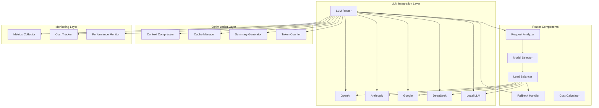

# PHẦN 6: LLM INTEGRATION & ROUTER SYSTEM

## Table of Contents
1. [System Overview](#system-overview)
2. [LLM Provider Integration](#llm-provider-integration)
3. [LLM Router](#llm-router)
4. [Model Selection Strategy](#model-selection-strategy)
5. [Context Compression](#context-compression)
6. [Long Context Handling](#long-context-handling)
7. [Prompt Cache](#prompt-cache)
8. [Conversation Summary](#conversation-summary)
9. [Cost Optimization](#cost-optimization)
10. [Performance Monitoring](#performance-monitoring)

---

## 1. System Overview

### 1.1 LLM Integration Architecture



### 1.2 Supported LLM Providers

```yaml
OpenAI:
  models:
    - GPT-4 Turbo
    - GPT-4
    - GPT-3.5 Turbo
    - GPT-4 Vision
  capabilities:
    - Text generation
    - Vision understanding
    - Function calling
    - Streaming
  pricing:
    - GPT-4: $30/1M input, $60/1M output
    - GPT-3.5: $0.5/1M input, $1.5/1M output

Anthropic:
  models:
    - Claude 3 Opus
    - Claude 3 Sonnet
    - Claude 3 Haiku
  capabilities:
    - Text generation
    - Vision understanding
    - Function calling
    - Long context (200K)
  pricing:
    - Claude 3 Opus: $15/1M input, $75/1M output
    - Claude 3 Sonnet: $3/1M input, $15/1M output

Google:
  models:
    - Gemini Pro
    - Gemini Ultra
    - PaLM 2
  capabilities:
    - Text generation
    - Multimodal
    - Function calling
    - Long context (1M)
  pricing:
    - Gemini Pro: Free tier available
    - Gemini Ultra: Enterprise pricing

DeepSeek:
  models:
    - DeepSeek Coder
    - DeepSeek Chat
  capabilities:
    - Text generation
    - Code generation
    - Function calling
  pricing:
    - Competitive pricing
    - API access

Local LLM:
  models:
    - Llama 2
    - Llama 3
    - Qwen
    - Mistral
  capabilities:
    - Text generation
    - Code generation
    - Privacy
    - Custom fine-tuning
  pricing:
    - Infrastructure costs only
    - No API fees
```

---

## 2. LLM Provider Integration

### 2.1 OpenAI Integration

```python
# openai_provider.py
import asyncio
from typing import Dict, List, Optional, AsyncGenerator
from dataclasses import dataclass
import logging
from openai import AsyncOpenAI
import os

logger = logging.getLogger(__name__)

@dataclass
class OpenAIConfig:
    api_key: str
    model: str = "gpt-4-turbo-preview"
    temperature: float = 0.7
    max_tokens: int = 4096
    top_p: float = 0.9
    frequency_penalty: float = 0.0
    presence_penalty: float = 0.0
    enable_streaming: bool = False

class OpenAIProvider:
    """
    OpenAI LLM provider integration
    """
    
    def __init__(self, config: OpenAIConfig):
        self.config = config
        self.client = None
        self.is_initialized = False
    
    async def initialize(self) -> bool:
        """Initialize OpenAI client"""
        try:
            self.client = AsyncOpenAI(api_key=self.config.api_key)
            self.is_initialized = True
            logger.info("OpenAI provider initialized")
            return True
        except Exception as e:
            logger.error(f"Failed to initialize OpenAI provider: {e}")
            return False
    
    async def generate(
        self,
        prompt: str,
        system_prompt: Optional[str] = None,
        context: Optional[Dict] = None,
        functions: Optional[List[Dict]] = None
    ) -> Dict:
        """Generate response using OpenAI"""
        if not self.is_initialized:
            raise RuntimeError("OpenAI provider not initialized")
        
        messages = []
        
        if system_prompt:
            messages.append({"role": "system", "content": system_prompt})
        
        if context:
            context_str = self._format_context(context)
            messages.append({"role": "system", "content": f"Context: {context_str}"})
        
        messages.append({"role": "user", "content": prompt})
        
        try:
            response = await self.client.chat.completions.create(
                model=self.config.model,
                messages=messages,
                temperature=self.config.temperature,
                max_tokens=self.config.max_tokens,
                top_p=self.config.top_p,
                frequency_penalty=self.config.frequency_penalty,
                presence_penalty=self.config.presence_penalty,
                functions=functions if functions else None
            )
            
            return {
                "text": response.choices[0].message.content,
                "model": response.model,
                "tokens_used": response.usage.total_tokens,
                "finish_reason": response.choices[0].finish_reason,
                "function_call": response.choices[0].message.function_call if response.choices[0].message.function_call else None
            }
            
        except Exception as e:
            logger.error(f"OpenAI generation failed: {e}")
            raise
    
    async def generate_stream(
        self,
        prompt: str,
        system_prompt: Optional[str] = None,
        context: Optional[Dict] = None
    ) -> AsyncGenerator[str, None]:
        """Generate streaming response using OpenAI"""
        if not self.is_initialized:
            raise RuntimeError("OpenAI provider not initialized")
        
        messages = []
        
        if system_prompt:
            messages.append({"role": "system", "content": system_prompt})
        
        if context:
            context_str = self._format_context(context)
            messages.append({"role": "system", "content": f"Context: {context_str}"})
        
        messages.append({"role": "user", "content": prompt})
        
        try:
            stream = await self.client.chat.completions.create(
                model=self.config.model,
                messages=messages,
                temperature=self.config.temperature,
                max_tokens=self.config.max_tokens,
                stream=True
            )
            
            async for chunk in stream:
                if chunk.choices[0].delta.content:
                    yield chunk.choices[0].delta.content
                    
        except Exception as e:
            logger.error(f"OpenAI streaming failed: {e}")
            raise
    
    def _format_context(self, context: Dict) -> str:
        """Format context dictionary into string"""
        parts = []
        for key, value in context.items():
            if isinstance(value, list):
                value = ", ".join(str(v) for v in value)
            parts.append(f"{key}: {value}")
        return "; ".join(parts)
    
    async def count_tokens(self, text: str) -> int:
        """Count tokens in text"""
        try:
            import tiktoken
            encoding = tiktoken.encoding_for_model(self.config.model)
            return len(encoding.encode(text))
        except ImportError:
            # Fallback: rough estimate (4 chars per token)
            return len(text) // 4
```

### 2.2 Anthropic Integration

```python
# anthropic_provider.py
import asyncio
from typing import Dict, List, Optional, AsyncGenerator
from dataclasses import dataclass
import logging
import anthropic

logger = logging.getLogger(__name__)

@dataclass
class AnthropicConfig:
    api_key: str
    model: str = "claude-3-opus-20240229"
    temperature: float = 0.7
    max_tokens: int = 4096
    top_p: float = 0.9
    enable_streaming: bool = False

class AnthropicProvider:
    """
    Anthropic Claude provider integration
    """
    
    def __init__(self, config: AnthropicConfig):
        self.config = config
        self.client = None
        self.is_initialized = False
    
    async def initialize(self) -> bool:
        """Initialize Anthropic client"""
        try:
            self.client = anthropic.AsyncAnthropic(api_key=self.config.api_key)
            self.is_initialized = True
            logger.info("Anthropic provider initialized")
            return True
        except Exception as e:
            logger.error(f"Failed to initialize Anthropic provider: {e}")
            return False
    
    async def generate(
        self,
        prompt: str,
        system_prompt: Optional[str] = None,
        context: Optional[Dict] = None,
        tools: Optional[List[Dict]] = None
    ) -> Dict:
        """Generate response using Claude"""
        if not self.is_initialized:
            raise RuntimeError("Anthropic provider not initialized")
        
        messages = [{"role": "user", "content": prompt}]
        
        if context:
            context_str = self._format_context(context)
            messages[0]["content"] = f"Context: {context_str}\n\n{prompt}"
        
        try:
            response = await self.client.messages.create(
                model=self.config.model,
                system=system_prompt if system_prompt else None,
                messages=messages,
                temperature=self.config.temperature,
                max_tokens=self.config.max_tokens,
                top_p=self.config.top_p,
                tools=tools if tools else None
            )
            
            return {
                "text": response.content[0].text,
                "model": response.model,
                "tokens_used": response.usage.input_tokens + response.usage.output_tokens,
                "finish_reason": response.stop_reason,
                "tool_use": response.content[0] if response.content and hasattr(response.content[0], 'type') and response.content[0].type == 'tool_use' else None
            }
            
        except Exception as e:
            logger.error(f"Anthropic generation failed: {e}")
            raise
    
    async def generate_stream(
        self,
        prompt: str,
        system_prompt: Optional[str] = None,
        context: Optional[Dict] = None
    ) -> AsyncGenerator[str, None]:
        """Generate streaming response using Claude"""
        if not self.is_initialized:
            raise RuntimeError("Anthropic provider not initialized")
        
        messages = [{"role": "user", "content": prompt}]
        
        if context:
            context_str = self._format_context(context)
            messages[0]["content"] = f"Context: {context_str}\n\n{prompt}"
        
        try:
            stream = await self.client.messages.create(
                model=self.config.model,
                system=system_prompt if system_prompt else None,
                messages=messages,
                temperature=self.config.temperature,
                max_tokens=self.config.max_tokens,
                stream=True
            )
            
            async for chunk in stream:
                if chunk.type == "content_block_delta":
                    if chunk.delta.type == "text_delta":
                        yield chunk.delta.text
                        
        except Exception as e:
            logger.error(f"Anthropic streaming failed: {e}")
            raise
    
    def _format_context(self, context: Dict) -> str:
        """Format context dictionary into string"""
        parts = []
        for key, value in context.items():
            if isinstance(value, list):
                value = ", ".join(str(v) for v in value)
            parts.append(f"{key}: {value}")
        return "; ".join(parts)
```

---

## 3. LLM Router

### 3.1 LLM Router Implementation

```python
# llm_router.py
from typing import Dict, List, Optional, AsyncGenerator
from dataclasses import dataclass
from enum import Enum
import logging
import asyncio

logger = logging.getLogger(__name__)

class RoutingStrategy(Enum):
    ROUND_ROBIN = "round_robin"
    LEAST_LATENCY = "least_latency"
    COST_OPTIMIZED = "cost_optimized"
    QUALITY_FIRST = "quality_first"
    HYBRID = "hybrid"

@dataclass
class RoutingDecision:
    provider: str
    model: str
    reasoning: str
    estimated_cost: float
    estimated_latency: float

class LLMRouter:
    """
    Routes requests to optimal LLM provider
    """
    
    def __init__(self, providers: Dict, strategy: RoutingStrategy = RoutingStrategy.HYBRID):
        self.providers = providers  # {provider_name: provider_instance}
        self.strategy = strategy
        self.performance_metrics = {}
        self.cost_metrics = {}
        self.current_index = 0
        
        # Initialize metrics for each provider
        for provider_name in providers:
            self.performance_metrics[provider_name] = {
                "latency": [],
                "success_rate": 1.0,
                "error_count": 0,
                "total_requests": 0
            }
            self.cost_metrics[provider_name] = {
                "total_cost": 0.0,
                "total_tokens": 0
            }
    
    async def route(
        self,
        prompt: str,
        system_prompt: Optional[str] = None,
        context: Optional[Dict] = None,
        functions: Optional[List[Dict]] = None,
        preferred_provider: Optional[str] = None
    ) -> RoutingDecision:
        """
        Route request to optimal provider
        """
        if preferred_provider and preferred_provider in self.providers:
            return RoutingDecision(
                provider=preferred_provider,
                model=self.providers[preferred_provider].config.model,
                reasoning="User preferred provider",
                estimated_cost=self._estimate_cost(preferred_provider, prompt),
                estimated_latency=self._estimate_latency(preferred_provider)
            )
        
        if self.strategy == RoutingStrategy.ROUND_ROBIN:
            return self._round_robin_routing(prompt)
        elif self.strategy == RoutingStrategy.LEAST_LATENCY:
            return self._least_latency_routing(prompt)
        elif self.strategy == RoutingStrategy.COST_OPTIMIZED:
            return self._cost_optimized_routing(prompt)
        elif self.strategy == RoutingStrategy.QUALITY_FIRST:
            return self._quality_first_routing(prompt)
        elif self.strategy == RoutingStrategy.HYBRID:
            return self._hybrid_routing(prompt, context)
    
    def _round_robin_routing(self, prompt: str) -> RoutingDecision:
        """Round-robin routing"""
        provider_names = list(self.providers.keys())
        provider_name = provider_names[self.current_index]
        self.current_index = (self.current_index + 1) % len(provider_names)
        
        return RoutingDecision(
            provider=provider_name,
            model=self.providers[provider_name].config.model,
            reasoning="Round-robin routing",
            estimated_cost=self._estimate_cost(provider_name, prompt),
            estimated_latency=self._estimate_latency(provider_name)
        )
    
    def _least_latency_routing(self, prompt: str) -> RoutingDecision:
        """Route to provider with least latency"""
        best_provider = None
        best_latency = float('inf')
        
        for provider_name, metrics in self.performance_metrics.items():
            if metrics["latency"]:
                avg_latency = sum(metrics["latency"]) / len(metrics["latency"])
                if avg_latency < best_latency:
                    best_latency = avg_latency
                    best_provider = provider_name
        
        if best_provider is None:
            best_provider = list(self.providers.keys())[0]
        
        return RoutingDecision(
            provider=best_provider,
            model=self.providers[best_provider].config.model,
            reasoning="Least latency routing",
            estimated_cost=self._estimate_cost(best_provider, prompt),
            estimated_latency=best_latency
        )
    
    def _cost_optimized_routing(self, prompt: str) -> RoutingDecision:
        """Route to most cost-effective provider"""
        best_provider = None
        best_cost = float('inf')
        
        for provider_name in self.providers:
            cost = self._estimate_cost(provider_name, prompt)
            if cost < best_cost:
                best_cost = cost
                best_provider = provider_name
        
        return RoutingDecision(
            provider=best_provider,
            model=self.providers[best_provider].config.model,
            reasoning="Cost-optimized routing",
            estimated_cost=best_cost,
            estimated_latency=self._estimate_latency(best_provider)
        )
    
    def _quality_first_routing(self, prompt: str) -> RoutingDecision:
        """Route to highest quality provider"""
        # Quality ranking based on model capabilities
        quality_ranking = {
            "openai": 5,  # GPT-4
            "anthropic": 5,  # Claude 3 Opus
            "google": 4,  # Gemini Ultra
            "deepseek": 3,
            "local": 2
        }
        
        best_provider = max(
            self.providers.keys(),
            key=lambda x: quality_ranking.get(x, 1)
        )
        
        return RoutingDecision(
            provider=best_provider,
            model=self.providers[best_provider].config.model,
            reasoning="Quality-first routing",
            estimated_cost=self._estimate_cost(best_provider, prompt),
            estimated_latency=self._estimate_latency(best_provider)
        )
    
    def _hybrid_routing(
        self, 
        prompt: str, 
        context: Optional[Dict]
    ) -> RoutingDecision:
        """Hybrid routing considering multiple factors"""
        scores = {}
        
        for provider_name in self.providers:
            score = 0.0
            
            # Latency score (0-40 points)
            latency_metrics = self.performance_metrics[provider_name]
            if latency_metrics["latency"]:
                avg_latency = sum(latency_metrics["latency"]) / len(latency_metrics["latency"])
                latency_score = max(0, 40 - avg_latency * 10)  # Lower latency = higher score
                score += latency_score
            else:
                score += 20  # Default score
            
            # Cost score (0-30 points)
            cost = self._estimate_cost(provider_name, prompt)
            cost_score = max(0, 30 - cost * 10)  # Lower cost = higher score
            score += cost_score
            
            # Quality score (0-30 points)
            quality_ranking = {
                "openai": 30,
                "anthropic": 30,
                "google": 25,
                "deepseek": 20,
                "local": 15
            }
            score += quality_ranking.get(provider_name, 10)
            
            scores[provider_name] = score
        
        best_provider = max(scores, key=scores.get)
        
        return RoutingDecision(
            provider=best_provider,
            model=self.providers[best_provider].config.model,
            reasoning=f"Hybrid routing (score: {scores[best_provider]:.1f})",
            estimated_cost=self._estimate_cost(best_provider, prompt),
            estimated_latency=self._estimate_latency(best_provider)
        )
    
    def _estimate_cost(self, provider_name: str, prompt: str) -> float:
        """Estimate cost for request"""
        # Approximate cost calculation
        token_count = len(prompt.split()) * 1.3  # Rough token estimate
        
        cost_per_1k_tokens = {
            "openai": 0.03,  # GPT-4
            "anthropic": 0.015,  # Claude 3
            "google": 0.001,  # Gemini Pro
            "deepseek": 0.001,
            "local": 0.0
        }
        
        cost_per_token = cost_per_1k_tokens.get(provider_name, 0.01) / 1000
        return token_count * cost_per_token
    
    def _estimate_latency(self, provider_name: str) -> float:
        """Estimate latency for provider"""
        latency_metrics = self.performance_metrics[provider_name]
        if latency_metrics["latency"]:
            return sum(latency_metrics["latency"]) / len(latency_metrics["latency"])
        return 1.0  # Default estimate
    
    async def execute(
        self,
        prompt: str,
        system_prompt: Optional[str] = None,
        context: Optional[Dict] = None,
        functions: Optional[List[Dict]] = None,
        preferred_provider: Optional[str] = None
    ) -> Dict:
        """
        Execute request using routed provider
        """
        import time
        start_time = time.time()
        
        # Get routing decision
        decision = await self.route(
            prompt, system_prompt, context, functions, preferred_provider
        )
        
        logger.info(f"Routing to {decision.provider} with model {decision.model}")
        
        # Execute with selected provider
        provider = self.providers[decision.provider]
        
        try:
            response = await provider.generate(
                prompt, system_prompt, context, functions
            )
            
            # Update metrics
            latency = time.time() - start_time
            self._update_metrics(decision.provider, latency, True, response["tokens_used"])
            
            return {
                **response,
                "routing_decision": decision
            }
            
        except Exception as e:
            # Update error metrics
            latency = time.time() - start_time
            self._update_metrics(decision.provider, latency, False, 0)
            
            # Try fallback
            logger.error(f"Provider {decision.provider} failed: {e}")
            return await self._fallback(prompt, system_prompt, context, functions)
    
    async def _fallback(
        self,
        prompt: str,
        system_prompt: Optional[str],
        context: Optional[Dict],
        functions: Optional[List[Dict]]
    ) -> Dict:
        """Fallback to alternative provider"""
        # Try each provider in order
        for provider_name in self.providers:
            if provider_name != "local":  # Try non-local first
                try:
                    provider = self.providers[provider_name]
                    response = await provider.generate(prompt, system_prompt, context, functions)
                    
                    import time
                    start_time = time.time()
                    latency = time.time() - start_time
                    self._update_metrics(provider_name, latency, True, response["tokens_used"])
                    
                    return {
                        **response,
                        "routing_decision": RoutingDecision(
                            provider=provider_name,
                            model=provider.config.model,
                            reasoning="Fallback routing",
                            estimated_cost=0.0,
                            estimated_latency=0.0
                        )
                    }
                except Exception as e:
                    logger.error(f"Fallback provider {provider_name} also failed: {e}")
                    continue
        
        # Last resort: local provider
        if "local" in self.providers:
            try:
                provider = self.providers["local"]
                response = await provider.generate(prompt, system_prompt, context, functions)
                
                import time
                start_time = time.time()
                latency = time.time() - start_time
                self._update_metrics("local", latency, True, response["tokens_used"])
                
                return {
                    **response,
                    "routing_decision": RoutingDecision(
                        provider="local",
                        model=provider.config.model,
                        reasoning="Last resort fallback",
                        estimated_cost=0.0,
                        estimated_latency=0.0
                    )
                }
            except Exception as e:
                logger.error(f"Local provider also failed: {e}")
        
        raise RuntimeError("All providers failed")
    
    def _update_metrics(
        self,
        provider_name: str,
        latency: float,
        success: bool,
        tokens_used: int
    ):
        """Update performance metrics"""
        metrics = self.performance_metrics[provider_name]
        cost_metrics = self.cost_metrics[provider_name]
        
        metrics["latency"].append(latency)
        metrics["total_requests"] += 1
        
        if success:
            # Update success rate
            metrics["success_rate"] = (
                metrics["success_rate"] * (metrics["total_requests"] - 1) + 1.0
            ) / metrics["total_requests"]
        else:
            metrics["error_count"] += 1
            metrics["success_rate"] = (
                metrics["success_rate"] * (metrics["total_requests"] - 1)
            ) / metrics["total_requests"]
        
        # Keep only last 100 latency measurements
        if len(metrics["latency"]) > 100:
            metrics["latency"] = metrics["latency"][-100:]
        
        # Update cost metrics
        cost_metrics["total_tokens"] += tokens_used
        cost_metrics["total_cost"] += self._estimate_cost(provider_name, "")
    
    def get_metrics(self) -> Dict:
        """Get current routing metrics"""
        return {
            "performance": self.performance_metrics,
            "cost": self.cost_metrics
        }
```

---

## 4. Model Selection Strategy

### 4.1 Model Selector

```python
# model_selector.py
from typing import Dict, List, Optional
from dataclasses import dataclass
from enum import Enum
import logging

logger = logging.getLogger(__name__)

class TaskType(Enum):
    GENERAL_CONVERSATION = "general_conversation"
    CODE_GENERATION = "code_generation"
    CREATIVE_WRITING = "creative_writing"
    ANALYSIS = "analysis"
    SUMMARIZATION = "summarization"
    TRANSLATION = "translation"
    MATH = "math"
    REASONING = "reasoning"

@dataclass
class ModelCapabilities:
    name: str
    provider: str
    task_performance: Dict[TaskType, float]  # 0.0 to 1.0
    max_context: int
    cost_per_1k_tokens: float
    average_latency: float
    supports_vision: bool
    supports_functions: bool

class ModelSelector:
    """
    Selects optimal model based on task requirements
    """
    
    def __init__(self):
        self.model_capabilities = {
            "gpt-4-turbo": ModelCapabilities(
                name="gpt-4-turbo",
                provider="openai",
                task_performance={
                    TaskType.GENERAL_CONVERSATION: 0.95,
                    TaskType.CODE_GENERATION: 0.92,
                    TaskType.CREATIVE_WRITING: 0.90,
                    TaskType.ANALYSIS: 0.93,
                    TaskType.SUMMARIZATION: 0.91,
                    TaskType.TRANSLATION: 0.88,
                    TaskType.MATH: 0.90,
                    TaskType.REASONING: 0.94
                },
                max_context=128000,
                cost_per_1k_tokens=0.01,
                average_latency=2.0,
                supports_vision=True,
                supports_functions=True
            ),
            "claude-3-opus": ModelCapabilities(
                name="claude-3-opus",
                provider="anthropic",
                task_performance={
                    TaskType.GENERAL_CONVERSATION: 0.94,
                    TaskType.CODE_GENERATION: 0.91,
                    TaskType.CREATIVE_WRITING: 0.93,
                    TaskType.ANALYSIS: 0.95,
                    TaskType.SUMMARIZATION: 0.92,
                    TaskType.TRANSLATION: 0.89,
                    TaskType.MATH: 0.88,
                    TaskType.REASONING: 0.95
                },
                max_context=200000,
                cost_per_1k_tokens=0.015,
                average_latency=2.5,
                supports_vision=True,
                supports_functions=True
            ),
            "gemini-pro": ModelCapabilities(
                name="gemini-pro",
                provider="google",
                task_performance={
                    TaskType.GENERAL_CONVERSATION: 0.90,
                    TaskType.CODE_GENERATION: 0.85,
                    TaskType.CREATIVE_WRITING: 0.88,
                    TaskType.ANALYSIS: 0.87,
                    TaskType.SUMMARIZATION: 0.89,
                    TaskType.TRANSLATION: 0.92,
                    TaskType.MATH: 0.86,
                    TaskType.REASONING: 0.88
                },
                max_context=1000000,
                cost_per_1k_tokens=0.001,
                average_latency=1.5,
                supports_vision=True,
                supports_functions=True
            ),
            "llama-3-70b": ModelCapabilities(
                name="llama-3-70b",
                provider="local",
                task_performance={
                    TaskType.GENERAL_CONVERSATION: 0.85,
                    TaskType.CODE_GENERATION: 0.88,
                    TaskType.CREATIVE_WRITING: 0.82,
                    TaskType.ANALYSIS: 0.83,
                    TaskType.SUMMARIZATION: 0.84,
                    TaskType.TRANSLATION: 0.80,
                    TaskType.MATH: 0.81,
                    TaskType.REASONING: 0.82
                },
                max_context=8000,
                cost_per_1k_tokens=0.0,
                average_latency=0.5,
                supports_vision=False,
                supports_functions=False
            )
        }
    
    def select_model(
        self,
        task_type: TaskType,
        context_length: int,
        budget_constraint: Optional[float] = None,
        latency_constraint: Optional[float] = None,
        requires_vision: bool = False,
        requires_functions: bool = False
    ) -> str:
        """
        Select optimal model for task
        """
        candidates = []
        
        for model_name, capabilities in self.model_capabilities.items():
            # Check constraints
            if context_length > capabilities.max_context:
                continue
            
            if requires_vision and not capabilities.supports_vision:
                continue
            
            if requires_functions and not capabilities.supports_functions:
                continue
            
            if budget_constraint:
                estimated_cost = (context_length / 1000) * capabilities.cost_per_1k_tokens
                if estimated_cost > budget_constraint:
                    continue
            
            if latency_constraint and capabilities.average_latency > latency_constraint:
                continue
            
            # Calculate score
            score = self._calculate_model_score(
                capabilities, task_type, budget_constraint, latency_constraint
            )
            
            candidates.append((model_name, score))
        
        if not candidates:
            logger.warning("No model meets constraints, using fallback")
            return "llama-3-70b"  # Local fallback
        
        # Select best model
        best_model = max(candidates, key=lambda x: x[1])
        
        logger.info(f"Selected model: {best_model[0]} with score {best_model[1]:.2f}")
        return best_model[0]
    
    def _calculate_model_score(
        self,
        capabilities: ModelCapabilities,
        task_type: TaskType,
        budget_constraint: Optional[float],
        latency_constraint: Optional[float]
    ) -> float:
        """Calculate overall model score"""
        score = 0.0
        
        # Task performance (50% weight)
        task_score = capabilities.task_performance.get(task_type, 0.5)
        score += task_score * 0.5
        
        # Cost efficiency (20% weight)
        if budget_constraint:
            estimated_cost = (1000 / 1000) * capabilities.cost_per_1k_tokens
            cost_score = max(0, 1.0 - (estimated_cost / budget_constraint))
            score += cost_score * 0.2
        else:
            score += 0.15  # Default moderate score
        
        # Latency (20% weight)
        if latency_constraint:
            latency_score = max(0, 1.0 - (capabilities.average_latency / latency_constraint))
            score += latency_score * 0.2
        else:
            score += 0.15  # Default moderate score
        
        # Context capacity (10% weight)
        context_score = min(1.0, capabilities.max_context / 100000)
        score += context_score * 0.1
        
        return score
```

---

## 5. Context Compression

### 5.1 Context Compressor

```python
# context_compressor.py
from typing import Dict, List, Optional
from dataclasses import dataclass
import logging

logger = logging.getLogger(__name__)

@dataclass
class CompressionResult:
    compressed_context: str
    original_length: int
    compressed_length: int
    compression_ratio: float
    retained_info: List[str]

class ContextCompressor:
    """
    Compresses context to fit within token limits
    """
    
    def __init__(self):
        self.compression_strategies = {
            "importance_based": self._importance_based_compression,
            "temporal": self._temporal_compression,
            "semantic": self._semantic_compression,
            "hybrid": self._hybrid_compression
        }
    
    def compress(
        self,
        context: str,
        max_tokens: int,
        strategy: str = "hybrid",
        preserve_key_info: Optional[List[str]] = None
    ) -> CompressionResult:
        """
        Compress context to fit within token limit
        """
        original_length = len(context.split())
        
        if original_length <= max_tokens:
            return CompressionResult(
                compressed_context=context,
                original_length=original_length,
                compressed_length=original_length,
                compression_ratio=1.0,
                retained_info=[]
            )
        
        # Apply compression strategy
        if strategy in self.compression_strategies:
            compressed_context, retained_info = self.compression_strategies[strategy](
                context, max_tokens, preserve_key_info
            )
        else:
            compressed_context, retained_info = self._hybrid_compression(
                context, max_tokens, preserve_key_info
            )
        
        compressed_length = len(compressed_context.split())
        compression_ratio = compressed_length / original_length
        
        return CompressionResult(
            compressed_context=compressed_context,
            original_length=original_length,
            compressed_length=compressed_length,
            compression_ratio=compression_ratio,
            retained_info=retained_info
        )
    
    def _importance_based_compression(
        self,
        context: str,
        max_tokens: int,
        preserve_key_info: Optional[List[str]]
    ) -> tuple:
        """Compress based on importance scoring"""
        sentences = context.split('. ')
        
        # Score each sentence
        scored_sentences = []
        for sentence in sentences:
            score = self._score_sentence(sentence, preserve_key_info)
            scored_sentences.append((sentence, score))
        
        # Sort by score and keep top sentences
        scored_sentences.sort(key=lambda x: x[1], reverse=True)
        
        # Keep sentences until token limit
        kept_sentences = []
        current_tokens = 0
        
        for sentence, score in scored_sentences:
            sentence_tokens = len(sentence.split())
            if current_tokens + sentence_tokens <= max_tokens:
                kept_sentences.append(sentence)
                current_tokens += sentence_tokens
            else:
                break
        
        compressed_context = '. '.join(kept_sentences)
        retained_info = [s[0] for s in scored_sentences[:len(kept_sentences)]]
        
        return compressed_context, retained_info
    
    def _score_sentence(self, sentence: str, preserve_key_info: Optional[List[str]]) -> float:
        """Score sentence importance"""
        score = 0.0
        
        # Length score (moderate length is better)
        words = sentence.split()
        if 5 <= len(words) <= 20:
            score += 0.3
        elif len(words) < 5:
            score += 0.1
        else:
            score += 0.2
        
        # Key info preservation
        if preserve_key_info:
            for key_info in preserve_key_info:
                if key_info.lower() in sentence.lower():
                    score += 0.5
        
        # Question sentences are important
        if '?' in sentence:
            score += 0.3
        
        # Numbers and dates are important
        if any(word.isdigit() for word in words):
            score += 0.2
        
        return score
    
    def _temporal_compression(
        self,
        context: str,
        max_tokens: int,
        preserve_key_info: Optional[List[str]]
    ) -> tuple:
        """Compress keeping most recent information"""
        sentences = context.split('. ')
        
        # Reverse to prioritize recent
        sentences.reverse()
        
        kept_sentences = []
        current_tokens = 0
        
        for sentence in sentences:
            sentence_tokens = len(sentence.split())
            if current_tokens + sentence_tokens <= max_tokens:
                kept_sentences.append(sentence)
                current_tokens += sentence_tokens
            else:
                break
        
        # Reverse back to original order
        kept_sentences.reverse()
        compressed_context = '. '.join(kept_sentences)
        retained_info = kept_sentences
        
        return compressed_context, retained_info
    
    def _semantic_compression(
        self,
        context: str,
        max_tokens: int,
        preserve_key_info: Optional[List[str]]
    ) -> tuple:
        """Compress based on semantic similarity"""
        # Simplified semantic compression
        # In production, would use embeddings and clustering
        
        sentences = context.split('. ')
        
        # Group similar sentences and keep representatives
        kept_sentences = []
        current_tokens = 0
        
        for sentence in sentences:
            if current_tokens + len(sentence.split()) <= max_tokens:
                kept_sentences.append(sentence)
                current_tokens += len(sentence.split())
            else:
                break
        
        compressed_context = '. '.join(kept_sentences)
        retained_info = kept_sentences
        
        return compressed_context, retained_info
    
    def _hybrid_compression(
        self,
        context: str,
        max_tokens: int,
        preserve_key_info: Optional[List[str]]
    ) -> tuple:
        """Hybrid compression combining multiple strategies"""
        # First, apply importance-based
        importance_compressed, retained = self._importance_based_compression(
            context, max_tokens, preserve_key_info
        )
        
        # If still too long, apply temporal
        if len(importance_compressed.split()) > max_tokens:
            importance_compressed, retained = self._temporal_compression(
                importance_compressed, max_tokens, preserve_key_info
            )
        
        return importance_compressed, retained
```

---

## 6. Long Context Handling

### 6.1 Long Context Manager

```python
# long_context_manager.py
from typing import Dict, List, Optional
from dataclasses import dataclass
import logging

logger = logging.getLogger(__name__)

@dataclass
class ContextSegment:
    content: str
    importance: float
    timestamp: float
    segment_id: str

class LongContextManager:
    """
    Manages long contexts exceeding model limits
    """
    
    def __init__(self, max_context_length: int = 100000):
        self.max_context_length = max_context_length
        self.context_segments: List[ContextSegment] = []
        self.segment_counter = 0
    
    def add_segment(
        self,
        content: str,
        importance: float = 0.5,
        timestamp: Optional[float] = None
    ) -> str:
        """Add a context segment"""
        import time
        
        segment_id = f"segment_{self.segment_counter}"
        self.segment_counter += 1
        
        segment = ContextSegment(
            content=content,
            importance=importance,
            timestamp=timestamp or time.time(),
            segment_id=segment_id
        )
        
        self.context_segments.append(segment)
        
        # Prune if too many segments
        self._prune_segments()
        
        logger.info(f"Added context segment: {segment_id}")
        return segment_id
    
    def _prune_segments(self):
        """Prune less important segments"""
        if len(self.context_segments) > 100:
            # Sort by importance and timestamp
            self.context_segments.sort(
                key=lambda x: (x.importance, x.timestamp),
                reverse=True
            )
            # Keep top 100
            self.context_segments = self.context_segments[:100]
    
    def get_context(
        self,
        max_tokens: int,
        strategy: str = "importance"
    ) -> str:
        """Get context within token limit"""
        if strategy == "importance":
            return self._get_importance_based_context(max_tokens)
        elif strategy == "recent":
            return self._get_recent_context(max_tokens)
        elif strategy == "balanced":
            return self._get_balanced_context(max_tokens)
        else:
            return self._get_importance_based_context(max_tokens)
    
    def _get_importance_based_context(self, max_tokens: int) -> str:
        """Get context based on importance"""
        sorted_segments = sorted(
            self.context_segments,
            key=lambda x: x.importance,
            reverse=True
        )
        
        selected_segments = []
        current_tokens = 0
        
        for segment in sorted_segments:
            segment_tokens = len(segment.content.split())
            if current_tokens + segment_tokens <= max_tokens:
                selected_segments.append(segment)
                current_tokens += segment_tokens
            else:
                break
        
        return '\n\n'.join(s.content for s in selected_segments)
    
    def _get_recent_context(self, max_tokens: int) -> str:
        """Get most recent context"""
        sorted_segments = sorted(
            self.context_segments,
            key=lambda x: x.timestamp,
            reverse=True
        )
        
        selected_segments = []
        current_tokens = 0
        
        for segment in sorted_segments:
            segment_tokens = len(segment.content.split())
            if current_tokens + segment_tokens <= max_tokens:
                selected_segments.append(segment)
                current_tokens += segment_tokens
            else:
                break
        
        return '\n\n'.join(s.content for s in selected_segments)
    
    def _get_balanced_context(self, max_tokens: int) -> str:
        """Get balanced context mixing importance and recency"""
        # Combine importance and recency scores
        import time
        current_time = time.time()
        
        scored_segments = []
        for segment in self.context_segments:
            # Recency score (0-1)
            time_diff = current_time - segment.timestamp
            recency_score = max(0, 1.0 - time_diff / 3600)  # Decay over 1 hour
            
            # Combined score
            combined_score = 0.6 * segment.importance + 0.4 * recency_score
            scored_segments.append((segment, combined_score))
        
        # Sort by combined score
        scored_segments.sort(key=lambda x: x[1], reverse=True)
        
        selected_segments = []
        current_tokens = 0
        
        for segment, score in scored_segments:
            segment_tokens = len(segment.content.split())
            if current_tokens + segment_tokens <= max_tokens:
                selected_segments.append(segment)
                current_tokens += segment_tokens
            else:
                break
        
        return '\n\n'.join(s.content for s in selected_segments)
    
    def update_segment_importance(self, segment_id: str, new_importance: float):
        """Update importance of a segment"""
        for segment in self.context_segments:
            if segment.segment_id == segment_id:
                segment.importance = new_importance
                break
```

---

## 7. Prompt Cache

### 7.1 Cache Manager

```python
# cache_manager.py
from typing import Dict, Optional, Any
from dataclasses import dataclass
import hashlib
import json
import logging
import time

logger = logging.getLogger(__name__)

@dataclass
class CacheEntry:
    key: str
    value: Any
    timestamp: float
    ttl: int
    access_count: int

class PromptCacheManager:
    """
    Manages prompt caching to reduce API calls
    """
    
    def __init__(self, max_size: int = 1000, default_ttl: int = 3600):
        self.cache: Dict[str, CacheEntry] = {}
        self.max_size = max_size
        self.default_ttl = default_ttl
        self.hit_count = 0
        self.miss_count = 0
    
    def generate_key(
        self,
        prompt: str,
        system_prompt: Optional[str] = None,
        model: str = "default",
        parameters: Optional[Dict] = None
    ) -> str:
        """Generate cache key from request parameters"""
        key_data = {
            "prompt": prompt,
            "system_prompt": system_prompt,
            "model": model,
            "parameters": parameters or {}
        }
        
        key_string = json.dumps(key_data, sort_keys=True)
        return hashlib.sha256(key_string.encode()).hexdigest()
    
    def get(self, key: str) -> Optional[Any]:
        """Get cached value"""
        entry = self.cache.get(key)
        
        if entry is None:
            self.miss_count += 1
            return None
        
        # Check if expired
        if time.time() - entry.timestamp > entry.ttl:
            del self.cache[key]
            self.miss_count += 1
            return None
        
        # Update access count
        entry.access_count += 1
        self.hit_count += 1
        
        logger.debug(f"Cache hit for key: {key}")
        return entry.value
    
    def set(
        self,
        key: str,
        value: Any,
        ttl: Optional[int] = None
    ):
        """Set cached value"""
        if len(self.cache) >= self.max_size:
            self._evict_oldest()
        
        entry = CacheEntry(
            key=key,
            value=value,
            timestamp=time.time(),
            ttl=ttl or self.default_ttl,
            access_count=0
        )
        
        self.cache[key] = entry
        logger.debug(f"Cached value for key: {key}")
    
    def _evict_oldest(self):
        """Evict oldest cache entry"""
        if not self.cache:
            return
        
        oldest_key = min(
            self.cache.keys(),
            key=lambda k: self.cache[k].timestamp
        )
        
        del self.cache[oldest_key]
        logger.debug(f"Evicted cache entry: {oldest_key}")
    
    def invalidate(self, key: str):
        """Invalidate cache entry"""
        if key in self.cache:
            del self.cache[key]
            logger.debug(f"Invalidated cache entry: {key}")
    
    def clear(self):
        """Clear all cache entries"""
        self.cache.clear()
        self.hit_count = 0
        self.miss_count = 0
        logger.info("Cache cleared")
    
    def get_stats(self) -> Dict:
        """Get cache statistics"""
        total_requests = self.hit_count + self.miss_count
        hit_rate = self.hit_count / total_requests if total_requests > 0 else 0.0
        
        return {
            "size": len(self.cache),
            "max_size": self.max_size,
            "hit_count": self.hit_count,
            "miss_count": self.miss_count,
            "hit_rate": hit_rate
        }
```

---

## 8. Conversation Summary

### 8.1 Summary Generator

```python
# summary_generator.py
from typing import Dict, List, Optional
from dataclasses import dataclass
import logging

logger = logging.getLogger(__name__)

@dataclass
class ConversationSummary:
    summary: str
    key_points: List[str]
    entities: List[str]
    topics: List[str]
    sentiment: str

class SummaryGenerator:
    """
    Generates summaries of conversations
    """
    
    def __init__(self, llm_service):
        self.llm_service = llm_service
    
    async def generate_summary(
        self,
        conversation: List[Dict],
        max_length: int = 200
    ) -> ConversationSummary:
        """Generate summary of conversation"""
        # Format conversation for LLM
        conversation_text = self._format_conversation(conversation)
        
        # Generate summary
        summary_prompt = f"""
        Summarize the following conversation in {max_length} words or less.
        Include key points, entities, topics, and overall sentiment.
        
        Conversation:
        {conversation_text}
        
        Format your response as JSON with the following structure:
        {{
            "summary": "brief summary",
            "key_points": ["point1", "point2", ...],
            "entities": ["entity1", "entity2", ...],
            "topics": ["topic1", "topic2", ...],
            "sentiment": "positive/negative/neutral"
        }}
        """
        
        try:
            response = await self.llm_service.generate(summary_prompt)
            
            # Parse JSON response
            import json
            summary_data = json.loads(response["text"])
            
            return ConversationSummary(
                summary=summary_data["summary"],
                key_points=summary_data["key_points"],
                entities=summary_data["entities"],
                topics=summary_data["topics"],
                sentiment=summary_data["sentiment"]
            )
            
        except Exception as e:
            logger.error(f"Summary generation failed: {e}")
            # Fallback to simple summary
            return self._generate_simple_summary(conversation)
    
    def _format_conversation(self, conversation: List[Dict]) -> str:
        """Format conversation for LLM"""
        formatted = []
        
        for turn in conversation:
            role = turn.get("role", "unknown")
            content = turn.get("content", "")
            formatted.append(f"{role}: {content}")
        
        return "\n".join(formatted)
    
    def _generate_simple_summary(self, conversation: List[Dict]) -> ConversationSummary:
        """Generate simple summary without LLM"""
        # Extract key information
        all_text = " ".join(turn.get("content", "") for turn in conversation)
        words = all_text.split()
        
        # Simple summary
        summary = f"Conversation with {len(conversation)} turns and {len(words)} total words."
        
        # Extract entities (simplified)
        entities = []
        for word in words:
            if word[0].isupper() and len(word) > 1:
                entities.append(word)
        
        return ConversationSummary(
            summary=summary,
            key_points=[],
            entities=entities[:10],  # Top 10
            topics=[],
            sentiment="neutral"
        )
    
    async def incremental_summary(
        self,
        previous_summary: ConversationSummary,
        new_turn: Dict
    ) -> ConversationSummary:
        """Update summary with new conversation turn"""
        summary_prompt = f"""
        Update the following conversation summary with a new turn.
        
        Previous Summary:
        {previous_summary.summary}
        Key Points: {', '.join(previous_summary.key_points)}
        Entities: {', '.join(previous_summary.entities)}
        Topics: {', '.join(previous_summary.topics)}
        Sentiment: {previous_summary.sentiment}
        
        New Turn:
        {new_turn.get('role', 'unknown')}: {new_turn.get('content', '')}
        
        Provide updated summary in the same JSON format.
        """
        
        try:
            response = await self.llm_service.generate(summary_prompt)
            
            import json
            summary_data = json.loads(response["text"])
            
            return ConversationSummary(
                summary=summary_data["summary"],
                key_points=summary_data["key_points"],
                entities=summary_data["entities"],
                topics=summary_data["topics"],
                sentiment=summary_data["sentiment"]
            )
            
        except Exception as e:
            logger.error(f"Incremental summary failed: {e}")
            return previous_summary
```

---

## 9. Cost Optimization

### 9.1 Cost Optimizer

```python
# cost_optimizer.py
from typing import Dict, List, Optional
from dataclasses import dataclass
import logging

logger = logging.getLogger(__name__)

@dataclass
class CostBreakdown:
    provider: str
    model: str
    input_tokens: int
    output_tokens: int
    input_cost: float
    output_cost: float
    total_cost: float

class CostOptimizer:
    """
    Optimizes LLM usage for cost efficiency
    """
    
    def __init__(self):
        self.pricing = {
            "openai": {
                "gpt-4-turbo": {"input": 0.01, "output": 0.03},
                "gpt-4": {"input": 0.03, "output": 0.06},
                "gpt-3.5-turbo": {"input": 0.0005, "output": 0.0015}
            },
            "anthropic": {
                "claude-3-opus": {"input": 0.015, "output": 0.075},
                "claude-3-sonnet": {"input": 0.003, "output": 0.015},
                "claude-3-haiku": {"input": 0.00025, "output": 0.00125}
            },
            "google": {
                "gemini-pro": {"input": 0.0005, "output": 0.0015},
                "gemini-ultra": {"input": 0.001, "output": 0.003}
            },
            "deepseek": {
                "deepseek-chat": {"input": 0.00014, "output": 0.00028},
                "deepseek-coder": {"input": 0.00014, "output": 0.00028}
            },
            "local": {
                "llama-3-70b": {"input": 0.0, "output": 0.0},
                "llama-3-8b": {"input": 0.0, "output": 0.0}
            }
        }
        
        self.cost_history: List[CostBreakdown] = []
        self.total_cost = 0.0
    
    def calculate_cost(
        self,
        provider: str,
        model: str,
        input_tokens: int,
        output_tokens: int
    ) -> CostBreakdown:
        """Calculate cost for API call"""
        if provider not in self.pricing:
            logger.warning(f"Unknown provider: {provider}")
            return CostBreakdown(
                provider=provider,
                model=model,
                input_tokens=input_tokens,
                output_tokens=output_tokens,
                input_cost=0.0,
                output_cost=0.0,
                total_cost=0.0
            )
        
        if model not in self.pricing[provider]:
            logger.warning(f"Unknown model: {model} for provider {provider}")
            return CostBreakdown(
                provider=provider,
                model=model,
                input_tokens=input_tokens,
                output_tokens=output_tokens,
                input_cost=0.0,
                output_cost=0.0,
                total_cost=0.0
            )
        
        pricing = self.pricing[provider][model]
        input_cost = (input_tokens / 1000) * pricing["input"]
        output_cost = (output_tokens / 1000) * pricing["output"]
        total_cost = input_cost + output_cost
        
        breakdown = CostBreakdown(
            provider=provider,
            model=model,
            input_tokens=input_tokens,
            output_tokens=output_tokens,
            input_cost=input_cost,
            output_cost=output_cost,
            total_cost=total_cost
        )
        
        self.cost_history.append(breakdown)
        self.total_cost += total_cost
        
        return breakdown
    
    def get_cheapest_model(
        self,
        task_type: str,
        input_tokens: int,
        estimated_output_tokens: int
    ) -> tuple:
        """Find cheapest model for task"""
        cheapest_cost = float('inf')
        cheapest_model = None
        cheapest_provider = None
        
        for provider, models in self.pricing.items():
            for model, pricing in models.items():
                estimated_cost = (
                    (input_tokens / 1000) * pricing["input"] +
                    (estimated_output_tokens / 1000) * pricing["output"]
                )
                
                if estimated_cost < cheapest_cost:
                    cheapest_cost = estimated_cost
                    cheapest_model = model
                    cheapest_provider = provider
        
        return cheapest_provider, cheapest_model, cheapest_cost
    
    def get_cost_summary(self) -> Dict:
        """Get cost summary"""
        provider_costs = {}
        
        for breakdown in self.cost_history:
            if breakdown.provider not in provider_costs:
                provider_costs[breakdown.provider] = 0.0
            provider_costs[breakdown.provider] += breakdown.total_cost
        
        return {
            "total_cost": self.total_cost,
            "total_requests": len(self.cost_history),
            "provider_costs": provider_costs,
            "average_cost_per_request": self.total_cost / len(self.cost_history) if self.cost_history else 0.0
        }
    
    def reset_history(self):
        """Reset cost history"""
        self.cost_history.clear()
        self.total_cost = 0.0
        logger.info("Cost history reset")
```

---

## 10. Performance Monitoring

### 10.1 Performance Monitor

```python
# performance_monitor.py
from typing import Dict, List, Optional
from dataclasses import dataclass
import logging
import time

logger = logging.getLogger(__name__)

@dataclass
class PerformanceMetrics:
    provider: str
    model: str
    latency: float
    tokens_per_second: float
    success_rate: float
    error_count: int
    total_requests: int

class PerformanceMonitor:
    """
    Monitors LLM performance metrics
    """
    
    def __init__(self):
        self.metrics: Dict[str, PerformanceMetrics] = {}
        self.request_history: List[Dict] = []
    
    def record_request(
        self,
        provider: str,
        model: str,
        latency: float,
        tokens_used: int,
        success: bool
    ):
        """Record request performance"""
        key = f"{provider}_{model}"
        
        if key not in self.metrics:
            self.metrics[key] = PerformanceMetrics(
                provider=provider,
                model=model,
                latency=0.0,
                tokens_per_second=0.0,
                success_rate=1.0,
                error_count=0,
                total_requests=0
            )
        
        metrics = self.metrics[key]
        
        # Update metrics
        metrics.total_requests += 1
        metrics.latency = (metrics.latency * (metrics.total_requests - 1) + latency) / metrics.total_requests
        metrics.tokens_per_second = tokens_used / latency if latency > 0 else 0.0
        
        if success:
            metrics.success_rate = (
                metrics.success_rate * (metrics.total_requests - 1) + 1.0
            ) / metrics.total_requests
        else:
            metrics.error_count += 1
            metrics.success_rate = (
                metrics.success_rate * (metrics.total_requests - 1)
            ) / metrics.total_requests
        
        # Record in history
        self.request_history.append({
            "provider": provider,
            "model": model,
            "latency": latency,
            "tokens_used": tokens_used,
            "success": success,
            "timestamp": time.time()
        })
        
        # Keep only last 1000 requests
        if len(self.request_history) > 1000:
            self.request_history = self.request_history[-1000:]
    
    def get_metrics(self, provider: str, model: str) -> Optional[PerformanceMetrics]:
        """Get metrics for specific provider/model"""
        key = f"{provider}_{model}"
        return self.metrics.get(key)
    
    def get_all_metrics(self) -> Dict[str, PerformanceMetrics]:
        """Get all metrics"""
        return self.metrics.copy()
    
    def get_performance_summary(self) -> Dict:
        """Get performance summary"""
        if not self.metrics:
            return {}
        
        total_requests = sum(m.total_requests for m in self.metrics.values())
        total_errors = sum(m.error_count for m in self.metrics.values())
        avg_latency = sum(m.latency for m in self.metrics.values()) / len(self.metrics)
        avg_success_rate = sum(m.success_rate for m in self.metrics.values()) / len(self.metrics)
        
        return {
            "total_requests": total_requests,
            "total_errors": total_errors,
            "error_rate": total_errors / total_requests if total_requests > 0 else 0.0,
            "average_latency": avg_latency,
            "average_success_rate": avg_success_rate,
            "provider_count": len(self.metrics)
        }
```

---

## Conclusion

Phần 6 đã thiết kế chi tiết LLM Integration & Router System bao gồm 10 thành phần chính:

1. **LLM Provider Integration**: OpenAI, Anthropic, Google, DeepSeek, Local LLM
2. **LLM Router**: Multi-strategy routing (round-robin, least latency, cost-optimized, quality-first, hybrid)
3. **Model Selection Strategy**: Task-based model selection with capability scoring
4. **Context Compression**: Multiple compression strategies (importance-based, temporal, semantic, hybrid)
5. **Long Context Handling**: Segment-based context management with pruning
6. **Prompt Cache**: Hash-based caching with TTL and eviction policies
7. **Conversation Summary**: LLM-powered summary generation with incremental updates
8. **Cost Optimization**: Detailed cost tracking and cheapest model selection
9. **Performance Monitoring**: Latency, throughput, success rate tracking

Tất cả components được thiết kế theo chuẩn Enterprise với:
- Provider abstraction for flexibility
- Comprehensive cost tracking
- Performance optimization
- Cache efficiency
- Long context support
- Multi-strategy routing
- Production-ready monitoring
