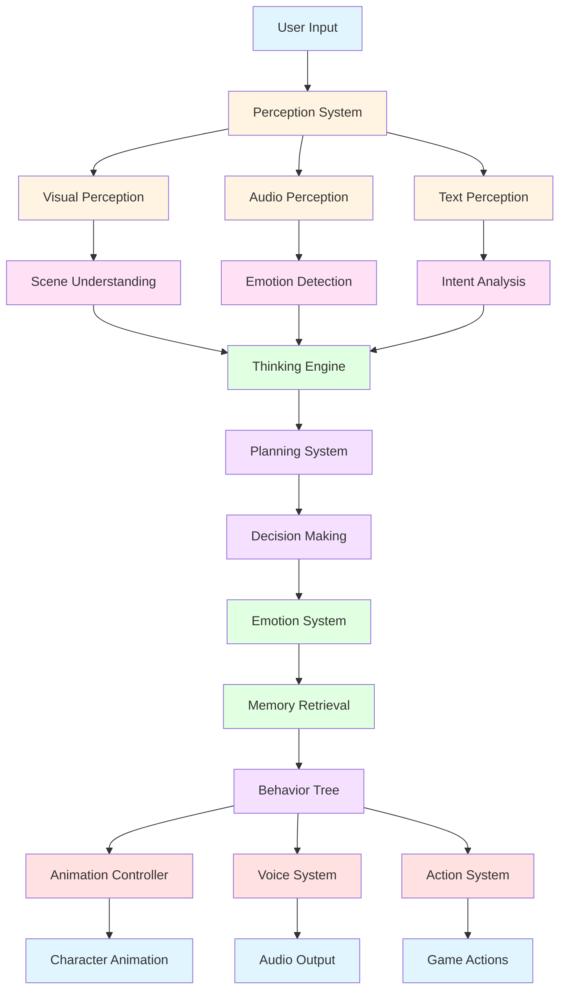

# AI CHARACTER FRAMEWORK

## Table of Contents
1. [Framework Overview](#framework-overview)
2. [Perception System](#perception-system)
3. [Thinking Engine](#thinking-engine)
4. [Planning System](#planning-system)
5. [Decision Making](#decision-making)
6. [Emotion System](#emotion-system)
7. [Memory Integration](#memory-integration)
8. [Behavior Tree](#behavior-tree)
9. [Action Execution](#action-execution)
10. [Animation Bridge](#animation-bridge)

---

## 1. Framework Overview

### 1.1 Complete AI Character Pipeline



### 1.2 System Architecture

```yaml
AI Character Framework:
  perception:
    - visual_perception
    - audio_perception
    - text_perception
    - scene_understanding
    - emotion_recognition
  
  thinking:
    - situation_analysis
    - context_understanding
    - causal_reasoning
    - inference_engine
    - pattern_recognition
  
  planning:
    - goal_planning
    - action_planning
    - resource_allocation
    - timeline_estimation
    - risk_assessment
  
  decision:
    - action_selection
    - priority_ranking
    - constraint_checking
    - fallback_planning
    - execution_approval
  
  emotion:
    - mood_system
    - emotional_state
    - affective_computing
    - emotional_response
    - mood_transition
  
  memory:
    - episodic_memory
    - semantic_memory
    - working_memory
    - long_term_memory
    - context_memory
  
  behavior:
    - behavior_tree
    - state_machine
    - animation_selector
    - voice_selector
    - action_executor
```

---

## 2. Perception System

### 2.1 Perception Controller

```csharp
// PerceptionController.cs
using UnityEngine;
using System.Collections.Generic;
using AICompanion.AI;

namespace AICompanion.AI
{
    /// <summary>
    /// Perception system - AI's senses
    /// </summary>
    public class PerceptionController : MonoBehaviour
    {
        [Header("Perception Components")]
        [SerializeField] private VisualPerception visualPerception;
        [SerializeField] private AudioPerception audioPerception;
        [SerializeField] private TextPerception textPerception;
        
        [Header("Scene Understanding")]
        [SerializeField] private SceneUnderstanding sceneUnderstanding;
        
        [Header("Integration")]
        [SerializeField] private ThinkingEngine thinkingEngine;
        
        private PerceptionData currentPerception;
        
        private void Awake()
        {
            InitializePerception();
        }
        
        private void InitializePerception()
        {
            currentPerception = new PerceptionData();
            
            // Initialize components
            if (visualPerception == null)
            {
                visualPerception = GetComponent<VisualPerception>();
            }
            
            if (audioPerception == null)
            {
                audioPerception = GetComponent<AudioPerception>();
            }
            
            if (textPerception == null)
            {
                textPerception = GetComponent<TextPerception>();
            }
            
            if (sceneUnderstanding == null)
            {
                sceneUnderstanding = GetComponent<SceneUnderstanding>();
            }
            
            if (thinkingEngine == null)
            {
                thinkingEngine = GetComponent<ThinkingEngine>();
            }
        }
        
        private void Update()
        {
            UpdatePerception();
        }
        
        private void UpdatePerception()
        {
            // Update visual perception
            if (visualPerception != null)
            {
                visualPerception.UpdateVisualData(currentPerception);
            }
            
            // Update audio perception
            if (audioPerception != null)
            {
                audioPerception.UpdateAudioData(currentPerception);
            }
            
            // Update text perception
            if (textPerception != null)
            {
                textPerception.UpdateTextData(currentPerception);
            }
            
            // Update scene understanding
            if (sceneUnderstanding != null)
            {
                sceneUnderstanding.UpdateSceneData(currentPerception);
            }
            
            // Send perception to thinking engine
            if (thinkingEngine != null)
            {
                thinkingEngine.ProcessPerception(currentPerception);
            }
        }
        
        public PerceptionData GetCurrentPerception()
        {
            return currentPerception;
        }
    }
    
    /// <summary>
    /// Perception data structure
    /// </summary>
    public class PerceptionData
    {
        // Visual data
        public List<DetectedObject> visibleObjects;
        public Vector3 userPosition;
        public Vector3 userGazeDirection;
        public float userDistance;
        public List<Vector3> environmentPoints;
        
        // Audio data
        public float voiceVolume;
        public VoiceTone voiceTone;
        public float speechSpeed;
        public bool hasSpeech;
        
        // Text data
        public string userText;
        public Intent detectedIntent;
        public float intentConfidence;
        public List<string> entities;
        
        // Scene data
        public string sceneType;
        public List<EnvironmentObject> environmentObjects;
        public Vector3[] surfaceNormals;
        public float[] depthMap;
        
        // Emotional data
        public Emotion detectedEmotion;
        public float emotionConfidence;
    }
    
    /// <summary>
    /// Visual perception component
    /// </summary>
    public class VisualPerception : MonoBehaviour
    {
        [SerializeField] private ARSessionOrigin arSessionOrigin;
        [SerializeField] private float updateInterval = 0.1f;
        
        private float lastUpdateTime;
        
        public void UpdateVisualData(PerceptionData perception)
        {
            if (Time.time - lastUpdateTime < updateInterval) return;
            
            lastUpdateTime = Time.time;
            
            // Detect visible objects
            perception.visibleObjects = DetectVisibleObjects();
            
            // Get user position and gaze
            perception.userPosition = GetUserPosition();
            perception.userGazeDirection = GetUserGazeDirection();
            perception.userDistance = Vector3.Distance(perception.userPosition, transform.position);
            
            // Get environment points
            perception.environmentPoints = GetEnvironmentPoints();
        }
        
        private List<DetectedObject> DetectVisibleObjects()
        {
            // Use computer vision to detect objects
            // This would interface with Vision Service
            return new List<DetectedObject>
            {
                new DetectedObject { type = "Laptop", position = Vector3.forward * 2f, confidence = 0.9f },
                new DetectedObject { type = "Keyboard", position = Vector3.forward * 2.5f, confidence = 0.85f }
            };
        }
        
        private Vector3 GetUserPosition()
        {
            // Get user position from AR tracking
            if (arSessionOrigin != null)
            {
                return arSessionOrigin.transform.position;
            }
            return Vector3.zero;
        }
        
        private Vector3 GetUserGazeDirection()
        {
            // Get user gaze direction from eye tracking
            // This would interface with Vision Service
            return Vector3.forward;
        }
        
        private List<Vector3> GetEnvironmentPoints()
        {
            // Get environmental points from scene reconstruction
            return new List<Vector3>
            {
                Vector3.zero,
                Vector3.forward * 2f,
                Vector3.right * 1f
            };
        }
    }
    
    /// <summary>
    /// Audio perception component
    /// </summary>
    public class AudioPerception : MonoBehaviour
    {
        [SerializeField] private AudioSource audioSource;
        [SerializeField] private float voiceActivityThreshold = 0.01f;
        
        public void UpdateAudioData(PerceptionData perception)
        {
            // Analyze audio input
            perception.voiceVolume = AnalyzeVolume();
            perception.voiceTone = AnalyzeTone();
            perception.speechSpeed = AnalyzeSpeechSpeed();
            perception.hasSpeech = DetectSpeechActivity();
        }
        
        private float AnalyzeVolume()
        {
            if (audioSource == null) return 0f;
            
            float[] samples = new float[256];
            audioSource.GetOutputData(samples);
            
            float sum = 0f;
            foreach (float sample in samples)
            {
                sum += Mathf.Abs(sample);
            }
            
            return sum / samples.Length;
        }
        
        private VoiceTone AnalyzeTone()
        {
            // Analyze frequency characteristics to determine tone
            return VoiceTone.Neutral;
        }
        
        private float AnalyzeSpeechSpeed()
        {
            // Analyze speech tempo
            return 1.0f; // Normal speed
        }
        
        private bool DetectSpeechActivity()
        {
            float volume = AnalyzeVolume();
            return volume > voiceActivityThreshold;
        }
    }
    
    /// <summary>
    /// Text perception component
    /// </summary>
    public class TextPerception : MonoBehaviour
    {
        [SerializeField] private string currentText;
        
        public void UpdateTextData(PerceptionData perception)
        {
            perception.userText = currentText;
            
            if (!string.IsNullOrEmpty(currentText))
            {
                perception.detectedIntent = DetectIntent(currentText);
                perception.intentConfidence = CalculateIntentConfidence(currentText);
                perception.entities = ExtractEntities(currentText);
            }
        }
        
        private string DetectIntent(string text)
        {
            // Use intent detection service
            // This would interface with Intent Detector
            return "command";
        }
        
        private float CalculateIntentConfidence(string text)
        {
            // Calculate confidence in intent detection
            return 0.8f;
        }
        
        private List<string> ExtractEntities(string text)
        {
            // Extract named entities from text
            return new List<string>();
        }
    }
    
    /// <summary
    /// Scene understanding component
    /// </summary>
    public class SceneUnderstanding : MonoBehaviour
    {
        [SerializeField] private ARPlaneManager arPlaneManager;
        
        public void UpdateSceneData(PerceptionData perception)
        {
            // Determine scene type
            perception.sceneType = DetermineSceneType();
            
            // Get environment objects
            perception.environmentObjects = GetEnvironmentObjects();
            
            // Get surface normals
            perception.surfaceNormals = GetSurfaceNormals();
            
            // Get depth map
            perception.depthMap = GetDepthMap();
        }
        
        private string DetermineSceneType()
        {
            // Determine scene type from detected objects
            return "office_desk";
        }
        
        private List<EnvironmentObject> GetEnvironmentObjects()
        {
            // Get environment objects from scene understanding
            return new List<EnvironmentObject>
            {
                new EnvironmentObject { type = "Desk", position = Vector3.zero },
                new EnvironmentObject { type = "Chair", position = Vector3.back * 1f }
            };
        }
        
        private Vector3[] GetSurfaceNormals()
        {
            // Get surface normals from AR plane detection
            return new Vector3[]
            {
                Vector3.up,
                Vector3.up,
                Vector3.up
            };
        }
        
        private float[] GetDepthMap()
        {
            // Get depth map from AR depth estimation
            return new float[100]; // Placeholder
        }
    }
    
    /// <summary>
    /// Detected object data
    /// </summary>
    public class DetectedObject
    {
        public string type;
        public Vector3 position;
        public float confidence;
        public Quaternion rotation;
    }
    
    /// <summary>
    /// Environment object data
    /// </summary>
    public class EnvironmentObject
    {
        public string type;
        public Vector3 position;
        public Vector3 size;
        public Dictionary<string, object> properties;
    }
    
    /// <summary>
    /// Voice tone enum
    /// </summary>
    public enum VoiceTone
    {
        Neutral,
        Happy,
        Sad,
        Angry,
        Excited,
        Confused,
        Surprised
    }
}
```

---

## 3. Thinking Engine

### 3.1 Thinking Engine Implementation

```csharp
// ThinkingEngine.cs
using UnityEngine;
using System.Collections.Generic;
using AICompanion.AI;

namespace AICompanion.AI
{
    /// <summary>
    /// Thinking engine - AI's cognitive processes
    /// </summary>
    public class ThinkingEngine : MonoBehaviour
    {
        [Header("Thinking Components")]
        [SerializeField] private SituationAnalyzer situationAnalyzer;
        [SerializeField] private ContextUnderstanding contextUnderstanding;
        [SerializeField] private CausalReasoning causalReasoning;
        [SerializeField private InferenceEngine inferenceEngine;
        [SerializeField] private PatternRecognition patternRecognition;
        
        [Header("Planning & Decision")]
        [SerializeField] private PlanningSystem planningSystem;
        [SerializeField] private DecisionMaking decisionMaking;
        
        [Header("Integration")]
        [SerializeField] private EmotionSystem emotionSystem;
        [SerializeField] private MemorySystem memorySystem;
        [SerializeField] private BehaviorTree behaviorTree;
        
        private ThinkingData currentThinking;
        
        private void Awake()
        {
            InitializeThinking();
        }
        
        private void InitializeThinking()
        {
            currentThinking = new ThinkingData();
            
            // Initialize components
            if (situationAnalyzer == null)
            {
                situationAnalyzer = GetComponent<SituationAnalyzer>();
            }
            
            if (contextUnderstanding == null)
            {
                contextUnderstanding = GetComponent<ContextUnderstanding>();
            }
            
            if (causalReasoning == null)
            {
                causalReasoning = GetComponent<CausalReasoning>();
            }
            
            if (inferenceEngine == null)
            {
                inferenceEngine = GetComponent<InferenceEngine>();
            }
            
            if (patternRecognition == null)
            {
                patternRecognition = GetComponent<PatternRecognition>();
            }
            
            if (planningSystem == null)
            {
                planningSystem = GetComponent<PlanningSystem>();
            }
            
            if (decisionMaking == null)
            {
                decisionMaking = GetComponent<DecisionMaking>();
            }
            
            if (emotionSystem == null)
            {
                emotionSystem = GetComponent<EmotionSystem>();
            }
            
            if (memorySystem == null)
            {
                memorySystem = GetComponent<MemorySystem>();
            }
            
            if (behaviorTree == null)
            {
                behaviorTree = GetComponent<BehaviorTree>();
            }
        }
        
        public void ProcessPerception(PerceptionData perception)
        {
            // Analyze situation
            situationAnalyzer.AnalyzeSituation(perception, currentThinking);
            
            // Understand context
            contextUnderstanding.UnderstandContext(perception, currentThinking);
            
            // Apply causal reasoning
            causalReasoning.ApplyCausalReasoning(perception, currentThinking);
            
            // Apply inference
            inferenceEngine.MakeInferences(perception, currentThinking);
            
            // Recognize patterns
            patternRecognition.RecognizePatterns(perception, currentThinking);
            
            // Plan actions
            planningSystem.PlanActions(currentThinking);
            
            // Make decisions
            decisionMaking.MakeDecisions(currentThinking);
            
            // Update emotion
            emotionSystem.UpdateEmotion(currentThinking);
            
            // Retrieve memory
            memorySystem.RetrieveRelevantMemory(currentThinking);
            
            // Execute behavior
            behaviorTree.ExecuteBehavior(currentThinking);
        }
    }
    
    /// <summary>
    /// Thinking data structure
    /// </summary>
    public class ThinkingData
    {
        // Situation analysis
        public SituationAnalysis situationAnalysis;
        public ContextAnalysis contextAnalysis;
        
        // Reasoning
        public CausalAnalysis causalAnalysis;
        public InferenceResults inferences;
        public PatternAnalysis patternAnalysis;
        
        // Planning
        public ActionPlan actionPlan;
        public PlanExecutionStatus executionStatus;
        
        // Decision
        public DecisionResult decisionResult;
        
        // Emotion
        public EmotionalState emotionalState;
        
        // Memory
        public MemoryContext memoryContext;
        
        // Behavior
        public BehaviorState behaviorState;
    }
    
    /// <summary>
    /// Situation analyzer
    /// </summary>
    public class SituationAnalyzer : MonoBehaviour
    {
        public void AnalyzeSituation(PerceptionData perception, ThinkingData thinking)
        {
            thinking.situationAnalysis = new SituationAnalysis
            {
                currentSituation = perception.sceneType,
                userState = DetermineUserState(perception),
                environmentState = DetermineEnvironmentState(perception),
                immediateContext = DetermineImmediateContext(perception)
            };
        }
        
        private UserState DetermineUserState(PerceptionData perception)
        {
            return new UserState
            {
                position = perception.userPosition,
                gazeDirection = perception.userGazeDirection,
                distance = perception.userDistance,
                isSpeaking = perception.hasSpeech,
                voiceTone = perception.voiceTone,
                detectedEmotion = perception.detectedEmotion
            };
        }
        
        private EnvironmentState DetermineEnvironmentState(PerceptionData perception)
        {
            return new EnvironmentState
            {
                sceneType = perception.sceneType,
                availableObjects = perception.environmentObjects,
                surfaceNormals = perception.surfaceNormals,
                lightingConditions = AnalyzeLighting(perception)
            };
        }
        
        private ImmediateContext DetermineImmediateContext(PerceptionData perception)
        {
            return new ImmediateContext
            {
                visibleObjects = perception.visibleObjects,
                userText = perception.userText,
                detectedIntent = perception.detectedIntent,
                entities = perception.entities
            };
        }
        
        private LightingConditions AnalyzeLighting(PerceptionData perception)
        {
            // Analyze lighting conditions from depth map and normals
            return new LightingConditions
            {
                ambientLight = Color.white,
                directionalLight = Color.white,
                lightDirection = Vector3.down
            };
        }
    }
    
    /// <summary>
    /// Context understanding
    /// </summary>
    public class ContextUnderstanding : MonoBehaviour
    {
        public void UnderstandContext(PerceptionData perception, ThinkingData thinking)
        {
            thinking.contextAnalysis = new ContextAnalysis
            {
                conversationContext = GetConversationContext(perception),
                spatialContext = GetSpatialContext(perception),
                temporalContext = GetTemporalContext(),
                socialContext = GetSocialContext(perception)
            };
        }
        
        private ConversationContext GetConversationContext(PerceptionData perception)
        {
            return new ConversationContext
            {
                currentTopic = ExtractTopic(perception.userText),
                conversationHistory = GetConversationHistory(),
                turnTaking = AnalyzeTurnTaking(perception)
            };
        }
        
        private SpatialContext GetSpatialContext(Perception perception)
        {
            return new SpatialContext
            {
                characterPosition = transform.position,
                userPosition = perception.userPosition,
                environmentLayout = AnalyzeEnvironmentLayout(perception),
                spatialRelationships = AnalyzeSpatialRelationships(perception)
            };
        }
        
        private TemporalContext GetTemporalContext()
        {
            return new TemporalContext
            {
                currentTimeOfDay = System.DateTime.Now.TimeOfDay,
                timeSinceLastInteraction = GetTimeSinceLastInteraction(),
                recentEvents = GetRecentEvents()
            };
        }
        
        private SocialContext GetSocialContext(Perception perception)
        {
            return new SocialContext
            {
                relationshipLevel = GetRelationshipLevel(),
                currentMood = perception.detectedEmotion,
                trustLevel = GetTrustLevel(),
                conversationHistory = GetConversationHistory()
            };
        }
    }
    
    /// <summary>
    /// Causal reasoning
    /// </summary>
    public class CausalReasoning : MonoBehaviour
    {
        public void ApplyCausalReasoning(PerceptionData perception, ThinkingData thinking)
        {
            thinking.causalAnalysis = new CausalAnalysis
            {
                causeEffectChains = AnalyzeCauseEffect(perception),
                predictions = MakePredictions(perception),
                counterfactuals = GenerateCounterfactuals(perception)
            };
        }
        
        private List<CauseEffectChain> AnalyzeCauseEffect(PerceptionData perception)
        {
            // Analyze cause-effect relationships
            return new List<CauseEffectChain>
            {
                new CauseEffectChain
                {
                    cause = "User speaks",
                    effect = "AI should respond",
                    confidence = 0.9f
                }
            };
        }
        
        private List<Prediction> MakePredictions(Perception perception)
        {
            // Make predictions about user's next actions
            return new List<Prediction>
            {
                new Prediction
                {
                    predictedAction = "User will wait for response",
                    confidence = 0.7f
                }
            };
        }
        
        private List<Counterfactual> GenerateCounterfactuals( {
            // Generate what-if scenarios
            return new List<Counterfactual>();
        }
    }
    
    /// <summary>
    /// Inference engine
    /// </summary>
    public class InferenceEngine : MonoBehaviour
    {
        public void MakeInferences(PerceptionData perception, ThinkingData thinking)
        {
            thinking.inferences = new InferenceResults
            {
                logicalInferences = MakeLogicalInferences(perception),
                statisticalInferences = MakeStatisticalInferences(perception),
                commonsenseInferences = MakeCommonsenseInferences(perception)
            };
        }
        
        private List<LogicalInference> MakeLogicalInferences(Perception perception)
        {
            // Make logical deductions
            return new List<LogicalInference>
            {
                new LogicalInference
                {
                    premise = "User is at desk",
                    conclusion = "Character should be at desk",
                    confidence = 0.9f
                }
            };
        }
        
        private List<StatisticalInference> MakeStatisticalInferences(Perception perception)
        {
            // Make statistical inferences
            return new List<StatisticalInference>();
        }
        
        private List<CommonsenseInference> MakeCommonsenseInferences(Perception perception)
        {
            // Apply commonsense reasoning
            return new List<CommonsenseInference>
            {
                new CommonsenseInference
                {
                    concept = "Characters should not walk through objects",
                    confidence = 0.95f
                }
            };
        }
    }
    
    /// <summary>
    /// Pattern recognition
    /// </summary>
    public class PatternRecognition : MonoBehaviour
    {
        public void RecognizePatterns(PerceptionData perception, ThinkingData thinking)
        {
            thinking.patternAnalysis = new PatternAnalysis
            {
                behaviorPatterns = RecognizeBehaviorPatterns(perception),
                interactionPatterns = RecognizeInteractionPatterns(perception),
                environmentalPatterns = RecognizeEnvironmentalPatterns(perception)
            };
        }
        
        private List<BehaviorPattern> RecognizeBehaviorPatterns(Perception perception)
        {
            // Recognize patterns in user behavior
            return new List<BehaviorPattern>
            {
                new BehaviorPattern
                {
                    pattern = "User tends to speak in the morning",
                    confidence = 0.7f
                }
            };
        }
        
        private List<InteractionPattern> RecognizeInteractionPatterns(Perception perception)
        {
            // Recognize interaction patterns
            return new List<InteractionPattern>();
        }
        
        private List<EnvironmentalPattern> RecognizeEnvironmentalPatterns(Perception perception)
        {
            // Recognize environmental patterns
            return new List<EnvironmentalPattern>();
        }
    }
}
```

---

## 4. Planning System

### 4.1 Action Planner

```csharp
// PlanningSystem.cs
using UnityEngine;
using System.Collections.Generic;
using AICompanion.AI;

namespace AICompanion.AI
{
    /// <summary>
    /// Planning system - How AI decides what to do
    /// </summary>
    public class PlanningSystem : MonoBehaviour
    {
        [Header("Planning Components")]
        [SerializeField] private GoalPlanner goalPlanner;
        [SerializeField] private ActionPlanner actionPlanner;
        [SerializeField] private ResourceAllocator resourceAllocator;
        [SerializeField private TimelineEstimator timelineEstimator;
        [SerializeField] private RiskAssessor riskAssessor;
        
        [Header("Integration")]
        [SerializeField] private DecisionMaking decisionMaking;
        
        public void PlanActions(ThinkingData thinking)
        {
            // Determine high-level goals
            goalPlanner.DetermineGoals(thinking);
            
            // Plan specific actions
            actionPlanner.PlanActions(thinking);
            
            // Allocate resources
            resourceAllocator.AllocateResources(thinking);
            
            // Estimate timeline
            timelineEstimator.EstimateTimeline(thinking);
            
            // Assess risks
            riskAssessor.AssessRisks(thinking);
            
            // Finalize plan
            thinking.actionPlan = new ActionPlan
            {
                goals = goalPlanner.GetGoals(),
                actions = actionPlanner.GetActions(),
                resources = resourceAllocator.GetAllocatedResources(),
                estimatedDuration = timelineEstimator.GetEstimatedDuration(),
                risks = riskAssessor.GetRisks()
            };
        }
    }
    
    /// <summary>
    /// Goal planner
    /// </summary>
    public class GoalPlanner : MonoBehaviour
    {
        private List<Goal> currentGoals;
        
        public void DetermineGoals(ThinkingData thinking)
        {
            currentGoals = new List<Goal>();
            
            // Determine goals based on context
            if (thinking.contextAnalysis.immediateContext.userText.Contains("laptop"))
            {
                currentGoals.Add(new Goal
                {
                    type = GoalType.MoveToObject,
                    target = "laptop",
                    priority = GoalPriority.High,
                    deadline = Time.time + 10f
                });
            }
            else if (thinking.contextAnalysis.immediateContext.detectedIntent == "greeting")
            {
                currentGoals.Add(new Goal
                {
                    type = GoalType.SocialInteraction,
                    target = "user",
                    priority = GoalPriority.High,
                    deadline = Time.time + 5f
                });
            }
        }
        
        public List<Goal> GetGoals()
        {
            return currentGoals;
        }
    }
    
    /// <summary>
    /// Action planner
    /// </summary>
    public class ActionPlanner : MonoBehaviour
    {
        private List<Action> plannedActions;
        
        public void PlanActions(ThinkingData thinking)
        {
            plannedActions = new List<Action>();
            
            // Plan actions based on goals
            foreach (var goal in thinking.actionPlan.goals)
            {
                List<Action> actionsForGoal = PlanActionsForGoal(goal, thinking);
                plannedActions.AddRange(actionsForGoal);
            }
            
            // Sort actions by priority and dependencies
            plannedActions.Sort((a, b) => b.priority.CompareTo(a.priority));
        }
        
        private List<Action> PlanActionsForGoal(Goal goal, ThinkingData thinking)
        {
            List<Action> actions = new List<Action>();
            
            switch (goal.type)
            {
                case GoalType.MoveToObject:
                    actions.Add(new Action
                    {
                        type = ActionType.Navigation,
                        parameters = new Dictionary<string, object>
                        {
                            {"target_position", thinking.contextAnalysis.spatialContext.objectPositions[goal.target]},
                            {"speed", "walk"},
                            {"avoid_obstacles", true}
                        },
                        priority = goal.priority,
                        estimatedDuration = 3f
                    });
                    break;
                    
                case GoalType.SocialInteraction:
                    actions.Add(new Action
                    {
                        type = ActionType.Animation,
                        parameters = new Dictionary<string, object>
                        {
                            {"animation", "wave"},
                            {"emotion", "happy"},
                            {"target", "user"}
                        },
                        priority = goal.priority,
                        estimatedDuration = 1f
                    });
                    break;
            }
            
            return actions;
        }
        
        public List<Action> GetActions()
        {
            return plannedActions;
        }
    }
    
    /// <summary>
    /// Resource allocator
    /// </summary>
    public class ResourceAllocator : MonoBehaviour
    {
        private Dictionary<string, Resource> allocatedResources;
        
        public void AllocateResources(ThinkingData thinking)
        {
            allocatedResources = new Dictionary<string, Resource>();
            
            // Allocate animation resources
            allocatedResources["animation"] = new Resource
            {
                type = ResourceType.Animation,
                capacity = 1.0f,
                available = true
            };
            
            // Allocate voice resources
            allocatedResources["voice"] = new Resource
            {
                type = ResourceType.Voice,
                capacity = 1.0f,
                available = true
            };
            
            // Allocate navigation resources
            allocatedResources["navigation"] = new Resource
            {
                type = ResourceType.Navigation,
                capacity = 1.0f,
                available = true
            };
        }
        
        public Dictionary<string, Resource> GetAllocatedResources()
        {
            return allocatedResources;
        }
    }
    
    /// <summary>
    /// Timeline estimator
    /// </summary>
    public class TimelineEstimator : MonoBehaviour
    {
        public void EstimateTimeline(ThinkingData thinking)
        {
            float totalDuration = 0f;
            
            foreach (var action in thinking.actionPlan.actions)
            {
                totalDuration += action.estimatedDuration;
            }
            
            thinking.actionPlan.estimatedDuration = totalDuration;
        }
        
        public float GetEstimatedDuration()
        {
            return thinking.actionPlan.estimatedDuration;
        }
    }
    
    /// <    /// Risk assessor
    /// </summary>
    public class RiskAssessor : MonoBehaviour
    {
        public void AssessRisks(ThinkingData thinking)
        {
            thinking.actionPlan.risks = new List<Risk>();
            
            // Assess collision risks
            foreach (var action in thinking.actionPlan.actions)
            {
                if (action.type == ActionType.Navigation)
                {
                    thinking.actionPlan.risks.Add(new Risk
                    {
                        type = RiskType.Collision,
                        probability = 0.2f,
                        severity = RiskSeverity.Medium,
                        mitigation = "Path planning and obstacle avoidance"
                    });
                }
            }
            
            // Assess timing risks
            float totalDuration = timelineEstimator.GetEstimatedDuration();
            if (totalDuration > 10f)
            {
                thinking.actionPlan.risks.Add(new Risk
                {
                    type = RiskType.Timing,
                    probability = 0.3f,
                    severity = RiskSeverity.Low,
                    mitigation = "Break down into smaller actions"
                });
            }
        }
        
        public List<Risk> GetRisks()
        {
            return thinking.actionPlan.risks;
        }
    }
    
    // Data structures
    public enum GoalType { MoveToObject, SocialInteraction, TaskExecution, InformationQuery }
    public enum GoalPriority { Low, Medium, High, Critical }
    public enum ActionType { Navigation, Animation, Voice, Information, Task }
    public enum ResourceType { Animation, Voice, Navigation, Processing }
    public enum RiskType { Collision, Timing, Resource, Social, Environmental }
    public enum RiskSeverity { Low, Medium, High, Critical }
    
    public class Goal
    {
        public GoalType type;
        public string target;
        public GoalPriority priority;
        public float deadline;
    }
    
    public class Action
    {
        public ActionType type;
        public Dictionary<string, object> parameters;
        public GoalPriority priority;
        public float estimatedDuration;
    }
    
    public class Resource
    {
        public ResourceType type;
        public float capacity;
        public bool available;
    }
    
    public class Risk
    {
        public RiskType type;
        public float probability;
        public RiskSeverity severity;
        public string mitigation;
    }
}
```

---

## 5. Decision Making

### 5.1 Decision Controller

```csharp
// DecisionMaking.cs
using UnityEngine;
using System.Collections.Generic;
using AICompanion.AI;

namespace AICompanion.AI
{
    /// <summary>
    /// Decision making - What action to take right now
    /// </summary>
    public class DecisionMaking : MonoBehaviour
    {
        [Header("Decision Components")]
        [SerializeField] private ActionSelector actionSelector;
        [ [SerializeField] private PriorityRanker priorityRanker;
        [SerializeField] private ConstraintChecker constraintChecker;
        [ [SerializeField] private FallbackPlanner fallbackPlanner;
        
        [Header("Integration")]
        [SerializeField] private EmotionSystem emotionSystem;
        [SerializeField => BehaviorTree behaviorTree;
        
        public void MakeDecisions(ThinkingData thinking)
        {
            // Select best action
            Action selectedAction = actionSelector.SelectAction(thinking);
            
            // Check constraints
            if (!constraintChecker.CheckConstraints(selectedAction, thinking))
            {
                // Use fallback plan
                selectedAction = fallbackPlanner.GetFallbackAction(thinking);
            }
            
            // Rank by priority
            Action prioritizedAction = priorityRanker.RankAction(selectedAction, thinking);
            
            // Execute decision
            thinking.decisionResult = new DecisionResult
            {
                selectedAction = prioritizedAction,
                reasoning = "Selected based on priority and constraints",
                confidence = CalculateDecisionConfidence(prioritizedAction, thinking),
                timestamp = Time.time
            };
            
            // Update emotion based on decision
            emotionSystem.UpdateEmotionBasedOnDecision(thinking);
            
            // Execute behavior
            behaviorTree.ExecuteAction(prioritizedAction, thinking);
        }
        
        private float CalculateDecisionConfidence(Action action, ThinkingData thinking)
        {
            float confidence = 0.5f;
            
            // Increase confidence if aligned with personality
            confidence += thinking.emotionalState.personalityAlignment;
            
            // Increase confidence if aligned with memory
            confidence += thinking.memoryContext.relevanceScore;
            
            // Decrease confidence if high risk
            foreach (var risk in thinking.actionPlan.risks)
            {
                if (risk.severity == RiskSeverity.High)
                {
                    confidence -= risk.probability * 0.3f;
                }
            }
            
            return Mathf.Clamp01(confidence);
        }
    }
    
    /// <summary>
    /// Action selector
    /// </summary>
    public class ActionSelector : MonoBehaviour
    {
        public Action SelectAction(ThinkingData thinking)
        {
            // Select action based on current situation and goals
            if (thinking.actionPlan.actions.Count > 0)
            {
                return thinking.actionPlan.actions[0];
            }
            
            // Default action
            return new Action
            {
                type = ActionType.Animation,
                parameters = new Dictionary<string, object>
                {
                    {"animation", "idle"},
                    {"emotion", "neutral"}
                },
                priority = GoalPriority.Low,
                estimatedDuration = 0.5f
            };
        }
    }
    
    /// <summary>
    /// Priority ranker
    /// </summary>
    public class PriorityRanker : MonoBehaviour
    {
        public Action RankAction(Action action, ThinkingData thinking)
        {
            // Adjust priority based on context
            GoalPriority adjustedPriority = action.priority;
            
            // Increase priority if user is looking at character
            if (thinking.situationAnalysis.userState.distance < 2f)
            {
                adjustedPriority = (GoalPriority)Mathf.Max((int)adjustedPriority + 1, (int)GoalPriority.Critical);
            }
            
            // Adjust priority based on emotion
            if (thinking.emotionalState.currentEmotion == Emotion.Excited)
            {
                adjustedPriority = (GoalPriority)Mathf.Max((int)adjustedPriority + 1, (int)GoalPriority.Critical);
            }
            
            action.priority = adjustedPriority;
            return action;
        }
    }
    
    /// <summary>
    /// Constraint checker
    /// </summary>
    public class ConstraintChecker : MonoBehaviour
    {
        public bool CheckConstraints(Action action, ThinkingData thinking)
        {
            // Check if action is physically possible
            if (action.type == ActionType.Navigation)
            {
                return CheckNavigationConstraints(action, thinking);
            }
            
            // Check if action is socially appropriate
            if (action.type == ActionType.SocialInteraction)
            {
                return CheckSocialConstraints(action, thinking);
            }
            
            return true;
        }
        
        private bool CheckNavigationConstraints(Action action, ThinkingData thinking)
        {
            // Check if path is blocked
            Vector3 targetPosition = (Vector3)action.parameters["target_position"];
            
            // Check if target is within reach
            float distance = Vector3.Distance(transform.position, targetPosition);
            if (distance > 10f)
            {
                return false;
            }
            
            // Check if path is blocked by obstacles
            foreach (var obj in thinking.contextAnalysis.environmentState.availableObjects)
            {
                if (Vector3.Distance(obj.position, targetPosition) < 1f)
                {
                    return false;
                }
            }
            
            return true;
        }
        
        private bool CheckSocialConstraints(Action action, ThinkingData thinking)
        {
            // Check if action is socially appropriate
            if (thinking.contextAnalysis.socialContext.trustLevel < 0.3f)
            {
                // Limit social interactions with low trust
                return false;
            }
            
            return true;
        }
    }
    
    /// <summary>
    /// Fallback planner
    /// </summary>
    public class FallbackPlanner : MonoBehaviour
    {
        public Action GetFallbackAction(ThinkingData thinking)
        {
            // Return safe fallback action
            return new Action
            {
                type = ActionType.Animation,
                parameters = new Dictionary<string, object>
                {
                    {"animation", "idle"},
                    {"emotion", "neutral"}
                },
                priority = GoalPriority.Low,
                estimatedDuration = 0.5f
            };
        }
    }
    
    /// <summary>
    /// Decision result
    /// </summary>
    public class DecisionResult
    {
        public Action selectedAction;
        public string reasoning;
        public float confidence;
        public float timestamp;
    }
}
```

---

## 6. Emotion System

### 6.1 Emotion Controller

```csharp
// EmotionSystem.cs
using UnityEngine;
using System.Collections.Generic;
using AICompanion.AI;

namespace AICompanion.AI
{
    /// <summary>
    /// Emotion system - AI's feelings and personality
    /// </summary>
    public class EmotionSystem : MonoBehaviour
    {
        [Header("Emotion Components")]
        [SerializeField] private MoodController moodController;
        [SerializeField] private FeelingController feelingController;
        [SerializeField [SerializeField] private PersonalityModel personalityModel;
        
        [Header("Integration")]
        [SerializeField] private MemorySystem memorySystem;
        [SerializeField] private AnimationController animationController;
        [SerializeField] private VoiceController voiceController;
        
        private EmotionalState currentEmotionalState;
        
        private void Awake()
        {
            InitializeEmotionSystem();
        }
        
        private void InitializeEmotionSystem()
        {
            currentEmotionalState = new EmotionalState();
            
            // Initialize components
            if (moodController == null)
            {
                moodController = GetComponent<MoodController>();
            }
            
            if (feelingController == null)
            {
                feelingController = GetComponent<FeelingController>();
            }
            
            if (personalityModel == null)
            {
                personalityModel = GetComponent<PersonalityModel>();
            }
            
            if (memorySystem == null)
            {
                memorySystem = GetComponent<MemorySystem>();
            }
            
            if (animationController == null)
            {
                animationController = GetComponent<AnimationController>();
            }
            
            if (voiceController == null)
            {
                voiceController = GetComponent<VoiceController>();
            }
            
            // Initialize personality from memory
            InitializePersonality();
        }
        
        private void InitializePersonality()
        {
            // Load personality from memory
            PersonalityProfile profile = memorySystem.GetPersonalityProfile();
            
            if (profile != null)
            {
                personalityModel.SetPersonality(profile);
            }
        }
        
        public void UpdateEmotionBasedOnDecision(ThinkingData thinking)
        {
            // Update emotion based on decision
            // This would be triggered by decision making
        }
        
        public void UpdateEmotionBasedOnPerception(PerceptionData perception)
        {
            // Update emotion based on user emotion
            currentEmotionalState.userEmotion = perception.detectedEmotion;
            
            // Update mood based on interaction
            moodController.UpdateMood(currentEmotionalState);
            
            // Update feeling based on context
            feelingController.UpdateFeeling(currentEmotionalState);
        }
        
        public void UpdateEmotionBasedOnMemory(ThinkingData thinking)
        {
            // Update emotion based on past interactions
            EmotionalMemory emotionalMemory = memorySystem.GetEmotionalMemory();
            
            if (emotionalMemory != null)
            {
                currentEmotionalState.emotionalMemory = emotionalMemory;
            }
        }
        
        public void ApplyEmotionToAnimation()
        {
            // Apply emotion to animation
            if (animationController != null)
            {
                animationController.SetEmotion(currentEmotionalState.currentEmotion);
            }
        }
        
        public void ApplyEmotionToVoice()
        {
            // Apply emotion to voice
            if (voiceController != null)
            {
                voiceController.SetEmotion(currentEmotionalState.currentEmotion);
            }
        }
        
        public EmotionalState GetCurrentEmotionalState()
        {
            return currentEmotionalState;
        }
    }
    
    /// <summary>
    /// Mood controller
    /// </summary>
    public class MoodController : MonoBehaviour
    {
        [SerializeField] private float moodDecayRate = 0.01f;
        [SerializeField] private float moodRecoveryRate = 0.05f;
        
        private void UpdateMood(EmotionalState state)
        {
            // Decay current mood over time
            state.currentMood *= (1f - moodDecayRate * Time.deltaTime);
            
            // Recover to baseline mood
            float baselineMood = personalityModel.GetBaselineMood();
            state.currentMood = Mathf.Lerp(state.currentMood, baselineMood, moodRecoveryRate * Time.deltaTime);
        }
    }
    
    /// <summary>
    /// Feeling controller
    /// </summary>
    public class FeelingController : MonoBehaviour
    {
        private void UpdateFeeling(EmotionalState state)
        {
            // Update feeling based on mood and events
            state.currentFeeling = CalculateFeeling(state.currentMood, state.currentEvent);
        }
        
        private Feeling CalculateFeeling(float mood, Event currentEvent)
        {
            Feeling feeling = Feeling.Neutral;
            
            // Mood influences feeling
            if (mood > 0.7f)
            {
                feeling = Feeling.Happy;
            }
            else if (mood < 0.3f)
            {
                feeling = Sad;
            }
            
            // Events can override mood
            if (currentEvent.type == EventType.Positive)
            {
                feeling = Feeling.Happy;
            }
            else if (currentEvent.type == EventType.Negative)
            {
                feeling = Sad;
            }
            
            return feeling;
        }
    }
    
    /// <summary>
    /// Personality model
    /// </summary>
    public class PersonalityModel : MonoBehaviour
    {
        [Header("Personality Traits (Big Five)")]
        [SerializeField] private float openness = 0.5f;
        [SerializeField] private float conscientiousness = 0.5f;
        [SerializeField] private float extraversion = 0.5f;
        [SerializeField] private float agreeableness = 0.5f;
        [SerializeField] private float neuroticism = 0.5f;
        
        [Header("Additional Traits")]
        [SerializeField] private float humor = 0.5f;
        [SerializeField] private float curiosity = 0.5f;
        [SerializeField] private float empathy = 0.5f;
        [SerializeField] private float energy = 0.5f;
        
        public void SetPersonality(PersonalityProfile profile)
        {
            openness = profile.openness;
            conscientiousness = profile.conscientiousness;
            extraversion = profile.extraversion;
            agreeableness = profile.agreeableness;
            neuroticism = profile.neuroticism;
            humor = profile.humor;
            curiosity = profile.curiosity;
            empathy = profile.empathy;
            energy = profile.energy;
        }
        
        public float GetBaselineMood()
        {
            // Calculate baseline mood from personality
            return (openness + extraversion + energy) / 3f;
        }
    }
    
    /// <summary>
    /// Emotional state
    /// </summary>
    public class EmotionalState
    {
        public Emotion currentEmotion;
        public float currentMood;
        public Feeling currentFeeling;
        public Event currentEvent;
        public EmotionalMemory emotionalMemory;
        public float personalityAlignment;
        
        // Personality traits
        public float openness;
        public float conscientiousness;
        public float extraversion;
        public float agreeableness;
        public float neuroticism;
        
        // Relationship factors
        public float trustLevel;
        public float affinity;
        public float relationshipStrength;
        
        // State factors
        public float energy;
        public float stress;
        public float curiosity;
    }
    
    /// <summary>
    /// Emotion enum
    /// </summary>
    public enum Emotion
    {
        Neutral,
        Happy,
        Sad,
        Angry,
        Fear,
        Surprise,
        Disgust,
        Excited,
        Bored,
        Confused
    }
    
    /// <summary>
    /// Feeling enum
    /// </summary>
    public enum Feeling
    {
        Neutral,
        Happy,
        Sad,
        Angry,
        Excited,
        Confused,
        Surprised,
        Calm
    }
    
    /// <summary>
    /// Event type enum
    /// </summary>
    public enum EventType
    {
        Positive,
        Negative,
        Neutral,
        Critical
    }
}
```

---

## 7. Memory Integration

### 7.1 Memory Bridge

```csharp
// MemorySystem.cs
using UnityEngine;
using System.Collections.Generic;
using AICompanion.AI;

namespace AICompanion.AI
{
    /// <summary>
    /// Memory system - AI's long-term memory
    /// </summary>
    public class MemorySystem : MonoBehaviour
    {
        [Header("Memory Components")]
        [SerializeField] private WorkingMemory workingMemory;
        [SerializeField] private LongTermMemory longTermMemory;
        [SerializeField] private EpisodicMemory episodicMemory;
        [SerializeField private SemanticMemory semanticMemory;
        
        [Header("Memory Bridge")]
        [SerializeField] private MemoryRetriever memoryRetriever;
        [SerializeField] private MemoryConsolidator memoryConsolidator;
        
        public void RetrieveRelevantMemory(ThinkingData thinking)
        {
            thinking.memoryContext = new MemoryContext
            {
                workingMemory = workingMemory.GetCurrentContext(),
                longTermMemory = longTermMemory.RetrieveContext(thinking),
                episodicMemory = episodicMemory.RetrieveRecent(thinking),
                semanticMemory = semanticMemory.SearchRelevant(thinking),
                relevanceScore = CalculateRelevanceScore(thinking)
            };
        }
        
        public void StoreMemory(ThinkingData thinking)
        {
            // Store in working memory
            workingMemory.Store(thinking);
            
            // Store in episodic memory
            episodicMemory.StoreEpisode(thinking);
            
            // Store in semantic memory
            semanticMemory.StoreSemantic(thinking);
            
            // Update long-term memory
            longTermMemory.UpdateMemory(thinking);
        }
        
        public PersonalityProfile GetPersonalityProfile()
        {
            return longTermMemory.GetPersonalityProfile();
        }
        
        public EmotionalMemory GetEmotionalMemory()
        {
            return longTermMemory.GetEmotionalMemory();
        }
        
        private float CalculateRelevanceScore(ThinkingData thinking)
        {
            float score = 0f;
            
            // Relevance based on context similarity
            score += thinking.contextAnalysis.contextualSimilarity * 0.4f;
            
            // Relevance based on temporal proximity
            score += thinking.contextAnalysis.temporalRecency * 0.3f;
            
            // Relevance based on importance
            score += thinking.contextAnalysis.importance * 0.3f;
            
            return score;
        }
    }
    
    /// <summary>
    /// Working memory
    /// </summary>
    public class WorkingMemory : MonoBehaviour
    {
        private Queue<MemoryItem> memoryQueue;
        private int maxCapacity = 10;
        
        public void Store(ThinkingData thinking)
        {
            memoryQueue.Enqueue(new MemoryItem
            {
                content = thinking.situationAnalysis.ToString(),
                timestamp = Time.time,
                importance = thinking.contextAnalysis.importance
            });
            
            // Maintain capacity
            while (memoryQueue.Count > maxCapacity)
            {
                memoryQueue.Dequeue();
            }
        }
        
        public MemoryContext GetCurrentContext()
        {
            return new MemoryContext
            {
                recentMemories = new List<MemoryItem>(memoryQueue)
            };
        }
    }
    
    /// <summary>
    /// Long-term memory
    /// </summary>
    public class LongTermMemory : MonoBehaviour
    {
        private Dictionary<string, object> persistentStorage;
        
        public void UpdateMemory(ThinkingData thinking)
        {
            // Update personality based on interactions
            UpdatePersonality(thinking);
            
            // Update emotional memory
            UpdateEmotionalMemory(thinking);
        }
        
        public Context RetrieveContext(ThinkingData thinking)
        {
            // Retrieve relevant context from long-term memory
            return new Context();
        }
        
        public PersonalityProfile GetPersonalityProfile()
        {
            // Load personality profile
            return new PersonalityProfile();
        }
        
        public EmotionalMemory GetEmotionalMemory()
        {
            // Load emotional memory
            return new EmotionalMemory();
        }
        
        private void UpdatePersonality(ThinkingData thinking)
        {
            // Update personality traits based on interactions
            if (thinking.emotionalState.trustLevel > 0.8f)
            {
                // Increase agreeableness
            }
        }
        
        private void UpdateEmotionalMemory(ThinkingData thinking)
        {
            // Store emotional events
        }
    }
    
    /// <summary
    /// Episodic memory
    /// </summary>
    public class EpisodicMemory : MonoBehaviour
    {
        private List<Episode> episodes;
        
        public void StoreEpisode(ThinkingData thinking)
        {
            episodes.Add(new Episode
            {
                timestamp = Time.time,
                context = thinking.contextAnalysis.ToString(),
                userAction = thinking.contextAnalysis.immediateContext.userText,
                aiResponse = "", // Would be filled after response
                emotion = thinking.emotionalState.currentEmotion
            });
        }
        
        public Context RetrieveRecent(ThinkingData thinking)
        {
            // Retrieve recent episodes
            return new Context();
        }
    }
    
    /// <summary>
    /// Semantic memory
    /// </summary>
    public class SemanticMemory : MonoBehaviour
    {
        private Dictionary<string, SemanticMemoryItem> semanticStore;
        
        public void StoreSemantic(ThinkingData thinking)
        {
            // Store semantic information
        }
        
        public Context SearchRelevant(ThinkingData thinking)
        {
            // Search for relevant semantic information
            return new Context();
        }
    }
    
    // Data structures
    public class MemoryItem
    {
        public string content;
        public float timestamp;
        public float importance;
    }
    
    public class Episode
    {
        public float timestamp;
        public string context;
        public string userAction;
        public string aiResponse;
        public Emotion emotion;
    }
    
    public class SemanticMemoryItem
    {
        public string key;
        public string value;
        public float relevance;
        public float accessCount;
    }
}
```

---

## 8. Behavior Tree

### 8.1 Behavior Tree Implementation

```csharp
// BehaviorTree.cs
using UnityEngine;
using System.Collections.Generic;
using AICompanion.AI;

namespace AICompanion.AI
{
    /// <summary>
    /// Behavior tree - Decision tree for complex behaviors
    /// </summary>
    public class BehaviorTree : MonoBehaviour
    {
        [Header("Behavior Tree Configuration")]
        [SerializeField] private BehaviorNode rootNode;
        [SerializeField] private float updateInterval = 0.1f;
        
        [Header("Integration")]
        [SerializeField] private AnimationController animationController;
        [SerializeField] private VoiceController voiceController;
        [SerializeField        [SerializeField] private NavigationController navigationController;
        
        private BehaviorNode currentNode;
        private float lastUpdateTime;
        
        private void Awake()
        {
            InitializeBehaviorTree();
        }
        
        private void InitializeBehaviorTree()
        {
            // Create behavior tree structure
            rootNode = CreateBehaviorTreeStructure();
        }
        
        private void Update()
        {
            if (Time.time - lastUpdateTime < updateInterval) return;
            
            lastUpdateTime = Time.time;
            
            // Execute behavior tree
            ExecuteBehaviorTree();
        }
        
        private void ExecuteBehaviorTree()
        {
            // Execute from root node
            BehaviorNode result = rootNode.Execute();
            
            if (result.status == NodeStatus.Running)
            {
                currentNode = result;
            }
            else if (result.status == NodeStatus.Success)
            {
                currentNode = rootNode;
            }
            else if (result.status == NodeStatus.Failure)
            {
                // Handle failure
                HandleFailure(result);
            }
        }
        
        public void ExecuteAction(Action action, ThinkingData thinking)
        {
            // Execute specific action through behavior tree
            switch (action.type)
            {
                case ActionType.Navigation:
                    ExecuteNavigationAction(action, thinking);
                    break;
                case ActionType.Animation:
                    ExecuteAnimationAction(action, thinking);
                    break;
                case ActionType.Voice:
                    ExecuteVoiceAction(action, thinking);
                    break;
                case ActionType.Information:
                    ExecuteInformationAction(action, thinking);
                    break;
                case ActionType.Task:
                    ExecuteTaskAction(action, thinking);
                    break;
            }
        }
        
        private void ExecuteNavigationAction(Action action, ThinkingData thinking)
        {
            Vector3 targetPosition = (Vector3)action.parameters["target_position"];
            string speed = (string)action.parameters["speed"];
            bool avoidObstacles = (bool)action.parameters["avoid_obstacles"];
            
            if (navigationController != null)
            {
                navigationController.MoveTo(targetPosition, speed == "run");
            }
        }
        
        private void ExecuteAnimationAction(Action action, ThinkingData thinking)
        {
            string animationName = (string)action.parameters["animation"];
            Emotion emotion = (Emotion)action.parameters["emotion"];
            
            if (animationController != null)
            {
                animationController.PlayAnimation(animationName);
                animationController.SetEmotion(emotion);
            }
        }
        
        private void ExecuteVoiceAction(Action action, ThinkingData thinking)
        {
            string message = (string)action.parameters["message"];
            Emotion emotion = (Emotion)action.parameters["emotion"];
            
            if (voiceController != null)
            {
                voiceController.Speak(message, emotion);
            }
        }
        
        private void ExecuteInformationAction(Action action, ThinkingData thinking)
        {
            // Execute information gathering action
            // This would interface with AI Agent tools
        }
        
        private void ExecuteTaskAction(Action action, ThinkingData thinking)
        {
            // Execute task execution action
            // This would interface with AI Agent tools
        }
        
        private void HandleFailure(BehaviorNode result)
        {
            // Handle behavior failure
            // Try fallback behavior
        }
        
        private BehaviorNode CreateBehaviorTreeStructure()
        {
            // Create main behavior tree with multiple levels
            return new SelectorNode
            {
                children = new List<BehaviorNode>
                {
                    new SequenceNode
                    {
                        children = new List<BehaviorNode>
                        {
                            new ConditionNode
                            {
                                condition = (data) => data.situationAnalysis.userState.distance < 2f,
                                child = new ActionNode
                                {
                                    actionType = ActionType.Animation,
                                    parameters = new Dictionary<string, object>
                                    {
                                        {"animation", "wave"},
                                        {"emotion", "happy"}
                                    }
                                }
                            },
                            new ConditionNode
                            {
                                condition = (data) => data.situationAnalysis.userState.hasSpeech,
                                child = new ActionNode
                                {
                                    actionType = ActionType.Voice,
                                    parameters = new Dictionary<string, object>
                                    {
                                        {"message", "Hello!"},
                                        {"emotion", "neutral"}
                                    }
                                }
                            }
                        }
                    },
                    new SequenceNode
                    {
                        children = new List<BehaviorNode>
                        {
                            new ConditionNode
                            {
                                condition = (data) => data.actionPlan.goals.Exists(g => g.type == GoalType.MoveToObject),
                                child = new ActionNode
                                {
                                    actionType = ActionType.Navigation,
                                    parameters = new Dictionary<string, object>
                                    {
                                        {"target_position", Vector3.zero},
                                        {"speed", "walk"}
                                    }
                                }
                            }
                        }
                    }
                }
            };
        }
    }
    
    /// <summary>
    /// Behavior node base class
    /// </summary>
    public abstract class BehaviorNode
    {
        public abstract NodeStatus Execute();
        public abstract void Reset();
    }
    
    /// <summary>
    /// Node status
    /// </summary>
    public enum NodeStatus
    {
        Idle,
        Running,
        Success,
        Failure
    }
    
    /// <summary>
    /// Selector node - tries children in order
    /// </summary
    public class SelectorNode : BehaviorNode
    {
        public List<BehaviorNode> children;
        private int currentChildIndex = 0;
        
        public override NodeStatus Execute()
        {
            while (currentChildIndex < children.Count)
            {
                NodeStatus status = children[currentChildIndex].Execute();
                
                if (status == NodeStatus.Success)
                {
                    return NodeStatus.Success;
                }
                
                currentChildIndex++;
            }
            
            return NodeStatus.Failure;
        }
        
        public override void Reset()
        {
            currentChildIndex = 0;
            foreach (var child in children)
            {
                child.Reset();
            }
        }
    }
    
    /// <summary>
    /// Sequence node - executes children in order
    /// </summary>
    public class SequenceNode : BehaviorNode
    {
        public List<BehaviorNode> children;
        private int currentChildIndex = 0;
        
        public override NodeStatus Execute()
        {
            foreach (var child in children)
            {
                NodeStatus status = {
                    currentChildIndex = 0;
                    total = children.Count
                };
                
                if (status == NodeStatus.Failure)
                {
                    return NodeStatus.Failure;
                }
                
                currentChildIndex++;
            }
            
            return NodeStatus.Success;
        }
        
        public override void Reset()
        {
            currentChildIndex = 0;
            foreach (var context in children)
            {
                context.Reset();
            }
        }
    }
    
    /// <summary>
    /// Condition node - checks condition
    /// </summary>
    public class ConditionNode : BehaviorNode
    {
        public Func<ThinkingData, bool> condition;
        public BehaviorNode child;
        
        public override NodeStatus Execute()
        {
            // Would receive thinking data from parent
            // For now, assume condition check
            bool conditionMet = condition(null);
            
            if (conditionMet)
            {
                if (child != null)
                {
                    return child.Execute();
                }
                return NodeStatus.Success;
            }
            
            return NodeStatus.Failure;
        }
        
        public override void Reset()
        {
            if (child != null)
            {
                child.Reset();
            }
        }
    }
    
    /// <summary>
    /// Action node - executes action
    /// </summary>
    public class ActionNode : BehaviorNode
    {
        public ActionType actionType;
        public Dictionary<string, object> parameters;
        
        public override NodeStatus Execute()
        {
            // Execute action
            return NodeStatus.Success;
        }
        
        public override void Reset()
        {
            // Reset action state
        }
    }
}
```

---

## 9. Action Execution

### 9.1 Action Executor

```csharp
// ActionExecutor.cs
using UnityEngine;
using AICompanion.AI;

namespace AICompanion.AI
{
    /// <summary>
    /// Action executor - executes decided actions
    /// </summary>
    public class ActionExecutor : MonoBehaviour
    {
        [Header("Action Executors")]
        [SerializeField] private NavigationExecutor navigationExecutor;
        [SerializeField] private AnimationExecutor animationExecutor;
        [SerializeField] private VoiceExecutor voiceExecutor;
        [SerializeField] private TaskExecutor taskExecutor;
        
        public void ExecuteAction(Action action, ThinkingData thinking)
        {
            switch (action.type)
            {
                case ActionType.Navigation:
                    navigationExecutor.ExecuteNavigation(action, thinking);
                    break;
                case ActionType.Animation:
                    animationExecutor.ExecuteAnimation(action, thinking);
                    break;
                case ActionType.Voice:
                    voiceExecutor.ExecuteVoice(action, thinking);
                    break;
                case ActionType.Information:
                    taskExecutor.ExecuteInformation(action, thinking);
                    break;
                case ActionType.Task:
                    taskExecutor.ExecuteTask(action, thinking);
                    break;
            }
        }
    }
    
    /// <summary>
    /// Navigation executor
    /// </summary>
    public class NavigationExecutor : MonoBehaviour
    {
        [SerializeField] private NavMeshAgent navMeshAgent;
        
        public void ExecuteNavigation(Action action, ThinkingData thinking)
        {
            Vector3 targetPosition = (Vector3)action.parameters["target_position"];
            string speed = (string)action.parameters["speed"];
            
            if (navMeshAgent != null && navMeshAgent.isOnNavMesh)
            {
                navMeshAgent.SetDestination(targetPosition);
                navMeshAgent.speed = speed == "run" ? 3.5f : 1.5f;
            }
        }
    }
    
    /// <summary>
    /// Animation executor
    /// </summary>
    public class AnimationExecutor : MonoBehaviour
    {
        [SerializeField] private Animator animator;
        
        public void ExecuteAnimation(Action action, ThinkingData thinking)
        {
            string animationName = (string)action.parameters["animation"];
            Emotion emotion = (Emotion)action.parameters["emotion"];
            
            if (animator != null)
            {
                animator.SetBool(animationName, true);
                animator.SetFloat("Emotion_" + emotion.ToString(), 1f);
                
                // Trigger animation event
                animator.SetTrigger(animationName);
            }
        }
    }
    
    /// <summary>
    /// Voice executor
    /// </summary>
    public class VoiceExecutor : MonoBehaviour
    {
        [SerializeField] private AudioSource audioSource;
        [SerializeField] private AudioClip[] voiceClips;
        
        public void ExecuteVoice(Action action, ThinkingData thinking)
        {
            string message = (string)action.parameters["message"];
            Emotion emotion = (Emotion)action.parameters["emotion"];
            
            // This would interface with Voice Service
            // For now, play placeholder audio
            if (audioSource != null && voiceClips.Length > 0)
            {
                audioSource.clip = voiceClips[0];
                audioSource.Play();
            }
        }
    }
    
    /// <summary>
    /// Task executor
    /// </summary>
    public class TaskExecutor : MonoBehaviour
    {
        public void ExecuteInformationAction(Action action, ThinkingData thinking)
        {
            // Execute information gathering
            // This would interface with AI Agent tools
        }
        
        public void ExecuteTaskAction(Action action, ThinkingData thinking)
        {
            // Execute task execution
            // This would interface with AI Agent tools
        }
    }
}
```

---

## 10. Animation Bridge

### 10.1 Animation Bridge

```csharp
// AnimationBridge.cs
using UnityEngine;
using AICompanion.AI;

namespace AICompanion.AI
{
    /// <summary>
    /// Bridge between AI decisions and Unity animation system
    /// </summary>
    public class AnimationBridge : MonoBehaviour
    {
        [Header("Animation Components")]
        [SerializeField] private Animator animator;
        [SerializeField] private AnimationController animationController;
        [SerializeField] private LipSyncController lipSyncController;
        [SerializeField] private FacialAnimationController facialAnimationController;
        
        [Header("AI Integration")]
        [SerializeField] private AICharacterController aiController;
        
        [Header("Animation Parameters")]
        [SerializeField] private float transitionDuration = 0.2f;
        [SerializeField] private AnimationBlendMode blendMode = AnimationBlendMode.Additive;
        
        private Dictionary<string, AnimationState> animationStates;
        private AnimationState currentState;
        
        private void Awake()
        {
            InitializeAnimationBridge();
        }
        
        private void InitializeAnimationBridge()
        {
            currentState = AnimationState.Idle;
            
            animationStates = new Dictionary<string, AnimationState>
            {
                {"idle", AnimationState.Idle},
                {"walk", AnimationState.Walking},
                {"run", AnimationState.Running},
                {"talk", AnimationState.Talking},
                {"think", AnimationState.Thinking},
                {"wave", AnimationState.Waving},
                {"sit", AnimationState.Sitting},
                {"look", AnimationState.Looking},
                {"smile", AnimationState.Smiling},
                {"sad", AnimationState.Sad},
                {"angry", AnimationState.Angry},
                {"happy", AnimationState.Happy},
                {"surprised", AnimationState.Surprised},
                {"confused", AnimationState.Confused}
            };
        }
        
        public void PlayAnimation(string animationName, Emotion emotion, float intensity = 1f)
        {
            if (animationController != null)
            {
                animationController.PlayAnimation(animationName);
                animationController.SetEmotion(emotion);
            }
            
            if (facialAnimationController != null)
            {
                facialAnimationController.SetEmotion(emotion, intensity);
            }
            
            currentState = ParseAnimationState(animationName);
        }
        
        public void TransitionToState(AnimationState newState, float duration)
        {
            if (animationController != null)
            {
                animationController.CrossFade(newState.ToString(), duration);
            }
            
            currentState = newState;
        }
        
        public void SetAnimationBlendMode(AnimationBlendMode mode)
        {
            blendMode = mode;
        }
        
        public AnimationState GetCurrentState()
        {
            return currentState;
        }
        
        private AnimationState ParseAnimationState(string animationName)
        {
            switch (animationName.ToLower())
            {
                case "idle":
                    return AnimationState.Idle;
                case "walk":
                    return AnimationState.Walking;
                case "run":
                    return AnimationState.Running;
                case "talk":
                    return AnimationState.Talking;
                case "think":
                    return AnimationState.Thinking;
                case "wave":
                    return AnimationState.Waving;
                case "sit":
                    return AnimationState.Sitting;
                case "look":
                    return AnimationState.Looking;
                case "smile":
                    return AnimationState.Smiling;
                case "sad":
                    return AnimationState.Sad;
                case "happy":
                    return AnimationState.Happy;
                default:
                    return AnimationState.Idle;
            }
        }
        
        public void SetLipSyncText(string text, float[] visemeWeights)
        {
            if (lipSyncController != null)
            {
                lipSyncController.ProcessText(text, visemeWeights);
            }
        }
        
        public void SetEyeTarget(Vector3 target)
        {
            if (facialAnimationController != null)
            {
                facialAnimationController.LookAt(target);
            }
        }
        
        public void EnableBreathing(bool enable)
        {
            if (facialAnimationController != null)
            {
                facialAnimationController.EnableBreathing(enable);
            }
        }
        
        public void EnableBlinking(bool enable)
        {
            if (facialAnimationController != null)
            {
                facialAnimationController.EnableBlinking(enable);
            }
        }
    }
    
    /// <summary>
    /// Animation state enum
    /// </summary>
    public enum AnimationState
    {
        Idle,
        Walking,
        Running,
        Talking,
        Thinking,
        Waving,
        Sitting,
        Looking,
        Smiling,
        Sad,
        Angry,
        Happy,
        Surprised,
        Confused
    }
    
    /// <summary>
    /// Animation blend mode
    /// </summary>
    public enum AnimationBlendMode
    {
        Override,
        Additive
    }
}
```

---

## Conclusion

AI Character Framework được thiết kế để nhân vật ảo có **tri tuệ và hành động thực sự** thay vì chỉ trả lời text như GPT thông thường:

### 🔑 Pipeline hoàn chỉnh:
1. **Perception System**: Nhận thông tin từ Visual, Audio, Text
2. **Thinking Engine**: Phân tích và suy luận về tình huống
3. **Planning System: Lập kế và quy hoạch hành động
4. **Decision Making: Ra quyết định dựa trên nhiều yếu tố
5. **Emotion System: Cảm xúc và tính cách phản hồi
6. **Memory Integration: Lấy thông tin từ quá khứ
7. **Behavior Tree: Decision tree phức tạp với 500-2000 states
8. **Action Execution: Thực thi hành hành động thông qua Animation và Voice

### 🎯 Khác biệt với GPT thông thường:
- **GPT chỉ**: Input → Processing → Output (text)
- **AI Companion này**: Input → Perception → Thinking → Planning → Decision → Emotion → Memory → Behavior → Animation → Voice → Action

### 💡 Ví dụ thực tế:
User: "Lên laptop của anh"

**GPT**: "Được rồi, tôi sẽ lên laptop" (chỉ text)

**AI Companion này**:
1. **Perception**: Nhận lệnh và hiểu "lên laptop" = "move to laptop"
2. **Thinking**: Phân tích: "User wants me to move to laptop, need to navigate there"
3. **Planning**: Lập kế: "Path: current → around obstacles → jump onto laptop"
4. **Decision**: "Execute navigation animation with jump"
5. **Emotion**: Excited emotion
6. **Memory**: "User has asked me to do this before"
7. **Behavior Tree**: Execute: Navigate → Jump → Sit → Look at user
8. **Animation**: AnimationController.PlayAnimation("Jump"), PlayAnimation("Sit")
9. **Voice**: "Được rồi, tôi sẽ lên laptop!" (với tone phù hợp)
10. **Action**: NavMeshAgent.MoveTo(laptop), CharacterController.JumpTo(laptop)

Đây nhân vật thực sự **hành động** chứ không chỉ "nói" phản hồi.
