# AI PERSONALITY ENGINE

## Table of Contents
1. [Personality System Overview](#personality-system-overview)
2. [Mood System](#mood-system)
3. [Feeling System](#feeling-system)
4. [Personality Traits](#personality-traits)
5. [Relationship System](#relationship-system)
6. [Trust System](#trust-system)
7. [Affinity System](#affinity-system)
8. [Humor System](#humor-system)
9. [Curiosity System](#curiosity-system)
10. [Energy System](#energy-system)

---

## 1. Personality System Overview

### 1.1 Complete Personality Architecture

```mermaid
graph TB
    A[Personality Engine] --> B[Mood System]
    A --> C[Feeling System]
    A --> D[Personality Traits]
    A --> E[Relationship System]
    A --> F[Trust System]
    A --> G[Affinity System]
    A --> H[Humor System]
    A --> I[Curiosity System]
    A --> J[Energy System]
    
    B --> B1[Current Mood]
    B --> B2[Mood Decay]
    B --> B3[Mood Recovery]
    
    C --> C1[Current Feeling]
    C --> C2[Feeling Transitions]
    C --> C3[Feeling Memory]
    
    D --> D1[Big Five]
    D --> D2[Additional Traits]
    D --> D3[Trait Evolution]
    
    E --> E1[Relationship Level]
    E --> E2[Interaction History]
    E --> E3[Social Memory]
    
    F --> F1[Trust Score]
    F --> F2[Trust Decay]
    F --> F3[Trust Building]
    
    G --> G1[Affinity Score]
    G --> G2[Like/Dislike]
    G --> G3[Emotional Bond]
    
    H --> H1[Humor Detection]
    H --> H2[Humor Generation]
    H --> H3[Joke Database]
    
    I --> I1[Curiosity Level]
    I --> I2[Exploration Drive]
    I --> I3[Learning Desire]
    
    J --> J1[Energy Level]
    J --> J2[Energy Decay]
    J --> J3[Energy Recovery]
    
    style A fill:#e1f5ff
    style B fill:#fff4e1
    style C fill:#fff4e1
    style D fill:#ffe1f5
    style E fill:#ffe1f5
    style F fill:#e1ffe1
    style G fill:#e1ffe1
    style H fill:#f5e1ff
    style I fill:#f5e1ff
    style J fill:#f5e1ff
```



### 1.2 Personality Factors

```yaml
Personality Factors:
  Mood:
    - CurrentMood: 0.0 to 1.0
    - MoodBaseline: 0.5
    - MoodDecayRate: 0.01 per second
    - MoodRecoveryRate: 0.05 per second
    
  Feeling:
    - CurrentFeeling: Neutral/Happy/Sad/Angry/etc
    - FeelingIntensity: 0.0 to 1.0
    - FeelingDuration: Time in current feeling
    
  Personality Traits (Big Five):
    - Openness: 0.0 to 1.0
    - Conscientiousness: 0.0 to 1.0
    - Extraversion: 0.0 to 1.0
    - Agreeableness: 0.0 to 1.0
    - Neuroticism: 0.0 to 1.0
    
  Additional Traits:
    - Humor: 0.0 to 1.0
    - Curiosity: 0.0 to 1.0
    - Empathy: 0.0 to 1.0
    - Energy: 0.0 to 1.0
    - Confidence: 0.0 to 1.0
    
  Relationship:
    - TrustLevel: 0.0 to 1.0
    - Affinity: 0.0 to 1.0
    - RelationshipStrength: 0.0 to 1.0
    - InteractionCount: Integer
    - PositiveInteractions: Integer
    - NegativeInteractions: Integer
    
  Emotional:
    - EmotionalMemory: Dictionary
    - EmotionalTriggers: List
    - EmotionalAssociations: Dictionary
```

---

## 2. Mood System

### 2.1 Mood Controller

```csharp
// MoodSystem.cs
using UnityEngine;
using System.Collections.Generic;

namespace AICompanion.Personality
{
    /// <summary>
    /// Mood system - Character's baseline emotional state
    /// </summary>
    public class MoodSystem : MonoBehaviour
    {
        [Header("Mood Settings")]
        [SerializeField] private float currentMood = 0.5f;
        [SerializeField] private float moodBaseline = 0.5f;
        [SerializeField] private float moodDecayRate = 0.01f;
        [SerializeField] private float moodRecoveryRate = 0.05f;
        
        [Header("Mood Influences")]
        [SerializeField] private float environmentInfluence = 0.1f;
        [SerializeField] private float socialInfluence = 0.2f;
        [SerializeField] private float taskInfluence = 0.15f;
        
        [Header("Mood Events")]
        [SerializeField] private List<MoodEvent> moodEvents;
        
        private float lastMoodUpdate;
        private const float MOOD_UPDATE_INTERVAL = 0.1f;
        
        private void Update()
        {
            if (Time.time - lastMoodUpdate < MOOD_UPDATE_INTERVAL) return;
            
            lastMoodUpdate = Time.time;
            
            UpdateMood();
        }
        
        private void UpdateMood()
        {
            // Apply mood decay
            currentMood *= (1f - moodDecayRate * Time.deltaTime);
            
            // Apply mood recovery toward baseline
            float distanceToBaseline = moodBaseline - currentMood;
            currentMood += distanceToBaseline * moodRecoveryRate * Time.deltaTime;
            
            // Clamp mood
            currentMood = Mathf.Clamp01(currentMood);
        }
        
        public void InfluenceMood(float delta, MoodInfluenceType influenceType)
        {
            float influence = 0f;
            
            switch (influenceType)
            {
                case MoodInfluenceType.Environment:
                    influence = environmentInfluence;
                    break;
                case MoodInfluenceType.Social:
                    influence = socialInfluence;
                    break;
                case MoodInfluenceType.Task:
                    influence = taskInfluence;
                    break;
            }
            
            currentMood += delta * influence;
            currentMood = Mathf.Clamp01(currentMood);
            
            // Record mood event
            moodEvents.Add(new MoodEvent
            {
                timestamp = Time.time,
                delta = delta,
                influenceType = influenceType,
                moodBefore = currentMood - delta * influence,
                moodAfter = currentMood
            });
        }
        
        public void SetMood(float mood)
        {
            currentMood = Mathf.Clamp01(mood);
        }
        
        public float GetMood()
        {
            return currentMood;
        }
        
        public MoodState GetMoodState()
        {
            if (currentMood > 0.8f)
                return MoodState.Excellent;
            else if (currentMood > 0.6f)
                return MoodState.Good;
            else if (currentMood > 0.4f)
                return MoodState.Neutral;
            else if (currentMood > 0.2f)
                return MoodState.Poor;
            else
                return MoodState.Terrible;
        }
        
        public void AdjustMoodBaseline(float newBaseline)
        {
            moodBaseline = Mathf.Clamp01(newBaseline);
        }
        
        public void ResetMood()
        {
            currentMood = moodBaseline;
        }
    }
    
    /// <summary>
    /// Mood event
    /// </summary>
    public class MoodEvent
    {
        public float timestamp;
        public float delta;
        public MoodInfluenceType influenceType;
        public float moodBefore;
        public float moodAfter;
    }
    
    public enum MoodState
    {
        Terrible,
        Poor,
        Neutral,
        Good,
        Excellent
    }
    
    public enum MoodInfluenceType
    {
        Environment,
        Social,
        Task
    }
}
```

---

## 3. Feeling System

### 3.1 Feeling Controller

```csharp
// FeelingSystem.cs
using UnityEngine;
using System.Collections.Generic;

namespace AICompanion.Personality
{
    /// <summary>
    /// Feeling system - Current emotional reaction
    /// </summary>
    public class FeelingSystem : MonoBehaviour
    {
        [Header("Feeling Settings")]
        [SerializeField] private Feeling currentFeeling = Feeling.Neutral;
        [SerializeField] private float feelingIntensity = 0.5f;
        [SerializeField] private float feelingDuration = 0f;
        
        [Header("Feeling Transitions")]
        [SerializeField] private float feelingTransitionSpeed = 0.5f;
        [SerializeField] private float feelingPersistence = 10f;
        
        [Header("Feeling Memory")]
        [SerializeField] private Dictionary<Feeling, FeelingMemory> feelingMemories;
        
        private Dictionary<Feeling, float> feelingInfluences;
        
        private void Awake()
        {
            feelingInfluences = new Dictionary<Feeling, float>();
            feelingMemories = new Dictionary<Feeling, FeelingMemory>();
            
            // Initialize feeling memories
            InitializeFeelingMemories();
        }
        
        private void InitializeFeelingMemories()
        {
            foreach (Feeling feeling in System.Enum.GetValues(typeof(Feeling)))
            {
                feelingMemories[feeling] = new FeelingMemory
                {
                    feeling = feeling,
                    totalExperience = 0f,
                    lastExperienced = 0f,
                    averageIntensity = 0f,
                    preferredIntensity = 0.5f
                };
            }
        }
        
        private void Update()
        {
            UpdateFeelingDuration();
            UpdateFeelingInfluences();
        }
        
        private void UpdateFeelingDuration()
        {
            if (feelingDuration > 0f)
            {
                feelingDuration -= Time.deltaTime;
                
                if (feelingDuration <= 0f)
                {
                    // Feeling has expired, return to neutral
                    TransitionToFeeling(Feeling.Neutral, 0.5f);
                }
            }
        }
        
        private void UpdateFeelingInfluences()
        {
            // Decay feeling influences over time
            List<Feeling> keysToRemove = new List<Feeling>();
            
            foreach (var kvp in feelingInfluences)
            {
                feelingInfluences[kvp.Key] *= 0.99f; // Decay factor
                
                if (feelingInfluences[kvp.Key] < 0.01f)
                {
                    keysToRemove.Add(kvp.Key);
                }
            }
            
            foreach (var key in keysToRemove)
            {
                feelingInfluences.Remove(key);
            }
        }
        
        public void SetFeeling(Feeling feeling, float intensity)
        {
            TransitionToFeeling(feeling, intensity);
        }
        
        public void AddFeelingInfluence(Feeling feeling, float influence)
        {
            if (!feelingInfluences.ContainsKey(feeling))
            {
                feelingInfluences[feeling] = 0f;
            }
            
            feelingInfluences[feeling] += influence;
            feelingInfluences[feeling] = Mathf.Clamp01(feelingInfluences[feeling]);
            
            // Update current feeling based on dominant influence
            Feeling dominantFeeling = GetDominantFeeling();
            float dominantIntensity = feelingInfluences[dominantFeeling];
            
            if (dominantIntensity > feelingIntensity)
            {
                TransitionToFeeling(dominantFeeling, dominantIntensity);
            }
        }
        
        private void TransitionToFeeling(Feeling newFeeling, float newIntensity)
        {
            // Record feeling memory
            if (currentFeeling != Feeling.Neutral)
            {
                feelingMemories[currentFeeling].totalExperience += feelingDuration;
                feelingMemories[currentFeeling].lastExperienced = Time.time;
                
                // Update average intensity
                float totalIntensity = feelingMemories[currentFeeling].averageIntensity * feelingMemories[currentFeeling].totalExperience;
                feelingMemories[currentFeeling].averageIntensity = (totalIntensity + feelingIntensity * feelingDuration) / (feelingMemories[currentFeeling].totalExperience + feelingDuration);
            }
            
            // Transition to new feeling
            currentFeeling = newFeeling;
            feelingIntensity = Mathf.Clamp01(newIntensity);
            feelingDuration = feelingPersistence;
            
            // Notify other systems
            OnFeelingChanged?.Invoke(currentFeeling, feelingIntensity);
        }
        
        private Feeling GetDominantFeeling()
        {
            Feeling dominantFeeling = Feeling.Neutral;
            float maxInfluence = 0f;
            
            foreach (var kvp in feelingInfluences)
            {
                if (kvp.Value > maxInfluence)
                {
                    maxInfluence = kvp.Value;
                    dominantFeeling = kvp.Key;
                }
            }
            
            return dominantFeeling;
        }
        
        public Feeling GetCurrentFeeling()
        {
            return currentFeeling;
        }
        
        public float GetFeelingIntensity()
        {
            return feelingIntensity;
        }
        
        public FeelingMemory GetFeelingMemory(Feeling feeling)
        {
            return feelingMemories.TryGetValue(feeling, out FeelingMemory memory) ? memory : null;
        }
        
        public void AdjustFeelingPersistence(float duration)
        {
            feelingPersistence = duration;
        }
        
        // Event
        public event System.Action<Feeling, float> OnFeelingChanged;
    }
    
    /// <summary>
    /// Feeling memory
    /// </summary>
    public class FeelingMemory
    {
        public Feeling feeling;
        public float totalExperience;
        public float lastExperienced;
        public float averageIntensity;
        public float preferredIntensity;
    }
    
    public enum Feeling
    {
        Neutral,
        Happy,
        Sad,
        Angry,
        Fear,
        Surprise,
        Disgust,
        Excited,
        Bored,
        Confused,
        Curious,
        Proud,
        Ashamed,
        Guilty,
        Jealous,
        Love,
        Hate
    }
}
```

---

## 4. Personality Traits

### 4.1 Personality Model

```csharp
// PersonalityModel.cs
using UnityEngine;
using System.Collections.Generic;

namespace AICompanion.Personality
{
    /// <summary>
    /// Personality model - Big Five + Additional traits
    /// </summary>
    public class PersonalityModel : MonoBehaviour
    {
        [Header("Big Five Traits")]
        [SerializeField] private float openness = 0.5f;
        [SerializeField] private float conscientiousness = 0.5f;
        [SerializeField] private float extraversion = 0.5f;
        [SerializeField] private float agreeableness = 0.5f;
        [SerializeField] private float neuroticism = 0.5f;
        
        [Header("Additional Traits")]
        [SerializeField] private float humor = 0.5f;
        [SerializeField] private float curiosity = 0.5f;
        [SerializeField] private float empathy = 0.5f;
        [SerializeField] private float energy = 0.5f;
        [SerializeField] private float confidence = 0.5f;
        [SerializeField] private float creativity = 0.5f;
        [SerializeField] private float stubbornness = 0.3f;
        
        [Header("Trait Evolution")]
        [SerializeField] private float traitEvolutionRate = 0.001f;
        [SerializeField] private bool enableTraitEvolution = true;
        
        private Dictionary<string, float> traitHistory;
        
        private void Awake()
        {
            traitHistory = new Dictionary<string, float>();
            
            // Initialize trait history
            InitializeTraitHistory();
        }
        
        private void InitializeTraitHistory()
        {
            traitHistory["Openness"] = openness;
            traitHistory["Conscientiousness"] = conscientiousness;
            traitHistory["Extraversion"] = extraversion;
            traitHistory["Agreeableness"] = agreeableness;
            traitHistory["Neuroticism"] = neuroticism;
            traitHistory["Humor"] = humor;
            traitHistory["Curiosity"] = curiosity;
            traitHistory["Empathy"] = empathy;
            traitHistory["Energy"] = energy;
            traitHistory["Confidence"] = confidence;
        }
        
        public void InfluenceTrait(string traitName, float delta)
        {
            switch (traitName)
            {
                case "Openness":
                    openness = Mathf.Clamp01(openness + delta);
                    break;
                case "Conscientiousness":
                    conscientiousness = Mathf.Clamp01(conscientiousness + delta);
                    break;
                case "Extraversion":
                    extraversion = Mathf.Clamp01(extraversion + delta);
                    break;
                case "Agreeableness":
                    agreeableness = Mathf.Clamp01(agreeableness + delta);
                    break;
                case "Neuroticism":
                    neuroticism = Mathf.Clamp01(neuroticism + delta);
                    break;
                case "Humor":
                    humor = Mathf.Clamp01(humor + delta);
                    break;
                case "Curiosity":
                    curiosity = Mathf.Clamp01(curiosity + delta);
                    break;
                case "Empathy":
                    empathy = Mathf.Clamp01(empathy + delta);
                    break;
                case "Energy":
                    energy = Mathf.Clamp01(energy + delta);
                    break;
                case "Confidence":
                    confidence = Mathf.Clamp01(confidence + delta);
                    break;
            }
            
            // Record trait history
            traitHistory[traitName] = GetTrait(traitName);
        }
        
        public float GetTrait(string traitName)
        {
            switch (traitName)
            {
                case "Openness":
                    return openness;
                case "Conscientiousness":
                    return conscientiousness;
                case "Extraversion":
                    return extraversion;
                case "Agreeableness":
                    return agreeableness;
                case "Neuroticism":
                    return neuroticism;
                case "Humor":
                    return humor;
                case "Curiosity":
                    return curiosity;
                case "Empathy":
                    return empathy;
                case "Energy":
                    return energy;
                case "Confidence":
                    return confidence;
                default:
                    return 0.5f;
            }
        }
        
        public void SetTrait(string traitName, float value)
        {
            InfluenceTrait(traitName, value - GetTrait(traitName));
        }
        
        public PersonalityProfile GetPersonalityProfile()
        {
            return new PersonalityProfile
            {
                openness = openness,
                conscientiousness = conscientiousness,
                extraversion = extraversion,
                agreeableness = agreeableness,
                neuroticism = neuroticism,
                humor = humor,
                curiosity = curiosity,
                empathy = empathy,
                energy = energy,
                confidence = confidence,
                creativity = creativity,
                stubbornness = stubbornness
            };
        }
        
        public void SetPersonalityProfile(PersonalityProfile profile)
        {
            openness = profile.openness;
            conscientiousness = profile.conscientiousness;
            extraversion = profile.extraversion;
            agreeableness = profile.agreeableness;
            neuroticism = profile.neuroticism;
            humor = profile.humor;
            curiosity = profile.curiosity;
            empathy = profile.empathy;
            energy = profile.energy;
            confidence = profile.confidence;
            creativity = profile.creativity;
            stubbornness = profile.stubbornness;
        }
        
        public float CalculatePersonalityAlignment(PersonalityProfile otherProfile)
        {
            // Calculate alignment with another personality profile
            float opennessDiff = Mathf.Abs(openness - otherProfile.openness);
            float conscientiousnessDiff = Mathf.Abs(conscientiousness - otherProfile.conscientiousness);
            float extraversionDiff = Mathf.Abs(extraversion - otherProfile.extraversion);
            float agreeablenessDiff = Mathf.Abs(agreeableness - otherProfile.agreeableness);
            float neuroticismDiff = Mathf.Abs(neuroticism - otherProfile.neuroticism);
            
            float totalDiff = opennessDiff + conscientiousnessDiff + extraversionDiff + 
                            agreeablenessDiff + neuroticismDiff;
            
            // Alignment is inverse of difference
            return 1f - (totalDiff / 5f);
        }
        
        public void EvolveTraits(InteractionResult interaction)
        {
            if (!enableTraitEvolution) return;
            
            // Evolve traits based on interaction
            float evolutionDelta = traitEvolutionRate * interaction.intensity;
            
            if (interaction.positive)
            {
                // Positive interactions tend to increase agreeableness and confidence
                agreeableness = Mathf.Clamp01(agreeableness + evolutionDelta);
                confidence = Mathf.Clamp01(confidence + evolutionDelta);
                neuroticism = Mathf.Clamp01(neuroticism - evolutionDelta);
            }
            else
            {
                // Negative interactions may increase neuroticism
                neuroticism = Mathf.Clamp01(neuroticism + evolutionDelta);
                confidence = Mathf.Clamp01(confidence - evolutionDelta);
            }
        }
    }
    
    /// <summary>
    /// Personality profile
    /// </summary>
    public class PersonalityProfile
    {
        public float openness;
        public float conscientiousness;
        public float extraversion;
        public float agreeableness;
        public float neuroticism;
        public float humor;
        public float curiosity;
        public float empathy;
        public float energy;
        public float confidence;
        public float creativity;
        public float stubbornness;
    }
    
    /// <summary>
    /// Interaction result
    /// </summary>
    public class InteractionResult
    {
        public bool positive;
        public float intensity;
        public InteractionType interactionType;
    }
    
    public enum InteractionType
    {
        Conversation,
        Task,
        Conflict,
        Cooperation,
        Help
    }
}
```

---

## 5. Relationship System

### 5.1 Relationship Manager

```csharp
// RelationshipSystem.cs
using UnityEngine;
using System.Collections.Generic;

namespace AICompanion.Personality
{
    /// <summary>
    /// Relationship system - Manages relationship with user
    /// </summary>
    public class RelationshipSystem : MonoBehaviour
    {
        [Header("Relationship Settings")]
        [SerializeField] private float relationshipLevel = 0.5f;
        [SerializeField] private int interactionCount = 0;
        [SerializeField] private int positiveInteractions = 0;
        [SerializeField] private int negativeInteractions = 0;
        
        [Header("Relationship Evolution")]
        [SerializeField] private float relationshipGrowthRate = 0.01f;
        [SerializeField] private float relationshipDecayRate = 0.001f;
        [SerializeField] private float relationshipDecayInterval = 60f;
        
        [Header("Social Memory")]
        [SerializeField] private Dictionary<string, SocialMemory> socialMemories;
        
        private float lastRelationshipDecay;
        
        private void Awake()
        {
            socialMemories = new Dictionary<string, SocialMemory>();
        }
        
        private void Update()
        {
            if (Time.time - lastRelationshipDecay > relationshipDecayInterval)
            {
                lastRelationshipDecay = Time.time;
                DecayRelationship();
            }
        }
        
        private void DecayRelationship()
        {
            // Decay relationship over time
            relationshipLevel *= (1f - relationshipDecayRate);
            relationshipLevel = Mathf.Clamp01(relationshipLevel);
        }
        
        public void RecordInteraction(InteractionType interactionType, bool positive, float intensity)
        {
            interactionCount++;
            
            if (positive)
            {
                positiveInteractions++;
                relationshipLevel += relationshipGrowthRate * intensity;
            }
            else
            {
                negativeInteractions++;
                relationshipLevel -= relationshipGrowthRate * intensity;
            }
            
            relationshipLevel = Mathf.Clamp01(relationshipLevel);
            
            // Record social memory
            string memoryKey = $"{interactionType}_{Time.time}";
            socialMemories[memoryKey] = new SocialMemory
            {
                interactionType = interactionType,
                positive = positive,
                intensity = intensity,
                timestamp = Time.time,
                relationshipLevelAtTime = relationshipLevel
            };
        }
        
        public float GetRelationshipLevel()
        {
            return relationshipLevel;
        }
        
        public RelationshipStatus GetRelationshipStatus()
        {
            if (relationshipLevel > 0.8f)
                return RelationshipStatus.CloseFriend;
            else if (relationshipLevel > 0.6f)
                return RelationshipStatus.Friend;
            else if (relationshipLevel > 0.4f)
                return RelationshipStatus.Acquaintance;
            else if (relationshipLevel > 0.2f)
                return RelationshipStatus.Stranger;
            else
                return RelationshipStatus.Hostile;
        }
        
        public float GetInteractionRatio()
        {
            if (interactionCount == 0) return 0.5f;
            
            return (float)positiveInteractions / interactionCount;
        }
        
        public List<SocialMemory> GetRecentMemories(int count)
        {
            List<SocialMemory> recentMemories = new List<SocialMemory>(socialMemories.Values);
            
            recentMemories.Sort((a, b) => b.timestamp.CompareTo(a.timestamp));
            
            return recentMemories.GetRange(0, Mathf.Min(count, recentMemories.Count));
        }
        
        public void SetRelationshipLevel(float level)
        {
            relationshipLevel = Mathf.Clamp01(level);
        }
        
        public void ResetRelationship()
        {
            relationshipLevel = 0.5f;
            interactionCount = 0;
            positiveInteractions = 0;
            negativeInteractions = 0;
            socialMemories.Clear();
        }
    }
    
    /// <summary>
    /// Social memory
    /// </summary>
    public class SocialMemory
    {
        public InteractionType interactionType;
        public bool positive;
        public float intensity;
        public float timestamp;
        public float relationshipLevelAtTime;
    }
    
    public enum RelationshipStatus
    {
        Hostile,
        Stranger,
        Acquaintance,
        Friend,
        CloseFriend
    }
}
```

---

## 6. Trust System

### 6.1 Trust Manager

```csharp
// TrustSystem.cs
using UnityEngine;
using System.Collections.Generic;

namespace AICompanion.Personality
{
    /// <summary>
    /// Trust system - Character's trust in user
    /// </summary>
    public class TrustSystem : MonoBehaviour
    {
        [Header("Trust Settings")]
        [SerializeField] private float trustLevel = 0.5f;
        [SerializeField] private float initialTrust = 0.5f;
        
        [Header("Trust Building")]
        [SerializeField] private float trustBuildRate = 0.05f;
        [SerializeField] private float trustDamageRate = 0.1f;
        [SerializeField] private float trustRecoveryRate = 0.01f;
        
        [Header("Trust Factors")]
        [SerializeField] private float consistencyWeight = 0.3f;
        [SerializeField] private float honestyWeight = 0.4f;
        [SerializeField] private float competenceWeight = 0.2f;
        [SerializeField] private float benevolenceWeight = 0.1f;
        
        [Header("Trust History")]
        [SerializeField] private List<TrustEvent> trustEvents;
        
        private Dictionary<string, float> trustFactors;
        
        private void Awake()
        {
            trustFactors = new Dictionary<string, float>
            {
                {"Consistency", 0.5f},
                {"Honesty", 0.5f},
                {"Competence", 0.5f},
                {"Benevolence", 0.5f}
            };
            
            trustEvents = new List<TrustEvent>();
        }
        
        public void BuildTrust(float amount, TrustFactor factor)
        {
            float weightedAmount = amount * GetFactorWeight(factor);
            
            trustLevel += weightedAmount * trustBuildRate;
            trustLevel = Mathf.Clamp01(trustLevel);
            
            // Update factor
            trustFactors[factor.ToString()] = Mathf.Clamp01(trustFactors[factor.ToString()] + weightedAmount * 0.1f);
            
            // Record trust event
            trustEvents.Add(new TrustEvent
            {
                timestamp = Time.time,
                amount = amount,
                factor = factor,
                trustBefore = trustLevel - weightedAmount * trustBuildRate,
                trustAfter = trustLevel
            });
        }
        
        public void DamageTrust(float amount, TrustFactor factor)
        {
            float weightedAmount = amount * GetFactorWeight(factor);
            
            trustLevel -= weightedAmount * trustDamageRate;
            trustLevel = Mathf.Clamp01(trustLevel);
            
            // Update factor
            trustFactors[factor.ToString()] = Mathf.Clamp01(trustFactors[factor.ToString()] - weightedAmount * 0.1f);
            
            // Record trust event
            trustEvents.Add(new TrustEvent
            {
                timestamp = Time.time,
                amount = -amount,
                factor = factor,
                trustBefore = trustLevel + weightedAmount * trustDamageRate,
                trustAfter = trustLevel
            });
        }
        
        public void RecoverTrust()
        {
            trustLevel += trustRecoveryRate * Time.deltaTime;
            trustLevel = Mathf.Clamp01(trustLevel);
        }
        
        private float GetFactorWeight(TrustFactor factor)
        {
            switch (factor)
            {
                case TrustFactor.Consistency:
                    return consistencyWeight;
                case TrustFactor.Honesty:
                    return honestyWeight;
                case TrustFactor.Competence:
                    return competenceWeight;
                case TrustFactor.Benevolence:
                    return benevolenceWeight;
                default:
                    return 0.25f;
            }
        }
        
        public float GetTrustLevel()
        {
            return trustLevel;
        }
        
        public TrustStatus GetTrustStatus()
        {
            if (trustLevel > 0.8f)
                return TrustStatus.HighTrust;
            else if (trustLevel > 0.6f)
                return TrustStatus.ModerateTrust;
            else if (trustLevel > 0.4f)
                return TrustStatus.LowTrust;
            else if (trustLevel > 0.2f)
                return TrustStatus.Suspicious;
            else
                return TrustStatus.Distrustful;
        }
        
        public float GetFactorValue(TrustFactor factor)
        {
            return trustFactors.TryGetValue(factor.ToString(), out float value) ? value : 0.5f;
        }
        
        public void SetTrustLevel(float level)
        {
            trustLevel = Mathf.Clamp01(level);
        }
        
        public void ResetTrust()
        {
            trustLevel = initialTrust;
            trustEvents.Clear();
            
            // Reset factors
            foreach (var key in trustFactors.Keys)
            {
                trustFactors[key] = 0.5f;
            }
        }
    }
    
    /// <summary>
    /// Trust event
    /// </summary>
    public class TrustEvent
    {
        public float timestamp;
        public float amount;
        public TrustFactor factor;
        public float trustBefore;
        public float trustAfter;
    }
    
    public enum TrustFactor
    {
        Consistency,
        Honesty,
        Competence,
        Benevolence
    }
    
    public enum TrustStatus
    {
        Distrustful,
        Suspicious,
        LowTrust,
        ModerateTrust,
        HighTrust
    }
}
```

---

## 7. Affinity System

### 7.1 Affinity Manager

```csharp
// AffinitySystem.cs
using UnityEngine;
using System.Collections.Generic;

namespace AICompanion.Personality
{
    /// <summary>
    /// Affinity system - Character's liking/disliking of user
    /// </summary>
    public class AffinitySystem : MonoBehaviour
    {
        [Header("Affinity Settings")]
        [SerializeField] private float affinityScore = 0.5f;
        [SerializeField] private float affinityBaseline = 0.5f;
        
        [Header("Affinity Influences")]
        [SerializeField] private float personalityAlignmentWeight = 0.3f;
        [SerializeField] private float sharedInterestsWeight = 0.2f;
        [SerializeField] private float communicationStyleWeight = 0.2f;
        [SerializeField] private float interactionQualityWeight = 0.3f;
        
        [Header("Emotional Bond")]
        [SerializeField] private float emotionalBond = 0.5f;
        [SerializeField] private float emotionalBondDecayRate = 0.001f;
        
        [Header("Like/Dislike Factors")]
        [SerializeField] private Dictionary<string, float> likeFactors;
        [SerializeField] private Dictionary<string, float> dislikeFactors;
        
        private void Awake()
        {
            likeFactors = new Dictionary<string, float>
            {
                {"Humor", 0.1f},
                {"Kindness", 0.2f},
                {"Intelligence", 0.15f},
                {"Creativity", 0.1f},
                {"Reliability", 0.15f},
                {"Empathy", 0.2f},
                {"Patience", 0.1f}
            };
            
            dislikeFactors = new Dictionary<string, float>
            {
                {"Arrogance", 0.2f},
                {"Selfishness", 0.2f},
                {"Dishonesty", 0.3f},
                {"Aggression", 0.15f},
                {"Disrespect", 0.15f}
            };
        }
        
        private void Update()
        {
            UpdateEmotionalBond();
        }
        
        private void UpdateEmotionalBond()
        {
            // Decay emotional bond over time
            emotionalBond *= (1f - emotionalBondDecayRate * Time.deltaTime);
            emotionalBond = Mathf.Clamp01(emotionalBond);
        }
        
        public void IncreaseAffinity(float amount, AffinityFactor factor)
        {
            float weightedAmount = amount * GetFactorWeight(factor);
            
            affinityScore += weightedAmount;
            affinityScore = Mathf.Clamp01(affinityScore);
            
            // Increase emotional bond
            emotionalBond += weightedAmount * 0.5f;
            emotionalBond = Mathf.Clamp01(emotionalBond);
        }
        
        public void DecreaseAffinity(float amount, AffinityFactor factor)
        {
            float weightedAmount = amount * GetFactorWeight(factor);
            
            affinityScore -= weightedAmount;
            affinityScore = Mathf.Clamp01(affinityScore);
            
            // Decrease emotional bond
            emotionalBond -= weightedAmount * 0.5f;
            emotionalBond = Mathf.Clamp01(emotionalBond);
        }
        
        private float GetFactorWeight(AffinityFactor factor)
        {
            switch (factor)
            {
                case AffinityFactor.PersonalityAlignment:
                    return personalityAlignmentWeight;
                case AffinityFactor.SharedInterests:
                    return sharedInterestsWeight;
                case AffinityFactor.CommunicationStyle:
                    return communicationStyleWeight;
                case AffinityFactor.InteractionQuality:
                    return interactionQualityWeight;
                default:
                    return 0.25f;
            }
        }
        
        public float GetAffinityScore()
        {
            return affinityScore;
        }
        
        public AffinityStatus GetAffinityStatus()
        {
            if (affinityScore > 0.8f)
                return AffinityStatus.Loves;
            else if (affinityScore > 0.6f)
                return AffinityStatus.Likes;
            else if (affinityScore > 0.4f)
                return AffinityStatus.Neutral;
            else if (affinityScore > 0.2f)
                return AffinityStatus.Dislikes;
            else
                return AffinityStatus.Hates;
        }
        
        public float GetEmotionalBond()
        {
            return emotionalBond;
        }
        
        public void SetAffinityScore(float score)
        {
            affinityScore = Mathf.Clamp01(score);
        }
        
        public void SetEmotionalBond(float bond)
        {
            emotionalBond = Mathf.Clamp01(bond);
        }
    }
    
    public enum AffinityFactor
    {
        PersonalityAlignment,
        SharedInterests,
        CommunicationStyle,
        InteractionQuality
    }
    
    public enum AffinityStatus
    {
        Hates,
        Dislikes,
        Neutral,
        Likes,
        Loves
    }
}
```

---

## 8. Humor System

### 8.1 Humor Controller

```csharp
// HumorSystem.cs
using UnityEngine;
using System.Collections.Generic;

namespace AICompanion.Personality
{
    /// <summary>
    /// Humor system - Character's sense of humor
    /// </summary>
    public class HumorSystem : MonoBehaviour
    {
        [Header("Humor Settings")]
        [SerializeField] private float humorLevel = 0.5f;
        [SerializeField] private HumorStyle humorStyle = HumorStyle.Witty;
        
        [Header("Humor Detection")]
        [SerializeField] private float humorDetectionThreshold = 0.5f;
        [SerializeField] private float humorDetectionSensitivity = 0.7f;
        
        [Header("Humor Generation")]
        [SerializeField] private bool enableHumorGeneration = true;
        [SerializeField] private float humorGenerationChance = 0.2f;
        
        [Header("Joke Database")]
        [SerializeField] private List<Joke> jokeDatabase;
        
        private Dictionary<string, float> humorPreferences;
        
        private void Awake()
        {
            humorPreferences = new Dictionary<string, float>
            {
                {"Sarcasm", 0.3f},
                {"Wordplay", 0.5f},
                {"Observational", 0.6f},
                {"SelfDeprecating", 0.2f},
                {"Dark", 0.1f},
                {"Physical", 0.4f},
                {"Slapstick", 0.3f}
            };
            
            // Initialize joke database
            InitializeJokeDatabase();
        }
        
        private void InitializeJokeDatabase()
        {
            jokeDatabase = new List<Joke>
            {
                new Joke
                {
                    type = JokeType.Wordplay,
                    content = "Why don't scientists trust atoms? Because they make up everything!",
                    humorLevel = 0.6f
                },
                new Joke
                {
                    type = JokeType.Observational,
                    content = "I'm reading a book on anti-gravity. It's impossible to put down!",
                    humorLevel = 0.7f
                },
                new Joke
                {
                    type = JokeType.Sarcasm,
                    content = "Oh great, another problem to solve. Just what I needed.",
                    humorLevel = 0.5f
                }
            };
        }
        
        public bool DetectHumor(string text)
        {
            // Analyze text for humor
            float humorScore = AnalyzeHumor(text);
            
            return humorScore > humorDetectionThreshold;
        }
        
        private float AnalyzeHumor(string text)
        {
            float humorScore = 0f;
            
            // Check for humor patterns
            string lowerText = text.ToLower();
            
            // Wordplay indicators
            if (lowerText.Contains("pun") || lowerText.Contains("play on words"))
            {
                humorScore += humorPreferences["Wordplay"] * humorDetectionSensitivity;
            }
            
            // Sarcasm indicators
            if (lowerText.Contains("obviously") || lowerText.Contains("great"))
            {
                humorScore += humorPreferences["Sarcasm"] * humorDetectionSensitivity;
            }
            
            // Physical humor indicators
            if (lowerText.Contains("fall") || lowerText.Contains("trip") || lowerText.Contains("slip"))
            {
                humorScore += humorPreferences["Physical"] * humorDetectionSensitivity;
            }
            
            return Mathf.Clamp01(humorScore);
        }
        
        public string GenerateHumor()
        {
            if (!enableHumorGeneration) return null;
            
            // Check if should generate humor
            if (Random.value > humorGenerationChance)
            {
                return null;
            }
            
            // Select joke based on humor style and preferences
            Joke selectedJoke = SelectJoke();
            
            if (selectedJoke != null)
            {
                return selectedJoke.content;
            }
            
            return null;
        }
        
        private Joke SelectJoke()
        {
            // Filter jokes by humor style
            List<Joke> filteredJokes = jokeDatabase.FindAll(j => 
                IsJokeCompatible(j.type, humorStyle)
            );
            
            if (filteredJokes.Count == 0)
            {
                filteredJokes = jokeDatabase;
            }
            
            // Select random joke
            return filteredJokes[Random.Range(0, filteredJokes.Count)];
        }
        
        private bool IsJokeCompatible(JokeType jokeType, HumorStyle style)
        {
            switch (style)
            {
                case HumorStyle.Witty:
                    return jokeType == JokeType.Wordplay || jokeType == JokeType.Observational;
                case HumorStyle.Sarcastic:
                    return jokeType == JokeType.Sarcasm;
                case HumorStyle.Slapstick:
                    return jokeType == JokeType.Physical;
                case HumorStyle.Dark:
                    return jokeType == JokeType.Dark;
                default:
                    return true;
            }
        }
        
        public void SetHumorLevel(float level)
        {
            humorLevel = Mathf.Clamp01(level);
        }
        
        public void SetHumorStyle(HumorStyle style)
        {
            humorStyle = style;
        }
        
        public void AddJoke(Joke joke)
        {
            jokeDatabase.Add(joke);
        }
    }
    
    /// <summary>
    /// Joke
    /// </summary>
    public class Joke
    {
        public JokeType type;
        public string content;
        public float humorLevel;
    }
    
    public enum JokeType
    {
        Wordplay,
        Observational,
        Sarcasm,
        SelfDeprecating,
        Dark,
        Physical,
        Slapstick
    }
    
    public enum HumorStyle
    {
        Witty,
        Sarcastic,
        Slapstick,
        Dark,
        Observational,
        SelfDeprecating
    }
}
```

---

## 9. Curiosity System

### 9.1 Curiosity Controller

```csharp
// CuriositySystem.cs
using UnityEngine;
using System.Collections.Generic;

namespace AICompanion.Personality
{
    /// <summary>
    /// Curiosity system - Character's desire to explore and learn
    /// </summary>
    public class CuriositySystem : MonoBehaviour
    {
        [Header("Curiosity Settings")]
        [SerializeField] private float curiosityLevel = 0.5f;
        [SerializeField] private float explorationDrive = 0.5f;
        [SerializeField] private float learningDesire = 0.5f;
        
        [Header("Curiosity Triggers")]
        [SerializeField] private float newObjectInterest = 0.3f;
        [SerializeField] private float unknownTopicInterest = 0.4f;
        [SerializeField] private float mysteryInterest = 0.5f;
        
        [Header("Curiosity Decay")]
        [SerializeField] private float curiosityDecayRate = 0.001f;
        [SerializeField] private float curiosityRecoveryRate = 0.02f;
        
        [Header("Exploration History")]
        [SerializeField] private Dictionary<string, ExplorationRecord> explorationHistory;
        
        private void Awake()
        {
            explorationHistory = new Dictionary<string, ExplorationRecord>();
        }
        
        private void Update()
        {
            UpdateCuriosity();
        }
        
        private void UpdateCuriosity()
        {
            // Decay curiosity over time
            curiosityLevel *= (1f - curiosityDecayRate * Time.deltaTime);
            
            // Recover curiosity toward baseline
            float baseline = (explorationDrive + learningDesire) / 2f;
            curiosityLevel += (baseline - curiosityLevel) * curiosityRecoveryRate * Time.deltaTime;
            
            curiosityLevel = Mathf.Clamp01(curiosityLevel);
        }
        
        public void TriggerCuriosity(CuriosityTrigger trigger, string target)
        {
            float interestAmount = 0f;
            
            switch (trigger)
            {
                case CuriosityTrigger.NewObject:
                    interestAmount = newObjectInterest;
                    break;
                case CuriosityTrigger.UnknownTopic:
                    interestAmount = unknownTopicInterest;
                    break;
                case CuriosityTrigger.Mystery:
                    interestAmount = mysteryInterest;
                    break;
            }
            
            // Check if already explored
            if (explorationHistory.ContainsKey(target))
            {
                // Reduce interest if already explored
                interestAmount *= 0.5f;
            }
            
            curiosityLevel += interestAmount;
            curiosityLevel = Mathf.Clamp01(curiosityLevel);
            
            // Record exploration
            explorationHistory[target] = new ExplorationRecord
            {
                target = target,
                timestamp = Time.time,
                interestLevel = curiosityLevel,
                explored = false
            };
        }
        
        public void MarkExplored(string target)
        {
            if (explorationHistory.ContainsKey(target))
            {
                explorationHistory[target].explored = true;
                explorationHistory[target].exploredAt = Time.time;
            }
        }
        
        public float GetCuriosityLevel()
        {
            return curiosityLevel;
        }
        
        public CuriosityState GetCuriosityState()
        {
            if (curiosityLevel > 0.8f)
                return CuriosityState.VeryCurious;
            else if (curiosityLevel > 0.6f)
                return CuriosityState.Curious;
            else if (curiosityLevel > 0.4f)
                return CuriosityState.ModeratelyCurious;
            else if (curiosityLevel > 0.2f)
                return CuriosityState.SlightlyCurious;
            else
                return CuriosityState.NotCurious;
        }
        
        public bool ShouldExplore(string target)
        {
            // Determine if should explore based on curiosity level
            if (curiosityLevel < 0.3f)
            {
                return false;
            }
            
            // Check if already explored
            if (explorationHistory.ContainsKey(target) && explorationHistory[target].explored)
            {
                // Re-explore if curiosity is high
                return curiosityLevel > 0.7f;
            }
            
            return true;
        }
        
        public void SetCuriosityLevel(float level)
        {
            curiosityLevel = Mathf.Clamp01(level);
        }
        
        public void SetExplorationDrive(float drive)
        {
            explorationDrive = Mathf.Clamp01(drive);
        }
        
        public void SetLearningDesire(float desire)
        {
            learningDesire = Mathf.Clamp01(desire);
        }
    }
    
    /// <summary>
    /// Exploration record
    /// </summary>
    public class ExplorationRecord
    {
        public string target;
        public float timestamp;
        public float interestLevel;
        public bool explored;
        public float exploredAt;
    }
    
    public enum CuriosityTrigger
    {
        NewObject,
        UnknownTopic,
        Mystery,
        Challenge,
        Novelty
    }
    
    public enum CuriosityState
    {
        NotCurious,
        SlightlyCurious,
        ModeratelyCurious,
        Curious,
        VeryCurious
    }
}
```

---

## 10. Energy System

### 10.1 Energy Controller

```csharp
// EnergySystem.cs
using UnityEngine;

namespace AICompanion.Personality
{
    /// <summary>
    /// Energy system - Character's energy level
    /// </summary>
    public class EnergySystem : MonoBehaviour
    {
        [Header("Energy Settings")]
        [SerializeField] private float energyLevel = 1.0f;
        [SerializeField] private float maxEnergy = 1.0f;
        [SerializeField] private float minEnergy = 0.0f;
        
        [Header("Energy Decay")]
        [SerializeField] private float idleDecayRate = 0.001f;
        [SerializeField] private float activeDecayRate = 0.01f;
        [SerializeField] private float mentalTaskDecayRate = 0.02f;
        
        [Header("Energy Recovery")]
        [SerializeField] private float restRecoveryRate = 0.05f;
        [SerializeField] private float foodRecoveryRate = 0.2f;
        [SerializeField] private float sleepRecoveryRate = 0.1f;
        
        [Header("Activity Multipliers")]
        [SerializeField] private Dictionary<string, float> activityMultipliers;
        
        private ActivityType currentActivity = ActivityType.Idle;
        
        private void Awake()
        {
            activityMultipliers = new Dictionary<string, float>
            {
                {"Idle", idleDecayRate},
                {"Active", activeDecayRate},
                {"MentalTask", mentalTaskDecayRate}
            };
        }
        
        private void Update()
        {
            UpdateEnergy();
        }
        
        private void UpdateEnergy()
        {
            // Get decay rate based on current activity
            float decayRate = GetActivityDecayRate(currentActivity);
            
            // Apply decay
            energyLevel -= decayRate * Time.deltaTime;
            energyLevel = Mathf.Clamp(energyLevel, minEnergy, maxEnergy);
        }
        
        private float GetActivityDecayRate(ActivityType activity)
        {
            switch (activity)
            {
                case ActivityType.Idle:
                    return idleDecayRate;
                case ActivityType.Active:
                    return activeDecayRate;
                case ActivityType.MentalTask:
                    return mentalTaskDecayRate;
                default:
                    return idleDecayRate;
            }
        }
        
        public void SetActivity(ActivityType activity)
        {
            currentActivity = activity;
        }
        
        public void RecoverEnergy(float amount, RecoveryType recoveryType)
        {
            float recoveryRate = GetRecoveryRate(recoveryType);
            
            energyLevel += amount * recoveryRate;
            energyLevel = Mathf.Clamp(energyLevel, minEnergy, maxEnergy);
        }
        
        private float GetRecoveryRate(RecoveryType recoveryType)
        {
            switch (recoveryType)
            {
                case RecoveryType.Rest:
                    return restRecoveryRate;
                case RecoveryType.Food:
                    return foodRecoveryRate;
                case RecoveryType.Sleep:
                    return sleepRecoveryRate;
                default:
                    return restRecoveryRate;
            }
        }
        
        public float GetEnergyLevel()
        {
            return energyLevel;
        }
        
        public EnergyState GetEnergyState()
        {
            if (energyLevel > 0.8f)
                return EnergyState.Energetic;
            else if (energyLevel > 0.6f)
                return EnergyState.Active;
            else if (energyLevel > 0.4f)
                return EnergyState.Normal;
            else if (energyLevel > 0.2f)
                return EnergyState.Tired;
            else
                return EnergyState.Exhausted;
        }
        
        public void SetEnergyLevel(float level)
        {
            energyLevel = Mathf.Clamp(level, minEnergy, maxEnergy);
        }
        
        public void ResetEnergy()
        {
            energyLevel = maxEnergy;
        }
    }
    
    public enum ActivityType
    {
        Idle,
        Active,
        MentalTask,
        PhysicalTask
    }
    
    public enum RecoveryType
    {
        Rest,
        Food,
        Sleep
    }
    
    public enum EnergyState
    {
        Exhausted,
        Tired,
        Normal,
        Active,
        Energetic
    }
}
```

---

## Conclusion

AI Personality Engine là **trái tim** của nhân vật - điều tạo nên "hồn" của AI:

### 🔑 Personality Components:
1. **Mood System**: Baseline emotional state (0.0-1.0) với decay và recovery
2. **Feeling System**: Current emotional reaction với transitions và memory
3. **Personality Traits**: Big Five (Openness, Conscientiousness, Extraversion, Agreeableness, Neuroticism) + Additional traits (Humor, Curiosity, Empathy, Energy, Confidence)
4. **Relationship System**: Relationship level, interaction history, social memory
5. **Trust System**: Trust score với factors (Consistency, Honesty, Competence, Benevolence)
6. **Affinity System**: Like/dislike score với emotional bond
7. **Humor System**: Humor detection, generation, joke database
8. **Curiosity System**: Exploration drive, learning desire, interest in novelty
9. **Energy System**: Energy level với decay và recovery

### 💡 Ví dụ thực tế:
User: "Hôm nay anh mệt."

**GPT thông thường**: "Hy vọng anh sớm khỏe."

**AI Companion với Personality Engine**:
1. **Perception**: Nhận detect "mệt" → Emotion = Sad
2. **Empathy System**: Empathy score cao → cảm thông cảm
3. **Mood System**: Mood giảm một chút (emotional contagion)
4. **Feeling System**: Feeling = Concerned
5. **Trust System**: Trust level cao → quan tâm đến user
6. **Affinity System**: Affinity cao → muốn giúp đỡ
7. **Humor System**: Humor level thấp → không đùa
8. **Energy System**: Energy bình thường → có thể giúp
9. **Response Planning**: 
   - Voice: Soft, empathetic tone
   - Face: Concerned expression
   - Animation: Comforting gesture
   - Text: "Anh ổn không? Có cần em giúp gì không?"

AI không chỉ trả lời text mà **cảm xúc và hành động** phù hợp với personality.

### 🎯 Personality Evolution:
- **Traits evolve over time** dựa trên interactions
- **Trust builds or damages** dựa trên consistency, honesty, competence
- **Relationship strengthens or weakens** dựa trên positive/negative interactions
- **Affinity changes** dựa trên personality alignment và shared interests
- **Mood và Feeling** ảnh hưởng bởi environment, social, và task influences

Đây là những gì tạo nên một AI Companion có "hồn" chứ không phải chỉ là chatbot.
