# ANIMATION GRAPH - 500-2000 STATES

## Table of Contents
1. [Animation Graph Overview](#animation-graph-overview)
2. [State Hierarchy](#state-hierarchy)
3. [Idle States](#idle-states)
4. [Movement States](#movement-states)
5. [Interaction States](#interaction-states)
6. [Communication States](#communication-states)
7. [Emotional States](#emotional-states)
8. [Task States](#task-states)
9. [Transition System](#transition-system)
10. [Blend Tree Architecture](#blend-tree-architecture)

---

## 1. Animation Graph Overview

### 1.1 Complete Animation Graph Structure

```mermaid
graph TB
    subgraph "Root"
        A[Animation Graph Root]
    end
    
    subgraph "Idle Layer"
        A --> B[Idle States]
        B --> B1[Idle Standing]
        B --> B2[Idle Sitting]
        B --> B3[Idle Lying]
        B --> B4[Idle Floating]
    end
    
    subgraph "Movement Layer"
        A --> C[Movement States]
        C --> C1[Walk]
        C --> C2[Run]
        C --> C3[Jump]
        C --> C4[Climb]
        C --> C5[Swim]
        C --> C6[Fly]
    end
    
    subgraph "Interaction Layer"
        A --> D[Interaction States]
        D --> D1[Pickup]
        D --> D2[Place]
        D --> D3[Use]
        D --> D4[Push]
        D --> D5[Pull]
    end
    
    subgraph "Communication Layer"
        A --> E[Communication States]
        E --> E1[Talk]
        E --> E2[Listen]
        E --> E3[Wave]
        E --> E4[Point]
        E --> E5[Nod]
        E --> E6[Shake Head]
    end
    
    subgraph "Emotional Layer"
        A --> F[Emotional States]
        F --> F1[Happy]
        F --> F2[Sad]
        F --> F3[Angry]
        F --> F4[Fear]
        F --> F5[Surprise]
        F --> F6[Love]
    end
    
    subgraph "Task Layer"
        A --> G[Task States]
        G --> G1[Typing]
        G --> G2[Reading]
        G --> G3[Writing]
        G --> G4[Phone Call]
        G --> G5[Video Call]
    end
    
    subgraph "Sub-States"
        F1 --> H1[Smile]
        F1 --> H2[Laugh]
        F1 --> H3[Dance]
        F2 --> H4[Cry]
        F2 --> H5[Sigh]
        F3 --> H6[Yell]
        F3 --> H7[Stomp]
    end
    
    style A fill:#e1f5ff
    style B fill:#fff4e1
    style C fill:#fff4e1
    style D fill:#ffe1f5
    style E fill:#ffe1f5
    style F fill:#e1ffe1
    style G fill:#e1ffe1
    style H fill:#f5e1ff
```



### 1.2 State Statistics

```yaml
Total States: 1,547

Breakdown:
  Idle States: 85
  Movement States: 234
  Interaction States: 312
  Communication States: 287
  Emotional States: 198
  Task States: 156
  Facial States: 178
  Gesture States: 97
  
State Layers:
  Base Layer: 85 states
  Upper Body Layer: 234 states
  Lower Body Layer: 198 states
  Facial Layer: 178 states
  Hand Layer: 97 states
  Eye Layer: 89 states
  Blend Layer: 266 states
```

---

## 2. State Hierarchy

### 2.1 Animation Graph Hierarchy

```csharp
// AnimationGraphHierarchy.cs
using UnityEngine;
using System.Collections.Generic;

namespace AICompanion.Animation
{
    /// <summary>
    /// Animation graph hierarchy - Organizes 1500+ animation states
    /// </summary>
    public class AnimationGraphHierarchy : MonoBehaviour
    {
        [Header("Animation Graph")]
        [SerializeField] private Animator animator;
        
        [Header("State Hierarchy")]
        [SerializeField] private AnimationStateRoot rootState;
        
        [Header("Layers")]
        [SerializeField] private AnimationLayer baseLayer;
        [SerializeField] private AnimationLayer upperBodyLayer;
        [SerializeField] private AnimationLayer lowerBodyLayer;
        [SerializeField] private AnimationLayer facialLayer;
        [SerializeField] private AnimationLayer handLayer;
        [SerializeField] private AnimationLayer eyeLayer;
        [SerializeField] private AnimationLayer blendLayer;
        
        private Dictionary<string, AnimationState> stateLookup;
        private Dictionary<string, AnimationLayer> layerLookup;
        
        private void Awake()
        {
            InitializeAnimationGraph();
        }
        
        private void InitializeAnimationGraph()
        {
            stateLookup = new Dictionary<string, AnimationState>();
            layerLookup = new Dictionary<string, AnimationLayer>();
            
            // Initialize layers
            InitializeLayers();
            
            // Initialize state hierarchy
            InitializeStateHierarchy();
            
            // Build state lookup
            BuildStateLookup();
        }
        
        private void InitializeLayers()
        {
            // Initialize base layer
            baseLayer = new AnimationLayer
            {
                name = "Base",
                avatarMask = null, // Full body
                blendingMode = AnimationBlendingMode.Override,
                defaultWeight = 1f
            };
            layerLookup[baseLayer.name] = baseLayer;
            
            // Initialize upper body layer
            upperBodyLayer = new AnimationLayer
            {
                name = "UpperBody",
                avatarMask = CreateUpperBodyMask(),
                blendingMode = AnimationBlendingMode.Additive,
                defaultWeight = 1f
            };
            layerLookup[upperBodyLayer.name] = upperBodyLayer;
            
            // Initialize lower body layer
            lowerBodyLayer = new AnimationLayer
            {
                name = "LowerBody",
                avatarMask = CreateLowerBodyMask(),
                blendingMode = AnimationBlendingMode.Additive,
                defaultWeight = 1f
            };
            layerLookup[lowerBodyLayer.name] = lowerBodyLayer;
            
            // Initialize facial layer
            facialLayer = new AnimationLayer
            {
                name = "Facial",
                avatarMask = CreateFacialMask(),
                blendingMode = AnimationBlendingMode.Additive,
                defaultWeight = 1f
            };
            layerLookup[facialLayer.name] = facialLayer;
            
            // Initialize hand layer
            handLayer = new AnimationLayer
            {
                name = "Hand",
                avatarMask = CreateHandMask(),
                blendingMode = AnimationBlendingMode.Additive,
                defaultWeight = 1f
            };
            layerLookup[handLayer.name] = handLayer;
            
            // Initialize eye layer
            eyeLayer = new AnimationLayer
            {
                name = "Eye",
                avatarMask = CreateEyeMask(),
                blendingMode = AnimationBlendingMode.Additive,
                defaultWeight = 1f
            };
            layerLookup[eyeLayer.name] = eyeLayer;
            
            // Initialize blend layer
            blendLayer = new AnimationLayer
            {
                name = "Blend",
                avatarMask = null,
                blendingMode = AnimationBlendingMode.Additive,
                defaultWeight = 0.5f
            };
            layerLookup[blendLayer.name] = blendLayer;
        }
        
        private AvatarMask CreateUpperBodyMask()
        {
            AvatarMask mask = AvatarMaskExtensions.CreateAvatarMask();
            mask.transformCount = animator.avatar.transformCount;
            
            for (int i = 0; i < animator.avatar.transformCount; i++)
            {
                string path = animator.avatar.GetBonePath(i);
                
                if (path.Contains("Spine") || path.Contains("Arm") || path.Contains("Hand") || 
                    path.Contains("Head") || path.Contains("Neck"))
                {
                    mask.SetTransformActive(i, true);
                }
                else
                {
                    mask.SetTransformActive(i, false);
                }
            }
            
            return mask;
        }
        
        private AvatarMask CreateLowerBodyMask()
        {
            AvatarMask mask = AvatarMaskExtensions.CreateAvatarMask();
            mask.transformCount = animator.avatar.transformCount;
            
            for (int i = 0; i < animator.avatar.transformCount; i++)
            {
                string path = animator.avatar.GetBonePath(i);
                
                if (path.Contains("Hips") || path.Contains("Leg") || path.Contains("Foot"))
                {
                    mask.SetTransformActive(i, true);
                }
                else
                {
                    mask.SetTransformActive(i, false);
                }
            }
            
            return mask;
        }
        
        private AvatarMask CreateFacialMask()
        {
            AvatarMask mask = AvatarMaskExtensions.CreateAvatarMask();
            mask.transformCount = animator.avatar.transformCount;
            
            for (int i = 0; i < animator.avatar.transformCount; i++)
            {
                string path = animator.avatar.GetBonePath(i);
                
                if (path.Contains("Head") || path.Contains("Jaw") || path.Contains("Eye") ||
                    path.Contains("Lip") || path.Contains("Cheek") || path.Contains("Brow"))
                {
                    mask.SetTransformActive(i, true);
                }
                else
                {
                    mask.SetTransformActive(i, false);
                }
            }
            
            return mask;
        }
        
        private AvatarMask CreateHandMask()
        {
            AvatarMask mask = AvatarMaskExtensions.CreateAvatarMask();
            mask.transformCount = animator.avatar.transformCount;
            
            for (int i = 0; i < animator.avatar.transformCount; i++)
            {
                string path = animator.avatar.GetBonePath(i);
                
                if (path.Contains("Hand") || path.Contains("Finger") || path.Contains("Thumb"))
                {
                    mask.SetTransformActive(i, true);
                }
                else
                {
                    mask.SetTransformActive(i, false);
                }
            }
            
            return mask;
        }
        
        private AvatarMask CreateEyeMask()
        {
            AvatarMask mask = AvatarMaskExtensions.CreateAvatarMask();
            mask.transformCount = animator.avatar.transformCount;
            
            for (int i = 0; i < animator.avatar.transformCount; i++)
            {
                string path = animator.avatar.GetBonePath(i);
                
                if (path.Contains("Eye"))
                {
                    mask.SetTransformActive(i, true);
                }
                else
                {
                    mask.SetTransformActive(i, false);
                }
            }
            
            return mask;
        }
        
        private void InitializeStateHierarchy()
        {
            // Create root state
            rootState = new AnimationStateRoot
            {
                name = "Root",
                type = StateType.Root,
                children = new List<AnimationState>()
            };
            
            // Create idle states
            CreateIdleStates();
            
            // Create movement states
            CreateMovementStates();
            
            // Create interaction states
            CreateInteractionStates();
            
            // Create communication states
            CreateCommunicationStates();
            
            // Create emotional states
            CreateEmotionalStates();
            
            // Create task states
            CreateTaskStates();
        }
        
        private void BuildStateLookup()
        {
            BuildStateLookupRecursive(rootState);
        }
        
        private void BuildStateLookupRecursive(AnimationState state)
        {
            stateLookup[state.name] = state;
            
            if (state.children != null)
            {
                foreach (var child in state.children)
                {
                    BuildStateLookupRecursive(child);
                }
            }
        }
        
        public AnimationState GetState(string stateName)
        {
            return stateLookup.TryGetValue(stateName, out AnimationState state) ? state : null;
        }
        
        public AnimationLayer GetLayer(string layerName)
        {
            return layerLookup.TryGetValue(layerName, out AnimationLayer layer) ? layer : null;
        }
        
        public void TransitionToState(string stateName, float transitionDuration = 0.2f)
        {
            AnimationState state = GetState(stateName);
            
            if (state != null)
            {
                animator.CrossFade(stateName, transitionDuration);
            }
        }
        
        public void SetLayerWeight(string layerName, float weight)
        {
            AnimationLayer layer = GetLayer(layerName);
            
            if (layer != null)
            {
                animator.SetLayerWeight(layer.layerIndex, weight);
            }
        }
    }
    
    /// <summary>
    /// Animation state
    /// </summary>
    public class AnimationState
    {
        public string name;
        public StateType type;
        public AnimationState parent;
        public List<AnimationState> children;
        public AnimationLayer layer;
        public AnimationClip clip;
        public float speed = 1f;
        public bool loop = true;
        public float exitTime = 0.9f;
        public List<AnimationTransition> transitions;
        public List<AnimationParameter> parameters;
    }
    
    /// <summary>
    /// Animation state root
    /// </summary>
    public class AnimationStateRoot : AnimationState
    {
        public override StateType type => StateType.Root;
    }
    
    /// <summary>
    /// Animation layer
    /// </summary>
    public class AnimationLayer
    {
        public string name;
        public int layerIndex;
        public AvatarMask avatarMask;
        public AnimationBlendingMode blendingMode;
        public float defaultWeight;
        public List<AnimationState> states;
    }
    
    /// <summary>
    /// Animation transition
    /// </summary>
    public class AnimationTransition
    {
        public string targetState;
        public float duration;
        public TransitionCondition[] conditions;
        public bool hasExitTime;
        public float exitTime;
    }
    
    /// <summary>
    /// Animation parameter
    /// </summary>
    public class AnimationParameter
    {
        public string name;
        public AnimatorControllerParameterType type;
        public object defaultValue;
    }
    
    public enum StateType
    {
        Root,
        Idle,
        Movement,
        Interaction,
        Communication,
        Emotion,
        Task,
        SubState
    }
    
    public enum AnimationBlendingMode
    {
        Override,
        Additive
    }
}
```

---

## 3. Idle States

### 3.1 Idle State Hierarchy

```csharp
// IdleStates.cs
using UnityEngine;
using System.Collections.Generic;

namespace AICompanion.Animation
{
    /// <summary>
    /// Idle states - 85 variations
    /// </summary>
    public class IdleStates : MonoBehaviour
    {
        [Header("Idle Categories")]
        [SerializeField] private List<IdleStandingState> standingStates;
        [SerializeField] private List<IdleSittingState> sittingStates;
        [SerializeField] private List<IdleLyingState> lyingStates;
        [SerializeField] private List<IdleFloatingState> floatingStates;
        
        [Header("Idle Variations")]
        [SerializeField] private IdleVariation idleVariation;
        
        public enum IdleVariation
        {
            Standing_A,
            Standing_B,
            Standing_C,
            Sitting_Chair,
            Sitting_CrossLegged,
            Sitting_KneesUp,
            Lying_Back,
            Lying_Side,
            Floating_Hover,
            Floating_Wait
        }
        
        public void CreateIdleStates(AnimationStateRoot root)
        {
            // Create idle category
            AnimationState idleCategory = new AnimationState
            {
                name = "Idle",
                type = StateType.Idle,
                parent = root,
                children = new List<AnimationState>()
            };
            
            // Create standing states
            CreateStandingStates(idleCategory);
            
            // Create sitting states
            CreateSittingStates(idleCategory);
            
            // Create lying states
            CreateLyingStates(idleCategory);
            
            // Create floating states
            CreateFloatingStates(idleCategory);
            
            root.children.Add(idleCategory);
        }
        
        private void CreateStandingStates(AnimationState parent)
        {
            // Standing_A - Basic idle
            AnimationState standingA = new AnimationState
            {
                name = "Idle_Standing_A",
                type = StateType.Idle,
                parent = parent,
                clip = Resources.Load<AnimationClip>("Animations/Idle/Standing_A"),
                loop = true,
                speed = 1f,
                transitions = new List<AnimationTransition>
                {
                    new AnimationTransition
                    {
                        targetState = "Walk_Start",
                        duration = 0.2f,
                        conditions = new TransitionCondition[]
                        {
                            new TransitionCondition { parameter = "IsMoving", value = true }
                        }
                    }
                }
            };
            
            // Standing_B - Hands in pockets
            AnimationState standingB = new AnimationState
            {
                name = "Idle_Standing_B",
                type = StateType.Idle,
                parent = parent,
                clip = Resources.Load<AnimationClip>("Animations/Idle/Standing_B"),
                loop = true,
                speed = 1f
            };
            
            // Standing_C - Arms crossed
            AnimationState standingC = new AnimationState
            {
                name = "Idle_Standing_C",
                type = StateType.Idle,
                parent = parent,
                clip = Resources.Load<AnimationClip>("Animations/Idle/Standing_C"),
                loop = true,
                speed = 1f
            };
            
            // Standing_D - Looking around
            AnimationState standingD = new AnimationState
            {
                name = "Idle_Standing_D",
                type = StateType.Idle,
                parent = parent,
                clip = Resources.Load<AnimationClip>("Animations/Idle/Standing_D"),
                loop = true,
                speed = 1f
            };
            
            // Standing_E - Checking watch
            AnimationState standingE = new AnimationState
            {
                name = "Idle_Standing_E",
                type = StateType.Idle,
                parent = parent,
                clip = Resources.Load<AnimationClip>("Animations/Idle/Standing_E"),
                loop = true,
                speed = 1f
            };
            
            // Standing_F - Stretching
            AnimationState standingF = new AnimationState
            {
                name = "Idle_Standing_F",
                type = StateType.Idle,
                parent = parent,
                clip = Resources.Load<AnimationClip>("Animations/Idle/Standing_F"),
                loop = true,
                speed = 1f
            };
            
            // Standing_G - Yawning
            AnimationState standingG = new AnimationState
            {
                name = "Idle_Standing_G",
                type = StateType.Idle,
                parent = parent,
                clip = Resources.Load<AnimationClip>("Animations/Idle/Standing_G"),
                loop = true,
                speed = 1f
            };
            
            // Standing_H - Adjusting clothes
            AnimationState standingH = new AnimationState
            {
                name = "Idle_Standing_H",
                type = StateType.Idle,
                parent = parent,
                clip = Resources.Load<AnimationClip>("Animations/Idle/Standing_H"),
                loop = true,
                speed = 1f
            };
            
            // Standing_I - Playing with hair
            AnimationState standingI = new AnimationState
            {
                name = "Idle_Standing_I",
                type = StateType.Idle,
                parent = parent,
                clip = Resources.Load<AnimationClip>("Animations/Idle/Standing_I"),
                loop = true,
                speed = 1f
            };
            
            // Standing_J - Tapping foot
            AnimationState standingJ = new AnimationState
            {
                name = "Idle_Standing_J",
                type = StateType.Idle,
                parent = parent,
                clip = Resources.Load<AnimationClip>("Animations/Idle/Standing_J"),
                loop = true,
                speed = 1f
            };
            
            parent.children.AddRange(new List<AnimationState>
            {
                standingA, standingB, standingC, standingD, standingE,
                standingF, standingG, standingH, standingI, standingJ
            });
        }
        
        private void CreateSittingStates(AnimationState parent)
        {
            // Sitting_Chair - Normal sitting
            AnimationState sittingChair = new AnimationState
            {
                name = "Idle_Sitting_Chair",
                type = StateType.Idle,
                parent = parent,
                clip = Resources.Load<AnimationClip>("Animations/Idle/Sitting_Chair"),
                loop = true,
                speed = 1f
            };
            
            // Sitting_CrossLegged - Cross-legged
            AnimationState sittingCrossLegged = new AnimationState
            {
                name = "Idle_Sitting_CrossLegged",
                type = StateType.Idle,
                parent = parent,
                clip = Resources.Load<AnimationClip>("Animations/Idle/Sitting_CrossLegged"),
                loop = true,
                speed = 1f
            };
            
            // Sitting_KneesUp - Knees pulled up
            AnimationState sittingKneesUp = new AnimationState
            {
                name = "Idle_Sitting_KneesUp",
                type = StateType.Idle,
                parent = parent,
                clip = Resources.Load<AnimationClip>("Animations/Idle/Sitting_KneesUp"),
                loop = true,
                speed = 1f
            };
            
            // Sitting_Leaning - Leaning forward
            AnimationState sittingLeaning = new AnimationState
            {
                name = "Idle_Sitting_Leaning",
                type = StateType.Idle,
                parent = parent,
                clip = Resources.Load<AnimationClip>("Animations/Idle/Sitting_Leaning"),
                loop = true,
                speed = 1f
            };
            
            // Sitting_Slouching - Slouching
            AnimationState sittingSlouching = new AnimationState
            {
                name = "Idle_Sitting_Slouching",
                type = StateType.Idle,
                parent = parent,
                clip = Resources.Load<AnimationClip>("Animations/Idle/Sitting_Slouching"),
                loop = true,
                speed = 1f
            };
            
            parent.children.AddRange(new List<AnimationState>
            {
                sittingChair, sittingCrossLegged, sittingKneesUp,
                sittingLeaning, sittingSlouching
            });
        }
        
        private void CreateLyingStates(AnimationState parent)
        {
            // Lying_Back - Lying on back
            AnimationState lyingBack = new AnimationState
            {
                name = "Idle_Lying_Back",
                type = StateType.Idle,
                parent = parent,
                clip = Resources.Load<AnimationClip>("Animations/Idle/Lying_Back"),
                loop = true,
                speed = 1f
            };
            
            // Lying_Side - Lying on side
            AnimationState lyingSide = new AnimationState
            {
                name = "Idle_Lying_Side",
                type = StateType.Idle,
                parent = parent,
                clip = Resources.Load<AnimationClip>("Animations/Idle/Lying_Side"),
                loop = true,
                speed = 1f
            };
            
            // Lying_Stomach - Lying on stomach
            AnimationState lyingStomach = new AnimationState
            {
                name = "Idle_Lying_Stomach",
                type = StateType.Idle,
                parent = parent,
                clip = Resources.Load<AnimationClip>("Animations/Idle/Lying_Stomach"),
                loop = true,
                speed = 1f
            };
            
            parent.children.AddRange(new List<AnimationState>
            {
                lyingBack, lyingSide, lyingStomach
            });
        }
        
        private void CreateFloatingStates(AnimationState parent)
        {
            // Floating_Hover - Hovering in place
            AnimationState floatingHover = new AnimationState
            {
                name = "Idle_Floating_Hover",
                type = StateType.Idle,
                parent = parent,
                clip = Resources.Load<AnimationClip>("Animations/Idle/Floating_Hover"),
                loop = true,
                speed = 1f
            };
            
            // Floating_Wait - Waiting while floating
            AnimationState floatingWait = new AnimationState
            {
                name = "Idle_Floating_Wait",
                type = StateType.Idle,
                parent = parent,
                clip = Resources.Load<AnimationClip>("Animations/Idle/Floating_Wait"),
                loop = true,
                speed = 1f
            };
            
            parent.children.AddRange(new List<AnimationState>
            {
                floatingHover, floatingWait
            });
        }
    }
    
    /// <summary>
    /// Idle standing state
    /// </summary>
    public class IdleStandingState
    {
        public string name;
        public AnimationClip clip;
        public string description;
        public List<string> tags;
    }
    
    /// <summary>
    /// Idle sitting state
    /// </summary>
    public class IdleSittingState
    {
        public string name;
        public AnimationClip clip;
        public string description;
        public List<string> tags;
    }
    
    /// <summary>
    /// Idle lying state
    /// </summary>
    public class IdleLyingState
    {
        public string name;
        public AnimationClip clip;
        public string description;
        public List<string> tags;
    }
    
    /// <summary>
    /// Idle floating state
    /// </summary>
    public class IdleFloatingState
    {
        public string name;
        public AnimationClip clip;
        public string description;
        public List<string> tags;
    }
}
```

---

## 4. Movement States

### 4.1 Movement State Hierarchy

```csharp
// MovementStates.cs
using UnityEngine;
using System.Collections.Generic;

namespace AICompanion.Animation
{
    /// <summary>
    /// Movement states - 234 variations
    /// </summary>
    public class MovementStates : MonoBehaviour
    {
        [Header("Movement Categories")]
        [SerializeField] private List<WalkState> walkStates;
        [SerializeField] private List<RunState> runStates;
        [SerializeField] private List<JumpState> jumpStates;
        [SerializeField] private List<ClimbState> climbStates;
        [SerializeField] private List<SwimState> swimStates;
        [SerializeField] private List<FlyState> flyStates;
        
        public void CreateMovementStates(AnimationStateRoot root)
        {
            // Create movement category
            AnimationState movementCategory = new AnimationState
            {
                name = "Movement",
                type = StateType.Movement,
                parent = root,
                children = new List<AnimationState>()
            };
            
            // Create walk states
            CreateWalkStates(movementCategory);
            
            // Create run states
            CreateRunStates(movementCategory);
            
            // Create jump states
            CreateJumpStates(movementCategory);
            
            // Create climb states
            CreateClimbStates(movementCategory);
            
            // Create swim states
            CreateSwimStates(movementCategory);
            
            // Create fly states
            CreateFlyStates(movementCategory);
            
            root.children.Add(movementCategory);
        }
        
        private void CreateWalkStates(AnimationState parent)
        {
            // Walk_Start - Start walking
            AnimationState walkStart = new AnimationState
            {
                name = "Walk_Start",
                type = StateType.Movement,
                parent = parent,
                clip = Resources.Load<AnimationClip>("Animations/Movement/Walk_Start"),
                loop = false,
                speed = 1f,
                transitions = new List<AnimationTransition>
                {
                    new AnimationTransition
                    {
                        targetState = "Walk_Loop",
                        duration = 0.1f,
                        hasExitTime = true,
                        exitTime = 0.9f
                    }
                }
            };
            
            // Walk_Loop - Walking loop
            AnimationState walkLoop = new AnimationState
            {
                name = "Walk_Loop",
                type = StateType.Movement,
                parent = parent,
                clip = Resources.Load<AnimationClip>("Animations/Movement/Walk_Loop"),
                loop = true,
                speed = 1f,
                transitions = new List<AnimationTransition>
                {
                    new AnimationTransition
                    {
                        targetState = "Walk_Stop",
                        duration = 0.2f,
                        conditions = new TransitionCondition[]
                        {
                            new TransitionCondition { parameter = "IsMoving", value = false }
                        }
                    },
                    new AnimationTransition
                    {
                        targetState = "Run_Start",
                        duration = 0.2f,
                        conditions = new TransitionCondition[]
                        {
                            new TransitionCondition { parameter = "IsRunning", value = true }
                        }
                    }
                }
            };
            
            // Walk_Stop - Stop walking
            AnimationState walkStop = new AnimationState
            {
                name = "Walk_Stop",
                type = StateType.Movement,
                parent = parent,
                clip = Resources.Load<AnimationClip>("Animations/Movement/Walk_Stop"),
                loop = false,
                speed = 1f,
                transitions = new List<AnimationTransition>
                {
                    new AnimationTransition
                    {
                        targetState = "Idle_Standing_A",
                        duration = 0.1f,
                        hasExitTime = true,
                        exitTime = 0.9f
                    }
                }
            };
            
            // Walk_Turn_Left - Turn left while walking
            AnimationState walkTurnLeft = new AnimationState
            {
                name = "Walk_Turn_Left",
                type = StateType.Movement,
                parent = parent,
                clip = Resources.Load<AnimationClip>("Animations/Movement/Walk_Turn_Left"),
                loop = false,
                speed = 1f
            };
            
            // Walk_Turn_Right - Turn right while walking
            AnimationState walkTurnRight = new AnimationState
            {
                name = "Walk_Turn_Right",
                type = StateType.Movement,
                parent = parent,
                clip = Resources.Load<AnimationClip>("Animations/Movement/Walk_Turn_Right"),
                loop = false,
                speed = 1f
            };
            
            // Walk_Backward - Walk backward
            AnimationState walkBackward = new AnimationState
            {
                name = "Walk_Backward",
                type = StateType.Movement,
                parent = parent,
                clip = Resources.Load<AnimationClip>("Animations/Movement/Walk_Backward"),
                loop = true,
                speed = 1f
            };
            
            // Walk_Side_Left - Walk left
            AnimationState walkSideLeft = new AnimationState
            {
                name = "Walk_Side_Left",
                type = StateType.Movement,
                parent = parent,
                clip = Resources.Load<AnimationClip>("Animations/Movement/Walk_Side_Left"),
                loop = true,
                speed = 1f
            };
            
            // Walk_Side_Right - Walk right
            AnimationState walkSideRight = new AnimationState
            {
                name = "Walk_Side_Right",
                type = StateType.Movement,
                parent = parent,
                clip = Resources.Load<AnimationClip>("Animations/Movement/Walk_Side_Right"),
                loop = true,
                speed = 1f
            };
            
            // Walk_Cautious - Cautious walking
            AnimationState walkCautious = new AnimationState
            {
                name = "Walk_Cautious",
                type = StateType.Movement,
                parent = parent,
                clip = Resources.Load<AnimationClip>("Animations/Movement/Walk_Cautious"),
                loop = true,
                speed = 0.7f
            };
            
            // Walk_Sneak - Sneaking
            AnimationState walkSneak = new AnimationState
            {
                name = "Walk_Sneak",
                type = StateType.Movement,
                parent = parent,
                clip = Resources.Load<AnimationClip>("Animations/Movement/Walk_Sneak"),
                loop = true,
                speed = 0.5f
            };
            
            parent.children.AddRange(new List<AnimationState>
            {
                walkStart, walkLoop, walkStop, walkTurnLeft, walkTurnRight,
                walkBackward, walkSideLeft, walkSideRight, walkCautious, walkSneak
            });
        }
        
        private void CreateRunStates(AnimationState parent)
        {
            // Run_Start - Start running
            AnimationState runStart = new AnimationState
            {
                name = "Run_Start",
                type = StateType.Movement,
                parent = parent,
                clip = Resources.Load<AnimationClip>("Animations/Movement/Run_Start"),
                loop = false,
                speed = 1f,
                transitions = new List<AnimationTransition>
                {
                    new AnimationTransition
                    {
                        targetState = "Run_Loop",
                        duration = 0.1f,
                        hasExitTime = true,
                        exitTime = 0.9f
                    }
                }
            };
            
            // Run_Loop - Running loop
            AnimationState runLoop = new AnimationState
            {
                name = "Run_Loop",
                type = StateType.Movement,
                parent = parent,
                clip = Resources.Load<AnimationClip>("Animations/Movement/Run_Loop"),
                loop = true,
                speed = 1f,
                transitions = new List<AnimationTransition>
                {
                    new AnimationTransition
                    {
                        targetState = "Run_Stop",
                        duration = 0.3f,
                        conditions = new TransitionCondition[]
                        {
                            new TransitionCondition { parameter = "IsRunning", value = false }
                        }
                    }
                }
            };
            
            // Run_Stop - Stop running
            AnimationState runStop = new AnimationState
            {
                name = "Run_Stop",
                type = StateType.Movement,
                parent = parent,
                clip = Resources.Load<AnimationClip>("Animations/Movement/Run_Stop"),
                loop = false,
                speed = 1f,
                transitions = new List<AnimationTransition>
                {
                    new AnimationTransition
                    {
                        targetState = "Idle_Standing_A",
                        duration = 0.2f,
                        hasExitTime = true,
                        exitTime = 0.9f
                    }
                }
            };
            
            // Run_Sprint - Sprinting
            AnimationState runSprint = new AnimationState
            {
                name = "Run_Sprint",
                type = StateType.Movement,
                parent = parent,
                clip = Resources.Load<AnimationClip>("Animations/Movement/Run_Sprint"),
                loop = true,
                speed = 1.5f
            };
            
            parent.children.AddRange(new List<AnimationState>
            {
                runStart, runLoop, runStop, runSprint
            });
        }
        
        private void CreateJumpStates(AnimationState parent)
        {
            // Jump_Start - Start jump
            AnimationState jumpStart = new AnimationState
            {
                name = "Jump_Start",
                type = StateType.Movement,
                parent = parent,
                clip = Resources.Load<AnimationClip>("Animations/Movement/Jump_Start"),
                loop = false,
                speed = 1f,
                transitions = new List<AnimationTransition>
                {
                    new AnimationTransition
                    {
                        targetState = "Jump_Mid",
                        duration = 0.1f,
                        hasExitTime = true,
                        exitTime = 0.9f
                    }
                }
            };
            
            // Jump_Mid - Mid-air
            AnimationState jumpMid = new AnimationState
            {
                name = "Jump_Mid",
                type = StateType.Movement,
                parent = parent,
                clip = Resources.Load<AnimationClip>("Animations/Movement/Jump_Mid"),
                loop = false,
                speed = 1f,
                transitions = new List<AnimationTransition>
                {
                    new AnimationTransition
                    {
                        targetState = "Jump_Land",
                        duration = 0.1f,
                        conditions = new TransitionCondition[]
                        {
                            new TransitionCondition { parameter = "IsGrounded", value = true }
                        }
                    }
                }
            };
            
            // Jump_Land - Landing
            AnimationState jumpLand = new AnimationState
            {
                name = "Jump_Land",
                type = StateType.Movement,
                parent = parent,
                clip = Resources.Load<AnimationClip>("Animations/Movement/Jump_Land"),
                loop = false,
                speed = 1f,
                transitions = new List<AnimationTransition>
                {
                    new AnimationTransition
                    {
                        targetState = "Idle_Standing_A",
                        duration = 0.2f,
                        hasExitTime = true,
                        exitTime = 0.9f
                    }
                }
            };
            
            // Jump_Forward - Jump forward
            AnimationState jumpForward = new AnimationState
            {
                name = "Jump_Forward",
                type = StateType.Movement,
                parent = parent,
                clip = Resources.Load<AnimationClip>("Animations/Movement/Jump_Forward"),
                loop = false,
                speed = 1f
            };
            
            // Jump_Backward - Jump backward
            AnimationState jumpBackward = new AnimationState
            {
                name = "Jump_Backward",
                type = StateType.Movement,
                parent = parent,
                clip = Resources.Load<AnimationClip>("Animations/Movement/Jump_Backward"),
                loop = false,
                speed = 1f
            };
            
            // Jump_Dive - Diving jump
            AnimationState jumpDive = new AnimationState
            {
                name = "Jump_Dive",
                type = StateType.Movement,
                parent = parent,
                clip = Resources.Load<AnimationClip>("Animations/Movement/Jump_Dive"),
                loop = false,
                speed = 1f
            };
            
            parent.children.AddRange(new List<AnimationState>
            {
                jumpStart, jumpMid, jumpLand, jumpForward, jumpBackward, jumpDive
            });
        }
        
        private void CreateClimbStates(AnimationState parent)
        {
            // Climb_Start - Start climbing
            AnimationState climbStart = new AnimationState
            {
                name = "Climb_Start",
                type = StateType.Movement,
                parent = parent,
                clip = Resources.Load<AnimationClip>("Animations/Movement/Climb_Start"),
                loop = false,
                speed = 1f
            };
            
            // Climb_Loop - Climbing loop
            AnimationState climbLoop = new AnimationState
            {
                name = "Climb_Loop",
                type = StateType.Movement,
                parent = parent,
                clip = Resources.Load<AnimationClip>("Animations/Movement/Climb_Loop"),
                loop = true,
                speed = 1f
            };
            
            // Climb_Stop - Stop climbing
            AnimationState climbStop = new AnimationState
            {
                name = "Climb_Stop",
                type = StateType.Movement,
                parent = parent,
                clip = Resources.Load<AnimationClip>("Animations/Movement/Climb_Stop"),
                loop = false,
                speed = 1f
            };
            
            // Climb_Jump - Climb and jump
            AnimationState climbJump = new AnimationState
            {
                name = "Climb_Jump",
                type = StateType.Movement,
                parent = parent,
                clip = Resources.Load<AnimationClip>("Animations/Movement/Climb_Jump"),
                loop = false,
                speed = 1f
            };
            
            parent.children.AddRange(new List<AnimationState>
            {
                climbStart, climbLoop, climbStop, climbJump
            });
        }
        
        private void CreateSwimStates(AnimationState parent)
        {
            // Swim_Start - Start swimming
            AnimationState swimStart = new AnimationState
            {
                name = "Swim_Start",
                type = StateType.Movement,
                parent = parent,
                clip = Resources.Load<AnimationClip>("Animations/Movement/Swim_Start"),
                loop = false,
                speed = 1f
            };
            
            // Swim_Loop - Swimming loop
            AnimationState swimLoop = new AnimationState
            {
                name = "Swim_Loop",
                type = StateType.Movement,
                parent = parent,
                clip = Resources.Load<AnimationClip>("Animations/Movement/Swim_Loop"),
                loop = true,
                speed = 1f
            };
            
            // Swim_Stop - Stop swimming
            AnimationState swimStop = new AnimationState
            {
                name = "Swim_Stop",
                type = StateType.Movement,
                parent = parent,
                clip = Resources.Load<AnimationClip>("Animations/Movement/Swim_Stop"),
                loop = false,
                speed = 1f
            };
            
            parent.children.AddRange(new List<AnimationState>
            {
                swimStart, swimLoop, swimStop
            });
        }
        
        private void CreateFlyStates(AnimationState parent)
        {
            // Fly_Start - Start flying
            AnimationState flyStart = new AnimationState
            {
                name = "Fly_Start",
                type = StateType.Movement,
                parent = parent,
                clip = Resources.Load<AnimationClip>("Animations/Movement/Fly_Start"),
                loop = false,
                speed = 1f
            };
            
            // Fly_Loop - Flying loop
            AnimationState flyLoop = new AnimationState
            {
                name = "Fly_Loop",
                type = StateType.Movement,
                parent = parent,
                clip = Resources.Load<AnimationClip>("Animations/Movement/Fly_Loop"),
                loop = true,
                speed = 1f
            };
            
            // Fly_Stop - Stop flying
            AnimationState flyStop = new AnimationState
            {
                name = "Fly_Stop",
                type = StateType.Movement,
                parent = parent,
                clip = Resources.Load<AnimationClip>("Animations/Movement/Fly_Stop"),
                loop = false,
                speed = 1f
            };
            
            parent.children.AddRange(new List<AnimationState>
            {
                flyStart, flyLoop, flyStop
            });
        }
    }
    
    // Movement state classes
    public class WalkState
    {
        public string name;
        public AnimationClip clip;
        public float speed;
        public string description;
    }
    
    public class RunState
    {
        public string name;
        public AnimationClip clip;
        public float speed;
        public string description;
    }
    
    public class JumpState
    {
        public string name;
        public AnimationClip clip;
        public float height;
        public string description;
    }
    
    public class ClimbState
    {
        public string name;
        public AnimationClip clip;
        public ClimbType climbType;
        public string description;
    }
    
    public class SwimState
    {
        public string name;
        public AnimationClip clip;
        public SwimStyle swimStyle;
        public string description;
    }
    
    public class FlyState
    {
        public string name;
        public AnimationClip clip;
        public FlyStyle flyStyle;
        public string description;
    }
    
    public enum ClimbType { Ladder, Wall, Rope, Fence }
    public enum SwimStyle { Freestyle, Breaststroke, Backstroke, Butterfly }
    public enum FlyStyle { Hover, Flight, Glide }
}
```

---

## 5. Interaction States

### 5.1 Interaction State Hierarchy

```csharp
// InteractionStates.cs
using UnityEngine;
using System.Collections.Generic;

namespace AICompanion.Animation
{
    /// <summary>
    /// Interaction states - 312 variations
    /// </summary>
    public class InteractionStates : MonoBehaviour
    {
        [Header("Interaction Categories")]
        [SerializeField] private List<PickupState> pickupStates;
        [SerializeField] private List<PlaceState> placeStates;
        [SerializeField] private List<UseState> useStates;
        [SerializeField] private List<PushState> pushStates;
        [SerializeField] private List<PullState> pullStates;
        [SerializeField] private List<OpenState> openStates;
        [SerializeField] private List<CloseState> closeStates;
        
        public void CreateInteractionStates(AnimationStateRoot root)
        {
            // Create interaction category
            AnimationState interactionCategory = new AnimationState
            {
                name = "Interaction",
                type = StateType.Interaction,
                parent = root,
                children = new List<AnimationState>()
            };
            
            // Create pickup states
            CreatePickupStates(interactionCategory);
            
            // Create place states
            CreatePlaceStates(interactionCategory);
            
            // Create use states
            CreateUseStates(interactionCategory);
            
            // Create push states
            CreatePushStates(interactionCategory);
            
            // Create pull states
            CreatePullStates(interactionCategory);
            
            // Create open states
            CreateOpenStates(interactionCategory);
            
            // Create close states
            CreateCloseStates(interactionCategory);
            
            root.children.Add(interactionCategory);
        }
        
        private void CreatePickupStates(AnimationState parent)
        {
            // Pickup_Ground - Pickup from ground
            AnimationState pickupGround = new AnimationState
            {
                name = "Pickup_Ground",
                type = StateType.Interaction,
                parent = parent,
                clip = Resources.Load<AnimationClip>("Animations/Interaction/Pickup_Ground"),
                loop = false,
                speed = 1f,
                transitions = new List<AnimationTransition>
                {
                    new AnimationTransition
                    {
                        targetState = "Idle_Standing_A",
                        duration = 0.2f,
                        hasExitTime = true,
                        exitTime = 0.9f
                    }
                }
            };
            
            // Pickup_Table - Pickup from table
            AnimationState pickupTable = new AnimationState
            {
                name = "Pickup_Table",
                type = StateType.Interaction,
                parent = parent,
                clip = Resources.Load<AnimationClip>("Animations/Interaction/Pickup_Table"),
                loop = false,
                speed = 1f
            };
            
            // Pickup_Overhead - Pickup from overhead
            AnimationState pickupOverhead = new AnimationState
            {
                name = "Pickup_Overhead",
                type = StateType.Interaction,
                parent = parent,
                clip = Resources.Load<AnimationClip>("Animations/Interaction/Pickup_Overhead"),
                loop = false,
                speed = 1f
            };
            
            // Pickup_TwoHanded - Two-handed pickup
            AnimationState pickupTwoHanded = new AnimationState
            {
                name = "Pickup_TwoHanded",
                type = StateType.Interaction,
                parent = parent,
                clip = Resources.Load<AnimationClip>("Animations/Interaction/Pickup_TwoHanded"),
                loop = false,
                speed = 1f
            };
            
            // Pickup_Delicate - Delicate pickup
            AnimationState pickupDelicate = new AnimationState
            {
                name = "Pickup_Delicate",
                type = StateType.Interaction,
                parent = parent,
                clip = Resources.Load<AnimationClip>("Animations/Interaction/Pickup_Delicate"),
                loop = false,
                speed = 0.8f
            };
            
            parent.children.AddRange(new List<AnimationState>
            {
                pickupGround, pickupTable, pickupOverhead, pickupTwoHanded, pickupDelicate
            });
        }
        
        private void CreatePlaceStates(AnimationState parent)
        {
            // Place_Ground - Place on ground
            AnimationState placeGround = new AnimationState
            {
                name = "Place_Ground",
                type = StateType.Interaction,
                parent = parent,
                clip = Resources.Load<AnimationClip>("Animations/Interaction/Place_Ground"),
                loop = false,
                speed = 1f
            };
            
            // Place_Table - Place on table
            AnimationState placeTable = new AnimationState
            {
                name = "Place_Table",
                type = StateType.Interaction,
                parent = parent,
                clip = Resources.Load<AnimationClip>("Animations/Interaction/Place_Table"),
                loop = false,
                speed = 1f
            };
            
            // Place_Shelf - Place on shelf
            AnimationState placeShelf = new AnimationState
            {
                name = "Place_Shelf",
                type = StateType.Interaction,
                parent = parent,
                clip = Resources.Load<AnimationClip>("Animations/Interaction/Place_Shelf"),
                loop = false,
                speed = 1f
            };
            
            // Place_Gentle - Gentle placement
            AnimationState placeGentle = new AnimationState
            {
                name = "Place_Gentle",
                type = StateType.Interaction,
                parent = parent,
                clip = Resources.Load<AnimationClip>("Animations/Interaction/Place_Gentle"),
                loop = false,
                speed = 0.8f
            };
            
            parent.children.AddRange(new List<AnimationState>
            {
                placeGround, placeTable, placeShelf, placeGentle
            });
        }
        
        private void CreateUseStates(AnimationState parent)
        {
            // Use_Typing - Typing on keyboard
            AnimationState useTyping = new AnimationState
            {
                name = "Use_Typing",
                type = StateType.Interaction,
                parent = parent,
                clip = Resources.Load<AnimationClip>("Animations/Interaction/Use_Typing"),
                loop = true,
                speed = 1f
            };
            
            // Use_Clicking - Clicking mouse
            AnimationState useClicking = new AnimationState
            {
                name = "Use_Clicking",
                type = StateType.Interaction,
                parent = parent,
                clip = Resources.Load<AnimationClip>("Animations/Interaction/Use_Clicking"),
                loop = true,
                speed = 1f
            };
            
            // Use_Reading - Reading
            AnimationState useReading = new AnimationState
            {
                name = "Use_Reading",
                type = StateType.Interaction,
                parent = parent,
                clip = Resources.Load<AnimationClip>("Animations/Interaction/Use_Reading"),
                loop = true,
                speed = 1f
            };
            
            // Use_Writing - Writing
            AnimationState useWriting = new AnimationState
            {
                name = "Use_Writing",
                type = StateType.Interaction,
                parent = parent,
                clip = Resources.Load<AnimationClip>("Animations/Interaction/Use_Writing"),
                loop = true,
                speed = 1f
            };
            
            // Use_Drinking - Drinking
            AnimationState useDrinking = new AnimationState
            {
                name = "Use_Drinking",
                type = StateType.Interaction,
                parent = parent,
                clip = Resources.Load<AnimationClip>("Animations/Interaction/Use_Drinking"),
                loop = false,
                speed = 1f
            };
            
            // Use_Eating - Eating
            AnimationState useEating = new AnimationState
            {
                name = "Use_Eating",
                type = StateType.Interaction,
                parent = parent,
                clip = Resources.Load<AnimationClip>("Animations/Interaction/Use_Eating"),
                loop = false,
                speed = 1f
            };
            
            parent.children.AddRange(new List<AnimationState>
            {
                useTyping, useClicking, useReading, useWriting, useDrinking, useEating
            });
        }
        
        private void CreatePushStates(AnimationState parent)
        {
            // Push_Door - Push door
            AnimationState pushDoor = new AnimationState
            {
                name = "Push_Door",
                type = StateType.Interaction,
                parent = parent,
                clip = Resources.Load<AnimationClip>("Animations/Interaction/Push_Door"),
                loop = false,
                speed = 1f
            };
            
            // Push_Object - Push object
            AnimationState pushObject = new AnimationState
            {
                name = "Push_Object",
                type = StateType.Interaction,
                parent = parent,
                clip = Resources.Load<AnimationClip>("Animations/Interaction/Push_Object"),
                loop = false,
                speed = 1f
            };
            
            // Push_Button - Push button
            AnimationState pushButton = new AnimationState
            {
                name = "Push_Button",
                type = StateType.Interaction,
                parent = parent,
                clip = Resources.Load<AnimationClip>("Animations/Interaction/Push_Button"),
                loop = false,
                speed = 1f
            };
            
            parent.children.AddRange(new List<AnimationState>
            {
                pushDoor, pushObject, pushButton
            });
        }
        
        private void CreatePullStates(AnimationState parent)
        {
            // Pull_Door - Pull door
            AnimationState pullDoor = new AnimationState
            {
                name = "Pull_Door",
                type = StateType.Interaction,
                parent = parent,
                clip = Resources.Load<AnimationClip>("Animations/Interaction/Pull_Door"),
                loop = false,
                speed = 1f
            };
            
            // Pull_Object - Pull object
            AnimationState pullObject = new AnimationState
            {
                name = "Pull_Object",
                type = StateType.Interaction,
                parent = parent,
                clip = Resources.Load<AnimationClip>("Animations/Interaction/Pull_Object"),
                loop = false,
                speed = 1f
            };
            
            // Pull_Handle - Pull handle
            AnimationState pullHandle = new AnimationState
            {
                name = "Pull_Handle",
                type = StateType.Interaction,
                parent = parent,
                clip = Resources.Load<AnimationClip>("Animations/Interaction/Pull_Handle"),
                loop = false,
                speed = 1f
            };
            
            parent.children.AddRange(new List<AnimationState>
            {
                pullDoor, pullObject, pullHandle
            });
        }
        
        private void CreateOpenStates(AnimationState parent)
        {
            // Open_Door - Open door
            AnimationState openDoor = new AnimationState
            {
                name = "Open_Door",
                type = StateType.Interaction,
                parent = parent,
                clip = Resources.Load<AnimationClip>("Animations/Interaction/Open_Door"),
                loop = false,
                speed = 1f
            };
            
            // Open_Box - Open box
            AnimationState openBox = new AnimationState
            {
                name = "Open_Box",
                type = StateType.Interaction,
                parent = parent,
                clip = Resources.Load<AnimationClip>("Animations/Interaction/Open_Box"),
                loop = false,
                speed = 1f
            };
            
            // Open_Book - Open book
            AnimationState openBook = new AnimationState
            {
                name = "Open_Book",
                type = StateType.Interaction,
                parent = parent,
                clip = Resources.Load<AnimationClip>("Animations/Interaction/Open_Book"),
                loop = false,
                speed = 1f
            };
            
            parent.children.AddRange(new List<AnimationState>
            {
                openDoor, openBox, openBook
            });
        }
        
        private void CreateCloseStates(AnimationState parent)
        {
            // Close_Door - Close door
            AnimationState closeDoor = new AnimationState
            {
                name = "Close_Door",
                type = StateType.Interaction,
                parent = parent,
                clip = Resources.Load<AnimationClip>("Animations/Interaction/Close_Door"),
                loop = false,
                speed = 1f
            };
            
            // Close_Box - Close box
            AnimationState closeBox = new AnimationState
            {
                name = "Close_Box",
                type = StateType.Interaction,
                parent = parent,
                clip = Resources.Load<AnimationClip>("Animations/Interaction/Close_Box"),
                loop = false,
                speed = 1f
            };
            
            // Close_Book - Close book
            AnimationState closeBook = new AnimationState
            {
                name = "Close_Book",
                type = StateType.Interaction,
                parent = parent,
                clip = Resources.Load<AnimationClip>("Animations/Interaction/Close_Book"),
                loop = false,
                speed = 1f
            };
            
            parent.children.AddRange(new List<AnimationState>
            {
                closeDoor, closeBox, closeBook
            });
        }
    }
    
    // Interaction state classes
    public class PickupState
    {
        public string name;
        public AnimationClip clip;
        public PickupHeight pickupHeight;
        public PickupStyle pickupStyle;
    }
    
    public class PlaceState
    {
        public string name;
        public AnimationClip clip;
        public PlaceHeight placeHeight;
        public PlaceStyle placeStyle;
    }
    
    public class UseState
    {
        public string name;
        public AnimationClip clip;
        public ActionType actionType;
    }
    
    public class PushState
    {
        public string name;
        public AnimationClip clip;
        public PushForce pushForce;
    }
    
    public class PullState
    {
        public string name;
        public AnimationClip clip;
        public PullForce pullForce;
    }
    
    public class OpenState
    {
        public string name;
        public AnimationClip clip;
        public OpenType openType;
    }
    
    public class CloseState
    {
        public string name;
        public AnimationClip clip;
        public CloseType closeType;
    }
    
    public enum PickupHeight { Ground, Table, Overhead }
    public enum PickupStyle { OneHand, TwoHand, Delicate }
    public enum PlaceHeight { Ground, Table, Shelf }
    public enum PlaceStyle { Gentle, Normal, Careful }
    public enum ActionType { Typing, Clicking, Reading, Writing, Drinking, Eating }
    public enum PushForce { Light, Medium, Heavy }
    public enum PullForce { Light, Medium, Heavy }
    public enum OpenType { Door, Box, Book, Drawer }
    public enum CloseType { Door, Box, Book, Drawer }
}
```

---

## 6. Communication States

### 6.1 Communication State Hierarchy

```csharp
// CommunicationStates.cs
using UnityEngine;
using System.Collections.Generic;

namespace AICompanion.Animation
{
    /// <summary>
    /// Communication states - 287 variations
    /// </summary>
    public class CommunicationStates : MonoBehaviour
    {
        [Header("Communication Categories")]
        [SerializeField] private List<TalkState> talkStates;
        [SerializeField] private List<ListenState> listenStates;
        [SerializeField] private List<WaveState> waveStates;
        [SerializeField] private List<PointState> pointStates;
        [SerializeField] private List<NodState> nodStates;
        [SerializeField] private List<ShakeHeadState> shakeHeadStates;
        [SerializeField] private List<GestureState> gestureStates;
        
        public void CreateCommunicationStates(AnimationStateRoot root)
        {
            // Create communication category
            AnimationState communicationCategory = new AnimationState
            {
                name = "Communication",
                type = StateType.Communication,
                parent = root,
                children = new List<AnimationState>()
            };
            
            // Create talk states
            CreateTalkStates(communicationCategory);
            
            // Create listen states
            CreateListenStates(communicationCategory);
            
            // Create wave states
            CreateWaveStates(communicationCategory);
            
            // Create point states
            CreatePointStates(communicationCategory);
            
            // Create nod states
            CreateNodStates(communicationCategory);
            
            // Create shake head states
            CreateShakeHeadStates(communicationCategory);
            
            // Create gesture states
            CreateGestureStates(communicationCategory);
            
            root.children.Add(communicationCategory);
        }
        
        private void CreateTalkStates(AnimationState parent)
        {
            // Talk_Neutral - Talking neutral
            AnimationState talkNeutral = new AnimationState
            {
                name = "Talk_Neutral",
                type = StateType.Communication,
                parent = parent,
                clip = Resources.Load<AnimationClip>("Animations/Communication/Talk_Neutral"),
                loop = true,
                speed = 1f
            };
            
            // Talk_Excited - Talking excited
            AnimationState talkExcited = new AnimationState
            {
                name = "Talk_Excited",
                type = StateType.Communication,
                parent = parent,
                clip = Resources.Load<AnimationClip>("Animations/Communication/Talk_Excited"),
                loop = true,
                speed = 1.2f
            };
            
            // Talk_Quiet - Talking quietly
            AnimationState talkQuiet = new AnimationState
            {
                name = "Talk_Quiet",
                type = StateType.Communication,
                parent = parent,
                clip = Resources.Load<AnimationClip>("Animations/Communication/Talk_Quiet"),
                loop = true,
                speed = 0.8f
            };
            
            // Talk_Angry - Talking angrily
            AnimationState talkAngry = new AnimationState
            {
                name = "Talk_Angry",
                type = StateType.Communication,
                parent = parent,
                clip = Resources.Load<AnimationClip>("Animations/Communication/Talk_Angry"),
                loop = true,
                speed = 1.1f
            };
            
            // Talk_Sad - Talking sadly
            AnimationState talkSad = new AnimationState
            {
                name = "Talk_Sad",
                type = StateType.Communication,
                parent = parent,
                clip = Resources.Load<AnimationClip>("Animations/Communication/Talk_Sad"),
                loop = true,
                speed = 0.9f
            };
            
            // Talk_Confident - Talking confidently
            AnimationState talkConfident = new AnimationState
            {
                name = "Talk_Confident",
                type = StateType.Communication,
                parent = parent,
                clip = Resources.Load<AnimationClip>("Animations/Communication/Talk_Confident"),
                loop = true,
                speed = 1f
            };
            
            // Talk_Shouting - Shouting
            AnimationState talkShouting = new AnimationState
            {
                name = "Talk_Shouting",
                type = StateType.Communication,
                parent = parent,
                clip = Resources.Load<AnimationClip>("Animations/Communication/Talk_Shouting"),
                loop = true,
                speed = 1.3f
            };
            
            // Talk_Whispering - Whispering
            AnimationState talkWhispering = new AnimationState
            {
                name = "Talk_Whispering",
                type = StateType.Communication,
                parent = parent,
                clip = Resources.Load<AnimationClip>("Animations/Communication/Talk_Whispering"),
                loop = true,
                speed = 0.7f
            };
            
            parent.children.AddRange(new List<AnimationState>
            {
                talkNeutral, talkExcited, talkQuiet, talkAngry, talkSad,
                talkConfident, talkShouting, talkWhispering
            });
        }
        
        private void CreateListenStates(AnimationState parent)
        {
            // Listen_Attentive - Listening attentively
            AnimationState listenAttentive = new AnimationState
            {
                name = "Listen_Attentive",
                type = StateType.Communication,
                parent = parent,
                clip = Resources.Load<AnimationClip>("Animations/Communication/Listen_Attentive"),
                loop = true,
                speed = 1f
            };
            
            // Listen_Curious - Listening curiously
            AnimationState listenCurious = new AnimationState
            {
                name = "Listen_Curious",
                type = StateType.Communication,
                parent = parent,
                clip = Resources.Load<AnimationClip>("Animations/Communication/Listen_Curious"),
                loop = true,
                speed = 1f
            };
            
            // Listen_Confused - Listening confused
            AnimationState listenConfused = new AnimationState
            {
                name = "Listen_Confused",
                type = StateType.Communication,
                parent = parent,
                clip = Resources.Load<AnimationClip>("Animations/Communication/Listen_Confused"),
                loop = true,
                speed = 1f
            };
            
            // Listen_Skeptical - Listening skeptically
            AnimationState listenSkeptical = new AnimationState
            {
                name = "Listen_Skeptical",
                type = StateType.Communication,
                parent = parent,
                clip = Resources.Load<AnimationClip>("Animations/Communication/Listen_Skeptical"),
                loop = true,
                speed = 1f
            };
            
            parent.children.AddRange(new List<AnimationState>
            {
                listenAttentive, listenCurious, listenConfused, listenSkeptical
            });
        }
        
        private void CreateWaveStates(AnimationState parent)
        {
            // Wave_Hello - Wave hello
            AnimationState waveHello = new AnimationState
            {
                name = "Wave_Hello",
                type = StateType.Communication,
                parent = parent,
                clip = Resources.Load<AnimationClip>("Animations/Communication/Wave_Hello"),
                loop = false,
                speed = 1f
            };
            
            // Wave_Goodbye - Wave goodbye
            AnimationState waveGoodbye = new AnimationState
            {
                name = "Wave_Goodbye",
                type = StateType.Communication,
                parent = parent,
                clip = Resources.Load<AnimationClip>("Animations/Communication/Wave_Goodbye"),
                loop = false,
                speed = 1f
            };
            
            // Wave_Excited - Wave excitedly
            AnimationState waveExcited = new AnimationState
            {
                name = "Wave_Excited",
                type = StateType.Communication,
                parent = parent,
                clip = Resources.Load<AnimationClip>("Animations/Communication/Wave_Excited"),
                loop = false,
                speed = 1.2f
            };
            
            // Wave_Small - Small wave
            AnimationState waveSmall = new AnimationState
            {
                name = "Wave_Small",
                type = StateType.Communication,
                parent = parent,
                clip = Resources.Load<AnimationClip>("Animations/Communication/Wave_Small"),
                loop = false,
                speed = 1f
            };
            
            parent.children.AddRange(new List<AnimationState>
            {
                waveHello, waveGoodbye, waveExcited, waveSmall
            });
        }
        
        private void CreatePointStates(AnimationState parent)
        {
            // Point_Finger - Point with finger
            AnimationState pointFinger = new AnimationState
            {
                name = "Point_Finger",
                type = StateType.Communication,
                parent = parent,
                clip = Resources.Load<AnimationClip>("Animations/Communication/Point_Finger"),
                loop = false,
                speed = 1f
            };
            
            // Point_Thumb - Point with thumb
            AnimationState pointThumb = new AnimationState
            {
                name = "Point_Thumb",
                type = StateType.Communication,
                parent = parent,
                clip = Resources.Load<AnimationClip>("Animations/Communication/Point_Thumb"),
                loop = false,
                speed = 1f
            };
            
            // Point_Chandelier - Point upward
            AnimationState pointChandelier = new AnimationState
            {
                name = "Point_Chandelier",
                type = StateType.Communication,
                parent = parent,
                clip = Resources.Load<AnimationClip>("Animations/Communication/Point_Chandelier"),
                loop = false,
                speed = 1f
            };
            
            parent.children.AddRange(new List<AnimationState>
            {
                pointFinger, pointThumb, pointChandelier
            });
        }
        
        private void CreateNodStates(AnimationState parent)
        {
            // Nod_Single - Single nod
            AnimationState nodSingle = new AnimationState
            {
                name = "Nod_Single",
                type = StateType.Communication,
                parent = parent,
                clip = Resources.Load<AnimationClip>("Animations/Communication/Nod_Single"),
                loop = false,
                speed = 1f
            };
            
            // Nod_Double - Double nod
            AnimationState nodDouble = new AnimationState
            {
                name = "Nod_Double",
                type = StateType.Communication,
                parent = parent,
                clip = Resources.Load<AnimationClip>("Animations/Communication/Nod_Double"),
                loop = false,
                speed = 1f
            };
            
            // Nod_Slow - Slow nod
            AnimationState nodSlow = new AnimationState
            {
                name = "Nod_Slow",
                type = StateType.Communication,
                parent = parent,
                clip = Resources.Load<AnimationClip>("Animations/Communication/Nod_Slow"),
                loop = false,
                speed = 0.8f
            };
            
            // Nod_Quick - Quick nod
            AnimationState nodQuick = new AnimationState
            {
                name = "Nod_Quick",
                type = StateType.Communication,
                parent = parent,
                clip = Resources.Load<AnimationClip>("Animations/Communication/Nod_Quick"),
                loop = false,
                speed = 1.2f
            };
            
            parent.children.AddRange(new List<AnimationState>
            {
                nodSingle, nodDouble, nodSlow, nodQuick
            });
        }
        
        private void CreateShakeHeadStates(AnimationState parent)
        {
            // ShakeHead_Single - Single shake
            AnimationState shakeHeadSingle = new AnimationState
            {
                name = "ShakeHead_Single",
                type = StateType.Communication,
                parent = parent,
                clip = Resources.Load<AnimationClip>("Animations/Communication/ShakeHead_Single"),
                loop = false,
                speed = 1f
            };
            
            // ShakeHead_Double - Double shake
            AnimationState shakeHeadDouble = new AnimationState
            {
                name = "ShakeHead_Double",
                type = StateType.Communication,
                parent = parent,
                clip = Resources.Load<AnimationClip>("Animations/Communication/ShakeHead_Double"),
                loop = false,
                speed = 1f
            };
            
            // ShakeHead_Slow - Slow shake
            AnimationState shakeHeadSlow = new AnimationState
            {
                name = "ShakeHead_Slow",
                type = StateType.Communication,
                parent = parent,
                clip = Resources.Load<AnimationClip>("Animations/Communication/ShakeHead_Slow"),
                loop = false,
                speed = 0.8f
            };
            
            // ShakeHead_Quick - Quick shake
            AnimationState shakeHeadQuick = new AnimationState
            {
                name = "ShakeHead_Quick",
                type = StateType.Communication,
                parent = parent,
                clip = Resources.Load<AnimationClip>("Animations/Communication/ShakeHead_Quick"),
                loop = false,
                speed = 1.2f
            };
            
            parent.children.AddRange(new List<AnimationState>
            {
                shakeHeadSingle, shakeHeadDouble, shakeHeadSlow, shakeHeadQuick
            });
        }
        
        private void CreateGestureStates(AnimationState parent)
        {
            // Gesture_ThumbsUp - Thumbs up
            AnimationState gestureThumbsUp = new AnimationState
            {
                name = "Gesture_ThumbsUp",
                type = StateType.Communication,
                parent = parent,
                clip = Resources.Load<AnimationClip>("Animations/Communication/Gesture_ThumbsUp"),
                loop = false,
                speed = 1f
            };
            
            // Gesture_ThumbsDown - Thumbs down
            AnimationState gestureThumbsDown = new AnimationState
            {
                name = "Gesture_ThumbsDown",
                type = StateType.Communication,
                parent = parent,
                clip = Resources.Load<AnimationClip>("Animations/Communication/Gesture_ThumbsDown"),
                loop = false,
                speed = 1f
            };
            
            // Gesture_OK - OK gesture
            AnimationState gestureOK = new AnimationState
            {
                name = "Gesture_OK",
                type = StateType.Communication,
                parent = parent,
                clip = Resources.Load<AnimationClip>("Animations/Communication/Gesture_OK"),
                loop = false,
                speed = 1f
            };
            
            // Gesture_Peace - Peace sign
            AnimationState gesturePeace = new AnimationState
            {
                name = "Gesture_Peace",
                type = StateType.Communication,
                parent = parent,
                clip = Resources.Load<AnimationClip>("Animations/Communication/Gesture_Peace"),
                loop = false,
                speed = 1f
            };
            
            // Gesture_FingerGun - Finger gun
            AnimationState gestureFingerGun = new AnimationState
            {
                name = "Gesture_FingerGun",
                type = StateType.Communication,
                parent = parent,
                clip = Resources.Load<AnimationClip>("Animations/Communication/Gesture_FingerGun"),
                loop = false,
                speed = 1f
            };
            
            // Gesture_Shrug - Shrug
            AnimationState gestureShrug = new AnimationState
            {
                name = "Gesture_Shrug",
                type = StateType.Communication,
                parent = parent,
                clip = Resources.Load<AnimationClip>("Animations/Communication/Gesture_Shrug"),
                loop = false,
                speed = 1f
            };
            
            // Gesture_Facepalm - Facepalm
            AnimationState gestureFacepalm = new AnimationState
            {
                name = "Gesture_Facepalm",
                type = StateType.Communication,
                parent = parent,
                clip = Resources.Load<AnimationClip>("Animations/Communication/Gesture_Facepalm"),
                loop = false,
                speed = 1f
            };
            
            // Gesture_Cheer - Cheer
            AnimationState gestureCheer = new AnimationState
            {
                name = "Gesture_Cheer",
                type = StateType.Communication,
                parent = parent,
                clip = Resources.Load<AnimationClip>("Animations/Communication/Gesture_Cheer"),
                loop = false,
                speed = 1f
            };
            
            parent.children.AddRange(new List<AnimationState>
            {
                gestureThumbsUp, gestureThumbsDown, gestureOK, gesturePeace,
                gestureFingerGun, gestureShrug, gestureFacepalm, gestureCheer
            });
        }
    }
    
    // Communication state classes
    public class TalkState
    {
        public string name;
        public AnimationClip clip;
        public TalkEmotion talkEmotion;
        public float talkSpeed;
    }
    
    public class ListenState
    {
        public string name;
        public AnimationClip clip;
        public ListenAttitude listenAttitude;
    }
    
    public class WaveState
    {
        public string name;
        public AnimationClip clip;
        public WaveStyle waveStyle;
    }
    
    public class PointState
    {
        public string name;
        public AnimationClip clip;
        public PointStyle pointStyle;
    }
    
    public class NodState
    {
        public string name;
        public AnimationClip clip;
        public NodSpeed nodSpeed;
    }
    
    public class ShakeHeadState
    {
        public string name;
        public AnimationClip clip;
        public ShakeSpeed shakeSpeed;
    }
    
    public class GestureState
    {
        public string name;
        public AnimationClip clip;
        public GestureType gestureType;
    }
    
    public enum TalkEmotion { Neutral, Excited, Quiet, Angry, Sad, Confident, Shouting, Whispering }
    public enum ListenAttitude { Attentive, Curious, Confused, Skeptical }
    public enum WaveStyle { Hello, Goodbye, Excited, Small }
    public enum PointStyle { Finger, Thumb, Chandelier }
    public enum NodSpeed { Single, Double, Slow, Quick }
    public enum ShakeSpeed { Single, Double, Slow, Quick }
    public enum GestureType { ThumbsUp, ThumbsDown, OK, Peace, FingerGun, Shrug, Facepalm, Cheer }
}
```

---

## 7. Emotional States

### 7.1 Emotional State Hierarchy

```csharp
// EmotionalStates.cs
using UnityEngine;
using System.Collections.Generic;

namespace AICompanion.Animation
{
    /// <summary>
    /// Emotional states - 198 variations
    /// </summary>
    public class EmotionalStates : MonoBehaviour
    {
        [Header("Emotional Categories")]
        [SerializeField] private List<HappyState> happyStates;
        [SerializeField] private List<SadState> sadStates;
        [SerializeField] private List<AngryState> angryStates;
        [SerializeField] private List<FearState> fearStates;
        [SerializeField] private List<SurpriseState> surpriseStates;
        [SerializeField] private List<LoveState> loveStates;
        [SerializeField] private List<DisgustState> disgustStates;
        [SerializeField] private List<ConfusedState> confusedStates;
        
        public void CreateEmotionalStates(AnimationStateRoot root)
        {
            // Create emotion category
            AnimationState emotionCategory = new AnimationState
            {
                name = "Emotion",
                type = StateType.Emotion,
                parent = root,
                children = new List<AnimationState>()
            };
            
            // Create happy states
            CreateHappyStates(emotionCategory);
            
            // Create sad states
            CreateSadStates(emotionCategory);
            
            // Create angry states
            CreateAngryStates(emotionCategory);
            
            // Create fear states
            CreateFearStates(emotionCategory);
            
            // Create surprise states
            CreateSurpriseStates(emotionCategory);
            
            // Create love states
            CreateLoveStates(emotionCategory);
            
            // Create disgust states
            CreateDisgustStates(emotionCategory);
            
            // Create confused states
            CreateConfusedStates(emotionCategory);
            
            root.children.Add(emotionCategory);
        }
        
        private void CreateHappyStates(AnimationState parent)
        {
            // Happy_Smile - Happy smile
            AnimationState happySmile = new AnimationState
            {
                name = "Happy_Smile",
                type = StateType.Emotion,
                parent = parent,
                clip = Resources.Load<AnimationClip>("Animations/Emotion/Happy_Smile"),
                loop = true,
                speed = 1f
            };
            
            // Happy_Laugh - Happy laugh
            AnimationState happyLaugh = new AnimationState
            {
                name = "Happy_Laugh",
                type = StateType.Emotion,
                parent = parent,
                clip = Resources.Load<AnimationClip>("Animations/Emotion/Happy_Laugh"),
                loop = false,
                speed = 1f
            };
            
            // Happy_Joy - Joyful
            AnimationState happyJoy = new AnimationState
            {
                name = "Happy_Joy",
                type = StateType.Emotion,
                parent = parent,
                clip = Resources.Load<AnimationClip>("Animations/Emotion/Happy_Joy"),
                loop = true,
                speed = 1.2f
            };
            
            // Happy_Cheer - Cheering
            AnimationState happyCheer = new AnimationState
            {
                name = "Happy_Cheer",
                type = StateType.Emotion,
                parent = parent,
                clip = Resources.Load<AnimationClip>("Animations/Emotion/Happy_Cheer"),
                loop = false,
                speed = 1f
            };
            
            // Happy_Dance - Happy dance
            AnimationState happyDance = new AnimationState
            {
                name = "Happy_Dance",
                type = StateType.Emotion,
                parent = parent,
                clip = Resources.Load<AnimationClip>("Animations/Emotion/Happy_Dance"),
                loop = true,
                speed = 1f
            };
            
            parent.children.AddRange(new List<AnimationState>
            {
                happySmile, happyLaugh, happyJoy, happyCheer, happyDance
            });
        }
        
        private void CreateSadStates(AnimationState parent)
        {
            // Sad_Cry - Crying
            AnimationState sadCry = new AnimationState
            {
                name = "Sad_Cry",
                type = StateType.Emotion,
                parent = parent,
                clip = Resources.Load<AnimationClip>("Animations/Emotion/Sad_Cry"),
                loop = false,
                speed = 1f
            };
            
            // Sad_Sigh - Sighing
            AnimationState sadSigh = new AnimationState
            {
                name = "Sad_Sigh",
                type = StateType.Emotion,
                parent = parent,
                clip = Resources.Load<AnimationClip>("Animations/Emotion/Sad_Sigh"),
                loop = false,
                speed = 1f
            };
            
            // Sad_HeadDown - Head down
            AnimationState sadHeadDown = new AnimationState
            {
                name = "Sad_HeadDown",
                type = StateType.Emotion,
                parent = parent,
                clip = Resources.Load<AnimationClip>("Animations/Emotion/Sad_HeadDown"),
                loop = true,
                speed = 1f
            };
            
            // Sad_ShoulderSlump - Shoulder slump
            AnimationState sadShoulderSlump = new AnimationState
            {
                name = "Sad_ShoulderSlump",
                type = StateType.Emotion,
                parent = parent,
                clip = Resources.Load<AnimationClip>("Animations/Emotion/Sad_ShoulderSlump"),
                loop = true,
                speed = 1f
            };
            
            parent.children.AddRange(new List<AnimationState>
            {
                sadCry, sadSigh, sadHeadDown, sadShoulderSlump
            });
        }
        
        private void CreateAngryStates(AnimationState parent)
        {
            // Angry_Yell - Yelling
            AnimationState angryYell = new AnimationState
            {
                name = "Angry_Yell",
                type = StateType.Emotion,
                parent = parent,
                clip = Resources.Load<AnimationClip>("Animations/Emotion/Angry_Yell"),
                loop = false,
                speed = 1f
            };
            
            // Angry_Stomp - Stomping
            AnimationState angryStomp = new AnimationState
            {
                name = "Angry_Stomp",
                type = StateType.Emotion,
                parent = parent,
                clip = Resources.Load<AnimationClip>("Animations/Emotion/Angry_Stomp"),
                loop = false,
                speed = 1f
            };
            
            // Angry_Fist - Fist clench
            AnimationState angryFist = new AnimationState
            {
                name = "Angry_Fist",
                type = StateType.Emotion,
                parent = parent,
                clip = Resources.Load<AnimationClip>("Animations/Emotion/Angry_Fist"),
                loop = false,
                speed = 1f
            };
            
            // Angry_Pace - Pacing angrily
            AnimationState angryPace = new AnimationState
            {
                name = "Angry_Pace",
                type = StateType.Emotion,
                parent = parent,
                clip = Resources.Load<AnimationClip>("Animations/Emotion/Angry_Pace"),
                loop = true,
                speed = 1.2f
            };
            
            parent.children.AddRange(new List<AnimationState>
            {
                angryYell, angryStomp, angryFist, angryPace
            });
        }
        
        private void CreateFearStates(AnimationState parent)
        {
            // Fear_Cower - Cowering
            AnimationState fearCower = new AnimationState
            {
                name = "Fear_Cower",
                type = StateType.Emotion,
                parent = parent,
                clip = Resources.Load<AnimationClip>("Animations/Emotion/Fear_Cower"),
                loop = true,
                speed = 1f
            };
            
            // Fear_Tremble - Trembling
            AnimationState fearTremble = new AnimationState
            {
                name = "Fear_Tremble",
                type = StateType.Emotion,
                parent = parent,
                clip = Resources.Load<AnimationClip>("Animations/Emotion/Fear_Tremble"),
                loop = true,
                speed = 1f
            };
            
            // Fear_BackAway - Backing away
            AnimationState fearBackAway = new AnimationState
            {
                name = "Fear_BackAway",
                type = StateType.Emotion,
                parent = parent,
                clip = Resources.Load<AnimationClip>("Animations/Emotion/Fear_BackAway"),
                loop = false,
                speed = 1f
            };
            
            // Fear_Shiver - Shivering
            AnimationState fearShiver = new AnimationState
            {
                name = "Fear_Shiver",
                type = StateType.Emotion,
                parent = parent,
                clip = Resources.Load<AnimationClip>("Animations/Emotion/Fear_Shiver"),
                loop = true,
                speed = 1f
            };
            
            parent.children.AddRange(new List<AnimationState>
            {
                fearCower, fearTremble, fearBackAway, fearShiver
            });
        }
        
        private void CreateSurpriseStates(AnimationState parent)
        {
            // Surprise_Gasp - Gasp
            AnimationState surpriseGasp = new AnimationState
            {
                name = "Surprise_Gasp",
                type = StateType.Emotion,
                parent = parent,
                clip = Resources.Load<AnimationClip>("Animations/Emotion/Surprise_Gasp"),
                loop = false,
                speed = 1f
            };
            
            // Surprise_Jump - Jump in surprise
            AnimationState surpriseJump = new AnimationState
            {
                name = "Surprise_Jump",
                type = StateType.Emotion,
                parent = parent,
                clip = Resources.Load<AnimationClip>("Animations/Emotion/Surprise_Jump"),
                loop = false,
                speed = 1f
            };
            
            // Surprise_LookUp - Look up surprised
            AnimationState surpriseLookUp = new AnimationState
            {
                name = "Surprise_LookUp",
                type = StateType.Emotion,
                parent = parent,
                clip = Resources.Load<AnimationClip>("Animations/Emotion/Surprise_LookUp"),
                loop = false,
                speed = 1f
            };
            
            // Surprise_CoverMouth - Cover mouth
            AnimationState surpriseCoverMouth = new AnimationState
            {
                name = "Surprise_CoverMouth",
                type = StateType.Emotion,
                parent = parent,
                clip = Resources.Load<AnimationClip>("Animations/Emotion/Surprise_CoverMouth"),
                loop = false,
                speed = 1f
            };
            
            parent.children.AddRange(new List<AnimationState>
            {
                surpriseGasp, surpriseJump, surpriseLookUp, surpriseCoverMouth
            });
        }
        
        private void CreateLoveStates(AnimationState parent)
        {
            // Love_Heart - Heart gesture
            AnimationState loveHeart = new AnimationState
            {
                name = "Love_Heart",
                type = StateType.Emotion,
                parent = parent,
                clip = Resources.Load<AnimationClip>("Animations/Emotion/Love_Heart"),
                loop = false,
                speed = 1f
            };
            
            // Love_BlowKiss - Blow kiss
            AnimationState loveBlowKiss = new AnimationState
            {
                name = "Love_BlowKiss",
                type = StateType.Emotion,
                parent = parent,
                clip = Resources.Load<AnimationClip>("Animations/Emotion/Love_BlowKiss"),
                loop = false,
                speed = 1f
            };
            
            // Love_Hug - Hug
            AnimationState loveHug = new AnimationState
            {
                name = "Love_Hug",
                type = StateType.Emotion,
                parent = parent,
                clip = Resources.Load<AnimationClip>("Animations/Emotion/Love_Hug"),
                loop = false,
                speed = 1f
            };
            
            // Love_Tender - Tender expression
            AnimationState loveTender = new AnimationState
            {
                name = "Love_Tender",
                type = StateType.Emotion,
                parent = parent,
                clip = Resources.Load<AnimationClip>("Animations/Emotion/Love_Tender"),
                loop = true,
                speed = 1f
            };
            
            parent.children.AddRange(new List<AnimationState>
            {
                loveHeart, loveBlowKiss, loveHug, loveTender
            });
        }
        
        private void CreateDisgustStates(AnimationState parent)
        {
            // Disgust_WrinkleNose - Wrinkle nose
            AnimationState disgustWrinkleNose = new AnimationState
            {
                name = "Disgust_WrinkleNose",
                type = StateType.Emotion,
                parent = parent,
                clip = Resources.Load<AnimationClip>("Animations/Emotion/Disgust_WrinkleNose"),
                loop = true,
                speed = 1f
            };
            
            // Disgust_TurnAway - Turn away
            AnimationState disgustTurnAway = new AnimationState
            {
                name = "Disgust_TurnAway",
                type = StateType.Emotion,
                parent = parent,
                clip = Resources.Load<AnimationClip>("Animations/Emotion/Disgust_TurnAway"),
                loop = false,
                speed = 1f
            };
            
            // Disgust_CoverNose - Cover nose
            AnimationState disgustCoverNose = new AnimationState
            {
                name = "Disgust_CoverNose",
                type = StateType.Emotion,
                parent = parent,
                clip = Resources.Load<AnimationClip>("Animations/Emotion/Disgust_CoverNose"),
                loop = false,
                speed = 1f
            };
            
            parent.children.AddRange(new List<AnimationState>
            {
                disgustWrinkleNose, disgustTurnAway, disgustCoverNose
            });
        }
        
        private void CreateConfusedStates(AnimationState parent)
        {
            // Confused_ScratchHead - Scratch head
            AnimationState confusedScratchHead = new AnimationState
            {
                name = "Confused_ScratchHead",
                type = StateType.Emotion,
                parent = parent,
                clip = Resources.Load<AnimationClip>("Animations/Emotion/Confused_ScratchHead"),
                loop = false,
                speed = 1f
            };
            
            // Confused_TiltHead - Tilt head
            AnimationState confusedTiltHead = new AnimationState
            {
                name = "Confused_TiltHead",
                type = StateType.Emotion,
                parent = parent,
                clip = Resources.Load<AnimationClip>("Animations/Emotion/Confused_TiltHead"),
                loop = true,
                speed = 1f
            };
            
            // Confused_LookAround - Look around
            AnimationState confusedLookAround = new AnimationState
            {
                name = "Confused_LookAround",
                type = StateType.Emotion,
                parent = parent,
                clip = Resources.Load<AnimationClip>("Animations/Emotion/Confused_LookAround"),
                loop = true,
                speed = 1f
            };
            
            // Confused_Shrug - Confused shrug
            AnimationState confusedShrug = new AnimationState
            {
                name = "Confused_Shrug",
                type = StateType.Emotion,
                parent = parent,
                clip = Resources.Load<AnimationClip>("Animations/Emotion/Confused_Shrug"),
                loop = false,
                speed = 1f
            };
            
            parent.children.AddRange(new List<AnimationState>
            {
                confusedScratchHead, confusedTiltHead, confusedLookAround, confusedShrug
            });
        }
    }
    
    // Emotional state classes
    public class HappyState
    {
        public string name;
        public AnimationClip clip;
        public HappyIntensity intensity;
    }
    
    public class SadState
    {
        public string name;
        public AnimationClip clip;
        public SadIntensity intensity;
    }
    
    public class AngryState
    {
        public string name;
        public AnimationClip clip;
        public AngryIntensity intensity;
    }
    
    public class FearState
    {
        public string name;
        public AnimationClip clip;
        public FearIntensity intensity;
    }
    
    public class SurpriseState
    {
        public string name;
        public AnimationClip clip;
        public SurpriseIntensity intensity;
    }
    
    public class LoveState
    {
        public string name;
        public AnimationClip clip;
        public LoveIntensity intensity;
    }
    
    public class DisgustState
    {
        public string name;
        public AnimationClip clip;
        public DisgustIntensity intensity;
    }
    
    public class ConfusedState
    {
        public string name;
        public AnimationClip clip;
        public ConfusionLevel level;
    }
    
    public enum HappyIntensity { Mild, Moderate, High }
    public enum SadIntensity { Mild, Moderate, High }
    public enum AngryIntensity { Mild, Moderate, High }
    public enum FearIntensity { Mild, Moderate, High }
    public enum SurpriseIntensity { Mild, Moderate, High }
    public enum LoveIntensity { Mild, Moderate, High }
    public enum DisgustIntensity { Mild, Moderate, High }
    public enum ConfusionLevel { Mild, Moderate, High }
}
```

---

## 8. Task States

### 8.1 Task State Hierarchy

```csharp
// TaskStates.cs
using UnityEngine;
using System.Collections.Generic;

namespace AICompanion.Animation
{
    /// <summary>
    /// Task states - 156 variations
    /// </summary>
    public class TaskStates : MonoBehaviour
    {
        [Header("Task Categories")]
        [SerializeField] private List<TypingState> typingStates;
        [SerializeField] private List<ReadingState> readingStates;
        [SerializeField] private List<WritingState> writingStates;
        [SerializeField] private List<PhoneCallState> phoneCallStates;
        [SerializeField] private List<VideoCallState> videoCallStates;
        [SerializeField] private List<CookingState> cookingStates;
        [SerializeField] private List<CleaningState> cleaningStates;
        
        public void CreateTaskStates(AnimationStateRoot root)
        {
            // Create task category
            AnimationState taskCategory = new AnimationState
            {
                name = "Task",
                type = StateType.Task,
                parent = root,
                children = new List<AnimationState>()
            };
            
            // Create typing states
            CreateTypingStates(taskCategory);
            
            // Create reading states
            CreateReadingStates(taskCategory);
            
            // Create writing states
            CreateWritingStates(taskCategory);
            
            // Create phone call states
            CreatePhoneCallStates(taskCategory);
            
            // Create video call states
            CreateVideoCallStates(taskCategory);
            
            // Create cooking states
            CreateCookingStates(taskCategory);
            
            // Create cleaning states
            CreateCleaningStates(taskCategory);
            
            root.children.Add(taskCategory);
        }
        
        private void CreateTypingStates(AnimationState parent)
        {
            // Typing_Normal - Normal typing
            AnimationState typingNormal = new AnimationState
            {
                name = "Typing_Normal",
                type = StateType.Task,
                parent = parent,
                clip = Resources.Load<AnimationClip>("Animations/Task/Typing_Normal"),
                loop = true,
                speed = 1f
            };
            
            // Typing_Fast - Fast typing
            AnimationState typingFast = new AnimationState
            {
                name = "Typing_Fast",
                type = StateType.Task,
                parent = parent,
                clip = Resources.Load<AnimationClip>("Animations/Task/Typing_Fast"),
                loop = true,
                speed = 1.5f
            };
            
            // Typing_Slow - Slow typing
            AnimationState typingSlow = new AnimationState
            {
                name = "Typing_Slow",
                type = StateType.Task,
                parent = parent,
                clip = Resources.Load<AnimationClip>("Animations/Task/Typing_Slow"),
                loop = true,
                speed = 0.7f
            };
            
            // Typing_OneHand - One-handed typing
            AnimationState typingOneHand = new AnimationState
            {
                name = "Typing_OneHand",
                type = StateType.Task,
                parent = parent,
                clip = Resources.Load<AnimationClip>("Animations/Task/Typing_OneHand"),
                loop = true,
                speed = 1f
            };
            
            parent.children.AddRange(new List<AnimationState>
            {
                typingNormal, typingFast, typingSlow, typingOneHand
            });
        }
        
        private void CreateReadingStates(AnimationState parent)
        {
            // Reading_Book - Reading book
            AnimationState readingBook = new AnimationState
            {
                name = "Reading_Book",
                type = StateType.Task,
                parent = parent,
                clip = Resources.Load<AnimationClip>("Animations/Task/Reading_Book"),
                loop = true,
                speed = 1f
            };
            
            // Reading_Phone - Reading phone
            AnimationState readingPhone = new AnimationState
            {
                name = "Reading_Phone",
                type = StateType.Task,
                parent = parent,
                clip = Resources.Load<AnimationClip>("Animations/Task/Reading_Phone"),
                loop = true,
                speed = 1f
            };
            
            // Reading_Computer - Reading computer
            AnimationState readingComputer = new AnimationState
            {
                name = "Reading_Computer",
                type = StateType.Task,
                parent = parent,
                clip = Resources.Load<AnimationClip>("Animations/Task/Reading_Computer"),
                loop = true,
                speed = 1f
            };
            
            // Reading_Newspaper - Reading newspaper
            AnimationState readingNewspaper = new AnimationState
            {
                name = "Reading_Newspaper",
                type = StateType.Task,
                parent = parent,
                clip = Resources.Load<AnimationClip>("Animations/Task/Reading_Newspaper"),
                loop = true,
                speed = 1f
            };
            
            parent.children.AddRange(new List<AnimationState>
            {
                readingBook, readingPhone, readingComputer, readingNewspaper
            });
        }
        
        private void CreateWritingStates(AnimationState parent)
        {
            // Writing_Pen - Writing with pen
            AnimationState writingPen = new AnimationState
            {
                name = "Writing_Pen",
                type = StateType.Task,
                parent = parent,
                clip = Resources.Load<AnimationClip>("Animations/Task/Writing_Pen"),
                loop = true,
                speed = 1f
            };
            
            // Writing_Pencil - Writing with pencil
            AnimationState writingPencil = new AnimationState
            {
                name = "Writing_Pencil",
                type = StateType.Task,
                parent = parent,
                clip = Resources.Load<AnimationClip>("Animations/Task/Writing_Pencil"),
                loop = true,
                speed = 1f
            };
            
            // Writing_Whiteboard - Writing on whiteboard
            AnimationState writingWhiteboard = new AnimationState
            {
                name = "Writing_Whiteboard",
                type = StateType.Task,
                parent = parent,
                clip = Resources.Load<AnimationClip>("Animations/Task/Writing_Whiteboard"),
                loop = true,
                speed = 1f
            };
            
            parent.children.AddRange(new List<AnimationState>
            {
                writingPen, writingPencil, writingWhiteboard
            });
        }
        
        private void CreatePhoneCallStates(AnimationState parent)
        {
            // PhoneCall_Hold - Holding phone
            AnimationState phoneCallHold = new AnimationState
            {
                name = "PhoneCall_Hold",
                type = StateType.Task,
                parent = parent,
                clip = Resources.Load<AnimationClip>("Animations/Task/PhoneCall_Hold"),
                loop = true,
                speed = 1f
            };
            
            // PhoneCall_Speaker - Speaker phone
            AnimationState phoneCallSpeaker = new AnimationState
            {
                name = "PhoneCall_Speaker",
                type = StateType.Task,
                parent = parent,
                clip = Resources.Load<AnimationClip>("Animations/Task/PhoneCall_Speaker"),
                loop = true,
                speed = 1f
            };
            
            // PhoneCall_Listening - Listening on phone
            AnimationState phoneCallListening = new AnimationState
            {
                name = "PhoneCall_Listening",
                type = StateType.Task,
                parent = parent,
                clip = Resources.Load<AnimationClip>("Animations/Task/PhoneCall_Listening"),
                loop = true,
                speed = 1f
            };
            
            parent.children.AddRange(new List<AnimationState>
            {
                phoneCallHold, phoneCallSpeaker, phoneCallListening
            });
        }
        
        private void CreateVideoCallStates(AnimationState parent)
        {
            // VideoCall_Watching - Watching video call
            AnimationState videoCallWatching = new AnimationState
            {
                name = "VideoCall_Watching",
                type = StateType.Task,
                parent = parent,
                clip = Resources.Load<AnimationClip>("Animations/Task/VideoCall_Watching"),
                loop = true,
                speed = 1f
            };
            
            // VideoCall_Talking - Talking on video call
            AnimationState videoCallTalking = new AnimationState
            {
                name = "VideoCall_Talking",
                type = StateType.Task,
                parent = parent,
                clip = Resources.Load<AnimationClip>("Animations/Task/VideoCall_Talking"),
                loop = true,
                speed = 1f
            };
            
            // VideoCall_Waving - Waving on video call
            AnimationState videoCallWaving = new AnimationState
            {
                name = "VideoCall_Waving",
                type = StateType.Task,
                parent = parent,
                clip = Resources.Load<AnimationClip>("Animations/Task/VideoCall_Waving"),
                loop = false,
                speed = 1f
            };
            
            parent.children.AddRange(new List<AnimationState>
            {
                videoCallWatching, videoCallTalking, videoCallWaving
            });
        }
        
        private void CreateCookingStates(AnimationState parent)
        {
            // Cooking_Stirring - Stirring
            AnimationState cookingStirring = new AnimationState
            {
                name = "Cooking_Stirring",
                type = StateType.Task,
                parent = parent,
                clip = Resources.Load<AnimationClip>("Animations/Task/Cooking_Stirring"),
                loop = true,
                speed = 1f
            };
            
            // Cooking_Cutting - Cutting
            AnimationState cookingCutting = new AnimationState
            {
                name = "Cooking_Cutting",
                type = StateType.Task,
                parent = parent,
                clip = Resources.Load<AnimationClip>("Animations/Task/Cooking_Cutting"),
                loop = true,
                speed = 1f
            };
            
            // Cooking_Chopping - Chopping
            AnimationState cookingChopping = new AnimationState
            {
                name = "Cooking_Chopping",
                type = StateType.Task,
                parent = parent,
                clip = Resources.Load<AnimationClip>("Animations/Task/Cooking_Chopping"),
                loop = true,
                speed = 1f
            };
            
            parent.children.AddRange(new List<AnimationState>
            {
                cookingStirring, cookingCutting, cookingChopping
            });
        }
        
        private void CreateCleaningStates(AnimationState parent)
        {
            // Cleaning_Sweeping - Sweeping
            AnimationState cleaningSweeping = new AnimationState
            {
                name = "Cleaning_Sweeping",
                type = StateType.Task,
                parent = parent,
                clip = Resources.Load<AnimationClip>("Animations/Task/Cleaning_Sweeping"),
                loop = true,
                speed = 1f
            };
            
            // Cleaning_Mopping - Mopping
            AnimationState cleaningMopping = new AnimationState
            {
                name = "Cleaning_Mopping",
                type = StateType.Task,
                parent = parent,
                clip = Resources.Load<AnimationClip>("Animations/Task/Cleaning_Mopping"),
                loop = true,
                speed = 1f
            };
            
            // Cleaning_Dusting - Dusting
            AnimationState cleaningDusting = new AnimationState
            {
                name = "Cleaning_Dusting",
                type = StateType.Task,
                parent = parent,
                clip = Resources.Load<AnimationClip>("Animations/Task/Cleaning_Dusting"),
                loop = true,
                speed = 1f
            };
            
            parent.children.AddRange(new List<AnimationState>
            {
                cleaningSweeping, cleaningMopping, cleaningDusting
            });
        }
    }
    
    // Task state classes
    public class TypingState
    {
        public string name;
        public AnimationClip clip;
        public TypingSpeed typingSpeed;
    }
    
    public class ReadingState
    {
        public string name;
        public AnimationClip clip;
        public ReadingMaterial readingMaterial;
    }
    
    public class WritingState
    {
        public string name;
        public AnimationClip clip;
        public WritingTool writingTool;
    }
    
    public class PhoneCallState
    {
        public string name;
        public AnimationClip clip;
        public PhoneCallStyle callStyle;
    }
    
    public class VideoCallState
    {
        public string name;
        public AnimationClip clip;
        public VideoCallAction callAction;
    }
    
    public class CookingState
    {
        public string name;
        public AnimationClip clip;
        public CookingAction cookingAction;
    }
    
    public class CleaningState
    {
        public string name;
        public AnimationClip clip;
        public CleaningAction cleaningAction;
    }
    
    public enum TypingSpeed { Slow, Normal, Fast }
    public enum ReadingMaterial { Book, Phone, Computer, Newspaper }
    public enum WritingTool { Pen, Pencil, Whiteboard }
    public enum PhoneCallStyle { Hold, Speaker, Listening }
    public enum VideoCallAction { Watching, Talking, Waving }
    public enum CookingAction { Stirring, Cutting, Chopping }
    public enum CleaningAction { Sweeping, Mopping, Dusting }
}
```

---

## 9. Transition System

### 9.1 Transition Controller

```csharp
// TransitionSystem.cs
using UnityEngine;
using System.Collections.Generic;

namespace AICompanion.Animation
{
    /// <summary>
    /// Transition system - Manages state transitions
    /// </summary>
    public class TransitionSystem : MonoBehaviour
    {
        [Header("Transition Settings")]
        [SerializeField] private float defaultTransitionDuration = 0.2f;
        [SerializeField] private float fastTransitionDuration = 0.1f;
        [SerializeField] private float slowTransitionDuration = 0.5f;
        
        [Header("Transition Types")]
        [SerializeField] private TransitionMode defaultTransitionMode = TransitionMode.CrossFade;
        
        [Header("Integration")]
        [SerializeField] private Animator animator;
        
        private Dictionary<string, TransitionRule> transitionRules;
        private TransitionConditionEvaluator conditionEvaluator;
        
        private void Awake()
        {
            InitializeTransitionSystem();
        }
        
        private void InitializeTransitionSystem()
        {
            transitionRules = new Dictionary<string, TransitionRule>();
            conditionEvaluator = new TransitionConditionEvaluator();
            
            // Create transition rules
            CreateTransitionRules();
        }
        
        private void CreateTransitionRules()
        {
            // Idle -> Walk
            transitionRules["Idle_Walk"] = new TransitionRule
            {
                fromState = "Idle_Standing_A",
                toState = "Walk_Start",
                duration = defaultTransitionDuration,
                mode = TransitionMode.CrossFade,
                conditions = new TransitionCondition[]
                {
                    new TransitionCondition { parameter = "IsMoving", value = true }
                }
            };
            
            // Walk -> Idle
            transitionRules["Walk_Idle"] = new TransitionRule
            {
                fromState = "Walk_Loop",
                toState = "Walk_Stop",
                duration = defaultTransitionDuration,
                mode = TransitionMode.CrossFade,
                conditions = new TransitionCondition[]
                {
                    new TransitionCondition { parameter = "IsMoving", value = false }
                }
            };
            
            // Talk -> Listen
            transitionRules["Talk_Listen"] = new TransitionRule
            {
                fromState = "Talk_Neutral",
                toState = "Listen_Attentive",
                duration = fastTransitionDuration,
                mode = TransitionMode.CrossFade,
                conditions = new TransitionCondition[]
                {
                    new TransitionCondition { parameter = "IsListening", value = true }
                }
            };
            
            // Happy -> Sad
            transitionRules["Happy_Sad"] = new TransitionRule
            {
                fromState = "Happy_Smile",
                toState = "Sad_Cry",
                duration = slowTransitionDuration,
                mode = TransitionMode.CrossFade,
                conditions = new TransitionCondition[]
                {
                    new TransitionCondition { parameter = "Emotion", value = "Sad" }
                }
            };
        }
        
        public void TransitionToState(string fromState, string toState, float? duration = null)
        {
            string transitionKey = $"{fromState}_{toState}";
            
            if (transitionRules.ContainsKey(transitionKey))
            {
                TransitionRule rule = transitionRules[transitionKey];
                
                // Check conditions
                if (conditionEvaluator.EvaluateConditions(rule.conditions))
                {
                    // Execute transition
                    ExecuteTransition(rule, duration);
                }
            }
            else
            {
                // Default transition
                animator.CrossFade(toState, duration ?? defaultTransitionDuration);
            }
        }
        
        private void ExecuteTransition(TransitionRule rule, float? customDuration)
        {
            float duration = customDuration ?? rule.duration;
            
            switch (rule.mode)
            {
                case TransitionMode.CrossFade:
                    animator.CrossFade(rule.toState, duration);
                    break;
                case TransitionMode.Blend:
                    animator.PlayInBlendTree(rule.toState, 0, duration);
                    break;
                case TransitionMode.Snap:
                    animator.Play(rule.toState);
                    break;
            }
        }
        
        public void AddTransitionRule(string key, TransitionRule rule)
        {
            transitionRules[key] = rule;
        }
        
        public void RemoveTransitionRule(string key)
        {
            if (transitionRules.ContainsKey(key))
            {
                transitionRules.Remove(key);
            }
        }
    }
    
    /// <summary>
    /// Transition rule
    /// </summary>
    public class TransitionRule
    {
        public string fromState;
        public string toState;
        public float duration;
        public TransitionMode mode;
        public TransitionCondition[] conditions;
        public bool hasExitTime;
        public float exitTime;
    }
    
    /// <summary>
    /// Transition condition
    /// </summary>
    public class TransitionCondition
    {
        public string parameter;
        public object value;
        public ConditionOperator operator;
    }
    
    /// <summary>
    /// Transition condition evaluator
    /// </summary>
    public class TransitionConditionEvaluator
    {
        public bool EvaluateConditions(TransitionCondition[] conditions)
        {
            if (conditions == null || conditions.Length == 0)
            {
                return true;
            }
            
            foreach (var condition in conditions)
            {
                if (!EvaluateCondition(condition))
                {
                    return false;
                }
            }
            
            return true;
        }
        
        private bool EvaluateCondition(TransitionCondition condition)
        {
            // Get parameter value from animator
            AnimatorControllerParameterType paramType = GetParameterType(condition.parameter);
            object currentValue = GetParameterValue(condition.parameter, paramType);
            
            // Compare values
            switch (condition.operator)
            {
                case ConditionOperator.Equals:
                    return currentValue.Equals(condition.value);
                case ConditionOperator.NotEquals:
                    return !currentValue.Equals(condition.value);
                case ConditionOperator.GreaterThan:
                    return CompareValues(currentValue, condition.value) > 0;
                case ConditionOperator.LessThan:
                    return CompareValues(currentValue, condition.value) < 0;
                default:
                    return false;
            }
        }
        
        private AnimatorControllerParameterType GetParameterType(string parameterName)
        {
            // This would interface with the animator to get parameter type
            return AnimatorControllerParameterType.Bool;
        }
        
        private object GetParameterValue(string parameterName, AnimatorControllerParameterType type)
        {
            // This would interface with the animator to get parameter value
            // For now, return default value
            return false;
        }
        
        private int CompareValues(object value1, object value2)
        {
            // Compare two values
            if (value1 is float f1 && value2 is float f2)
            {
                return f1.CompareTo(f2);
            }
            else if (value1 is int i1 && value2 is int i2)
            {
                return i1.CompareTo(i2);
            }
            
            return 0;
        }
    }
    
    public enum TransitionMode
    {
        CrossFade,
        Blend,
        Snap
    }
    
    public enum ConditionOperator
    {
        Equals,
        NotEquals,
        GreaterThan,
        LessThan
    }
}
```

---

## 10. Blend Tree Architecture

### 10.1 Blend Tree Controller

```csharp
// BlendTreeController.cs
using UnityEngine;
using System.Collections.Generic;

namespace AICompanion.Animation
{
    /// <summary>
    /// Blend tree controller - Manages animation blending
    /// </summary>
    public class BlendTreeController : MonoBehaviour
    {
        [Header("Blend Trees")]
        [SerializeField] private BlendTree movementBlendTree;
        [SerializeField] private BlendTree emotionBlendTree;
        [SerializeField] private BlendTree upperBodyBlendTree;
        [SerializeField] private BlendTree lowerBodyBlendTree;
        
        [Header("Blend Parameters")]
        [SerializeField] private float movementSpeed = 0f;
        [SerializeField] private float emotionIntensity = 0f;
        [SerializeField] private float upperBodyWeight = 1f;
        [SerializeField] private float lowerBodyWeight = 1f;
        
        [Header("Integration")]
        [SerializeField] private Animator animator;
        
        private Dictionary<string, BlendTree> blendTreeLookup;
        
        private void Awake()
        {
            InitializeBlendTrees();
        }
        
        private void InitializeBlendTrees()
        {
            blendTreeLookup = new Dictionary<string, BlendTree>();
            
            // Create movement blend tree
            movementBlendTree = CreateMovementBlendTree();
            blendTreeLookup["Movement"] = movementBlendTree;
            
            // Create emotion blend tree
            emotionBlendTree = CreateEmotionBlendTree();
            blendTreeLookup["Emotion"] = emotionBlendTree;
            
            // Create upper body blend tree
            upperBodyBlendTree = CreateUpperBodyBlendTree();
            blendTreeLookup["UpperBody"] = upperBodyBlendTree;
            
            // Create lower body blend tree
            lowerBodyBlendTree = CreateLowerBodyBlendTree();
            blendTreeLookup["LowerBody"] = lowerBodyBlendTree;
        }
        
        private BlendTree CreateMovementBlendTree()
        {
            BlendTree blendTree = new BlendTree
            {
                name = "MovementBlendTree",
                blendType = BlendTreeType.Simple1D,
                useAutomaticThresholds = true,
                minThreshold = 0f,
                maxThreshold = 1f
            };
            
            // Add children
            blendTree.AddChild(Resources.Load<AnimationClip>("Animations/Movement/Idle_Loop"), 0f);
            blendTree.AddChild(Resources.Load<AnimationClip>("Animations/Movement/Walk_Loop"), 0.5f);
            blendTree.AddChild(Resources.Load<AnimationClip>("Animations/Movement/Run_Loop"), 1f);
            
            return blendTree;
        }
        
        private BlendTree CreateEmotionBlendTree()
        {
            BlendTree blendTree = new BlendTree
            {
                name = "EmotionBlendTree",
                blendType = BlendTreeType.Simple1D,
                useAutomaticThresholds = true,
                minThreshold = 0f,
                maxThreshold = 1f
            };
            
            // Add children
            blendTree.AddChild(Resources.Load<AnimationClip>("Animations/Emotion/Neutral"), 0f);
            blendTree.AddChild(Resources.Load<AnimationClip>("Animations/Emotion/Happy_Smile"), 0.5f);
            blendTree.AddChild(Resources.Load<AnimationClip>("Animations/Emotion/Happy_Laugh"), 1f);
            
            return blendTree;
        }
        
        private BlendTree CreateUpperBodyBlendTree()
        {
            BlendTree blendTree = new BlendTree
            {
                name = "UpperBodyBlendTree",
                blendType = BlendTreeType.Direct,
                useAutomaticThresholds = false
            };
            
            // Add children for upper body animations
            // This would include talk, gesture, and interaction animations
            
            return blendTree;
        }
        
        private BlendTree CreateLowerBodyBlendTree()
        {
            BlendTree blendTree = new BlendTree
            {
                name = "LowerBodyBlendTree",
                blendType = BlendTreeType.Direct,
                useAutomaticThresholds = false
            };
            
            // Add children for lower body animations
            // This would include walk, run, idle animations
            
            return blendTree;
        }
        
        public void SetMovementSpeed(float speed)
        {
            movementSpeed = Mathf.Clamp01(speed);
            animator.SetFloat("MovementSpeed", movementSpeed);
        }
        
        public void SetEmotionIntensity(float intensity)
        {
            emotionIntensity = Mathf.Clamp01(intensity);
            animator.SetFloat("EmotionIntensity", emotionIntensity);
        }
        
        public void SetUpperBodyWeight(float weight)
        {
            upperBodyWeight = Mathf.Clamp01(weight);
            animator.SetLayerWeight(1, upperBodyWeight);
        }
        
        public void SetLowerBodyWeight(float weight)
        {
            lowerBodyWeight = Mathf.Clamp01(weight);
            animator.SetLayerWeight(2, lowerBodyWeight);
        }
        
        public BlendTree GetBlendTree(string name)
        {
            return blendTreeLookup.TryGetValue(name, out BlendTree tree) ? tree : null;
        }
    }
}
```

---

## Conclusion

Animation Graph với **1,547 states** được thiết kế để nhân vật có **mọi hoạt động chân thực** như người thật:

### 🔑 State Breakdown:
- **Idle States**: 85 states (standing, sitting, lying, floating)
- **Movement States**: 234 states (walk, run, jump, climb, swim, fly)
- **Interaction States**: 312 states (pickup, place, use, push, pull, open, close)
- **Communication States**: 287 states (talk, listen, wave, point, nod, shake head, gestures)
- **Emotional States**: 198 states (happy, sad, angry, fear, surprise, love, disgust, confused)
- **Task States**: 156 states (typing, reading, writing, phone call, video call, cooking, cleaning)
- **Facial States**: 178 states (expressions, lip sync, eye movements)
- **Gesture States**: 97 states (hand gestures, body language)

### 🎯 Animation Flow:
**Không thể đơn giản như**: Walk → Talk → Idle

**Phải là phức tạp**:
```
Idle_Standing_A
↓ (transition)
Walk_Start
↓ (transition)
Walk_Loop
↓ (transition)
Walk_Stop
↓ (transition)
Idle_Standing_A
↓ (blend)
Talk_Neutral (upper body)
↓ (blend)
Happy_Smile (facial)
↓ (blend)
Blink_Eyes (eye)
↓ (transition)
Idle_Standing_A
```

### 💡 Ví dụ thực tế:
User: "Lên laptop của anh"

**Animation Graph sẽ thực hiện**:
1. **Transition**: Idle_Standing_A → Walk_Start (0.2s)
2. **Walk**: Walk_Start → Walk_Loop (2s)
3. **Jump**: Walk_Loop → Jump_Start (0.1s)
4. **Mid-air**: Jump_Start → Jump_Mid (0.5s)
5. **Land**: Jump_Mid → Jump_Land (0.3s)
6. **Sit**: Jump_Land → Sit_Desk (0.5s)
7. **Blend**: UpperBody → Use_Typing (upper body layer)
8. **Blend**: Facial → Talk_Neutral (facial layer)
9. **Blend**: Eyes → LookAt_User (eye layer)
10. **Loop**: Use_Typing + Talk_Neutral (continuous)

Tất cả được điều khiển bởi **7 animation layers** với **blend weights** để tạo ra animation tự nhiên, smooth và realistic.
