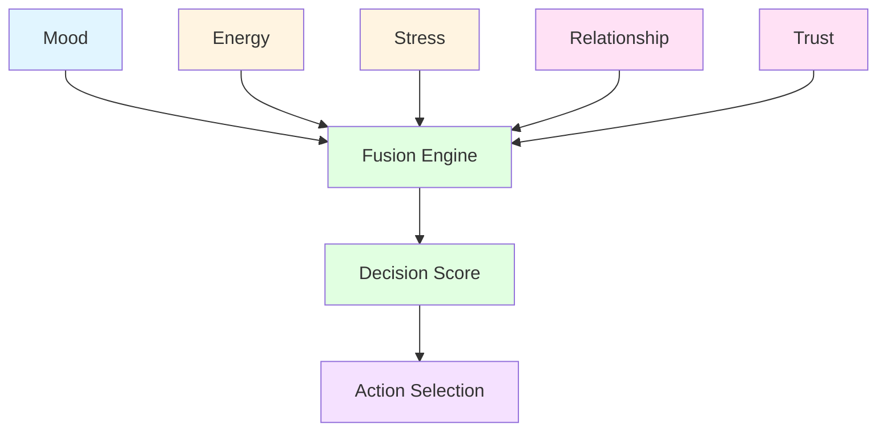

# MOTIVATION + EMOTION FUSION ENGINE

## Overview

Motivation + Emotion Fusion combines Mood, Energy, Stress, Relationship, Trust to make decisions WITHOUT relying on GPT.

---

## 1. Fusion Architecture



---

## 2. Fusion Engine

```csharp
// MotivationEmotionFusionEngine.cs
public class MotivationEmotionFusionEngine : MonoBehaviour
{
    [Header("Fusion Weights")]
    [SerializeField] private float moodWeight = 0.25f;
    [SerializeField] private float energyWeight = 0.20f;
    [SerializeField] private float stressWeight = 0.15f;
    [SerializeField] private float relationshipWeight = 0.20f;
    [SerializeField] private float trustWeight = 0.20f;
    
    [Header("Integration")]
    [SerializeField] private MoodSystem moodSystem;
    [SerializeField] private EnergySystem energySystem;
    [SerializeField] private StressSystem stressSystem;
    [SerializeField] private RelationshipSystem relationshipSystem;
    [SerializeField] private TrustSystem trustSystem;
    
    public DecisionScore CalculateDecisionScore(DecisionOption option)
    {
        float score = 0f;
        
        // Mood influence
        float mood = moodSystem.GetMood();
        score += mood * moodWeight;
        
        // Energy influence
        float energy = energySystem.GetEnergyLevel();
        score += energy * energyWeight;
        
        // Stress influence (inverse - lower stress = higher score)
        float stress = stressSystem.GetStressLevel();
        score += (1f - stress) * stressWeight;
        
        // Relationship influence
        float relationship = relationshipSystem.GetRelationshipLevel();
        score += relationship * relationshipWeight;
        
        // Trust influence
        float trust = trustSystem.GetTrustLevel();
        score += trust * trustWeight;
        
        return new DecisionScore
        {
            score = score,
            moodComponent = mood * moodWeight,
            energyComponent = energy * energyWeight,
            stressComponent = (1f - stress) * stressWeight,
            relationshipComponent = relationship * relationshipWeight,
            trustComponent = trust * trustWeight
        };
    }
    
    public DecisionOption SelectBestOption(List<DecisionOption> options)
    {
        DecisionOption bestOption = null;
        float bestScore = 0f;
        
        foreach (var option in options)
        {
            DecisionScore score = CalculateDecisionScore(option);
            
            if (score.score > bestScore)
            {
                bestScore = score.score;
                bestOption = option;
            }
        }
        
        return bestOption;
    }
}

public class DecisionScore
{
    public float score;
    public float moodComponent;
    public float energyComponent;
    public float stressComponent;
    public float relationshipComponent;
    public float trustComponent;
}

public class DecisionOption
{
    public string id;
    public string description;
    public ActionType type;
    public Dictionary<string, object> parameters;
}
```

---

## 3. Independent Decision Making

```csharp
// IndependentDecisionEngine.cs
public class IndependentDecisionEngine : MonoBehaviour
{
    [Header("Decision Making")]
    [SerializeField] private MotivationEmotionFusionEngine fusionEngine;
    
    [Header("Decision Thresholds")]
    [SerializeField] private float decisionThreshold = 0.6f;
    
    public Decision MakeDecision(List<DecisionOption> options)
    {
        // Calculate scores for all options
        Dictionary<DecisionOption, DecisionScore> scores = new Dictionary<DecisionOption, DecisionScore>();
        
        foreach (var option in options)
        {
            scores[option] = fusionEngine.CalculateDecisionScore(option);
        }
        
        // Select best option
        DecisionOption bestOption = fusionEngine.SelectBestOption(options);
        DecisionScore bestScore = scores[bestOption];
        
        // Check if decision score meets threshold
        if (bestScore.score < decisionThreshold)
        {
            // Use fallback decision
            return MakeFallbackDecision();
        }
        
        // Make decision based on fusion (NOT GPT)
        return new Decision
        {
            selectedOption = bestOption,
            score = bestScore,
            reasoning = GenerateReasoning(bestScore),
            timestamp = Time.time
        };
    }
    
    private Decision MakeFallbackDecision()
    {
        // Fallback to safe default decision
        return new Decision
        {
            selectedOption = new DecisionOption
            {
                id = "fallback",
                description = "Safe default action",
                type = ActionType.Idle
            },
            score = new DecisionScore { score = 0.5f },
            reasoning = "Using fallback due to low confidence",
            timestamp = Time.time
        };
    }
    
    private string GenerateReasoning(DecisionScore score)
    {
        return $"Decision based on mood ({score.moodComponent:F2}), energy ({score.energyComponent:F2}), stress ({score.stressComponent:F2}), relationship ({score.relationshipComponent:F2}), trust ({score.trustComponent:F2})";
    }
}

public class Decision
{
    public DecisionOption selectedOption;
    public DecisionScore score;
    public string reasoning;
    public float timestamp;
}
```

---

## 4. Decision vs GPT

**GPT Decision:**
- User query → GPT generates response
- No consideration of current state
- No emotional context
- No relationship context

**Fusion Decision:**
- User query → Fusion Engine calculates score → Decision based on mood, energy, stress, relationship, trust
- Considers current state
- Emotional context
- Relationship context
- Independent of GPT

**Example:**
User: "Em có thể giúp anh không?"

**GPT:** "Được, em có thể giúp anh. Anh cần gì?" (always the same)

**Fusion:**
- Mood: Happy (0.8)
- Energy: High (0.9)
- Stress: Low (0.2)
- Relationship: Close friend (0.9)
- Trust: High (0.85)
- **Score: 0.73**
- **Decision:** "Tất nhiên! Anh cần em giúp gì không? Em rất sẵn lòng!" (enthusiastic, personalized)

---

## Conclusion

Motivation + Emotion Fusion enables:
- **Independent decision making** WITHOUT relying on GPT
- **Context-aware decisions** based on current state
- **Emotional intelligence** in decision making
- **Relationship-aware responses**
- **Trust-based actions**

**This is what makes AI truly autonomous rather than just a text generator.**
