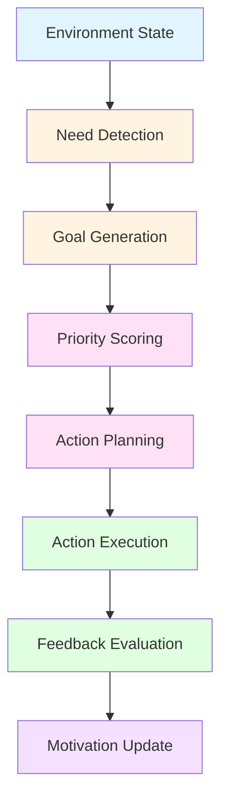

# MOTIVATION ENGINE

## Table of Contents
1. [Motivation System Overview](#motivation-system-overview)
2. [Need Detection](#need-detection)
3. [Goal Generation](#goal-generation)
4. [Priority Scoring](#priority-scoring)
5. [Action Planning](#action-planning)
6. [Motivation Types](#motivation-types)
7. [Motivation Fusion](#motivation-fusion)
8. [Motivation Evolution](#motivation-evolution)

---

## 1. Motivation System Overview

### 1.1 Motivation Pipeline



### 1.2 Philosophy

**Motivation Engine vs Reactive AI:**

**Reactive AI (GPT):**
- User asks → AI responds
- No initiative
- No proactive behavior
- Only reacts to input

**Motivated AI (Motivation Engine):**
- Observes environment → Detects needs → Generates goals → Prioritizes → Plans actions → Executes proactively
- **Example**: "Anh làm việc 6 tiếng chưa uống nước" → AI tự nói "Anh uống nước đi" (không cần user hỏi)

---

## 2. Need Detection

### 2.1 Need Detector

```csharp
// NeedDetectionSystem.cs
using UnityEngine;
using System.Collections.Generic;

namespace AICompanion.Motivation
{
    /// <summary>
    /// Need detection - AI detects needs from environment
    /// </summary>
    public class NeedDetectionSystem : MonoBehaviour
    {
        [Header("Need Categories")]
        [SerializeField] private List<PhysiologicalNeed> physiologicalNeeds;
        [SerializeField] private List<SocialNeed> socialNeeds;
        [SerializeField] private List<TaskNeed> taskNeeds;
        [SerializeField] private List<LearningNeed> learningNeeds;
        
        [Header("Detection Thresholds")]
        [SerializeField] private float physiologicalThreshold = 0.7f;
        [SerializeField] private float socialThreshold = 0.6f;
        [SerializeField] private float taskThreshold = 0.5f;
        [SerializeField] private float learningThreshold = 0.4f;
        
        [Header("Observation Window")]
        [SerializeField] private float observationWindow = 300f; // 5 minutes
        
        private Dictionary<string, float> needScores;
        private float lastObservationTime;
        
        private void Awake()
        {
            needScores = new Dictionary<string, float>();
            
            // Initialize needs
            InitializeNeeds();
        }
        
        private void InitializeNeeds()
        {
            // Physiological needs
            physiologicalNeeds = new List<PhysiologicalNeed>
            {
                new PhysiologicalNeed { name = "Water", threshold = 0.7f, description = "User needs water" },
                new PhysiologicalNeed { name = "Food", threshold = 0.6f, description = "User needs food" },
                new PhysiologicalNeed { name = "Rest", threshold = 0.8f, description = "User needs rest" },
                new PhysiologicalNeed { name = "Exercise", threshold = 0.5f, description = "User needs exercise" }
            };
            
            // Social needs
            socialNeeds = new List<SocialNeed>
            {
                new SocialNeed { name = "Attention", threshold = 0.6f, description = "User needs attention" },
                new SocialNeed { name = "Companionship", threshold = 0.5f, description = "User needs companionship" },
                new SocialNeed { name = "Affirmation", threshold = 0.4f, description = "User needs affirmation" }
            };
            
            // Task needs
            taskNeeds = new List<TaskNeed>
            {
                new TaskNeed { name = "Reminder", threshold = 0.5f, description = "User needs reminders" },
                new TaskNeed { name = "Assistance", threshold = 0.6f, description = "User needs assistance" },
                new TaskNeed { name = "Information", threshold = 0.4f, description = "User needs information" }
            };
            
            // Learning needs
            learningNeeds = new List<LearningNeed>
            {
                new LearningNeed { name = "NewKnowledge", threshold = 0.3f, description = "User wants to learn" },
                new LearningNeed { name = "SkillImprovement", threshold = 0.4f, description = "User wants to improve skills" },
                new LearningNeed { name = "Exploration", threshold = 0.5f, description = "User wants to explore" }
            };
        }
        
        private void Update()
        {
            UpdateObservations();
            DetectNeeds();
        }
        
        private void UpdateObservations()
        {
            // Observe user state over time window
            float currentTime = Time.time;
            
            if (currentTime - lastObservationTime > observationWindow)
            {
                lastObservationTime = currentTime;
                AnalyzeObservations();
            }
        }
        
        private void AnalyzeObservations()
        {
            // Analyze user behavior patterns
            // This would interface with Vision Engine and AI Character Framework
            
            // Example: Detect if user has been working for 6 hours without water
            float workDuration = DetectWorkDuration();
            if (workDuration > 6f)
            {
                needScores["Water"] += 0.3f;
            }
            
            // Example: Detect if user looks tired
            float tirednessLevel = DetectTiredness();
            if (tiredness > 0.7f)
            {
                needScores["Rest"] += 0.2f;
            }
            
            // Example: Detect if user seems lonely
            float socialInteraction = DetectSocialInteraction();
            if (socialInteraction < 0.3f)
            {
                needScores["Companionship"] += 0.2f;
            }
        }
        
        private void DetectNeeds()
        {
            List<DetectedNeed> detectedNeeds = new List<DetectedNeed>();
            
            // Check physiological needs
            foreach (var need in physiologicalNeeds)
            {
                if (needScores.TryGetValue(need.name, out float score) && score >= need.threshold)
                {
                    detectedNeeds.Add(new DetectedNeed
                    {
                        type = NeedType.Physiological,
                        name = need.name,
                        description = need.description,
                        urgency = score,
                        priority = need.threshold
                    });
                }
            }
            
            // Check social needs
            foreach (var need in socialNeeds)
            {
                if (needScores.TryGetValue(need.name, out float score) && score >= need.threshold)
                {
                    detectedNeeds.Add(new DetectedNeed
                    {
                        type = NeedType.Social,
                        name = need.name,
                        description = need.description,
                        urgency = score,
                        priority = need.threshold
                    });
                }
            }
            
            // Check task needs
            foreach (var need in taskNeeds)
            {
                if (needScores.TryGetValue(need.name, out float score) && score >= need.threshold)
                {
                    detectedNeeds.Add(new DetectedNeed
                    {
                        type = NeedType.Task,
                        name = need.name,
                        description = need.description,
                        urgency = score,
                        priority = need.threshold
                    });
                }
            }
            
            // Check learning needs
            foreach (var need in learningNeeds)
            {
                if (needScores.TryGetValue(need.name, out float score) && score >= need.threshold)
                {
                    detectedNeeds.Add(new DetectedNeed
                    {
                        type = NeedType.Learning,
                        name = need.name,
                        description = need.description,
                        urgency = score,
                        priority = need.threshold
                    });
                }
            }
            
            // Trigger goal generation for detected needs
            if (detectedNeeds.Count > 0)
            {
                OnNeedsDetected?.Invoke(detectedNeeds);
            }
        }
        
        private float DetectWorkDuration()
        {
            // Detect how long user has been working
            // This would interface with Vision Engine to detect user activity
            return 0f; // Placeholder
        }
        
        private float DetectTiredness()
        {
            // Detect user tiredness level
            // This would interface with Vision Engine to detect facial expressions
            return 0f; // Placeholder
        }
        
        private float DetectSocialInteraction()
        {
            // Detect social interaction level
            // This would interface with Vision Engine to detect conversations
            return 0f; // Placeholder
        }
        
        public void UpdateNeedScore(string needName, float delta)
        {
            if (!needScores.ContainsKey(needName))
            {
                needScores[needName] = 0f;
            }
            
            needScores[needName] += delta;
            needScores[needName] = Mathf.Clamp01(needScores[needName]);
        }
        
        // Event
        public event System.Action<List<DetectedNeed>> OnNeedsDetected;
    }
    
    /// <summary>
    /// Detected need
    /// </summary>
    public class DetectedNeed
    {
        public NeedType type;
        public string name;
        public string description;
        public float urgency;
        public float priority;
        public float timestamp;
    }
    
    public class PhysiologicalNeed
    {
        public string name;
        public float threshold;
        public string description;
    }
    
    public class SocialNeed
    {
        public string name;
        public float threshold;
        public string description;
    }
    
    public class TaskNeed
    {
        public string name;
        public float threshold;
        public string description;
    }
    
    public class LearningNeed
    {
        public string name;
        public float threshold;
        public string description;
    }
    
    public enum NeedType
    {
        Physiological,
        Social,
        Task,
        Learning
    }
}
```

---

## 3. Goal Generation

### 3.1 Goal Generator

```csharp
// GoalGenerationSystem.cs
using UnityEngine;
using System.Collections.Generic;

namespace AICompanion.Motivation
{
    /// <summary>
    /// Goal generation - Converts needs into actionable goals
    /// </summary>
    public class GoalGenerationSystem : MonoBehaviour
    {
        [Header("Goal Templates")]
        [SerializeField] private List<GoalTemplate> goalTemplates;
        
        [Header("Goal Generation Settings")]
        [SerializeField] private float goalGenerationInterval = 5f;
        [SerializeField] private int maxActiveGoals = 5;
        
        [Header("Integration")]
        [SerializeField] private NeedDetectionSystem needDetection;
        [SerializeField] private PersonalityModel personalityModel;
        
        private List<Goal> activeGoals;
        private float lastGoalGeneration;
        
        private void Awake()
        {
            activeGoals = new List<Goal>();
            
            // Initialize goal templates
            InitializeGoalTemplates();
        }
        
        private void InitializeGoalTemplates()
        {
            goalTemplates = new List<GoalTemplate>
            {
                new GoalTemplate
                {
                    needType = NeedType.Phiological,
                    needName = "Water",
                    goalType = GoalType.Assistance,
                    description = "Encourage user to drink water",
                    template = "User has been working for {duration} hours without water. Suggest: 'You should drink water.'",
                    defaultPriority = GoalPriority.High
                },
                new GoalTemplate
                {
                    needType = NeedType.Social,
                    needName = "Companionship",
                    goalType = GoalType.SocialInteraction,
                    description = "Engage user in conversation",
                    template = "User seems lonely. Initiate conversation about {topic}.",
                    defaultPriority = GoalPriority.Medium
                },
                new GoalTemplate
                {
                    needType = NeedType.Task,
                    needName = "Reminder",
                    goalType = GoalType.Reminder,
                    description = "Remind user of task",
                    template = "User has {task} scheduled at {time}. Provide reminder.",
                    defaultPriority = GoalPriority.Medium
                },
                new GoalTemplate
                {
                    needType = NeedType.Learning,
                    needName = "NewKnowledge",
                    goalType = GoalType.InformationProvision,
                    description = "Share information with user",
                    template = "User is interested in {topic}. Share relevant information.",
                    defaultPriority = GoalPriority.Low
                }
            };
        }
        
        private void Start()
        {
            needDetection.OnNeedsDetected += HandleNeedsDetected;
        }
        
        private void OnDestroy()
        {
            needDetection.OnNeedsDetected -= HandleNeedsDetected;
        }
        
        private void HandleNeedsDetected(List<DetectedNeed> detectedNeeds)
        {
            foreach (var need in detectedNeeds)
            {
                Goal goal = GenerateGoalFromNeed(need);
                
                if (goal != null)
                {
                    AddGoal(goal);
                }
            }
        }
        
        private Goal GenerateGoalFromNeed(DetectedNeed need)
        {
            // Find matching goal template
            GoalTemplate template = goalTemplates.Find(t => 
                t.needType == need.type && t.needName == need.name
            );
            
            if (template == null)
            {
                // Generate default goal
                return GenerateDefaultGoal(need);
            }
            
            // Generate goal from template
            Goal goal = new Goal
            {
                id = System.Guid.NewGuid().ToString(),
                type = template.goalType,
                name = $"{template.needName} Goal",
                description = template.description,
                need = need,
                priority = CalculateGoalPriority(template, need),
                deadline = Time.time + CalculateGoalDuration(template),
                parameters = new Dictionary<string, object>(),
                status = GoalStatus.Pending
            };
            
            // Fill in template parameters
            goal.parameters["template"] = template.template;
            goal.parameters["urgency"] = need.urgency;
            
            return goal;
        }
        
        private Goal GenerateDefaultGoal(DetectedNeed need)
        {
            return new Goal
            {
                id = System.Guid.NewGuid().ToString(),
                type = GoalType.Assistance,
                name = $"{need.name} Goal",
                description = need.description,
                need = need,
                priority = need.priority > 0.7f ? GoalPriority.High : GoalPriority.Medium,
                deadline = Time.time + 300f, // 5 minutes
                parameters = new Dictionary<string, object>(),
                status = GoalStatus.Pending
            };
        }
        
        private float CalculateGoalPriority(GoalTemplate template, DetectedNeed need)
        {
            float basePriority = template.defaultPriority;
            
            // Adjust based on personality
            float extraversion = personalityModel.GetTrait("Extraversion");
            float agreeableness = personalityModel.GetTrait("Agreeableness");
            
            if (template.goalType == GoalType.SocialInteraction)
            {
                basePriority += extraversion * 0.2f;
            }
            
            if (template.goalType == GoalType.Assistance)
            {
                basePriority += agreeableness * 0.2f;
            }
            
            // Adjust based on need urgency
            basePriority += need.urgency * 0.3f;
            
            return Mathf.Clamp01(basePriority);
        }
        
        private float CalculateGoalDuration(GoalTemplate template)
        {
            switch (template.goalType)
            {
                case GoalType.Assistance:
                    return 300f; // 5 minutes
                case GoalType.SocialInteraction:
                    return 600f; // 10 minutes
                case GoalType.Reminder:
                    return 60f; // 1 minute
                case GoalType.InformationProvision:
                    return 180f; // 3 minutes
                default:
                    return 300f;
            }
        }
        
        private void AddGoal(Goal goal)
        {
            // Check if already has similar goal
            if (activeGoals.Exists(g => g.name == goal.name))
            {
                return;
            }
            
            // Check max active goals
            if (activeGoals.Count >= maxActiveGoals)
            {
                // Remove lowest priority goal
                activeGoals.Sort((a, b) => a.priority.CompareTo(b.priority));
                activeGoals.RemoveAt(0);
            }
            
            activeGoals.Add(goal);
            
            // Trigger goal execution
            OnGoalGenerated?.Invoke(goal);
        }
        
        public void UpdateGoalStatus(string goalId, GoalStatus status)
        {
            Goal goal = activeGoals.Find(g => g.id == goalId);
            
            if (goal != null)
            {
                goal.status = status;
                
                if (status == GoalStatus.Completed || status == GoalStatus.Failed)
                {
                    activeGoals.Remove(goal);
                }
            }
        }
        
        public List<Goal> GetActiveGoals()
        {
            return new List<Goal>(activeGoals);
        }
        
        // Event
        public event System.Action<Goal> OnGoalGenerated;
    }
    
    /// <summary>
    /// Goal
    /// </summary>
    public class Goal
    {
        public string id;
        public GoalType type;
        public string name;
        public string description;
        public DetectedNeed need;
        public GoalPriority priority;
        public float deadline;
        public Dictionary<string, object> parameters;
        public GoalStatus status;
    }
    
    public class GoalTemplate
    {
        public NeedType needType;
        public string needName;
        public GoalType goalType;
        public string description;
        public string template;
        public GoalPriority defaultPriority;
    }
    
    public enum GoalType
    {
        Assistance,
        SocialInteraction,
        Reminder,
        InformationProvision,
        TaskExecution,
        Learning
    }
    
    public enum GoalPriority
    {
        Low,
        Medium,
        High,
        Critical
    }
    
    public enum GoalStatus
    {
        Pending,
        InProgress,
        Completed,
        Failed,
        Cancelled
    }
}
```

---

## 4. Priority Scoring

### 4.1 Priority Scorer

```csharp
// PriorityScoringSystem.cs
using UnityEngine;
using System.Collections.Generic;

namespace AICompanion.Motivation
{
    /// <summary>
    /// Priority scoring - Determines which goal/action should be executed first
    /// </summary>
    public class PriorityScoringSystem : MonoBehaviour
    {
        [Header("Priority Factors")]
        [SerializeField] private float urgencyWeight = 0.4f;
        [SerializeField] private float importanceWeight = 0.3f;
        [SerializeField = private float dependencyWeight = 0.2f;
        [SerializeField] private float personalityWeight = 0.1f;
        
        [Header("Integration")]
        [SerializeField] private PersonalityModel personalityModel;
        [SerializeField] private GoalGenerationSystem goalGeneration;
        
        public float CalculatePriority(GoalAction action)
        {
            float score = 0f;
            
            // Urgency score
            float urgencyScore = CalculateUrgencyScore(action);
            score += urgencyScore * urgencyWeight;
            
            // Importance score
            float importanceScore = CalculateImportanceScore(action);
            score += importanceScore * importanceWeight;
            
            // Dependency score
            float dependencyScore = CalculateDependencyScore(action);
            score += dependencyScore * dependencyWeight;
            
            // Personality alignment score
            float personalityScore = CalculatePersonalityScore(action);
            score += personalityScore * personalityWeight;
            
            return Mathf.Clamp01(score);
        }
        
        private float CalculateUrgencyScore(GoalAction action)
        {
            // Higher urgency = higher priority
            float timeUntilDeadline = action.deadline - Time.time;
            
            if (timeUntilDeadline < 60f) // Less than 1 minute
            {
                return 1.0f;
            }
            else if (timeUntilDeadline < 300f) // Less than 5 minutes
            {
                return 0.8f;
            }
            else if (timeUntilDeadline < 900f) // Less than 15 minutes
            {
                return 0.6f;
            }
            else
            {
                return 0.4f;
            }
        }
        
        private float CalculateImportanceScore(GoalAction action)
        {
            // Important goals have higher priority
            switch (action.type)
            {
                case ActionType.Emergency:
                    return 1.0f;
                case ActionType.Safety:
                    return 0.9f;
                case ActionType.Health:
                    return 0.8f;
                case ActionType.Social:
                    return 0.6f;
                case TaskType.Task:
                    return 0.5f;
                default:
                    return 0.4f;
            }
        }
        
        private float CalculateDependencyScore(GoalAction action)
        {
            // Goals with dependencies on completed tasks have higher priority
            float completedDependencies = 0f;
            float totalDependencies = action.dependencies.Count;
            
            if (totalDependencies > 0)
            {
                foreach (var dependency in action.dependencies)
                {
                    if (dependency.status == DependencyStatus.Completed)
                    {
                        completedDependencies += 1f;
                    }
                }
                
                return completedDependencies / totalDependencies;
            }
            
            return 0.5f; // Default score if no dependencies
        }
        
        private float CalculatePersonalityScore(GoalAction action)
        {
            // Personality traits influence priority
            float score = 0.5f;
            
            // Extraverted personality prefers social actions
            float extraversion = personalityModel.GetTrait("Extraversion");
            if (action.type == ActionType.Social)
            {
                score += extraversion * 0.3f;
            }
            
            // Conscientious personality prefers task completion
            float conscientiousness = personalityModel.GetTrait("Conscientiousness");
            if (action.type == ActionType.Task)
            {
                score += conscientiousness * 0.3f;
            }
            
            // Agreeable personality prefers helping others
            float agreeableness = personalityModel.GetTrait("Agreeableness");
            if (action.type == ActionType.Assistance)
            {
                score += agreeableness * 0.3f;
            }
            
            return score;
        }
        
        public void ReorderActions(List<GoalAction> actions)
        {
            // Sort actions by priority
            actions.Sort((a, b) => CalculatePriority(b).Compare(CalculatePriority(a)));
        }
    }
    
    public class GoalAction
    {
        public string id;
        public ActionType type;
        public float deadline;
        public List<Dependency> dependencies;
    }
    
    public class Dependency
    {
        public string id;
        public DependencyStatus status;
    }
    
    public enum ActionType
    {
        Emergency,
        Safety,
        Health,
        Social,
        Task,
        Assistance
        Information
        Entertainment
    }
    
    public enum DependencyStatus
    {
        Pending,
        InProgress,
        Completed,
        Failed
    }
}
```

---

## 5. Action Planning

### 5.1 Action Planner

```csharp
// ActionPlanningSystem.cs
using UnityEngine;
using System.Collections.Generic;

namespace AICompanion.Motivation
{
    /// <summary>
    /// Action planning - Converts goals into executable actions
    /// </summary>
    public class ActionPlanningSystem : MonoBehaviour
    {
        [Header("Action Templates")]
        [SerializeField] private List<ActionTemplate> actionTemplates;
        
        [Header("Planning Settings")]
        [SerializeField] private float planningInterval = 1f;
        [SerializeField] private int maxActionsPerGoal = 3;
        
        [Header("Integration")]
        [SerializeField] private GoalGenerationSystem goalGeneration;
        [SerializeField] private PriorityScoringSystem priorityScoring;
        
        private List<PlannedAction> plannedActions;
        private float lastPlanningTime;
        
        private void Start()
        {
            goalGeneration.OnGoalGenerated += HandleGoalGenerated;
        }
        
        private void OnDestroy()
        {
            goalGeneration.OnGoalGenerated -= HandleGoalGenerated;
        }
        
        private void HandleGoalGenerated(Goal goal)
        {
            // Generate actions for goal
            List<PlannedAction> actions = GenerateActionsForGoal(goal);
            
            foreach (var action in actions)
            {
                plannedActions.Add(action);
            }
            
            // Prioritize actions
            priorityScorer.ReorderActions(plannedActions.ConvertAll(a => (GoalAction)a));
        }
        
        private List<PlannedAction> GenerateActionsForGoal(Goal goal)
        {
            List<PlannedAction> actions = new List<PlannedAction>();
            
            // Find matching action template
            ActionTemplate template = actionTemplates.Find(t => 
                t.goalType == goal.type
            );
            
            if (template == null)
            {
                // Generate default action
                actions.Add(new PlannedAction
                {
                    id = System.Guid.NewGuid().ToString(),
                    goalId = goal.id,
                    type = ActionType.Assistance,
                    description = goal.description,
                    priority = goal.priority,
                    deadline = goal.deadline,
                    parameters = new Dictionary<string, object>(),
                    status = ActionStatus.Pending
                });
            }
            else
            {
                // Generate action from template
                PlannedAction action = new PlannedAction
                {
                    id = System.Guid.NewGuid().ToString(),
                    goalId = goal.id,
                    type = template.actionType,
                    description = template.description,
                    priority = goal.priority,
                    deadline = goal.deadline,
                    parameters = new Dictionary<string, object>(),
                    status = ActionStatus.Pending
                };
                
                // Fill in template parameters
                action.parameters["template"] = template.template;
                action.parameters["goal_parameters"] = goal.parameters;
                
                actions.Add(action);
            }
            
            return actions;
        }
        
        private void Update()
        {
            if (Time.time - lastPlanningTime < planningInterval) return;
            
            lastPlanningTime = Time.time;
            
            ProcessPlannedActions();
        }
        
        private void ProcessPlannedActions()
        {
            // Sort actions by priority
            plannedActions.Sort((a, b) => priorityScoring.CalculatePriority(b).Compare(priorityScoring.CalculatePriority(a)));
            
            // Execute top priority action
            if (plannedActions.Count > 0)
            {
                PlannedAction action = plannedActions[0];
                
                if (action.status == ActionStatus.Pending)
                {
                    ExecuteAction(action);
                }
            }
        }
        
        private void ExecuteAction(PlannedAction action)
        {
            action.status = ActionStatus.InProgress;
            
            // Execute action based on type
            switch (action.type)
            {
                case ActionType.Speech:
                    ExecuteSpeechAction(action);
                    break;
                case ActionType.Animation:
                    ExecuteAnimationAction(action);
                    break;
                case ActionType.Task:
                    ExecuteTaskAction(action);
                    break;
                case ActionType.Information:
                    ExecuteInformationAction(action);
                    break;
            }
            
            // Update goal status
            goalGeneration.UpdateGoalStatus(action.goalId, GoalStatus.InProgress);
        }
        
        private void ExecuteSpeechAction(PlannedAction action)
        {
            // Execute speech action
            // This would interface with Voice Engine
            string message = GetActionMessage(action);
            
            // Send to Voice Engine
            // voiceService.Speak(message);
            
            // Mark action as completed
            action.status = ActionStatus.Completed;
        }
        
        private void ExecuteAnimationAction(PlannedAction action)
        {
            // Execute animation action
            // This would interface with Animation Engine
            string animationName = GetActionAnimation(action);
            
            // Send to Animation Engine
            // animationController.PlayAnimation(animationName);
            
            // Mark action as completed
            action.status = ActionStatus.Completed;
        }
        
        private void ExecuteTaskAction(PlannedAction action)
        {
            // Execute task action
            // This would interface with Agent Engine
            // agentService.ExecuteTask(action);
            
            // Mark action as completed
            action.status = ActionStatus.Completed;
        }
        
        private void ExecuteInformationAction(PlannedAction action)
        {
            // Execute information action
            // This would interface with LLM Router
            string query = GetActionQuery(action);
            
            // Send to LLM Router
            // llmService.Generate(query);
            
            // Mark action as completed
            action.status = ActionStatus.Completed;
        }
        
        private string GetActionMessage(PlannedAction action)
        {
            // Generate message from action parameters
            if (action.parameters.ContainsKey("template"))
            {
                return action.parameters["template"].ToString();
            }
            
            return action.description;
        }
        
        private string GetActionAnimation(PlannedAction action)
        {
            // Get animation name from action parameters
            if (action.parameters.ContainsKey("animation"))
            {
                return action.parameters["animation"].ToString();
            }
            
            return "Idle";
        }
        
        private string GetActionQuery(PlannedAction action)
        {
            // Get query from action parameters
            if (action.parameters.ContainsKey("query"))
            {
                return action.parameters["query"].ToString();
            }
            
            return action.description;
        }
        
        public List<PlannedAction> GetPlannedActions()
        {
            return new List<PlannedAction>(plannedActions);
        }
    }
    
    public class ActionTemplate
    {
        public GoalType goalType;
        public ActionType actionType;
        public string description;
        public string template;
    }
    
    public class PlannedAction
    {
        public string id;
        public string goalId;
        public ActionType type;
        public string description;
        public GoalPriority priority;
        public float deadline;
        public Dictionary<string, object> parameters;
        public ActionStatus status;
    }
    
    public enum ActionStatus
    {
        Pending,
        InProgress,
        Completed,
        Failed,
        Cancelled
    }
}
```

---

## 6. Motivation Types

### 6.1 Motivation Types

```csharp
// MotivationTypes.cs
using UnityEngine;

namespace AICompanion.Motivation
{
    /// <summary>
    /// Motivation types - Different types of motivation
    /// </summary>
    public enum MotivationType
    {
        // Physiological motivations
        Hunger,
        Thirst,
        Fatigue,
        Comfort,
        Safety,
        
        // Social motivations
        Belonging,
        Recognition,
        Achievement,
        Status,
        Power,
        
        // Cognitive motivations
        Curiosity,
        Understanding,
        Competence,
        Autonomy,
        
        // Emotional motivations
        Love,
        Hate,
        Fear,
        Anger,
        Disgust,
        Surprise,
        Happiness,
        Sadness
    }
    
    /// <summary>
    /// Motivation state
    /// </summary>
    public class MotivationState
    {
        public Dictionary<MotivationType, float> activeMotivations;
        public MotivationType dominantMotivation;
        public float motivationIntensity;
        
        public MotivationState()
        {
            activeMotivations = new Dictionary<MotivationType, float>();
            dominantMotivation = MotivationType.Curiosity;
            motivationIntensity = 0.5f;
        }
        
        public void SetMotivation(MotivationType type, float intensity)
        {
            activeMotivations[type] = intensity;
            
            // Find dominant motivation
            dominantMotivation = GetDominantMotivation();
            motivationIntensity = activeMotivations[dominantMotivation];
        }
        
        private MotivationType GetDominantMotivation()
        {
            MotivationType dominant = MotivationType.Curiosity;
            float maxIntensity = 0f;
            
            foreach (var kvp in activeMotivations)
            {
                if (kvp.Value > maxIntensity)
                {
                    maxIntensity = kvp.Value;
                    dominant = kvp.Key;
                }
            }
            
            return dominant;
        }
        
        public float GetMotivationIntensity(MotivationType type)
        {
            return activeMotivations.TryGetValue(type, out float intensity) ? intensity : 0f;
        }
    }
}
```

---

## 7. Motivation Fusion

### 7.1 Motivation Fusion Engine

```csharp
// MotivationFusionEngine.cs
using UnityEngine;
using System.Collections.Generic;

namespace AICompanion.Motivation
{
    /// <summary>
    /// Motivation fusion - Combines mood, energy, stress, relationship, trust for decision making
    /// </summary>
    public class MotivationFusionEngine : MonoBehaviour
    {
        [Header("Fusion Factors")]
        [SerializeField] private float moodWeight = 0.25f;
        [SerializeField] private float energyWeight = 0.2f;
        [SerializeField] private float stressWeight = 0.15f;
        [SerializeField] private float relationshipWeight = 0.2f;
        [SerializeField] private float trustWeight = 0.2f;
        
        [Header("Integration")]
        [SerializeField] private MoodSystem moodSystem;
        [SerializeField] private EnergySystem energySystem;
        [SerializeField] private StressSystem stressSystem;
        [SerializeField] private RelationshipSystem relationshipSystem;
        [SerializeField] private TrustSystem trustSystem;
        
        public DecisionScore CalculateDecisionScore(DecisionOption option)
        {
            float score = 0f;
            
            // Mood influence
            float mood = moodSystem.GetMood();
            score += mood * moodWeight;
            
            // Energy influence
            float energy = energySystem.GetEnergyLevel();
            score += energy * energyWeight;
            
            // Stress influence (inverse - lower stress = higher score)
            float stress = stressSystem.GetStressLevel();
            score += (1f - stress) * stressWeight;
            
            // Relationship influence
            float relationship = relationshipSystem.GetRelationshipLevel();
            score += relationship * relationshipWeight;
            
            // Trust influence
            float trust = trustSystem.GetTrustLevel();
            score += trust * trustWeight;
            
            return new DecisionScore
            {
                score = score,
                moodComponent = mood * moodWeight,
                energyComponent = energy * energyWeight,
                stressComponent = (1f - stress) * stressWeight,
                relationshipComponent = relationship * relationshipWeight,
                trustComponent = trust * trustWeight
            };
        }
        
        public DecisionOption SelectBestOption(List<DecisionOption> options)
        {
            DecisionOption bestOption = null;
            float bestScore = 0f;
            
            foreach (var option in options)
            {
                DecisionScore score = CalculateDecisionScore(option);
                
                if (score.score > bestScore)
                {
                    bestScore = score.score;
                    bestOption = option;
                }
            }
            
            return bestOption;
        }
    }
    
    public class DecisionScore
    {
        public float score;
        public float moodComponent;
        public float energyComponent;
        public float stressComponent;
        public float relationshipComponent;
        public float trustComponent;
    }
    
    public class DecisionOption
    {
        public string id;
        public string description;
        public ActionType type;
        public Dictionary<string, object> parameters;
    }
    
    public class StressSystem : MonoBehaviour
    {
        [SerializeField] private float stressLevel = 0.5f;
        
        public float GetStressLevel()
        {
            return stressLevel;
        }
    }
}
```

---

## 8. Motivation Evolution

### 8.1 Motivation Evolution

```csharp
// MotivationEvolution.cs
using UnityEngine;
using System.Collections.Generic;

namespace AICompanion.Motivation
{
    /// <summary>
    /// Motivation evolution - Personality and motivation evolves over time
    /// </summary>
    public class MotivationEvolution : MonoBehaviour
    {
        [Header("Evolution Settings")]
        [SerializeField] private float evolutionRate = 0.001f;
        [SerializeField] private bool enableEvolution = true;
        
        [Header("Integration")]
        [SerializeField] private PersonalityModel personalityModel;
        [SerializeField] private List<InteractionHistory> interactionHistory;
        
        private void Update()
        {
            if (!enableEvolution) return;
            
            EvolveMotivations();
        }
        
        private void EvolveMotivations()
        {
            // Evolve motivations based on interaction history
            foreach (var interaction in interactionHistory)
            {
                if (interaction.positive)
                {
                    // Positive interactions increase motivation for similar actions
                    IncreaseMotivation(interaction.type, interaction.intensity * evolutionRate);
                }
                else
                {
                    // Negative interactions decrease motivation
                    DecreaseMotivation(interaction.type, interaction.intensity * evolutionRate);
                }
            }
        }
        
        private void IncreaseMotivation(MotivationType type, float delta)
        {
            // Increase motivation for this type
            // This would interface with MotivationType system
        }
        
        private void DecreaseMotivation(MotivationType type, float delta)
        {
            // Decrease motivation for this type
            // This would interface with MotivationType system
        }
    }
    
    public class InteractionHistory
    {
        public string interactionType;
        public bool positive;
        public float intensity;
        public float timestamp;
    }
}
```

---

## Conclusion

Motivation Engine làm cho AI có **tự chủ** và **chủ động** thay vì chỉ phản hồi:

### 🔑 Key Features:
1. **Need Detection**: AI quan sát environment và detect needs (user cần nước, user cô đơn, user mệt)
2. **Goal Generation**: Tự động tạo goals từ needs
3. **Priority Scoring**: Quyết định goal nào quan trọng nhất
4. **Action Planning**: Chuyển goals thành executable actions
5. **Motivation Types**: Multiple motivation types (Physiological, Social, Cognitive, Emotional)
6. **Motivation Fusion**: Kết hợp mood, energy, stress, relationship, trust để ra quyết định
7. **Motivation Evolution**: Personality và motivation evolves over time

### 💡 Ví dụ thực tế:

**Reactive AI (GPT):**
User: "Anh làm việc 6 tiếng rồi."
AI: "Em hiểu. Anh nên nghỉ ngơi một chút."

**Motivated AI:**
- **Need Detection**: AI observes → user đã làm việc 6 tiếng, chưa uống nước
- **Goal Generation**: Goal = "Encourage user to drink water"
- **Priority Scoring**: Priority = High (Health need)
- **Action Planning**: Action = "Suggest drinking water to user"
- **Execution**: AI tự nói "Anh uống nước đi nhé" (không cần user hỏi)

**Motivation Engine làm cho AI có proactivity như một trợ lý thực sự chứ không chỉ là chatbot.**
