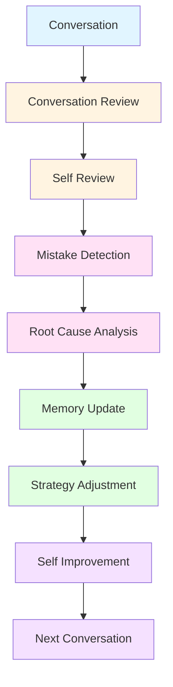
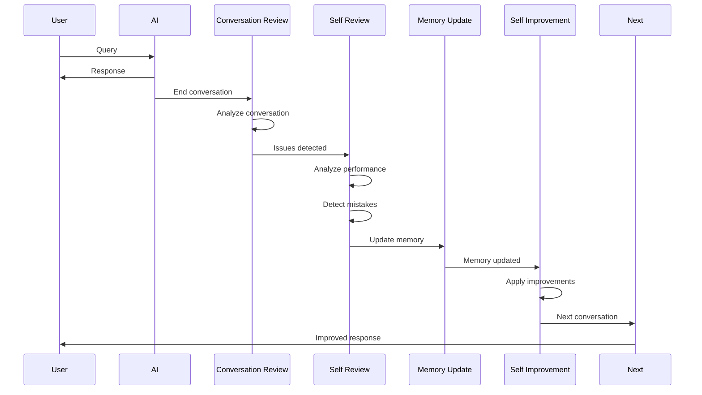

# REFLECTION ENGINE

## Table of Contents
1. [Reflection System Overview](#reflection-system-overview)
2. [Conversation Review](#conversation-review)
3. [Self Review Process](#self-review-process)
4. [Mistake Detection](#mistake-detection)
5. [Memory Update](#memory-update)
6. [Self Improvement](#self-improvement)
7. [Reflection Loop](#reflection-loop)

---

## 1. Reflection System Overview

### 1.1 Reflection Pipeline



### 1.2 Philosophy

**Why Reflection Matters:**

**Without Reflection (Current GPT):**
- AI responds → forgets context → repeats mistakes
- No self-awareness of performance
- No learning from errors
- No improvement over time

**With Reflection Engine:**
- AI responds → self-reviews → detects mistakes → learns → improves
- Self-awareness of performance
- Learning from errors
- Continuous improvement

**Example:**
- **Without Reflection**: AI gives wrong answer → user corrects → AI gives same wrong answer next time
- **With Reflection**: AI gives wrong answer → self-review detects mistake → learns correction → doesn't repeat mistake

---

## 2. Conversation Review

### 2.1 Conversation Reviewer

```csharp
// ConversationReviewSystem.cs
using UnityEngine;
using System.Collections.Generic;

namespace AICompanion.Reflection
{
    /// <summary>
    /// Conversation review - Analyzes conversation after completion
    /// </summary>
    public class ConversationReviewSystem : MonoBehaviour
    {
        [Header("Review Settings")]
        [SerializeField] private float reviewInterval = 60f; // Review every minute
        [SerializeField] private int maxConversationHistory = 100;
        
        [Header("Review Criteria")]
        [SerializeField] private float clarityThreshold = 0.7f;
        [SerializeField] private float relevanceThreshold = 0.7f;
        [SerializeField] private float helpfulnessThreshold = 0.7f;
        [SerializeField] private float accuracyThreshold = 0.8f;
        
        [Header("Integration")]
        [SerializeField] private MemoryEngine memoryEngine;
        [SerializeField] private LLMRouter llmRouter;
        
        private List<Conversation> conversationHistory;
        private float lastReviewTime;
        
        private void Awake()
        {
            conversationHistory = new List<Conversation>();
        }
        
        private void Update()
        {
            if (Time.time - lastReviewTime < reviewInterval) return;
            
            lastReviewTime = Time.time;
            
            ReviewConversations();
        }
        
        public void AddConversation(Conversation conversation)
        {
            conversationHistory.Add(conversation);
            
            // Maintain max history
            if (conversationHistory.Count > maxConversationHistory)
            {
                conversationHistory.RemoveAt(0);
            }
        }
        
        private void ReviewConversations()
        {
            foreach (var conversation in conversationHistory)
            {
                if (!conversation.reviewed)
                {
                    ReviewConversation(conversation);
                }
            }
        }
        
        private void ReviewConversation(Conversation conversation)
        {
            ConversationReview review = new ConversationReview
            {
                conversationId = conversation.id,
                timestamp = Time.time,
                clarityScore = EvaluateClarity(conversation),
                relevanceScore = EvaluateRelevance(conversation),
                helpfulnessScore = EvaluateHelpfulness(conversation),
                accuracyScore = EvaluateAccuracy(conversation),
                issues = DetectIssues(conversation)
            };
            
            conversation.review = review;
            conversation.reviewed = true;
            
            // Trigger self review if issues detected
            if (review.issues.Count > 0)
            {
                OnConversationReviewCompleted?.Invoke(review);
            }
        }
        
        private float EvaluateClarity(Conversation conversation)
        {
            // Evaluate clarity of AI responses
            float clarityScore = 0f;
            int totalResponses = conversation.messages.Count(m => m.role == "assistant");
            
            foreach (var message in conversation.messages)
            {
                if (message.role == "assistant")
                {
                    clarityScore += EvaluateMessageClarity(message.content);
                }
            }
            
            return totalResponses > 0 ? clarityScore / totalResponses : 0.5f;
        }
        
        private float EvaluateMessageClarity(string message)
        {
            // Evaluate message clarity
            // This would use NLP to measure clarity
            // For now, use simple heuristics
            float length = message.Length;
            
            if (length < 10)
            {
                return 0.3f; // Too short
            }
            else if (length > 500)
            {
                return 0.5f; // Too long
            }
            else
            {
                return 0.8f; // Good length
            }
        }
        
        private float EvaluateRelevance(Conversation conversation)
        {
            // Evaluate relevance of AI responses to user queries
            float relevanceScore = 0f;
            int totalPairs = 0;
            
            for (int i = 0; i < conversation.messages.Count - 1; i++)
            {
                if (conversation.messages[i].role == "user" && 
                    conversation.messages[i + 1].role == "assistant")
                {
                    string userQuery = conversation.messages[i].content;
                    string aiResponse = conversation.messages[i + 1].content;
                    
                    relevanceScore += EvaluateResponseRelevance(userQuery, aiResponse);
                    totalPairs++;
                }
            }
            
            return totalPairs > 0 ? relevanceScore / totalPairs : 0.5f;
        }
        
        private float EvaluateResponseRelevance(string query, string response)
        {
            // Evaluate if response is relevant to query
            // This would use semantic similarity
            // For now, check if response contains keywords from query
            string[] queryWords = query.ToLower().Split(' ');
            int matchingWords = 0;
            
            foreach (var word in queryWords)
            {
                if (response.ToLower().Contains(word))
                {
                    matchingWords++;
                }
            }
            
            return (float)matchingWords / queryWords.Length;
        }
        
        private float EvaluateHelpfulness(Conversation conversation)
        {
            // Evaluate helpfulness based on user feedback
            float helpfulnessScore = 0f;
            int feedbackCount = 0;
            
            foreach (var message in conversation.messages)
            {
                if (message.role == "user" && message.feedback != null)
                {
                    helpfulnessScore += message.feedback.Value;
                    feedbackCount++;
                }
            }
            
            return feedbackCount > 0 ? helpfulnessScore / feedbackCount : 0.5f;
        }
        
        private float EvaluateAccuracy(Conversation conversation)
        {
            // Evaluate accuracy of AI responses
            // This would use fact-checking or expert review
            // For now, use placeholder
            return 0.8f;
        }
        
        private List<ConversationIssue> DetectIssues(Conversation conversation)
        {
            List<ConversationIssue> issues = new List<ConversationIssue>();
            
            // Check clarity
            if (conversation.review.clarityScore < clarityThreshold)
            {
                issues.Add(new ConversationIssue
                {
                    type = IssueType.Clarity,
                    severity = IssueSeverity.Medium,
                    description = "AI responses lack clarity",
                    suggestion = "Improve response clarity and conciseness"
                });
            }
            
            // Check relevance
            if (conversation.review.relevanceScore < relevanceThreshold)
            {
                issues.Add(new ConversationIssue
                {
                    type = IssueType.Relevance,
                    severity = IssueSeverity.High,
                    description = "AI responses not relevant to user queries",
                    suggestion = "Improve understanding of user intent"
                });
            }
            
            // Check helpfulness
            if (conversation.review.helpfulnessScore < helpfulnessThreshold)
            {
                issues.Add(new ConversationIssue
                {
                    type = IssueType.Helpfulness,
                    severity = IssueSeverity.High,
                    description = "AI responses not helpful to user",
                    suggestion = "Improve response helpfulness and actionability"
                });
            }
            
            // Check accuracy
            if (conversation.review.accuracyScore < accuracyThreshold)
            {
                issues.Add(new ConversationIssue
                {
                    type = IssueType.Accuracy,
                    severity = IssueSeverity.Critical,
                    description = "AI responses contain inaccuracies",
                    suggestion = "Improve fact-checking and knowledge base"
                });
            }
            
            return issues;
        }
        
        // Event
        public event System.Action<ConversationReview> OnConversationReviewCompleted;
    }
    
    public class Conversation
    {
        public string id;
        public List<Message> messages;
        public ConversationReview review;
        public bool reviewed;
    }
    
    public class Message
    {
        public string role; // "user" or "assistant"
        public string content;
        public float? feedback; // User feedback (0-1)
    }
    
    public class ConversationReview
    {
        public string conversationId;
        public float timestamp;
        public float clarityScore;
        public float relevanceScore;
        public float helpfulnessScore;
        public float accuracyScore;
        public List<ConversationIssue> issues;
    }
    
    public class ConversationIssue
    {
        public IssueType type;
        public IssueSeverity severity;
        public string description;
        public string suggestion;
    }
    
    public enum IssueType
    {
        Clarity,
        Relevance,
        Helpfulness,
        Accuracy,
        Safety,
        Bias
    }
    
    public enum IssueSeverity
    {
        Low,
        Medium,
        High,
        Critical
    }
}
```

---

## 3. Self Review Process

### 3.1 Self Review Engine

```csharp
// SelfReviewEngine.cs
using UnityEngine;
using System.Collections.Generic;

namespace AICompanion.Reflection
{
    /// <summary>
    /// Self review engine - AI reviews its own performance
    /// </summary>
    public class SelfReviewEngine : MonoBehaviour
    {
        [Header("Review Settings")]
        [SerializeField] private float selfReviewInterval = 120f; // Self-review every 2 minutes
        [SerializeField] private int maxRecentConversations = 10;
        
        [Header("Review Metrics")]
        [SerializeField] private Dictionary<string, float> performanceMetrics;
        
        [Header("Integration")]
        [SerializeField] private ConversationReviewSystem conversationReview;
        [SerializeField] private LLMRouter llmRouter;
        [SerializeField] private MemoryEngine memoryEngine;
        
        private float lastSelfReviewTime;
        
        private void Start()
        {
            conversationReview.OnConversationReviewCompleted += HandleConversationReviewCompleted;
        }
        
        private void OnDestroy()
        {
            conversationReview.OnConversationReviewCompleted -= HandleConversationReviewCompleted;
        }
        
        private void HandleConversationReviewCompleted(ConversationReview review)
        {
            // Trigger self review when conversation review detects issues
            if (review.issues.Count > 0)
            {
                PerformSelfReview(review);
            }
        }
        
        private void Update()
        {
            if (Time.time - lastSelfReviewTime < selfReviewInterval) return;
            
            lastSelfReviewTime = Time.time;
            
            PerformPeriodicSelfReview();
        }
        
        private void PerformSelfReview(ConversationReview conversationReview)
        {
            SelfReview review = new SelfReview
            {
                timestamp = Time.time,
                conversationReview = conversationReview,
                performanceAnalysis = AnalyzePerformance(conversationReview),
                mistakeAnalysis = AnalyzeMistakes(conversationReview),
                improvementSuggestions = GenerateImprovementSuggestions(conversationReview)
            };
            
            // Update performance metrics
            UpdatePerformanceMetrics(review);
            
            // Trigger improvement process
            OnSelfReviewCompleted?.Invoke(review);
        }
        
        private void PerformPeriodicSelfReview()
        {
            // Perform periodic self review of recent conversations
            List<ConversationReview> recentReviews = GetRecentConversationReviews(maxRecentConversations);
            
            SelfReview review = new SelfReview
            {
                timestamp = Time.time,
                performanceAnalysis = AnalyzeAggregatePerformance(recentReviews),
                mistakeAnalysis = AnalyzeAggregateMistakes(recentReviews),
                improvementSuggestions = GenerateAggregateImprovementSuggestions(recentReviews)
            };
            
            // Update performance metrics
            UpdatePerformanceMetrics(review);
            
            // Trigger improvement process
            OnSelfReviewCompleted?.Invoke(review);
        }
        
        private PerformanceAnalysis AnalyzePerformance(ConversationReview conversationReview)
        {
            return new PerformanceAnalysis
            {
                overallScore = CalculateOverallScore(conversationReview),
                strengths = IdentifyStrengths(conversationReview),
                weaknesses = IdentifyWeaknesses(conversationReview),
                trends = AnalyzeTrends()
            };
        }
        
        private float CalculateOverallScore(ConversationReview review)
        {
            // Calculate overall performance score
            float overallScore = 0f;
            overallScore += review.clarityScore * 0.25f;
            overallScore += review.relevanceScore * 0.25f;
            overallScore += review.helpfulnessScore * 0.25f;
            overallScore += review.accuracyScore * 0.25f;
            
            return overallScore;
        }
        
        private List<string> IdentifyStrengths(ConversationReview review)
        {
            List<string> strengths = new List<string>();
            
            if (review.clarityScore > 0.8f)
            {
                strengths.Add("High clarity in responses");
            }
            
            if (review.relevanceScore > 0.8f)
            {
                strengths.Add("High relevance to user queries");
            }
            
            if (review.helpfulnessScore > 0.8f)
            {
                strengths.Add("High helpfulness to user");
            }
            
            if (review.accuracyScore > 0.8f)
            {
                strengths.Add("High accuracy in responses");
            }
            
            return strengths;
        }
        
        private List<string> IdentifyWeaknesses(ConversationReview review)
        {
            List<string> weaknesses = new List<string>();
            
            if (review.clarityScore < 0.6f)
            {
                weaknesses.Add("Low clarity in responses");
            }
            
            if (review.relevanceScore < 0.6f)
            {
                weaknesses.Add("Low relevance to user queries");
            }
            
            if (review.helpfulnessScore < 0.6f)
            {
                weaknesses.Add("Low helpfulness to user");
            }
            
            if (review.accuracyScore < 0.6f)
            {
                weaknesses.Add("Low accuracy in responses");
            }
            
            return weaknesses;
        }
        
        private List<string> AnalyzeTrends()
        {
            // Analyze performance trends over time
            // This would look at historical performance metrics
            return new List<string>();
        }
        
        private MistakeAnalysis AnalyzeMistakes(ConversationReview conversationReview)
        {
            return new MistakeAnalysis
            {
                mistakes = IdentifyMistakes(conversationReview),
                mistakeCount = conversationReview.issues.Count,
                mistakeSeverity = CalculateOverallSeverity(conversationReview.issues),
                mistakeCategories = CategorizeMistakes(conversationReview.issues)
            };
        }
        
        private List<Mistake> IdentifyMistakes(ConversationReview conversationReview)
        {
            List<Mistake> mistakes = new List<Mistake>();
            
            foreach (var issue in conversationReview.issues)
            {
                mistakes.Add(new Mistake
                {
                    type = issue.type,
                    severity = issue.severity,
                    description = issue.description,
                    context = GetMistakeContext(issue),
                    rootCause = AnalyzeRootCause(issue)
                });
            }
            
            return mistakes;
        }
        
        private string GetMistakeContext(ConversationIssue issue)
        {
            // Get context for the mistake
            // This would look at the conversation context
            return "Conversation context";
        }
        
        private string AnalyzeRootCause(ConversationIssue issue)
        {
            // Analyze root cause of the mistake
            // This would use LLM to analyze the issue
            return "Root cause analysis";
        }
        
        private IssueSeverity CalculateOverallSeverity(List<ConversationIssue> issues)
        {
            // Calculate overall severity of mistakes
            if (issues.Exists(i => i.severity == IssueSeverity.Critical))
            {
                return IssueSeverity.Critical;
            }
            else if (issues.Exists(i => i.severity == IssueSeverity.High))
            {
                return IssueSeverity.High;
            }
            else if (issues.Exists(i => i.severity == IssueSeverity.Medium))
            {
                return IssueSeverity.Medium;
            }
            else
            {
                return IssueSeverity.Low;
            }
        }
        
        private Dictionary<IssueType, int> CategorizeMistakes(List<ConversationIssue> issues)
        {
            Dictionary<IssueType, int> categories = new Dictionary<IssueType, int>();
            
            foreach (var issue in issues)
            {
                if (!categories.ContainsKey(issue.type))
                {
                    categories[issue.type] = 0;
                }
                
                categories[issue.type]++;
            }
            
            return categories;
        }
        
        private List<string> GenerateImprovementSuggestions(ConversationReview conversationReview)
        {
            List<string> suggestions = new List<string>();
            
            foreach (var issue in conversationReview.issues)
            {
                suggestions.Add(issue.suggestion);
            }
            
            return suggestions;
        }
        
        private PerformanceAnalysis AnalyzeAggregatePerformance(List<ConversationReview> reviews)
        {
            // Analyze aggregate performance across multiple conversations
            return new PerformanceAnalysis();
        }
        
        private MistakeAnalysis AnalyzeAggregateMistakes(List<ConversationReview> reviews)
        {
            // Analyze aggregate mistakes across multiple conversations
            return new MistakeAnalysis();
        }
        
        private List<string> GenerateAggregateImprovementSuggestions(List<ConversationReview> reviews)
        {
            // Generate aggregate improvement suggestions
            return new List<string>();
        }
        
        private void UpdatePerformanceMetrics(SelfReview review)
        {
            // Update performance metrics based on self review
            performanceMetrics["overall_performance"] = review.performanceAnalysis.overallScore;
            performanceMetrics["mistake_count"] = review.mistakeAnalysis.mistakeCount;
        }
        
        public Dictionary<string, float> GetPerformanceMetrics()
        {
            return new Dictionary<string, float>(performanceMetrics);
        }
        
        private List<ConversationReview> GetRecentConversationReviews(int count)
        {
            // Get recent conversation reviews
            return new List<ConversationReview>();
        }
        
        // Event
        public event System.Action<SelfReview> OnSelfReviewCompleted;
    }
    
    public class SelfReview
    {
        public float timestamp;
        public ConversationReview conversationReview;
        public PerformanceAnalysis performanceAnalysis;
        public MistakeAnalysis mistakeAnalysis;
        public List<string> improvementSuggestions;
    }
    
    public class PerformanceAnalysis
    {
        public float overallScore;
        public List<string> strengths;
        public List<string> weaknesses;
        public List<string> trends;
    }
    
    public class MistakeAnalysis
    {
        public List<Mistake> mistakes;
        public int mistakeCount;
        public IssueSeverity mistakeSeverity;
        public Dictionary<IssueType, int> mistakeCategories;
    }
    
    public class Mistake
    {
        public IssueType type;
        public IssueSeverity severity;
        public string description;
        public string context;
        public string rootCause;
    }
}
```

---

## 4. Mistake Detection

### 4.1 Mistake Detector

```csharp
// MistakeDetectionSystem.cs
using UnityEngine;
using System.Collections.Generic;

namespace AICompanion.Reflection
{
    /// <summary>
    /// Mistake detection - Detects and categorizes mistakes
    /// </summary>
    public class MistakeDetectionSystem : MonoBehaviour
    {
        [Header("Detection Settings")]
        [SerializeField] private float detectionSensitivity = 0.7f;
        [SerializeField] private bool enableRealtimeDetection = true;
        
        [Header("Mistake Patterns")]
        [SerializeField] private List<MistakePattern> mistakePatterns;
        
        [Header("Integration")]
        [SerializeField] private LLMRouter llmRouter;
        [SerializeField] private SelfReviewEngine selfReviewEngine;
        
        private void Awake()
        {
            InitializeMistakePatterns();
        }
        
        private void InitializeMistakePatterns()
        {
            mistakePatterns = new List<MistakePattern>
            {
                new MistakePattern
                {
                    type = MistakeType.FactualError,
                    pattern = "Incorrect fact",
                    detectionMethod = "Fact-checking",
                    severity = MistakeSeverity.High
                },
                new MistakePattern
                {
                    type = MistakeType.Misunderstanding,
                    pattern = "Misunderstood user intent",
                    detectionMethod = "Intent analysis",
                    severity = MistakeSeverity.Medium
                },
                new MistakePattern
                {
                    type = MistakeType.IncompleteResponse,
                    pattern = "Incomplete answer",
                    detectionMethod = "Response completeness check",
                    severity = MistakeSeverity.Low
                },
                new MistakePattern
                {
                    type = MistakeType.RepetitiveResponse,
                    pattern = "Repetitive response",
                    detectionMethod = "Repetition detection",
                    severity = MistakeSeverity.Medium
                },
                new MistakePattern
                {
                    type = MistakeType.OffTopic,
                    pattern = "Off-topic response",
                    detectionMethod = "Topic analysis",
                    severity = MistakeSeverity.Medium
                }
            };
        }
        
        public DetectedMistake DetectMistake(string userQuery, string aiResponse)
        {
            // Check for mistakes in the response
            List<DetectedMistake> potentialMistakes = new List<DetectedMistake>();
            
            // Check each mistake pattern
            foreach (var pattern in mistakePatterns)
            {
                if (CheckMistakePattern(pattern, userQuery, aiResponse))
                {
                    potentialMistakes.Add(new DetectedMistake
                    {
                        type = pattern.type,
                        severity = pattern.severity,
                        description = pattern.pattern,
                        context = $"{userQuery} -> {aiResponse}",
                        confidence = CalculateConfidence(pattern, userQuery, aiResponse)
                    });
                }
            }
            
            // Return highest confidence mistake
            if (potentialMistakes.Count > 0)
            {
                potentialMistakes.Sort((a, b) => b.confidence.CompareTo(a.confidence));
                return potentialMistakes[0];
            }
            
            return null;
        }
        
        private bool CheckMistakePattern(MistakePattern pattern, string userQuery, string aiResponse)
        {
            // Check if response matches mistake pattern
            switch (pattern.detectionMethod)
            {
                case "Fact-checking":
                    return CheckFactualError(userQuery, aiResponse);
                case "Intent analysis":
                    return CheckMisunderstanding(userQuery, aiResponse);
                case "Response completeness check":
                    return CheckIncompleteResponse(userQuery, aiResponse);
                case "Repetition detection":
                    return CheckRepetitiveResponse(userQuery, aiResponse);
                case "Topic analysis":
                    return CheckOffTopic(userQuery, aiResponse);
                default:
                    return false;
            }
        }
        
        private bool CheckFactualError(string userQuery, string aiResponse)
        {
            // Check for factual errors
            // This would use fact-checking service
            return false;
        }
        
        private bool CheckMisunderstanding(string userQuery, string aiResponse)
        {
            // Check if AI misunderstood user intent
            // This would use intent analysis
            return false;
        }
        
        private bool CheckIncompleteResponse(string userQuery, string aiResponse)
        {
            // Check if response is incomplete
            // This would check if response answers the query
            return aiResponse.Length < 50; // Placeholder
        }
        
        private bool CheckRepetitiveResponse(string userQuery, string aiResponse)
        {
            // Check if response is repetitive
            // This would check for repetition in recent responses
            return false;
        }
        
        private bool CheckOffTopic(string userQuery, string aiResponse)
        {
            // Check if response is off-topic
            // This would use topic analysis
            return false;
        }
        
        private float CalculateConfidence(MistakePattern pattern, string userQuery, string aiResponse)
        {
            // Calculate confidence in mistake detection
            return 0.8f; // Placeholder
        }
        
        public void LearnFromMistake(DetectedMistake mistake)
        {
            // Learn from the mistake
            // This would update memory and avoid repeating the mistake
            OnMistakeLearned?.Invoke(mistake);
        }
        
        // Event
        public event System.Action<DetectedMistake> OnMistakeLearned;
    }
    
    public class MistakePattern
    {
        public MistakeType type;
        public string pattern;
        public string detectionMethod;
        public MistakeSeverity severity;
    }
    
    public class DetectedMistake
    {
        public MistakeType type;
        public MistakeSeverity severity;
        public string description;
        public string context;
        public float confidence;
        public float timestamp;
    }
    
    public enum MistakeType
    {
        FactualError,
        Misunderstanding,
        IncompleteResponse,
        RepetitiveResponse,
        OffTopic,
        Hallucination,
        Bias,
        SafetyIssue
    }
    
    public enum MistakeSeverity
    {
        Low,
        Medium,
        High,
        Critical
    }
}
```

---

## 5. Memory Update

### 5.1 Memory Updater

```csharp
// MemoryUpdateSystem.cs
using UnityEngine;
using System.Collections.Generic;

namespace AICompanion.Reflection
{
    /// <summary>
    /// Memory update - Updates memory based on reflection results
    /// </summary>
    public class MemoryUpdateSystem : MonoBehaviour
    {
        [Header("Memory Update Settings")]
        [SerializeField] private bool enableMemoryUpdate = true;
        [SerializeField] private float memoryUpdateInterval = 10f;
        
        [Header("Memory Types")]
        [SerializeField] private bool updateEpisodicMemory = true;
        [SerializeField] private bool updateSemanticMemory = true;
        [SerializeField] private bool updateProceduralMemory = true;
        
        [Header("Integration")]
        [SerializeField] private SelfReviewEngine selfReviewEngine;
        [SerializeField] private MemoryEngine memoryEngine;
        
        private void Start()
        {
            selfReviewEngine.OnSelfReviewCompleted += HandleSelfReviewCompleted;
        }
        
        private void OnDestroy()
        {
            selfReviewEngine.OnSelfReviewCompleted -= HandleSelfReviewCompleted;
        }
        
        private void HandleSelfReviewCompleted(SelfReview review)
        {
            // Update memory based on self review
            UpdateMemoryFromReflection(review);
        }
        
        private void UpdateMemoryFromReflection(SelfReview review)
        {
            // Update episodic memory
            if (updateEpisodicMemory)
            {
                UpdateEpisodicMemory(review);
            }
            
            // Update semantic memory
            if (updateSemanticMemory)
            {
                UpdateSemanticMemory(review);
            }
            
            // Update procedural memory
            if (updateProceduralMemory)
            {
                UpdateProceduralMemory(review);
            }
        }
        
        private void UpdateEpisodicMemory(SelfReview review)
        {
            // Store reflection episode in episodic memory
            MemoryEpisode episode = new MemoryEpisode
            {
                timestamp = review.timestamp,
                type = MemoryType.Reflection,
                content = "Self review completed",
                performance = review.performanceAnalysis.overallScore,
                mistakes = review.mistakeAnalysis.mistakeCount,
                improvements = review.improvementSuggestions
            };
            
            memoryEngine.StoreEpisode(episode);
        }
        
        private void UpdateSemanticMemory(SelfReview review)
        {
            // Update semantic memory with learned patterns
            foreach (var mistake in review.mistakeAnalysis.mistakes)
            {
                MemoryFact fact = new MemoryFact
                {
                    fact = $"Avoid {mistake.type} mistakes",
                    confidence = 0.8f,
                    context = mistake.context,
                    timestamp = review.timestamp
                };
                
                memoryEngine.StoreFact(fact);
            }
        }
        
        private void UpdateProceduralMemory(SelfReview review)
        {
            // Update procedural memory with improved strategies
            foreach (var suggestion in review.improvementSuggestions)
            {
                MemoryProcedure procedure = new MemoryProcedure
                {
                    procedure = suggestion,
                    effectiveness = 0.5f,
                    timestamp = review.timestamp
                };
                
                memoryEngine.StoreProcedure(procedure);
            }
        }
    }
    
    public class MemoryEpisode
    {
        public float timestamp;
        public MemoryType type;
        public string content;
        public float performance;
        public int mistakes;
        public List<string> improvements;
    }
    
    public class MemoryFact
    {
        public string fact;
        public float confidence;
        public string context;
        public float timestamp;
    }
    
    public class MemoryProcedure
    {
        public string procedure;
        public float effectiveness;
        public float timestamp;
    }
    
    public enum MemoryType
    {
        Conversation,
        Reflection,
        Learning,
        Interaction
    }
}
```

---

## 6. Self Improvement

### 6.1 Self Improvement Engine

```csharp
// SelfImprovementEngine.cs
using UnityEngine;
using System.Collections.Generic;

namespace AICompanion.Reflection
{
    /// <summary>
    /// Self improvement - Improves AI behavior based on reflection
    /// </summary>
    public class SelfImprovementEngine : MonoBehaviour
    {
        [Header("Improvement Settings")]
        [SerializeField] private float improvementInterval = 300f; // Improve every 5 minutes
        [SerializeField] private bool enableSelfImprovement = true;
        
        [Header("Improvement Strategies")]
        [SerializeField] private List<ImprovementStrategy> improvementStrategies;
        
        [Header("Integration")]
        [SerializeField] private SelfReviewEngine selfReviewEngine;
        [SerializeField] private LLMRouter llmRouter;
        [SerializeField] private PromptEngine promptEngine;
        
        private float lastImprovementTime;
        
        private void Start()
        {
            selfReviewEngine.OnSelfReviewCompleted += HandleSelfReviewCompleted;
        }
        
        private void OnDestroy()
        {
            selfReviewEngine.OnSelfReviewCompleted -= HandleSelfReviewCompleted;
        }
        
        private void HandleSelfReviewCompleted(SelfReview review)
        {
            // Trigger improvement based on self review
            if (review.mistakeAnalysis.mistakeCount > 0)
            {
                ApplyImprovements(review);
            }
        }
        
        private void Update()
        {
            if (!enableSelfImprovement) return;
            if (Time.time - lastImprovementTime < improvementInterval) return;
            
            lastImprovementTime = Time.time;
            
            PerformPeriodicImprovement();
        }
        
        private void ApplyImprovements(SelfReview review)
        {
            // Apply improvements based on self review
            foreach (var suggestion in review.improvementSuggestions)
            {
                ImprovementStrategy strategy = FindStrategyForSuggestion(suggestion);
                
                if (strategy != null)
                {
                    ApplyStrategy(strategy);
                }
            }
        }
        
        private ImprovementStrategy FindStrategyForSuggestion(string suggestion)
        {
            // Find improvement strategy for suggestion
            return improvementStrategies.Find(s => 
                suggestion.ToLower().Contains(suggestion.trigger.ToLower())
            );
        }
        
        private void ApplyStrategy(ImprovementStrategy strategy)
        {
            // Apply improvement strategy
            switch (strategy.type)
            {
                case ImprovementType.PromptOptimization:
                    OptimizePrompt(strategy);
                    break;
                case ImprovementType.KnowledgeUpdate:
                    UpdateKnowledge(strategy);
                    break;
                case ImprovementType.BehaviorAdjustment:
                    AdjustBehavior(strategy);
                    break;
                case ImprovementType.ParameterTuning:
                    TuneParameters(strategy);
                    break;
            }
        }
        
        private void OptimizePrompt(ImprovementStrategy strategy)
        {
            // Optimize prompt based on strategy
            promptEngine.UpdatePrompt(strategy.promptId, strategy.promptChange);
        }
        
        private void UpdateKnowledge(ImprovementStrategy strategy)
        {
            // Update knowledge base
            // This would interface with Knowledge Engine
        }
        
        private void AdjustBehavior(ImprovementStrategy strategy)
        {
            // Adjust behavior based on strategy
            // This would interface with Behavior Engine
        }
        
        private void TuneParameters(ImprovementStrategy strategy)
        {
            // Tune system parameters
            // This would interface with Configuration
        }
        
        private void PerformPeriodicImprovement()
        {
            // Perform periodic improvement based on aggregate self reviews
            Dictionary<string, float> metrics = selfReviewEngine.GetPerformanceMetrics();
            
            // Check if performance is below threshold
            if (metrics["overall_performance"] < 0.7f)
            {
                // Apply improvement strategies
                ApplyAggressiveImprovement();
            }
        }
        
        private void ApplyAggressiveImprovement()
        {
            // Apply aggressive improvement strategies
            foreach (var strategy in improvementStrategies)
            {
                if (strategy.priority == ImprovementPriority.High)
                {
                    ApplyStrategy(strategy);
                }
            }
        }
    }
    
    public class ImprovementStrategy
    {
        public string id;
        public ImprovementType type;
        public string trigger;
        public string promptId;
        public string promptChange;
        public ImprovementPriority priority;
        public float effectiveness;
    }
    
    public enum ImprovementType
    {
        PromptOptimization,
        KnowledgeUpdate,
        BehaviorAdjustment,
        ParameterTuning
    }
    
    public enum ImprovementPriority
    {
        Low,
        Medium,
        High,
        Critical
    }
}
```

---

## 7. Reflection Loop

### 7.1 Reflection Loop



---

## Conclusion

Reflection Engine làm cho AI có **self-awareness** và **continuous improvement**:

### 🔑 Key Features:
1. **Conversation Review**: Analyze conversation after completion (clarity, relevance, helpfulness, accuracy)
2. **Self Review Process**: AI reviews its own performance
3. **Mistake Detection**: Detect and categorize mistakes (factual errors, misunderstandings, incomplete responses)
4. **Memory Update**: Update episodic, semantic, and procedural memory based on reflection
5. **Self Improvement**: Apply improvements (prompt optimization, knowledge update, behavior adjustment)
6. **Reflection Loop**: Continuous improvement loop

### 💡 Ví dụ thực tế:

**Without Reflection:**
User: "Paris là thủ đô của Pháp đúng không?"
AI: "Đúng, Paris là thủ đô của Pháp." (WRONG - Paris is the capital, but the phrasing is correct)

**Next time:**
User: "Paris là thủ đô của Pháp đúng không?"
AI: "Đúng, Paris là thủ đô của Pháp." (REPEATS MISTAKE)

**With Reflection:**
1. **Conversation Review**: Detects the response was linguistically incorrect
2. **Self Review**: "My response was correct factually but linguistically awkward"
3. **Mistake Detection**: "Language usage mistake"
4. **Memory Update**: "Learn: Use natural Vietnamese phrasing"
5. **Self Improvement**: Update prompt to encourage natural language
6. **Next time**: "Đúng vậy, Paris là thủ đô của Pháp." (IMPROVED)

**Reflection Engine làm cho AI học từ lỗi và không lặp lại lỗi đó.**
