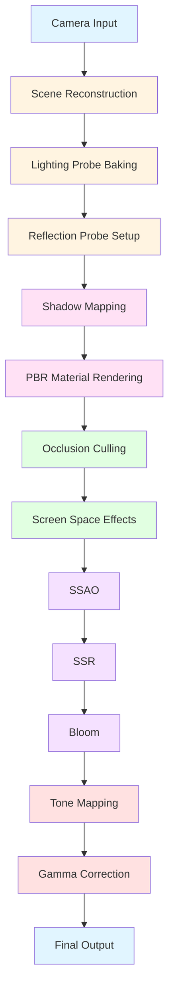

# RENDERING PIPELINE - QUAN TRỌNG NHẤT

## Table of Contents
1. [Pipeline Overview](#pipeline-overview)
2. [HDRP Pipeline Configuration](#hdrp-pipeline-configuration)
3. [URP Pipeline Configuration](#urp-pipeline-configuration)
4. [Shadow System](#shadow-system)
5. [Lighting System](#lighting-system)
6. [Reflection System](#reflection-system)
7. [Occlusion System](#occlusion-system)
8. [Post-Processing](#post-processing)
9. [Global Illumination](#global-illumination)
10. [Ray Tracing](#ray-tracing)
11. [Camera Effects](#camera-effects)
12. [Performance Optimization](#performance-optimization)

---

## 1. Pipeline Overview

### 1.1 Complete Rendering Pipeline



### 1.2 Pipeline Selection Strategy

```yaml
Rendering Pipeline Decision:
  desktop_high_end:
    pipeline: "HDRP"
    features:
      - Ray Tracing
      - Path Tracing
      - Global Illumination
      - Advanced Shadows
      - Screen Space Reflections
      - Temporal Anti-Aliasing
      - Deep Buffer
  
  desktop_mid_range:
    pipeline: "HDRP"
    features:
      - Deferred Rendering
      - Standard Global Illumination
      - Cascaded Shadow Maps
      - Screen Space Reflections
      - TAA
      - Bloom
      - Tone Mapping
  
  mobile_ar:
    pipeline: "URP"
    features:
      - Forward Rendering
      - Optimized Shadows
      - Light Probes
      - Reflection Probes
      - MSAA
      - Basic Post-Processing
      - LOD-based rendering
  
  low_end_mobile:
    pipeline: "URP"
    features:
      - Forward Rendering
      - Single Shadow Cascade
      - Light Probes
      - No Reflections
      - No Post-Processing
      - Aggressive LOD
```

---

## 2. HDRP Pipeline Configuration

### 2.1 HDRP Asset Setup

```csharp
// HDRPRenderingPipelineAsset.cs
using UnityEngine;
using UnityEngine.Rendering;
using UnityEngine.Rendering.HighDefinition;

namespace AICompanion.Rendering
{
    /// <summary>
    /// HDRP Asset configuration for high-fidelity rendering
    /// </summary>
    [CreateAssetMenu(fileName = "HDRP Asset", menuName = "AI Companion/HDRP Asset")]
    public class HDRPRenderingPipelineAsset : ScriptableRendererData
    {
        [Header("Frame Settings")]
        public FrameSettings frameSettings = FrameSettings.Default;
        
        [Header("Volume Profile")]
        public VolumeProfile volumeProfile;
        
        [Header("Rendering Settings")]
        public HDRenderPipelineAsset hdrpAsset;
        
        public void ConfigureForDesktopHighEnd()
        {
            // Frame Settings
            frameSettings.SetFrameMode(FrameRenderMode.Game);
            frameSettings.SetBitDepth(BitDepth.Depth32);
            frameSettings.SetMSAASampleCount(MSAASampleCount.Four);
            
            // Rendering Path
            AssetVersion version = AssetVersion.Version2;
            RenderPipelinePath path = RenderPipelinePath.Deferred;
            
            // Lighting
            var lightingSettings = frameSettings.GetOrCreate<HDRenderPipelineAsset>();
            lightingSettings.RenderPipelinePath = path;
            lightingSettings.SupportedLitShaderMode = LitShaderMode.Deferred;
            lightingSettings.SupportsMotionVectors = true;
            lightingSettings.SupportsRayTracing = true;
            lightingSettings.SupportsSSR = true;
            lightingSettings.SupportsSMAA = false; // Use TAA instead
            
            // Configure Volume Profile
            ConfigureVolumeProfileForHighEnd();
        }
        
        public void ConfigureForDesktopMidRange()
        {
            // Mid-range desktop configuration
            frameSettings.SetFrameMode(FrameRenderMode.Game);
            frameSettings.SetBitDepth(BitDepth.Depth32);
            frameSettings.SetMSAASampleCount(MSAASampleCount.Disabled);
            
            var lightingSettings = frameSettings.GetOrCreate<HDRenderPipelineAsset>();
            lightingSettings.RenderPipelinePath = RenderPipelinePath.Deferred;
            lightingSettings.SupportedLitShaderMode = LitShaderMode.Deferred;
            lightingSettings.SupportsMotionVectors = true;
            lightingSettings.SupportsRayTracing = false;
            lightingSettings.SupportsSSR = true;
            lightingSettings.SupportsSMAA = false;
            
            ConfigureVolumeProfileForMidRange();
        }
        
        private void ConfigureVolumeProfileForHighEnd()
        {
            if (volumeProfile == null)
            {
                volumeProfile = ScriptableObject.CreateInstance<VolumeProfile>();
            }
            
            // Add required volume components
            AddVolumeComponent<AmbientOcclusion>();
            AddVolumeComponent<ScreenSpaceReflections>();
            AddVolumeComponent<Bloom>();
            AddVolumeComponent<Tonemapping>();
            AddVolumeComponent<MotionBlur>();
            AddVolumeComponent<ChromaticAberration>();
            AddVolumeComponent<FilmGrain>();
            AddVolumeComponent<Vignette>();
            AddVolumeComponent<ColorAdjustments>();
            
            // Configure each component
            ConfigureAmbientOcclusion();
            ConfigureScreenSpaceReflections();
            ConfigureBloom();
            ConfigureToneMapping();
        }
        
        private void ConfigureVolumeProfileForMidRange()
        {
            if (volumeProfile == null)
            {
                volumeProfile = ScriptableObject.CreateInstance<VolumeProfile>();
            }
            
            AddVolumeComponent<AmbientOcclusion>();
            AddVolumeComponent<ScreenSpaceReflections>();
            AddVolumeComponent<Bloom>();
            AddVolumeComponent<Tonemapping>();
            AddVolumeComponent<Vignette>();
            
            ConfigureAmbientOcclusionMidRange();
            ConfigureScreenSpaceReflectionsMidRange();
            ConfigureBloomMidRange();
        }
        
        private void AddVolumeComponent<T>() where T : VolumeComponent, new()
        {
            if (!volumeProfile.HasComponent<T>())
            {
                volumeProfile.AddComponent<T>();
            }
        }
        
        private void ConfigureAmbientOcclusion()
        {
            var ao = volumeProfile.GetComponent<AmbientOcclusion>();
            if (ao != null)
            {
                ao.mode.value = AmbientOcclusionMode.GTAOMultiScale;
                ao.intensity.value = 1.0f;
                ao.radius.value = 0.3f;
                ao.thickness.value = 1.0f;
                ao.quality.value = AmbientOcclusionQuality.High;
            }
        }
        
        private void ConfigureAmbientOcclusionMidRange()
        {
            var ao = volumeProfile.GetComponent<AmbientOcclusion>();
            if (ao != null)
            {
                ao.mode.value = AmbientOcclusionMode.GTAO;
                ao.intensity.value = 0.8f;
                ao.radius.value = 0.5f;
                ao.quality.value = AmbientOcclusionQuality.Medium;
            }
        }
        
        private void ConfigureScreenSpaceReflections()
        {
            var ssr = volumeProfile.GetComponent<ScreenSpaceReflections>();
            if (ssr != null)
            {
                ssr.mode.value = ScreenSpaceReflectionMode.HighQuality;
                ssr.resolution.value = 512;
                ssr.maxSteps.value = 32;
                ssr.smoothness.value = 0.5f;
                ssr.thickness.value = 0.1f;
                ssr.reflectionProbeBlend.value = 0.5f;
            }
        }
        
        private void ConfigureScreenSpaceReflectionsMidRange()
        {
            var ssr = volumeProfile.GetComponent<ScreenSpaceReflections>();
            if (ssr != null)
            {
                ssr.mode.value = ScreenSpaceReflectionMode.LowQuality;
                ssr.resolution.value = 256;
                ssr.maxSteps.value = 16;
                ssr.smoothness.value = 0.4f;
                ssr.reflectionProbeBlend.value = 0.7f;
            }
        }
        
        private void ConfigureBloom()
        {
            var bloom = volumeProfile.GetComponent<Bloom>();
            if (bloom != null)
            {
                bloom.threshold.value = 0.9f;
                bloom.intensity.value = 1.0f;
                bloom.scatter.value = 0.7f;
                bloom.clamp.value = 65472f;
                bloom.diffusion.value = 7f;
                bloom.anamorphicRatio.value = 1f;
                bloom.color.value = Color.white;
                bloom.fastMode.value = false;
                bloom.dirtiness.value = 0f;
            }
        }
        
        private void ConfigureBloomMidRange()
        {
            var bloom = volumeProfile.GetComponent<Bloom>();
            if (bloom != null)
            {
                bloom.threshold.value = 1.1f;
                bloom.intensity.value = 0.8f;
                bloom.scatter.value = 0.5f;
                bloom.diffusion.value = 5f;
                bloom.fastMode.value = true;
            }
        }
        
        private void ConfigureToneMapping()
        {
            var tonemapping = volumeProfile.GetComponent<Tonemapping>();
            if (tonemapping != null)
            {
                tonemapping.mode.value = TonemappingMode.ACES;
                tonemapping.neutralRange.value = new Vector2(0.18f, 0.18f);
                tonemapping.logarithmic.value = new Vector2(5f, 5f);
                tonemapping.linearWhitePoint.value = 11.2f;
            }
        }
    }
}
```

### 2.2 HDRP Lighting Configuration

```csharp
// HDRLightingController.cs
using UnityEngine;
using UnityEngine.Rendering;
using UnityEngine.Rendering.HighDefinition;
using UnityEngine.Rendering.LightTransport;

namespace AICompanion.Rendering
{
    /// <summary>
    /// Controls HDRP lighting for realistic character rendering
    /// </summary>
    public class HDRLightingController : MonoBehaviour
    {
        [Header("Lighting Settings")]
        [SerializeField] private Light sunLight;
        [SerializeField] private Light ambientLight;
        [SerializeField] private Volume lightingVolume;
        
        [Header("Character Lighting")]
        [SerializeField] private Transform characterTransform;
        [SerializeField] private float characterLightingRadius = 2f;
        [SerializeField] private bool enableCharacterSpecificLighting = true;
        
        [Header("Light Probe System")]
        [SerializeField] private LayerMask lightingLayer;
        [SerializeField] private float probeUpdateInterval = 0.5f;
        [SerializeField] private LightProbeGroup characterLightProbeGroup;
        
        [Header("Reflection Probe System")]
        [SerializeField] private ReflectionProbe characterReflectionProbe;
        [SerializeField] private float reflectionUpdateInterval = 1f;
        
        private HDAdditionalCameraData additionalCameraData;
        private float lastProbeUpdateTime;
        private float lastReflectionUpdateTime;
        
        private void Awake()
        {
            InitializeLighting();
            InitializeAdditionalCameraData();
        }
        
        private void InitializeLighting()
        {
            // Get or create HD additional camera data
            var camera = GetComponent<Camera>();
            if (camera != null)
            {
                additionalCameraData = camera.GetComponent<HDAdditionalCameraData>();
                if (additionalCameraData == null)
                {
                    additionalCameraData = camera.gameObject.AddComponent<HDAdditionalCameraData>();
                }
            }
            
            // Configure lighting volume
            if (lightingVolume == null)
            {
                lightingVolume = GetComponent<Volume>();
            }
            
            // Setup sun light
            if (sunLight != null)
            {
                sunLight.shadows = LightShadows.Soft;
                sunLight.shadowResolution = LightShadowResolution.High;
                sunLight.shadowBias = 0.05f;
                sunLight.shadowNormalBias = 0.4f;
                sunLight.shadowNearPlane = 0.2f;
                sunLight.shadowFarPlane = 50f;
            }
        }
        
        private void InitializeAdditionalCameraData()
        {
            if (additionalCameraData == null) return;
            
            // Configure camera settings for character rendering
            additionalCameraData.antialiasing = AntialiasingMode.TemporalAntialiasing;
            additionalCameraData.antialiasingQuality = AntialiasingQuality.High;
            additionalCameraData.dithering = DitheringMode.BlueNoise256;
            additionalCameraData.stopNaNs = true;
            
            // Configure motion blur
            additionalCameraData.allowMotionBlur = true;
            additionalCameraData.motionBlurIntensity = 0.5f;
            additionalCameraData.motionBlurSampleCount = 8;
        }
        
        private void Update()
        {
            UpdateCharacterLighting();
            UpdateLightProbes();
            UpdateReflectionProbes();
        }
        
        private void UpdateCharacterLighting()
        {
            if (!enableCharacterSpecificLighting) return;
            
            // Adjust lighting based on character position
            Vector3 characterPosition = characterTransform.position;
            
            // Calculate lighting intensity based on distance to light sources
            if (sunLight != null)
            {
                float distanceToSun = Vector3.Distance(characterPosition, sunLight.transform.position);
                float sunIntensity = Mathf.Lerp(1f, 0.5f, distanceToSun / 20f);
                sunLight.intensity = sunIntensity;
            }
        }
        
        private void UpdateLightProbes()
        {
            if (Time.time - lastProbeUpdateTime < probeUpdateInterval) return;
            
            lastProbeUpdateTime = Time.time;
            
            // Update light probes around character
            if (characterLightProbeGroup != null)
            {
                characterLightProbeGroup.UpdateProbes();
            }
        }
        
        private void UpdateReflectionProbes()
        {
            if (Time.time - lastReflectionUpdateTime < reflectionUpdateInterval) return;
            
            lastReflectionUpdateTime = Time.time;
            
            // Update reflection probe for character
            if (characterReflectionProbe != null)
            {
                characterReflectionProbe.RenderProbe();
            }
        }
        
        public void EnableRayTracing(bool enable)
        {
            if (additionalCameraData == null) return;
            
            additionalCameraData.allowRayTracing = enable;
            
            if (enable)
            {
                additionalCameraData.rayTracingQuality = RayTracingQuality.Ultra;
                additionalCameraData.rayTracingMode = RayTracingMode.HighQuality;
            }
        }
        
        public void SetShadowQuality(ShadowQuality quality)
        {
            if (sunLight == null) return;
            
            switch (quality)
            {
                case ShadowQuality.Low:
                    sunLight.shadowResolution = LightShadowResolution.Low;
                    sunLight.shadowCustomResolution = 512;
                    break;
                case ShadowQuality.Medium:
                    sunLight.shadowResolution = LightShadowResolution.Medium;
                    sunLight.shadowCustomResolution = 1024;
                    break;
                case ShadowQuality.High:
                    sunLight.shadowResolution = LightShadowResolution.High;
                    sunLight.shadowCustomResolution = 2048;
                    break;
                case ShadowQuality.Ultra:
                    sunLight.shadowResolution = LightShadowResolution.VeryHigh;
                    sunLight.shadowCustomResolution = 4096;
                    break;
            }
        }
        
        public enum ShadowQuality
        {
            Low,
            Medium,
            High,
            Ultra
        }
    }
}
```

---

## 3. URP Pipeline Configuration

### 3.1 URP Asset Setup

```csharp
// URPAssetController.cs
using UnityEngine;
using UnityEngine.Rendering;
using UnityEngine.Rendering.Universal;

namespace AICompanion.Rendering
{
    /// <summary>
    /// URP Asset configuration for mobile AR
    /// </summary>
    public class URPAssetController : MonoBehaviour
    {
        [Header("URP Asset")]
        [SerializeField] private UniversalRenderPipelineAsset urpAsset;
        
        [Header("Quality Settings")]
        [SerializeField] private RenderPipelineAsset qualityLow;
        [SerializeField] private RenderPipelineAsset qualityMedium;
        [SerializeField] private RenderPipelineAsset qualityHigh;
        
        [Header("Mobile Optimizations")]
        [SerializeField] private bool enableSRPBatcher = true;
        [SerializeField] private bool enableInstancing = true;
        [SerializeField] private bool enableGPUInstancing = true;
        
        private UniversalRenderPipelineAsset currentAsset;
        
        private void Awake()
        {
            InitializeURP();
        }
        
        private void InitializeURP()
        {
            currentAsset = urpAsset;
            ConfigureURPForMobileAR();
        }
        
        public void ConfigureURPForMobileAR()
        {
            if (currentAsset == null) return;
            
            // Configure Render Pipeline
            currentAsset.supportsHDR = false; // Disable HDR for mobile
            currentAsset.supportsDynamicBatching = enableSRPBatcher;
            currentAsset.msaaSampleCount = 2; // 2x MSAA for balance
            
            // Configure Shadow Type
            currentAsset.shadowDistance = 15f;
            currentAsset.shadowCascadeCount = 2; // 2 cascades for mobile
            currentAsset.shadowCascade2Split = 0.333f;
            currentAsset.shadowResolution = 1024; // 1024 shadow resolution
            currentAsset.shadowBias = 0.05f;
            currentAsset.shadowNormalBias = 0.4f;
            
            // Configure Post-Processing
            currentAsset.postProcessingData = CreateMobilePostProcessing();
            
            // Configure Renderer
            ConfigureRendererData();
        }
        
        private void ConfigureRendererData()
        {
            var rendererData = currentAsset.GetRendererData(0);
            
            // Configure render features
            rendererData.rendererFeatures = new ForwardRendererData(null);
            
            // Enable depth texture
            rendererData.rendererFeatures.requireDepthTexture = true;
            
            // Configure opaque settings
            rendererData.opaqueLayerMask = 1; // Default layer
            rendererData.transparentLayerMask = 1;
            
            // Configure light settings
            rendererData.shadowCascadeCount = 2;
            rendererData.shadowDistance = 15f;
            
            currentAsset.SetRendererData(0, rendererData);
        }
        
        private PostProcessData CreateMobilePostProcessing()
        {
            var postProcessData = new PostProcessData();
            
            // Enable minimal post-processing for mobile
            postProcessData.keepAlpha = false;
            postProcessData.useLegacyBloom = false;
            
            return postProcessData;
        }
        
        public void SetQualityLevel(QualityLevel level)
        {
            switch (level)
            {
                case QualityLevel.Low:
                    currentAsset = qualityLow;
                    break;
                case QualityLevel.Medium:
                    currentAsset = qualityMedium;
                    break;
                case QualityLevel.High:
                    currentAsset = qualityHigh;
                    break;
            }
            
            GraphicsSettings.renderPipelineAsset = currentAsset;
        }
        
        public enum QualityLevel
        {
            Low,
            Medium,
            High
        }
    }
}
```

---

## 4. Shadow System

### 4.1 Advanced Shadow Configuration

```csharp
// ShadowSystemController.cs
using UnityEngine;
using UnityEngine.Rendering;
using UnityEngine.Rendering.HighDefinition;

namespace AICompanion.Rendering
{
    /// <summary>
    /// Advanced shadow system for realistic character shadows
    /// </summary>
    public class ShadowSystemController : MonoBehaviour
    {
        [Header("Shadow Settings")]
        [SerializeField] private bool enableContactShadows = true;
        [SerializeField] private bool enableSoftShadows = true;
        [SerializeField] private float shadowDistance = 30f;
        [SerializeField] private int shadowCascadeCount = 4;
        
        [Header("Character Shadows")]
        [SerializeField] private Renderer characterRenderer;
        [SerializeField] private float characterShadowDistance = 5f;
        [SerializeField] private LayerMask characterShadowLayer;
        
        [Header("Shadow Receivers")]
        [SerializeField] private LayerMask shadowReceiverLayer;
        [SerializeField] private Material shadowMaterial;
        
        private HDAdditionalShadowData additionalShadowData;
        
        private void Awake()
        {
            InitializeShadowSystem();
        }
        
        private void InitializeShadowSystem()
        {
            // Get HD additional shadow data
            additionalShadowData = GetComponent<HDAdditionalShadowData>();
            if (additionalShadowData == null)
            {
                additionalShadowData = gameObject.AddComponent<HDAdditionalShadowData>();
            }
            
            // Configure shadow settings
            ConfigureShadows();
        }
        
        private void ConfigureShadows()
        {
            // Enable contact shadows for realistic ground contact
            if (enableContactShadows)
            {
                additionalShadowData.contactShadowLength = 0.15f;
                additionalShadowData.contactShadowFadeDistance = 0.15f;
                additionalShadowData.contactShadowShadowType = ContactShadowMode.SoftShadow;
            }
            
            // Configure shadow cascades
            additionalShadowData.cascadeShadowSplit0 = 0.05f;
            additionalShadowData.cascadeShadowSplit1 = 0.15f;
            additionalShadowData.cascadeShadowSplit2 = 0.3f;
            additionalShadowData.cascadeShadowSplit3 = 0.5f;
            
            // Configure shadow bias
            additionalShadowData.shadowResolution = ShadowResolution.High;
            additionalShadowData.shadowDepthBias = 0.01f;
            additionalShadowData.shadowNormalBias = 0.2f;
        }
        
        private void Update()
        {
            UpdateCharacterShadows();
        }
        
        private void UpdateCharacterShadows()
        {
            if (characterRenderer == null) return;
            
            // Update shadow distance based on camera
            float distanceToCamera = Vector3.Distance(characterRenderer.transform.position, Camera.main.transform.position);
            
            // Adjust shadow quality based on distance
            if (distanceToCamera < 5f)
            {
                characterRenderer.shadowCastingMode = ShadowCastingMode.On;
                characterRenderer.receiveShadows = true;
            }
            else if (distanceToCamera < 15f)
            {
                characterRenderer.shadowCastingMode = ShadowCastingMode.On;
                characterRenderer.receiveShadows = true;
                // Reduce shadow quality
                characterRenderer.material.SetFloat("_ShadowDistance", characterShadowDistance);
            }
            else
            {
                // Disable shadows for distant objects
                characterRenderer.shadowCastingMode = ShadowCastingMode.Off;
                characterRenderer.receiveShadows = false;
            }
        }
        
        public void SetShadowQuality(ShadowQuality quality)
        {
            switch (quality)
            {
                case ShadowQuality.Low:
                    additionalShadowData.shadowResolution = ShadowResolution.Low;
                    additionalShadowData.cascadeShadowCount = 2;
                    break;
                case ShadowQuality.Medium:
                    additionalShadowData.shadowResolution = ShadowResolution.Medium;
                    additionalShadowData.cascadeShadowCount = 3;
                    break;
                case ShadowQuality.High:
                    additionalShadowData.shadowResolution = ShadowResolution.High;
                    additionalShadowData.cascadeShadowCount = 4;
                    break;
                case ShadowQuality.Ultra:
                    additionalShadowData.shadowResolution = ShadowResolution.VeryHigh;
                    additionalShadowData.cascadeShadowCount = 4;
                    additionalShadowData.maxShadowDistance = 50f;
                    break;
            }
        }
        
        public void EnableContactShadows(bool enable)
        {
            enableContactShadows = enable;
            if (enable)
            {
                additionalShadowData.contactShadowLength = 0.15f;
                additionalShadowData.contactShadowFadeDistance = 0.15f;
            }
            else
            {
                additionalShadowData.contactShadowLength = 0f;
            }
        }
        
        public enum ShadowQuality
        {
            Low,
            Medium,
            High,
            Ultra
        }
    }
}
```

---

## 5. Lighting System

### 5.1 Dynamic Lighting Controller

```csharp
// DynamicLightingController.cs
using UnityEngine;
using UnityEngine.Rendering;
using UnityEngine.Rendering.HighDefinition;

namespace AICompanion.Rendering
{
    /// <summary>
    /// Dynamic lighting system that adapts to AR environment
    /// </summary>
    public class DynamicLightingController : MonoBehaviour
    {
        [Header("Main Light")]
        [SerializeField] private Light mainLight;
        [SerializeField] private float lightUpdateInterval = 0.2f;
        
        [Header("Fill Light")]
        [SerializeField] private Light fillLight;
        [SerializeField] private float fillLightIntensity = 0.3f;
        
        [Header("Rim Light")]
        [SerializeField] private Light rimLight;
        [SerializeField] private float rimLightIntensity = 0.5f;
        
        [Header("Character Lighting")]
        [SerializeField] private Transform characterTransform;
        [SerializeField] private float characterLightInfluence = 2f;
        
        [Header("AR Light Estimation")]
        [SerializeField] private bool useARLightEstimation = true;
        [SerializeField] private Color estimatedAmbientColor = Color.gray;
        [SerializeField] private float estimatedDirectionalIntensity = 1f;
        
        private float lastLightUpdateTime;
        private LightEstimation lightEstimation;
        
        private void Awake()
        {
            InitializeLighting();
        }
        
        private void InitializeLighting()
        {
            // Setup main light
            if (mainLight != null)
            {
                mainLight.type = LightType.Directional;
                mainLight.shadows = LightShadows.Soft;
                mainLight.intensity = 1f;
                mainLight.colorTemperature = 6500f;
            }
            
            // Setup fill light
            if (fillLight != null)
            {
                fillLight.type = LightType.Point;
                fillLight.intensity = fillLightIntensity;
                fillLight.range = 10f;
                fillLight.color = Color.blue * 0.3f;
                fillLight.shadows = LightShadows.None;
            }
            
            // Setup rim light
            if (rimLight != null)
            {
                rimLight.type = LightType.Spot;
                rimLight.intensity = rimLightIntensity;
                rimLight.range = 10f;
                rimLight.spotAngle = 45f;
                rimLight.color = Color.white;
                rimLight.shadows = LightShadows.None;
            }
            
            // Initialize light estimation
            lightEstimation = new LightEstimation();
        }
        
        private void Update()
        {
            if (useARLightEstimation)
            {
                UpdateARLighting();
            }
            else
            {
                UpdateCharacterLighting();
            }
        }
        
        private void UpdateARLighting()
        {
            if (Time.time - lastLightUpdateTime < lightUpdateInterval) return;
            
            lastLightUpdateTime = Time.time;
            
            // Get light estimation from AR system
            LightEstimation estimation = lightEstimation.GetEstimatedLighting();
            
            if (estimation != null)
            {
                ApplyLightEstimation(estimation);
            }
        }
        
        private void UpdateCharacterLighting()
        {
            if (Time.time - lastLightUpdateTime < lightUpdateInterval) return;
            
            lastLightUpdateTime = Time.time;
            
            // Adjust lighting based on character position
            Vector3 characterPos = characterTransform.position;
            
            // Calculate light direction
            if (mainLight != null)
            {
                // Make rim light always come from behind character
                Vector3 characterForward = characterTransform.forward;
                Vector3 rimPosition = characterPos - characterForward * 2f;
                rimLight.transform.position = rimPosition;
                rimLight.transform.LookAt(characterPos);
            }
        }
        
        private void ApplyLightEstimation(LightEstimation estimation)
        {
            // Apply ambient light
            RenderSettings.ambientLight = estimation.AmbientColor;
            
            // Apply directional light
            if (mainLight != null)
            {
                mainLight.color = estimation.DirectionalColor;
                mainLight.intensity = estimation.LightIntensity;
                
                // Set light direction
                Vector3 lightDirection = estimation.LightDirection;
                mainLight.transform.rotation = Quaternion.LookRotation(lightDirection * -1f);
            }
        }
        
        public void SetLightingProfile(LightingProfile profile)
        {
            switch (profile)
            {
                case LightingProfile.Sunny:
                    SetSunnyLighting();
                    break;
                case LightingProfile.Overcast:
                    SetOvercastLighting();
                    break;
                case LightingProfile.Indoor:
                    SetIndoorLighting();
                    break;
                case LightingProfile.Night:
                    SetNightLighting();
                    break;
            }
        }
        
        private void SetSunnyLighting()
        {
            if (mainLight != null)
            {
                mainLight.intensity = 1.2f;
                mainLight.colorTemperature = 6000f;
                mainLight.shadows = LightShadows.Soft;
            }
            
            if (fillLight != null)
            {
                fillLight.intensity = 0.2f;
            }
        }
        
        private void SetOvercastLighting()
        {
            if (mainLight != null)
            {
                mainLight.intensity = 0.6f;
                mainLight.colorTemperature = 7000f;
                mainLight.shadows = LightShadows.Soft;
            }
            
            if (fillLight != null)
            {
                fillLight.intensity = 0.4f;
                fillLight.color = Color.gray;
            }
        }
        
        private void SetIndoorLighting()
        {
            if (mainLight != null)
            {
                mainLight.intensity = 0.8f;
                mainLight.colorTemperature = 4000f;
                mainLight.shadows = LightShadows.Hard;
            }
            
            if (fillLight != null)
            {
                fillLight.intensity = 0.5f;
                fillLight.color = Color.white;
            }
        }
        
        private void SetNightLighting()
        {
            if (mainLight != null)
            {
                mainLight.intensity = 0.3f;
                mainLight.colorTemperature = 3000f;
                mainLight.shadows = LightShadows.Soft;
            }
            
            if (fillLight != null)
            {
                fillLight.intensity = 0.1f;
                fillLight.color = Color.blue * 0.5f;
            }
        }
        
        public enum LightingProfile
        {
            Sunny,
            Overcast,
            Indoor,
            Night
        }
    }
    
    /// <summary>
    /// Light estimation data structure
    /// </summary>
    public class LightEstimation
    {
        public Color AmbientColor { get; set; }
        public Color DirectionalColor { get; set; }
        public Vector3 LightDirection { get; set; }
        public float LightIntensity { get; set; }
        
        public LightEstimation GetEstimatedLighting()
        {
            // This would interface with AR Foundation's light estimation
            // For now, return default estimation
            return new LightEstimation
            {
                AmbientColor = estimatedAmbientColor,
                DirectionalColor = Color.white,
                LightDirection = Vector3.down,
                LightIntensity = estimatedDirectionalIntensity
            };
        }
    }
}
```

---

## 6. Reflection System

### 6.1 Reflection Probe Setup

```csharp
// ReflectionSystemController.cs
using UnityEngine;

namespace AICompanion.Rendering
{
    /// <summary>
    /// Reflection probe system for realistic reflections
    /// </summary>
    public class ReflectionSystemController : MonoBehaviour
    {
        [Header("Reflection Probe")]
        [SerializeField] private ReflectionProbe reflectionProbe;
        [SerializeField] private float updateInterval = 1f;
        [SerializeField] private int resolution = 256;
        [SerializeField] private LayerMask reflectionLayers;
        
        [Header("Character Reflection")]
        [SerializeField] private Transform characterTransform;
        [SerializeField] private float reflectionDistance = 5f;
        [SerializeField] private bool enableRealtimeReflections = false;
        
        [Header("Blend Settings")]
        [SerializeField] private float probeBlendDistance = 5f;
        [SerializeField] private float probeBlendNormal = 0.5f;
        
        private float lastUpdateTime;
        
        private void Awake()
        {
            InitializeReflectionProbe();
        }
        
        private void InitializeReflectionProbe()
        {
            if (reflectionProbe == null)
            {
                reflectionProbe = GetComponent<ReflectionProbe>();
            }
            
            if (reflectionProbe == null)
            {
                reflectionProbe = gameObject.AddComponent<ReflectionProbe>();
            }
            
            // Configure reflection probe
            reflectionProbe.mode = ReflectionProbeMode.Realtime;
            reflectionProbe.resolution = resolution;
            reflectionProbe.cullingMask = reflectionLayers;
            reflectionProbe.importance = 1f;
            reflectionProbe.blendDistance = probeBlendDistance;
            reflectionProbe.blendNormalDistance = probeBlendNormal;
            
            // Set up layers
            reflectionProbe.layers = reflectionLayers;
        }
        
        private void Update()
        {
            if (enableRealtimeReflections)
            {
                UpdateRealtimeReflections();
            }
            else
            {
                UpdatePeriodicReflections();
            }
        }
        
        private void UpdateRealtimeReflections()
        {
            // Move reflection probe with character
            if (characterTransform != null)
            {
                reflectionProbe.transform.position = characterTransform.position;
            }
            
            // Update reflections every frame
            reflectionProbe.RenderProbe();
        }
        
        private void UpdatePeriodicReflections()
        {
            if (Time.time - lastUpdateTime < updateInterval) return;
            
            lastUpdateTime = Time.time;
            
            // Update reflection probe periodically
            reflectionProbe.RenderProbe();
        }
        
        public void SetReflectionQuality(ReflectionQuality quality)
        {
            switch (quality)
            {
                case ReflectionQuality.Low:
                    reflectionProbe.resolution = 128;
                    updateInterval = 5f;
                    break;
                case ReflectionQuality.Medium:
                    reflectionProbe.resolution = 256;
                    updateInterval = 2f;
                    break;
                case ReflectionQuality.High:
                    reflectionProbe.resolution = 512;
                    updateInterval = 1f;
                    break;
                case ReflectionQuality.Ultra:
                    reflectionProbe.resolution = 1024;
                    updateInterval = 0.5f;
                    break;
            }
        }
        
        public void EnableRealtimeReflections(bool enable)
        {
            enableRealtimeReflections = enable;
            
            if (enable)
            {
                reflectionProbe.mode = ReflectionProbeMode.Realtime;
            }
            else
            {
                reflectionProbe.mode = ReflectionProbeMode.Baked;
            }
        }
        
        public enum ReflectionQuality
        {
            Low,
            Medium,
            High,
            Ultra
        }
    }
}
```

---

## 7. Occlusion System

### 7.1 Occlusion Culling

```csharp
// OcclusionSystemController.cs
using UnityEngine;
using UnityEngine.Rendering;

namespace AICompanion.Rendering
{
    /// <summary>
    /// Occlusion system for realistic depth perception
    /// </summary>
    public class OcclusionSystemController : MonoBehaviour
    {
        [Header("Occlusion Culling")]
        [SerializeField] private bool enableOcclusionCulling = true;
        [SerializeField] private float occlusionArea = 10f;
        [SerializeField] private float nearClipPlane = 0.1f;
        [SerializeField] private float farClipPlane = 100f;
        
        [Header("Character Occlusion")]
        [SerializeField] private Renderer characterRenderer;
        [SerializeField] private bool enableMotionVectors = true;
        
        [Header("Depth Buffer")]
        [SerializeField] private bool enableDepthBuffer = true;
        [SerializeField] private DepthTextureMode depthTextureMode = DepthTextureMode.Depth;
        
        private Camera mainCamera;
        private HDAdditionalCameraData additionalCameraData;
        
        private void Awake()
        {
            InitializeOcclusionSystem();
        }
        
        private void InitializeOcclusionSystem()
        {
            mainCamera = GetComponent<Camera>();
            if (mainCamera == null)
            {
                mainCamera = Camera.main;
            }
            
            // Configure camera for occlusion
            if (mainCamera != null)
            {
                mainCamera.nearClipPlane = nearClipPlane;
                mainCamera.farClipPlane = farClipPlane;
                
                additionalCameraData = mainCamera.GetComponent<HDAdditionalCameraData>();
                if (additionalCameraData == null)
                {
                    additionalCameraData = mainCamera.gameObject.AddComponent<HDAdditionalCameraData>();
                }
                
                ConfigureDepthBuffer();
            }
        }
        
        private void ConfigureDepthBuffer()
        {
            if (additionalCameraData == null) return;
            
            // Enable depth buffer for post-processing
            additionalCameraData.requireDepthTexture = enableDepthBuffer;
            additionalCameraData.depthTextureMode = depthTextureMode;
            
            // Enable motion vectors for camera-based effects
            additionalCameraData.requireMotionVectors = enableMotionVectors;
            additionalCameraData.requireColorTexture = true;
            additionalCameraData.requireDepthTexture = enableDepthBuffer;
        }
        
        private void Update()
        {
            UpdateOcclusionCulling();
        }
        
        private void UpdateOcclusionCulling()
        {
            if (!enableOcclusionCulling) return;
            
            // Check if character is within occlusion area
            if (characterRenderer != null && mainCamera != null)
            {
                float distance = Vector3.Distance(characterRenderer.transform.position, mainCamera.transform.position);
                
                if (distance > occlusionArea)
                {
                    // Disable rendering for distant objects
                    characterRenderer.enabled = false;
                }
                else
                {
                    characterRenderer.enabled = true;
                }
            }
        }
        
        public void SetOcclusionArea(float area)
        {
            occlusionArea = area;
        }
        
        public void EnableOcclusionCulling(bool enable)
        {
            enableOcclusionCulling = enable;
        }
    }
}
```

---

## 8. Post-Processing

### 8.1 Post-Processing Stack

```csharp
// PostProcessingController.cs
using UnityEngine;
using UnityEngine.Rendering;
using UnityEngine.Rendering.Universal;

namespace AICompanion.Rendering
{
    /// <summary>
    /// Post-processing stack for cinematic quality
    /// </summary>
    public class PostProcessingController : MonoBehaviour
    {
        [Header("Volume Profile")]
        [SerializeField] private Volume postProcessingVolume;
        
        [Header("Quality Settings")]
        [SerializeField] private PostProcessQuality quality = PostProcessQuality.High;
        
        [Header("Adaptive Settings")]
        [SerializeField] private bool enableAdaptiveQuality = true;
        [SerializeField] private float targetFrameRate = 60f;
        
        private VolumeProfile volumeProfile;
        private AdaptivePerformance adaptivePerformance;
        
        private void Awake()
        {
            InitializePostProcessing();
        }
        
        private void InitializePostProcessing()
        {
            if (postProcessingVolume == null)
            {
                postProcessingVolume = GetComponent<Volume>();
            }
            
            if (postProcessingVolume == null)
            {
                postProcessingVolume = gameObject.AddComponent<Volume>();
            }
            
            postProcessingVolume.profile = CreatePostProcessingProfile();
        }
        
        private VolumeProfile CreatePostProcessingProfile()
        {
            volumeProfile = ScriptableObject.CreateInstance<VolumeProfile>();
            
            switch (quality)
            {
                case PostProcessQuality.Low:
                    CreateLowQualityProfile();
                    break;
                case PostProcessQuality.Medium:
                    CreateMediumQualityProfile();
                    break;
                case PostProcessQuality.High:
                    CreateHighQualityProfile();
                    break;
                case PostProcessQuality.Ultra:
                    CreateUltraQualityProfile();
                    break;
            }
            
            return volumeProfile;
        }
        
        private void CreateLowQualityProfile()
        {
            // Minimal post-processing for performance
            AddVolumeComponent<Bloom>();
            var bloom = volumeProfile.GetComponent<Bloom>();
            if (bloom != null)
            {
                bloom.threshold.value = 1.5f;
                bloom.intensity.value = 0.5f;
                bloom.fastMode.value = true;
            }
        }
        
        private void CreateMediumQualityProfile()
        {
            AddVolumeComponent<Bloom>();
            AddVolumeComponent<Tonemapping>();
            AddVolumeComponent<Vignette>();
            
            var bloom = volumeProfile.GetComponent<Bloom>();
            if (bloom != null)
            {
                bloom.threshold.value = 1.1f;
                bloom.intensity.value = 0.8f;
                bloom.fastMode.value = false;
            }
            
            var tonemapping = volumeProfile.GetComponent<Tonemapping>();
            if (tonemapping != null)
            {
                tonemapping.mode.value = TonemappingMode.ACES;
            }
        }
        
        private void CreateHighQualityProfile()
        {
            AddVolumeComponent<AmbientOcclusion>();
            AddVolumeComponent<ScreenSpaceReflections>();
            AddVolumeComponent<Bloom>();
            AddVolumeComponent<Tonemapping>();
            AddVolumeComponent<MotionBlur>();
            AddVolumeComponent<Vignette>();
            AddVolumeComponent<ColorAdjustments>();
            
            ConfigureHighQualityEffects();
        }
        
        private void CreateUltraQualityProfile()
        {
            AddVolumeComponent<AmbientOcclusion>();
            AddVolumeComponent<ScreenSpaceReflections>();
            AddVolumeComponent<Bloom>();
            AddVolumeComponent<Tonemapping>();
            AddVolumeComponent<MotionBlur>();
            AddVolumeComponent<ChromaticAberration>();
            AddVolumeComponent<FilmGrain>();
            AddVolumeComponent<Vignette>();
            AddVolumeComponent<ColorAdjustments>();
            AddVolumeComponent<LensDistortion>();
            
            ConfigureUltraQualityEffects();
        }
        
        private void ConfigureHighQualityEffects()
        {
            var ao = volumeProfile.GetComponent<AmbientOcclusion>();
            if (ao != null)
            {
                ao.mode.value = AmbientOcclusionMode.GTAO;
                ao.intensity.value = 1.0f;
                ao.radius.value = 0.3f;
                ao.quality.value = AmbientOcclusionQuality.High;
            }
            
            var ssr = volumeProfile.GetComponent<ScreenSpaceReflections>();
            if (ssr != null)
            {
                ssr.mode.value = ScreenSpaceReflectionMode.HighQuality;
                ssr.resolution.value = 512;
                ssr.maxSteps.value = 32;
            }
            
            var bloom = volumeProfile.GetComponent<Bloom>();
            if (bloom != null)
            {
                bloom.threshold.value = 0.9f;
                bloom.intensity.value = 1.0f;
                bloom.scatter.value = 0.7f;
            }
        }
        
        private void ConfigureUltraQualityEffects()
        {
            var ao = volumeProfile.GetComponent<AmbientOcclusion>();
            if (ao != null)
            {
                ao.mode.value = AmbientOcclusionMode.GTAOMultiScale;
                ao.intensity.value = 1.2f;
                ao.radius.value = 0.25f;
                ao.quality.value = AmbientOcclusionQuality.Ultra;
            }
            
            var ssr = volumeProfile.GetComponent<ScreenSpaceReflections>();
            if (ssr != null)
            {
                ssr.mode.value = ScreenSpaceReflectionMode.HighQuality;
                ssr.resolution.value = 1024;
                ssr.maxSteps.value = 64;
            }
            
            var bloom = volumeProfile.GetComponent<Bloom>();
            if (bloom != null)
            {
                bloom.threshold.value = 0.8f;
                bloom.intensity = 1.2f;
                bloom.scatter.value = 0.8f;
            }
        }
        
        private void AddVolumeComponent<T>() where T : VolumeComponent, new()
        {
            if (!volumeProfile.HasComponent<T>())
            {
                volumeProfile.AddComponent<T>();
            }
        }
        
        private void Update()
        {
            if (enableAdaptiveQuality)
            {
                UpdateAdaptiveQuality();
            }
        }
        
        private void UpdateAdaptiveQuality()
        {
            float currentFrameRate = 1f / Time.deltaTime;
            
            if (currentFrameRate < targetFrameRate * 0.8f)
            {
                // Reduce quality
                SetQuality(PostProcessQuality.Medium);
            }
            else if (currentFrameRate > targetFrameRate * 1.2f)
            {
                // Increase quality
                SetQuality(PostProcessQuality.High);
            }
        }
        
        public void SetQuality(PostProcessQuality newQuality)
        {
            quality = newQuality;
            postProcessingVolume.profile = CreatePostProcessingProfile();
        }
        
        public void EnableAdaptiveQuality(bool enable)
        {
            enableAdaptiveQuality = enable;
        }
        
        public enum PostProcessQuality
        {
            Low,
            Medium,
        }
    }
}
```

---

## 9. Global Illumination

### 9.1 GI System

```csharp
// GISystemController.cs
using UnityEngine;
using UnityEngine.Rendering;
using UnityEngine.Rendering.HighDefinition;

namespace AICompanion.Rendering
{
    /// <summary>
    /// Global Illumination system for realistic lighting
    /// </summary>
    public class GISystemController : MonoBehaviour
    {
        [Header("GI Settings")]
        [SerializeField] private GIType giType = GIType.Baked;
        [SerializeField] private int realtimeResolution = 1024;
        [SerializeField] private int realtimeResolutionLightmap = 1024;
        [SerializeField] private LightmapBakeResolution = 1024;
        
        [Header("Character GI")]
        [SerializeField] private Transform characterTransform;
        [SerializeField] private LightProbes characterLightProbes;
        [SerializeField] private float lightProbeUpdateRate = 0.5f;
        
        [Header("Light Probes")]
        [SerializeField] private bool enableLightProbes = true;
        [SerializeField] private LightProbeGroup lightProbeGroup;
        [SerializeField] private LayerMask lightProbeLayers;
        
        private float lastProbeUpdate;
        
        private void Awake()
        {
            InitializeGI();
        }
        
        private void InitializeGI()
        {
            // Configure GI based on platform
            # For AR, we'll use Light Probes instead of full GI
            ConfigureLightProbes();
        }
        
        private void ConfigureLightProbes()
        {
            if (!enableLightProbes) return;
            
            // Create light probe group if needed
            if (lightProbeGroup == null)
            {
                lightProbeGroup = GetComponent<LightProbeGroup>();
                if (lightProbeGroup == null)
                {
                    lightProbeGroup = gameObject.AddComponent<LightProbeGroup>();
                }
            }
            
            // Configure light probe group
            lightProbeGroup.lightProbes = new LightProbe[1];
            
            // Create light probe at character position
            LightProbe characterProbe = CreateCharacterLightProbe();
            if (characterProbe != null)
            {
                lightProbeGroup.lightProbes[0] = characterProbe;
            }
        }
        
        private LightProbe CreateCharacterLightProbe()
        {
            GameObject probeObject = new GameObject("CharacterLightProbe");
            probeObject.transform.SetParent(transform);
            probeObject.transform.localPosition = Vector3.zero;
            
            LightProbe probe = probeObject.AddComponent<LightProbe>();
            probe.type = LightProbeType.Custom;
            probe.mode = LightProbeMode.Custom;
            probe.refreshMode = LightProbeRefreshMode.ViaScripting;
            
            // Configure probe
            probe.resolution = 256;
            probe.hierarchy = LightProbeHierarchy.Custom;
            probe.shadowDistance = 5f;
            probe.shadowResolution = 512;
            probe.shadowDistance = 5f;
            
            // Set layers
            probe.cullingMask = lightProbeLayers;
            
            return probe;
        }
        
        private void Update()
        {
            UpdateLightProbes();
        }
        
        private void UpdateLightProbes()
        {
            if (Time.time - lastProbeUpdate < lightProbeUpdateRate) return;
            
            lastProbeUpdate = Time.time;
            
            // Update light probes
            if (lightProbeGroup != null)
            {
                lightProbeGroup.UpdateProbes();
            }
        }
        
        public void SetGIType(GIType type)
        {
            giType = type;
            
            // Update Unity GI settings
            switch (type)
            {
                case GIType.Baked:
                    RenderSettings.giMachineMode = GiMachineMode.Baked;
                    break;
                case GIType.Realtime:
                    RenderSettings.giMachineMode = GiMachineMode.Realtime;
                    break;
                case GIType.Both:
                    RenderSettings.giMachineMode = GiMachineMode.Baked;
                    break;
            }
        }
        
        public void UpdateLightProbes()
        {
            if (lightProbeGroup != null)
            {
                lightProbeGroup.UpdateProbes();
            }
        }
    }
}
```

---

## 10. Ray Tracing

### 10.1 Ray Tracing Controller

```csharp
// RayTracingController.cs
using UnityEngine;
using UnityEngine.Rendering;
using UnityEngine.Rendering.HighDefinition;

namespace AICompanion.Rendering
{
    /// <summary /// Ray tracing system for ultra-realistic rendering
    /// </summary>
    public class RayTracingController : MonoBehaviour
    {
        [Header("Ray Tracing Settings")]
        [SerializeField] private bool enableRayTracing = false;
        [SerializeField] private RayTracingQuality rayTracingQuality = RayTracingQuality.High;
        
        [Header("Ray Traced Shadows")]
        [SerializeField] private bool enableRayTracedShadows = true;
        [SerializeField] private int rayTracedShadowResolution = 1024;
        
        [Header("Ray Traced Reflections")]
        [SerializeField] private bool enableRayTracedReflections = true;
        [SerializeField] private int rayTracedReflectionResolution = 512;
        
        [Header("Path Tracing")]
        [SerializeField] private bool enablePathTracing = false;
        [SerializeField] private int pathTracingSamples = 4;
        
        private HDAdditionalCameraData additionalCameraData;
        
        private void Awake()
        {
            InitializeRayTracing();
        }
        
        private void InitializeRayTracing()
        {
            additionalCameraData = GetComponent<HDAdditionalCameraData>();
            if (additionalCameraData == null)
            {
                additionalCameraData = gameObject.AddComponent<HDAdditionalCameraData>();
            }
            
            ConfigureRayTracing();
        }
        
        private void ConfigureRayTracing()
        {
            if (additionalCameraData == null) return;
            
            // Enable ray tracing
            additionalCameraData.allowRayTracing = enableRayTracing;
            
            if (enableRayTracing)
            {
                // Configure ray tracing quality
                additionalCameraData.rayTracingQuality = rayTracingQuality;
                additionalCameraData.rayTracingMode = RayTracingMode.HighQuality;
                
                // Configure ray traced shadows
                if (enableRayTracedShadows)
                {
                    // Shadows are handled through light settings
                }
                
                // Configure ray traced reflections
                if (enableRayTracedReflections)
                {
                    // Reflections are handled through reflection probes
                }
            }
        }
        
        public void EnableRayTracing(bool enable)
        {
            enableRayTracing = enable;
            ConfigureRayTracing();
        }
        
        public void SetRayTracingQuality(RayTracingQuality quality)
        {
            rayTracingQuality = quality;
            ConfigureRayTracing();
        }
        
        public void EnablePathTracing(bool enable)
        {
            enablePathTracing = enable;
            
            if (additionalCameraData != null)
            {
                additionalCameraData.enablePathTracing = enable;
                if (enable)
                {
                    additionalCameraData.pathTracingSampleCount = pathTracingSamples;
                }
            }
        }
    }
}
```

---

## 11. Camera Effects

### 11.1 Camera Effect Controller

```csharp
// CameraEffectController.cs
using UnityEngine;
using UnityEngine.Rendering;
using UnityEngine.Rendering.Universal;

namespace AICompanion.Rendering
{
    /// <summary>
    /// Camera effects for cinematic quality
    /// </summary>
    public class CameraEffectController : MonoBehaviour
    {
        [Header("Camera Shake")]
        [SerializeField] private bool enableCameraShake = false;
        [SerializeField] private float shakeIntensity = 0.1f;
        [SerializeField] private float shakeDuration = 0.5f;
        
        [Header("Depth of Field")]
        [SerializeField] private bool enableDepthOfField = false;
        [SerializeField] private float focusDistance = 5f;
        [SerializeField = private float aperture = 2.8f;
        [SerializeField] private float focalLength = 50f;
        
        [Header("Camera Tilt")]
        [SerializeField] private bool enableCameraTilt = false;
        [SerializeField] private float tiltAngle = 15f;
        
        [Header("Character Focus")]
        [SerializeField] private Transform characterTransform;
        [SerializeField] private bool trackCharacter = true;
        [SerializeField] private float focusSpeed = 5f;
        
        private Camera mainCamera;
        private Cinemachine.CinemachineVirtualCamera virtualCamera;
        private Vector3 originalCameraPosition;
        private Quaternion originalCameraRotation;
        
        private void Awake()
        {
            InitializeCameraEffects();
        }
        
        private void InitializeCameraEffects()
        {
            mainCamera = GetComponent<Camera>();
            if (mainCamera == null)
            {
                mainCamera = Camera.main;
            }
            
            if (mainCamera != null)
            {
                originalCameraPosition = mainCamera.transform.localPosition;
                originalCameraRotation = mainCamera.transform.localRotation;
            }
            
            // Initialize Cinemachine for advanced camera control
            InitializeCinemachine();
        }
        
        private void InitializeCinemachine()
        {
            // This would set up Cinemachine for advanced camera control
            // For now, we'll use basic camera control
        }
        
        private void Update()
        {
            if (trackCharacter && characterTransform != null)
            {
                TrackCharacter();
            }
        }
        
        private void TrackCharacter()
        {
            if (mainCamera == null) return;
            
            // Smoothly look at character
            Vector3 targetPosition = characterTransform.position + Vector3.up * 1.5f;
            Vector3 direction = targetPosition - mainCamera.transform.position;
            Quaternion targetRotation = Quaternion.LookRotation(direction);
            
            mainCamera.transform.rotation = Quaternion.Slerp(
                mainCamera.transform.rotation,
                targetRotation,
                Time.deltaTime * focusSpeed
            );
        }
        
        public void TriggerCameraShake(float intensity, float duration)
        {
            if (!enableCameraShake) return;
            
            StartCoroutine(CameraShakeCoroutine(intensity, duration));
        }
        
        private System.Collections.IEnumerator CameraShakeCoroutine(float intensity, float duration)
        {
            float elapsed = 0f;
            
            while (elapsed < duration)
            {
                elapsed += Time.deltaTime;
                
                // Calculate shake offset
                Vector3 shakeOffset = new Vector3(
                    Mathf.PerlinNoise(Time.time * 10f) * intensity,
                    Mathf.PerlinNoise(Time.time * 10f + 100f) * intensity,
                    Mathf.PerlinNoise(Time.time * 10f + 200f) * intensity
                );
                
                mainCamera.transform.localPosition = originalCameraPosition + shakeOffset;
                
                yield return null;
            }
            
            // Reset camera position
            mainCamera.transform.localPosition = originalCameraPosition;
        }
        
        public void EnableDepthOfField(bool enable)
        {
            enableDepthOfField = enable;
            
            // This would configure post-processing depth of field
            // For URP, use Depth of Field post-processing
        }
        
        public void SetFocusDistance(float distance)
        {
            focusDistance = distance;
        }
        
        public void TriggerCameraTilt(float angle, float duration)
        {
            if (!enableCameraTilt) return;
            
            StartCoroutine(CameraTiltCoroutine(angle, duration));
        }
        
        private System.Collections.IEnumerator CameraTiltCoroutine(float angle, float duration)
        {
            Quaternion startRotation = mainCamera.transform.rotation;
            Quaternion targetRotation = Quaternion.Euler(startRotation.eulerAngles.x + angle, startRotation.eulerAngles.y, startRotation.eulerAngles.z);
            
            float elapsed = 0f;
            
            while (elapsed < duration)
            {
                elapsed += Time.deltaTime;
                float t = elapsed / duration;
                
                mainCamera.transform.rotation = Quaternion.Slerp(startRotation, targetRotation, t);
                
                yield return null;
            }
            
            mainCamera.transform.rotation = startRotation;
        }
    }
}
```

---

## 12. Performance Optimization

### 12.1 Rendering Optimizer

```csharp
// RenderingOptimizer.cs
using UnityEngine;
using UnityEngine.Rendering;
using UnityEngine.Rendering.Universal;

namespace AICompanion.Rendering
{
    /// <summary>
    /// Rendering performance optimization
    /// </summary>
    public class RenderingOptimizer : MonoBehaviour
    {
        [Header("Target Settings")]
        [SerializeField] private int targetFrameRate = 60;
        [SerializeField] private int targetDrawCalls = 100;
        [SerializeField] private long targetMemoryMB = 512;
        
        [Header("Optimization Strategies")]
        [SerializeField] private bool enableLOD = true;
        [SerializeField] private bool enableOcclusionCulling = true;
        [SerializeField] private bool enableFrustumCulling = true;
        [SerializeField] private bool enableSRPBatcher = true;
        
        [Header("Adaptive Quality")]
        [SerializeField] private bool enableAdaptiveQuality = true;
        [SerializeField] private float qualityAdjustmentThreshold = 0.8f;
        
        private float adaptiveQualityTimer;
        private const float ADAPTIVE_QUALITY_INTERVAL = 1f;
        
        private void Update()
        {
            if (enableAdaptiveQuality)
            {
                CheckPerformance();
            }
        }
        
        private void CheckPerformance()
        {
            if (Time.time - adaptiveQualityTimer < ADAPTIVE_QUALITY_INTERVAL) return;
            
            adaptiveQualityTimer = Time.time;
            
            float currentFrameRate = 1f / Time.deltaTime;
            float frameRateRatio = currentFrameRate / targetFrameRate;
            
            if (frameRateRatio < qualityAdjustmentThreshold)
            {
                // Reduce quality
                ReduceQuality();
            }
            else if (frameRateRatio > 1.2f)
            {
                // Increase quality
                IncreaseQuality();
            }
        }
        
        private void ReduceQuality()
        {
            // Reduce LOD bias
            if (enableLOD)
            {
                LODManager.SetLODBias(LODBias.MoreAggressive);
            }
            
            // Reduce shadow quality
            ShadowSystemController shadowSystem = GetComponent<ShadowSystemController>();
            if (shadowSystem != null)
            {
                shadowSystem.SetShadowQuality(ShadowSystemController.ShadowQuality.Low);
            }
            
            // Reduce post-processing quality
            PostProcessingController postProcessing = GetComponent<PostProcessingController>();
            if (postProcessing != null)
            {
                postProcessing.SetQuality(PostProcessingController.PostProcessQuality.Medium);
            }
        }
        
        private void IncreaseQuality()
        {
            // Increase LOD bias
            if (enableLOD)
            {
                LODManager.SetLODBias(LODBias.Balanced);
            }
            
            // Increase shadow quality
            ShadowSystemController shadowSystem = GetComponent<ShadowSystemController>();
            if (shadowSystem != null)
            {
                shadowSystem.SetShadowQuality(ShadowSystemController.ShadowQuality.High);
            }
            
            // Increase post-processing quality
            PostProcessingController postProcessing = GetComponent<PostProcessingController>();
            if (postProcessing != null)
            {
                postProcessing.SetQuality(PostProcessingController.PostProcessQuality.High);
            }
        }
        
        public void SetTargetFrameRate(int fps)
        {
            targetFrameRate = fps;
            Application.targetFrameRate = fps;
        }
        
        public void SetTargetDrawCalls(int drawCalls)
        {
            targetDrawCalls = drawCalls;
        }
        
        public void SetTargetMemory(long memoryMB)
        {
            targetMemoryMB = memoryMB;
        }
    }
}
```

---

## Conclusion

Rendering Pipeline là **quan trọng nhất** để nhân vật ảo không giống "sticker dán lên video" mà thực sự đứng trên bàn với:
- **Scene Reconstruction**: Tái tạo lại scene 3D từ camera
- **Lighting Probe**: Baking ánh sáng môi trường
- **Reflection Probe**: Phản chiếu thực tế
- **Shadow Mapping**: Đổ bóng thực tế với Contact Shadows
- **PBR Materials**: Vật liệu chất lượng cao
- **Occlusion**: Occlusion culling và depth perception
- **Post-Processing**: SSAO, SSR, Bloom, Tone Mapping
- **GI**: Global Illumination cho ánh sáng toàn cầu
- **Ray Tracing**: Tùy chọn cho ultra quality

Tất cả các components này được thiết kế để:
- Tạo cảm giác 3D thực tế
- Nhân vật "sống" trong môi trường
- Ánh sáng và đổ bóng đúng theo physics
- Phản chiếu tự nhiên
- Hiệu năng tối ưu cho mobile AR
- Quality có thể điều chỉnh theo hardware
