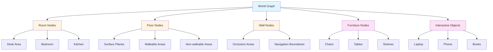
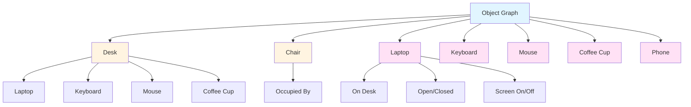

# WORLD SIMULATION

## Table of Contents
1. [World Graph System](#world-graph-system)
2. [Object Graph System](#object-graph-system)
3. [Navigation System](#navigation-system)
4. [Environment Understanding](#environment-understanding)
5. [Spatial Awareness](#spatial-awareness)
6. [Physics Integration](#physics-integration)

---

## 1. World Graph System

### 1.1 World Graph Architecture



### 1.2 World Graph Implementation

```csharp
// WorldGraphSystem.cs
using UnityEngine;
using System.Collections.Generic;
using AICompanion.World;

namespace AICompanion.World
{
    /// <summary>
    /// World graph - Hierarchical representation of the environment
    /// </summary>
    public class WorldGraphSystem : MonoBehaviour
    {
        [Header("World Graph Structure")]
        [SerializeField] private WorldNode rootNode;
        [SerializeField] private float graphUpdateInterval = 0.5f;
        
        [Header("Node Types")]
        [SerializeField] private List<RoomNode> roomNodes;
        [SerializeField] private List<FloorNode> floorNodes;
        [SerializeField] private List<WallNode> wallNodes;
        [SerializeField] private List<FurnitureNode> furnitureNodes;
        [SerializeField] private List<InteractiveObjectNode> interactiveObjects;
        
        [Header("Integration")]
        [SerializeField] private ARPlaneManager arPlaneManager;
        [SerializeField] private ARAnchorManager arAnchorManager;
        
        private Dictionary<string, WorldNode> nodeLookup;
        private float lastUpdateTime;
        
        private void Awake()
        {
            InitializeWorldGraph();
        }
        
        private void InitializeWorldGraph()
        {
            nodeLookup = new Dictionary<string, WorldNode>();
            
            // Create root node
            rootNode = new WorldNode
            {
                id = "world_root",
                type = NodeType.Root,
                position = Vector3.zero,
                bounds = new Bounds(Vector3.zero, Vector3.one * 100f)
            };
            
            nodeLookup[rootNode.id] = rootNode;
        }
        
        private void Update()
        {
            if (Time.time - lastUpdateTime < graphUpdateInterval) return;
            
            lastUpdateTime = Time.time;
            
            UpdateWorldGraph();
        }
        
        private void UpdateWorldGraph()
        {
            // Update room nodes
            UpdateRoomNodes();
            
            // Update floor nodes
            UpdateFloorNodes();
            
            // Update furniture nodes
            UpdateFurnitureNodes();
            
            // Update interactive objects
            UpdateInteractiveObjects();
            
            // Update relationships
            UpdateNodeRelationships();
        }
        
        private void UpdateRoomNodes()
        {
            // Update room nodes based on AR plane detection
            if (arPlaneManager != null)
            {
                foreach (var plane in arPlaneManager.trackables)
                {
                    string roomId = $"room_{plane.trackableId}";
                    
                    if (!nodeLookup.ContainsKey(roomId))
                    {
                        RoomNode roomNode = new RoomNode
                        {
                            id = roomId,
                            type = NodeType.Room,
                            position = plane.center,
                            bounds = new Bounds(plane.center, plane.size),
                            roomType = DetermineRoomType(plane)
                        };
                        
                        nodeLookup[roomId] = roomNode;
                        roomNodes.Add(roomNode);
                    }
                }
            }
        }
        
        private void UpdateFloorNodes()
        {
            // Update floor nodes for walkable areas
            foreach (var roomNode in roomNodes)
            {
                string floorId = $"floor_{roomNode.id}";
                
                if (!nodeLookup.ContainsKey(floorId))
                {
                    FloorNode floorNode = new FloorNode
                    {
                        id = floorId,
                        type = NodeType.Floor,
                        position = roomNode.position,
                        bounds = roomNode.bounds,
                        walkable = true,
                        surfaceType = SurfaceType.Wood
                    };
                    
                    nodeLookup[floorId] = floorNode;
                    floorNodes.Add(floorNode);
                }
            }
        }
        
        private void UpdateFurnitureNodes()
        {
            // Update furniture nodes from object detection
            // This would interface with Vision Service
        }
        
        private void UpdateInteractiveObjects()
        {
            // Update interactive objects
            // This would interface with Vision Service
        }
        
        private void UpdateNodeRelationships()
        {
            // Update spatial relationships between nodes
            foreach (var node in nodeLookup.Values)
            {
                node.neighbors = FindNeighbors(node);
            }
        }
        
        private List<WorldNode> FindNeighbors(WorldNode node)
        {
            List<WorldNode> neighbors = new List<WorldNode>();
            
            foreach (var otherNode in nodeLookup.Values)
            {
                if (otherNode == node) continue;
                
                float distance = Vector3.Distance(node.position, otherNode.position);
                
                if (distance < 5f) // Neighbor threshold
                {
                    neighbors.Add(otherNode);
                }
            }
            
            return neighbors;
        }
        
        private RoomType DetermineRoomType(ARPlane plane)
        {
            // Determine room type based on plane characteristics
            // This would use object detection and pattern recognition
            return RoomType.Office;
        }
        
        public WorldNode GetNode(string nodeId)
        {
            return nodeLookup.TryGetValue(nodeId, out WorldNode node) ? node : null;
        }
        
        public List<WorldNode> GetNodesOfType(NodeType type)
        {
            List<WorldNode> nodes = new List<WorldNode>();
            
            foreach (var node in nodeLookup.Values)
            {
                if (node.type == type)
                {
                    nodes.Add(node);
                }
            }
            
            return nodes;
        }
        
        public WorldNode FindNearestNode(Vector3 position, NodeType type)
        {
            WorldNode nearestNode = null;
            float nearestDistance = float.MaxValue;
            
            foreach (var node in nodeLookup.Values)
            {
                if (node.type != type) continue;
                
                float distance = Vector3.Distance(position, node.position);
                
                if (distance < nearestDistance)
                {
                    nearestDistance = distance;
                    nearestNode = node;
                }
            }
            
            return nearestNode;
        }
    }
    
    /// <summary>
    /// World node base class
    /// </summary>
    public class WorldNode
    {
        public string id;
        public NodeType type;
        public Vector3 position;
        public Bounds bounds;
        public List<WorldNode> neighbors;
        public Dictionary<string, object> properties;
    }
    
    /// <summary>
    /// Room node
    /// </summary>
    public class RoomNode : WorldNode
    {
        public RoomType roomType;
        public float height;
        public List<FurnitureNode> furniture;
        public List<InteractiveObjectNode> objects;
    }
    
    /// <summary>
    /// Floor node
    /// </summary>
    public class FloorNode : WorldNode
    {
        public bool walkable;
        public SurfaceType surfaceType;
        public float friction;
        public NavMeshBuildFlags navMeshFlags;
    }
    
    /// <summary>
    /// Wall node
    /// </summary>
    public class WallNode : WorldNode
    {
        public bool occluder;
        public float height;
        public Material wallMaterial;
    }
    
    /// <summary>
    /// Furniture node
    /// </summary>
    public class FurnitureNode : WorldNode
    {
        public FurnitureType furnitureType;
        public bool standable;
        public bool climbable;
        public List<InteractivePoint> interactivePoints;
    }
    
    /// <summary>
    /// Interactive object node
    /// </summary>
    public class InteractiveObjectNode : WorldNode
    {
        public ObjectType objectType;
        public bool interactable;
        public InteractionType[] availableInteractions;
        public Dictionary<string, object> objectState;
    }
    
    // Enums
    public enum NodeType { Root, Room, Floor, Wall, Furniture, Object }
    public enum RoomType { Office, Bedroom, Kitchen, LivingRoom, Bathroom, Unknown }
    public enum SurfaceType { Wood, Tile, Carpet, Concrete, Glass }
    public enum FurnitureType { Desk, Chair, Table, Bed, Shelf, Cabinet }
    public enum ObjectType { Laptop, Phone, Book, Cup, Remote, Keys }
    public enum InteractionType { Use, Pickup, Place, Open, Close, Interact }
    
    public class InteractivePoint
    {
        public Vector3 position;
        public Quaternion rotation;
        public InteractionType interactionType;
    }
}
```

---

## 2. Object Graph System

### 2.1 Object Graph Architecture



### 2.2 Object Graph Implementation

```csharp
// ObjectGraphSystem.cs
using UnityEngine;
using System.Collections.Generic;
using AICompanion.World;

namespace AICompanion.World
{
    /// <summary>
    /// Object graph - Represents objects and their relationships
    /// </summary>
    public class ObjectGraphSystem : MonoBehaviour
    {
        [Header("Object Graph Structure")]
        [SerializeField] private ObjectNode rootNode;
        [SerializeField] private float graphUpdateInterval = 0.3f;
        
        [Header("Object Categories")]
        [SerializeField] private List<FurnitureObject> furnitureObjects;
        [SerializeField] private List<ElectronicObject> electronicObjects;
        [SerializeField] private List<SmallObject> smallObjects;
        
        [Header("Integration")]
        [SerializeField] private WorldGraphSystem worldGraph;
        [SerializeField] private ObjectDetectionService objectDetection;
        
        private Dictionary<string, ObjectNode> objectLookup;
        private float lastUpdateTime;
        
        private void Awake()
        {
            InitializeObjectGraph();
        }
        
        private void InitializeObjectGraph()
        {
            objectLookup = new Dictionary<string, ObjectNode>();
            
            // Create root node
            rootNode = new ObjectNode
            {
                id = "objects_root",
                type = ObjectTypeContainer.Root,
                position = Vector3.zero
            };
            
            objectLookup[rootNode.id] = rootNode;
        }
        
        private void Update()
        {
            if (Time.time - lastUpdateTime < graphUpdateInterval) return;
            
            lastUpdateTime = Time.time;
            
            UpdateObjectGraph();
        }
        
        private void UpdateObjectGraph()
        {
            // Detect objects from computer vision
            List<DetectedObject> detectedObjects = objectDetection.DetectObjects();
            
            // Update object nodes
            foreach (var detected in detectedObjects)
            {
                UpdateObjectNode(detected);
            }
            
            // Update object relationships
            UpdateObjectRelationships();
        }
        
        private void UpdateObjectNode(DetectedObject detected)
        {
            string objectId = $"object_{detected.type}_{detected.position.GetHashCode()}";
            
            if (!objectLookup.ContainsKey(objectId))
            {
                ObjectNode objectNode = CreateObjectNode(detected);
                objectLookup[objectId] = objectNode;
                
                // Add to appropriate category
                AddToCategory(objectNode);
            }
            else
            {
                // Update existing node
                UpdateExistingNode(objectLookup[objectId], detected);
            }
        }
        
        private ObjectNode CreateObjectNode(DetectedObject detected)
        {
            ObjectNode node = new ObjectNode
            {
                id = $"object_{detected.type}_{detected.position.GetHashCode()}",
                type = DetermineObjectType(detected.type),
                position = detected.position,
                rotation = detected.rotation,
                bounds = new Bounds(detected.position, detected.size),
                confidence = detected.confidence,
                lastSeen = Time.time
            };
            
            return node;
        }
        
        private void UpdateExistingNode(ObjectNode node, DetectedObject detected)
        {
            node.position = detected.position;
            node.rotation = detected.rotation;
            node.confidence = detected.confidence;
            node.lastSeen = Time.time;
        }
        
        private void AddToCategory(ObjectNode node)
        {
            switch (node.type)
            {
                case ObjectType.Furniture:
                    furnitureObjects.Add(new FurnitureObject { node = node });
                    break;
                case ObjectType.Electronic:
                    electronicObjects.Add(new ElectronicObject { node = node });
                    break;
                case ObjectType.Small:
                    smallObjects.Add(new SmallObject { node = node });
                    break;
            }
        }
        
        private void UpdateObjectRelationships()
        {
            // Update spatial relationships
            foreach (var node in objectLookup.Values)
            {
                node.spatialRelationships = FindSpatialRelationships(node);
                node.parentObject = FindParentObject(node);
                node.childObjects = FindChildObjects(node);
            }
        }
        
        private List<SpatialRelationship> FindSpatialRelationships(ObjectNode node)
        {
            List<SpatialRelationship> relationships = new List<SpatialRelationship>();
            
            foreach (var otherNode in objectLookup.Values)
            {
                if (otherNode == node) continue;
                
                SpatialRelation relation = DetermineSpatialRelation(node, otherNode);
                
                if (relation != SpatialRelation.None)
                {
                    relationships.Add(new SpatialRelationship
                    {
                        targetObject = otherNode,
                        relation = relation,
                        distance = Vector3.Distance(node.position, otherNode.position)
                    });
                }
            }
            
            return relationships;
        }
        
        private SpatialRelation DetermineSpatialRelation(ObjectNode node1, ObjectNode node2)
        {
            Vector3 direction = (node2.position - node1.position).normalized;
            float distance = Vector3.Distance(node1.position, node2.position);
            
            if (distance < 0.5f)
            {
                return SpatialRelation.OnTop;
            }
            else if (distance < 1f && Mathf.Abs(direction.y) < 0.3f)
            {
                return SpatialRelation.NextTo;
            }
            else if (distance < 2f)
            {
                return SpatialRelation.Near;
            }
            
            return SpatialRelation.None;
        }
        
        private ObjectNode FindParentObject(ObjectNode node)
        {
            // Find object that this node is on top of
            foreach (var otherNode in objectLookup.Values)
            {
                if (otherNode == node) continue;
                
                if (IsOnTopOf(node, otherNode))
                {
                    return otherNode;
                }
            }
            
            return null;
        }
        
        private List<ObjectNode> FindChildObjects(ObjectNode node)
        {
            List<ObjectNode> children = new List<ObjectNode>();
            
            foreach (var otherNode in objectLookup.Values)
            {
                if (otherNode == node) continue;
                
                if (IsOnTopOf(otherNode, node))
                {
                    children.Add(otherNode);
                }
            }
            
            return children;
        }
        
        private bool IsOnTopOf(ObjectNode child, ObjectNode parent)
        {
            float distance = Vector3.Distance(child.position, parent.position);
            return distance < 0.5f && child.position.y > parent.position.y;
        }
        
        private ObjectType DetermineObjectType(string detectedType)
        {
            // Map detected type to object type
            switch (detectedType.ToLower())
            {
                case "desk":
                case "chair":
                case "table":
                    return ObjectType.Furniture;
                case "laptop":
                case "phone":
                case "monitor":
                    return ObjectType.Electronic;
                case "cup":
                case "book":
                case "pen":
                    return ObjectType.Small;
                default:
                    return ObjectType.Unknown;
            }
        }
        
        public ObjectNode GetObject(string objectId)
        {
            return objectLookup.TryGetValue(objectId, out ObjectNode node) ? node : null;
        }
        
        public List<ObjectNode> GetObjectsOfType(ObjectType type)
        {
            List<ObjectNode> objects = new List<ObjectNode>();
            
            foreach (var node in objectLookup.Values)
            {
                if (node.type == type)
                {
                    objects.Add(node);
                }
            }
            
            return objects;
        }
        
        public ObjectNode FindNearestObject(Vector3 position, ObjectType type)
        {
            ObjectNode nearestObject = null;
            float nearestDistance = float.MaxValue;
            
            foreach (var node in objectLookup.Values)
            {
                if (node.type != type) continue;
                
                float distance = Vector3.Distance(position, node.position);
                
                if (distance < nearestDistance)
                {
                    nearestDistance = distance;
                    nearestObject = node;
                }
            }
            
            return nearestObject;
        }
        
        public List<ObjectNode> GetObjectsOnTopOf(ObjectNode parent)
        {
            List<ObjectNode> children = new List<ObjectNode>();
            
            foreach (var node in objectLookup.Values)
            {
                if (node.parentObject == parent)
                {
                    children.Add(node);
                }
            }
            
            return children;
        }
    }
    
    /// <summary>
    /// Object node
    /// </summary>
    public class ObjectNode
    {
        public string id;
        public ObjectType type;
        public Vector3 position;
        public Quaternion rotation;
        public Bounds bounds;
        public float confidence;
        public float lastSeen;
        
        // Relationships
        public List<SpatialRelationship> spatialRelationships;
        public ObjectNode parentObject;
        public List<ObjectNode> childObjects;
        
        // State
        public Dictionary<string, object> state;
        public bool interactable;
        public bool reachable;
    }
    
    /// <summary>
    /// Spatial relationship
    /// </summary>
    public class SpatialRelationship
    {
        public ObjectNode targetObject;
        public SpatialRelation relation;
        public float distance;
    }
    
    /// <summary>
    /// Detected object
    /// </summary>
    public class DetectedObject
    {
        public string type;
        public Vector3 position;
        public Quaternion rotation;
        public Vector3 size;
        public float confidence;
    }
    
    // Container objects
    public class FurnitureObject
    {
        public ObjectNode node;
        public FurnitureType furnitureType;
    }
    
    public class ElectronicObject
    {
        public ObjectNode node;
        public ElectronicType electronicType;
        public bool poweredOn;
    }
    
    public class SmallObject
    {
        public ObjectNode node;
        public SmallObjectType smallObjectType;
        public bool canPickup;
    }
    
    // Enums
    public enum ObjectTypeContainer { Root, Furniture, Electronic, Small, Unknown }
    public enum ObjectType { Furniture, Electronic, Small, Unknown }
    public enum SpatialRelation { OnTop, NextTo, Near, Inside, Behind, InFront, None }
    public enum FurnitureType { Desk, Chair, Table, Bed, Shelf, Cabinet }
    public enum ElectronicType { Laptop, Phone, Monitor, TV, Tablet }
    public enum SmallObjectType { Cup, Book, Pen, Remote, Keys, Phone }
}
```

---

## 3. Navigation System

### 3.1 Navigation Controller

```csharp
// NavigationSystem.cs
using UnityEngine;
using UnityEngine.AI;
using System.Collections.Generic;
using AICompanion.World;

namespace AICompanion.World
{
    /// <summary>
    /// Navigation system - Pathfinding and obstacle avoidance
    /// </summary>
    public class NavigationSystem : MonoBehaviour
    {
        [Header("Navigation Components")]
        [SerializeField] private NavMeshAgent navMeshAgent;
        [SerializeField] private CharacterController characterController;
        
        [Header("Navigation Settings")]
        [SerializeField] private float defaultSpeed = 1.5f;
        [SerializeField] private float runSpeed = 3.5f;
        [SerializeField] private float stoppingDistance = 0.5f;
        [SerializeField] private float avoidanceRadius = 1f;
        
        [Header("Integration")]
        [SerializeField] private WorldGraphSystem worldGraph;
        [SerializeField] private ObjectGraphSystem objectGraph;
        
        private Queue<NavigationTarget> navigationQueue;
        private NavigationTarget currentTarget;
        private bool isNavigating;
        
        private void Awake()
        {
            InitializeNavigation();
        }
        
        private void InitializeNavigation()
        {
            navigationQueue = new Queue<NavigationTarget>();
            
            if (navMeshAgent == null)
            {
                navMeshAgent = GetComponent<NavMeshAgent>();
            }
            
            if (navMeshAgent != null)
            {
                navMeshAgent.speed = defaultSpeed;
                navMeshAgent.stoppingDistance = stoppingDistance;
                navMeshAgent.autoBraking = true;
                navMeshAgent.obstacleAvoidanceType = ObstacleAvoidanceType.HighQualityObstacleAvoidance;
            }
        }
        
        private void Update()
        {
            UpdateNavigation();
        }
        
        private void UpdateNavigation()
        {
            if (!isNavigating || currentTarget == null) return;
            
            // Check if reached target
            if (navMeshAgent != null && navMeshAgent.remainingDistance < stoppingDistance)
            {
                OnNavigationComplete();
            }
        }
        
        public void NavigateTo(Vector3 targetPosition, bool run = false)
        {
            NavigationTarget target = new NavigationTarget
            {
                position = targetPosition,
                run = run,
                priority = NavigationPriority.Normal
            };
            
            NavigateTo(target);
        }
        
        public void NavigateToObject(ObjectNode objectNode, bool run = false)
        {
            Vector3 targetPosition = CalculateObjectApproachPosition(objectNode);
            
            NavigationTarget target = new NavigationTarget
            {
                position = targetPosition,
                targetObject = objectNode,
                run = run,
                priority = NavigationPriority.Normal
            };
            
            NavigateTo(target);
        }
        
        public void NavigateTo(NavigationTarget target)
        {
            if (isNavigating)
            {
                navigationQueue.Enqueue(target);
            }
            else
            {
                StartNavigation(target);
            }
        }
        
        private void StartNavigation(NavigationTarget target)
        {
            currentTarget = target;
            isNavigating = true;
            
            if (navMeshAgent != null && navMeshAgent.isOnNavMesh)
            {
                navMeshAgent.SetDestination(target.position);
                navMeshAgent.speed = target.run ? runSpeed : defaultSpeed;
                navMeshAgent.isStopped = false;
            }
        }
        
        private void OnNavigationComplete()
        {
            isNavigating = false;
            
            // Perform action at target
            if (currentTarget.targetObject != null)
            {
                InteractWithObject(currentTarget.targetObject);
            }
            
            // Process next target in queue
            if (navigationQueue.Count > 0)
            {
                NavigationTarget nextTarget = navigationQueue.Dequeue();
                StartNavigation(nextTarget);
            }
        }
        
        private Vector3 CalculateObjectApproachPosition(ObjectNode objectNode)
        {
            // Calculate optimal approach position for object
            Vector3 approachPosition = objectNode.position;
            
            // Offset by object bounds
            approachPosition -= objectNode.bounds.extents.z * Vector3.forward;
            
            return approachPosition;
        }
        
        private void InteractWithObject(ObjectNode objectNode)
        {
            // Perform interaction with object
            if (objectNode.interactable)
            {
                // Trigger interaction event
                OnObjectInteraction?.Invoke(objectNode);
            }
        }
        
        public void StopNavigation()
        {
            isNavigating = false;
            currentTarget = null;
            navigationQueue.Clear();
            
            if (navMeshAgent != null)
            {
                navMeshAgent.isStopped = true;
            }
        }
        
        public void SetSpeed(float speed)
        {
            if (navMeshAgent != null)
            {
                navMeshAgent.speed = speed;
            }
        }
        
        public bool IsNavigating()
        {
            return isNavigating;
        }
        
        public Vector3 GetCurrentTarget()
        {
            return currentTarget?.position ?? transform.position;
        }
        
        // Event
        public event System.Action<ObjectNode> OnObjectInteraction;
    }
    
    /// <summary>
    /// Navigation target
    /// </summary>
    public class NavigationTarget
    {
        public Vector3 position;
        public ObjectNode targetObject;
        public bool run;
        public NavigationPriority priority;
    }
    
    public enum NavigationPriority
    {
        Low,
        Normal,
        High,
        Critical
    }
}
```

---

## 4. Environment Understanding

### 4.1 Environment Analyzer

```csharp
// EnvironmentUnderstanding.cs
using UnityEngine;
using System.Collections.Generic;
using AICompanion.World;

namespace AICompanion.World
{
    /// <summary>
    /// Environment understanding - Analyzes the AR environment
    /// </summary>
    public class EnvironmentUnderstanding : MonoBehaviour
    {
        [Header("Analysis Components")]
        [SerializeField] private SceneAnalyzer sceneAnalyzer;
        [SerializeField] private LightingAnalyzer lightingAnalyzer;
        [SerializeField] private MaterialAnalyzer materialAnalyzer;
        [SerializeField] private SpaceAnalyzer spaceAnalyzer;
        
        [Header("Integration")]
        [SerializeField] private WorldGraphSystem worldGraph;
        [SerializeField] private ObjectGraphSystem objectGraph;
        
        private EnvironmentAnalysis currentAnalysis;
        
        private void Update()
        {
            UpdateEnvironmentAnalysis();
        }
        
        private void UpdateEnvironmentAnalysis()
        {
            currentAnalysis = new EnvironmentAnalysis
            {
                sceneType = sceneAnalyzer.AnalyzeSceneType(),
                lightingConditions = lightingAnalyzer.AnalyzeLighting(),
                materialProperties = materialAnalyzer.AnalyzeMaterials(),
                spatialLayout = spaceAnalyzer.AnalyzeSpace(),
                occlusionAreas = AnalyzeOcclusion(),
                walkableAreas = AnalyzeWalkableAreas()
            };
        }
        
        private List<OcclusionArea> AnalyzeOcclusion()
        {
            List<OcclusionArea> occlusionAreas = new List<OcclusionArea>();
            
            // Analyze wall nodes for occlusion
            List<WorldNode> wallNodes = worldGraph.GetNodesOfType(NodeType.Wall);
            
            foreach (var wallNode in wallNodes)
            {
                if (wallNode is WallNode wall)
                {
                    if (wall.occluder)
                    {
                        occlusionAreas.Add(new OcclusionArea
                        {
                            position = wall.position,
                            bounds = wall.bounds,
                            occlusionType = OcclusionType.Full
                        });
                    }
                }
            }
            
            return occlusionAreas;
        }
        
        private List<WalkableArea> AnalyzeWalkableAreas()
        {
            List<WalkableArea> walkableAreas = new List<WalkableArea>();
            
            // Analyze floor nodes for walkable areas
            List<WorldNode> floorNodes = worldGraph.GetNodesOfType(NodeType.Floor);
            
            foreach (var floorNode in floorNodes)
            {
                if (floorNode is FloorNode floor)
                {
                    if (floor.walkable)
                    {
                        walkableAreas.Add(new WalkableArea
                        {
                            position = floor.position,
                            bounds = floor.bounds,
                            surfaceType = floor.surfaceType,
                            friction = floor.friction
                        });
                    }
                }
            }
            
            return walkableAreas;
        }
        
        public EnvironmentAnalysis GetCurrentAnalysis()
        {
            return currentAnalysis;
        }
    }
    
    /// <summary>
    /// Scene analyzer
    /// </summary>
    public class SceneAnalyzer : MonoBehaviour
    {
        public SceneType AnalyzeSceneType()
        {
            // Analyze scene type from object distribution
            // This would use pattern recognition
            return SceneType.OfficeDesk;
        }
    }
    
    /// <summary>
    /// Lighting analyzer
    /// </summary>
    public class LightingAnalyzer : MonoBehaviour
    {
        public LightingConditions AnalyzeLighting()
        {
            // Analyze lighting conditions
            return new LightingConditions
            {
                ambientLight = RenderSettings.ambientLight,
                directionalLight = RenderSettings.sun ? RenderSettings.sun.color : Color.white,
                lightDirection = RenderSettings.sun ? RenderSettings.sun.transform.forward : Vector3.down,
                lightIntensity = RenderSettings.sun ? RenderSettings.sun.intensity : 1f
            };
        }
    }
    
    /// <summary>
    /// Material analyzer
    /// </summary>
    public class MaterialAnalyzer : MonoBehaviour
    {
        public MaterialProperties AnalyzeMaterials()
        {
            // Analyze material properties
            return new MaterialProperties
            {
                dominantColor = Color.white,
                roughness = 0.5f,
                metallic = 0f,
                reflectivity = 0.1f
            };
        }
    }
    
    /// <summary>
    /// Space analyzer
    /// </summary>
    public class SpaceAnalyzer : MonoBehaviour
    {
        public SpatialLayout AnalyzeSpace()
        {
            // Analyze spatial layout
            return new SpatialLayout
            {
                totalArea = 10f,
                freeArea = 5f,
                occupiedArea = 5f,
                ceilingHeight = 3f
            };
        }
    }
    
    // Data structures
    public class EnvironmentAnalysis
    {
        public SceneType sceneType;
        public LightingConditions lightingConditions;
        public MaterialProperties materialProperties;
        public SpatialLayout spatialLayout;
        public List<OcclusionArea> occlusionAreas;
        public List<WalkableArea> walkableAreas;
    }
    
    public class OcclusionArea
    {
        public Vector3 position;
        public Bounds bounds;
        public OcclusionType occlusionType;
    }
    
    public class WalkableArea
    {
        public Vector3 position;
        public Bounds bounds;
        public SurfaceType surfaceType;
        public float friction;
    }
    
    public class LightingConditions
    {
        public Color ambientLight;
        public Color directionalLight;
        public Vector3 lightDirection;
        public float lightIntensity;
    }
    
    public class MaterialProperties
    {
        public Color dominantColor;
        public float roughness;
        public float metallic;
        public float reflectivity;
    }
    
    public class SpatialLayout
    {
        public float totalArea;
        public float freeArea;
        public float occupiedArea;
        public float ceilingHeight;
    }
    
    public enum SceneType { OfficeDesk, LivingRoom, Kitchen, Bedroom, Unknown }
    public enum OcclusionType { Full, Partial, None }
}
```

---

## 5. Spatial Awareness

### 5.1 Spatial Awareness System

```csharp
// SpatialAwarenessSystem.cs
using UnityEngine;
using System.Collections.Generic;
using AICompanion.World;

namespace AICompanion.World
{
    /// <summary>
    /// Spatial awareness - Character's understanding of its position in space
    /// </summary>
    public class SpatialAwarenessSystem : MonoBehaviour
    {
        [Header("Spatial State")]
        [SerializeField] private SpatialState currentSpatialState;
        
        [Header("Integration")]
        [SerializeField] private WorldGraphSystem worldGraph;
        [SerializeField] private ObjectGraphSystem objectGraph;
        [SerializeField] private NavigationSystem navigationSystem;
        
        private void Update()
        {
            UpdateSpatialState();
        }
        
        private void UpdateSpatialState()
        {
            currentSpatialState = new SpatialState
            {
                currentPosition = transform.position,
                currentRoom = DetermineCurrentRoom(),
                nearbyObjects = GetNearbyObjects(),
                walkableSurface = DetermineWalkableSurface(),
                occludedBy = DetermineOccluders(),
                relativeToObject = DetermineRelativePositions()
            };
        }
        
        private RoomNode DetermineCurrentRoom()
        {
            // Find which room the character is in
            WorldNode nearestRoom = worldGraph.FindNearestNode(transform.position, NodeType.Room);
            
            if (nearestRoom is RoomNode room)
            {
                return room;
            }
            
            return null;
        }
        
        private List<ObjectNode> GetNearbyObjects()
        {
            List<ObjectNode> nearbyObjects = new List<ObjectNode>();
            
            // Get objects within 3 meters
            foreach (var objectNode in objectGraph.objectLookup.Values)
            {
                float distance = Vector3.Distance(transform.position, objectNode.position);
                
                if (distance < 3f)
                {
                    nearbyObjects.Add(objectNode);
                }
            }
            
            return nearbyObjects;
        }
        
        private FloorNode DetermineWalkableSurface()
        {
            // Find which floor the character is on
            WorldNode nearestFloor = worldGraph.FindNearestNode(transform.position, NodeType.Floor);
            
            if (nearestFloor is FloorNode floor)
            {
                return floor;
            }
            
            return null;
        }
        
        private List<WorldNode> DetermineOccluders()
        {
            List<WorldNode> occluders = new List<WorldNode>();
            
            // Find objects that occlude the character
            EnvironmentAnalysis analysis = GetComponent<EnvironmentUnderstanding>()?.GetCurrentAnalysis();
            
            if (analysis != null)
            {
                foreach (var occlusionArea in analysis.occlusionAreas)
                {
                    if (occlusionArea.bounds.Contains(transform.position))
                    {
                        occluders.Add(occlusionArea);
                    }
                }
            }
            
            return occluders;
        }
        
        private Dictionary<ObjectNode, SpatialRelation> DetermineRelativePositions()
        {
            Dictionary<ObjectNode, SpatialRelation> relativePositions = new Dictionary<ObjectNode, SpatialRelation>();
            
            foreach (var objectNode in currentSpatialState.nearbyObjects)
            {
                SpatialRelation relation = DetermineRelationToObject(objectNode);
                relativePositions[objectNode] = relation;
            }
            
            return relativePositions;
        }
        
        private SpatialRelation DetermineRelationToObject(ObjectNode objectNode)
        {
            Vector3 direction = (objectNode.position - transform.position).normalized;
            float distance = Vector3.Distance(transform.position, objectNode.position);
            
            if (distance < 0.5f)
            {
                return SpatialRelation.OnTop;
            }
            else if (distance < 1f)
            {
                return SpatialRelation.NextTo;
            }
            else if (distance < 2f)
            {
                return SpatialRelation.Near;
            }
            
            return SpatialRelation.None;
        }
        
        public SpatialState GetSpatialState()
        {
            return currentSpatialState;
        }
        
        public bool CanReach(ObjectNode objectNode)
        {
            // Check if object is reachable
            float distance = Vector3.Distance(transform.position, objectNode.position);
            
            if (distance > 5f)
            {
                return false;
            }
            
            // Check if path is blocked
            if (navigationSystem != null)
            {
                NavMeshPath path = new NavMeshPath();
                return navigationSystem.navMeshAgent.CalculatePath(objectNode.position, path);
            }
            
            return true;
        }
        
        public Vector3 GetOptimalApproachPosition(ObjectNode objectNode)
        {
            // Calculate optimal approach position
            Vector3 approachPosition = objectNode.position;
            
            // Offset by object bounds
            approachPosition -= objectNode.bounds.extents.z * Vector3.forward;
            
            return approachPosition;
        }
    }
    
    /// <summary>
    /// Spatial state
    /// </summary>
    public class SpatialState
    {
        public Vector3 currentPosition;
        public RoomNode currentRoom;
        public List<ObjectNode> nearbyObjects;
        public FloorNode walkableSurface;
        public List<WorldNode> occludedBy;
        public Dictionary<ObjectNode, SpatialRelation> relativeToObject;
    }
}
```

---

## 6. Physics Integration

### 6.1 Physics Controller

```csharp
// PhysicsIntegration.cs
using UnityEngine;
using AICompanion.World;

namespace AICompanion.World
{
    /// <summary>
    /// Physics integration - Physical interactions with world
    /// </summary>
    public class PhysicsIntegration : MonoBehaviour
    {
        [Header("Physics Components")]
        [SerializeField] private Rigidbody characterRigidbody;
        [SerializeField] private CapsuleCollider characterCollider;
        
        [Header("Physics Settings")]
        [SerializeField] private float mass = 1f;
        [SerializeField] private float drag = 0f;
        [SerializeField] private float angularDrag = 0.05f;
        [SerializeField] private bool useGravity = true;
        
        [Header("Collision Settings")]
        [SerializeField] private LayerMask collisionLayers;
        [SerializeField] private bool enableCollisionDetection = true;
        
        [Header("Integration")]
        [SerializeField] private WorldGraphSystem worldGraph;
        [SerializeField] private ObjectGraphSystem objectGraph;
        
        private void Awake()
        {
            InitializePhysics();
        }
        
        private void InitializePhysics()
        {
            if (characterRigidbody == null)
            {
                characterRigidbody = GetComponent<Rigidbody>();
            }
            
            if (characterRigidbody != null)
            {
                characterRigidbody.mass = mass;
                characterRigidbody.drag = drag;
                characterRigidbody.angularDrag = angularDrag;
                characterRigidbody.useGravity = useGravity;
            }
            
            if (characterCollider == null)
            {
                characterCollider = GetComponent<CapsuleCollider>();
            }
        }
        
        private void OnCollisionEnter(Collision collision)
        {
            HandleCollision(collision);
        }
        
        private void OnCollisionStay(Collision collision)
        {
            HandleContinuousCollision(collision);
        }
        
        private void OnCollisionExit(Collision collision)
        {
            HandleCollisionExit(collision);
        }
        
        private void HandleCollision(Collision collision)
        {
            // Handle collision with objects
            GameObject collisionObject = collision.gameObject;
            
            // Check if collision is with interactive object
            ObjectNode objectNode = objectGraph?.GetObject(collisionObject.name);
            
            if (objectNode != null && objectNode.interactable)
            {
                OnObjectCollision?.Invoke(objectNode, collision);
            }
        }
        
        private void HandleContinuousCollision(Collision collision)
        {
            // Handle continuous collision (e.g., walking on surface)
            if (collision.contacts.Length > 0)
            {
                ContactPoint contact = collision.contacts[0];
                
                // Check if character is on top of object
                if (contact.normal.y > 0.9f)
                {
                    OnSurfaceContact?.Invoke(contact.normal);
                }
            }
        }
        
        private void HandleCollisionExit(Collision collision)
        {
            // Handle collision exit
        }
        
        public void ApplyForce(Vector3 force, ForceMode mode = ForceMode.Force)
        {
            if (characterRigidbody != null)
            {
                characterRigidbody.AddForce(force, mode);
            }
        }
        
        public void ApplyTorque(Vector3 torque, ForceMode mode = ForceMode.Force)
        {
            if (characterRigidbody != null)
            {
                characterRigidbody.AddTorque(torque, mode);
            }
        }
        
        public void SetKinematic(bool kinematic)
        {
            if (characterRigidbody != null)
            {
                characterRigidbody.isKinematic = kinematic;
            }
        }
        
        public bool IsGrounded()
        {
            // Check if character is grounded
            return Physics.Raycast(transform.position, Vector3.down, 0.1f, collisionLayers);
        }
        
        // Events
        public event System.Action<ObjectNode, Collision> OnObjectCollision;
        public event System.Action<Vector3> OnSurfaceContact;
    }
}
```

---

## Conclusion

World Simulation là **cốt lõi** để AI biết mình đang ở đâu và tương tác với environment:

### 🔑 Components:
1. **World Graph**: Hierarchical representation (Room → Floor → Wall → Furniture → Objects)
2. **Object Graph**: Objects và relationships (Desk → Laptop, Keyboard, Mouse, Coffee)
3. **Navigation System**: Pathfinding và obstacle avoidance
4. **Environment Understanding**: Scene analysis, lighting, materials, space
5. **Spatial Awareness**: Character's position relative to objects
6. **Physics Integration**: Physical interactions và collisions

### 💡 Ví dụ thực tế:
User: "Lên laptop của anh"

**Trước khi có World Simulation**:
- AI không biết laptop ở đâu
- AI không biết cách di chuyển đến laptop
- AI không biết có vật cản gì trên đường

**Sau khi có World Simulation**:
1. **World Graph**: "Mình đang ở room 'office_desk'"
2. **Object Graph**: "Laptop nằm trên desk, bên cạnh keyboard và mouse"
3. **Spatial Awareness**: "Mình đang đứng cách laptop 2m, ở bên trái laptop"
4. **Navigation System**: "Path: current →绕过chair → jump lên desk → reach laptop"
5. **Environment Understanding**: "Desk có height 0.75m, có thể climb lên"
6. **Physics Integration**: "Apply force để jump lên desk"

AI thực sự biết **mình đang đứng cạnh laptop** và biết **cách di chuyển đến laptop**.
