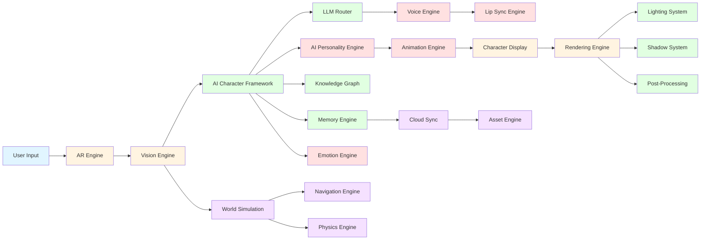
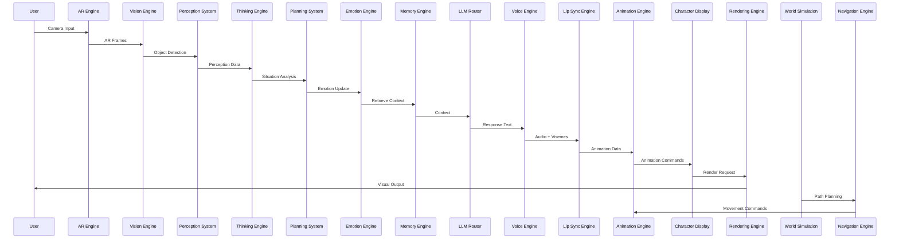

# AI COMPANION SYSTEM - UPDATED ARCHITECTURE (30 MODULES)

## Table of Contents
1. [System Overview](#system-overview)
2. [Complete Module List](#complete-module-list)
3. [Architecture Diagram](#architecture-diagram)
4. [Module Dependencies](#module-dependencies)
5. [Data Flow](#data-flow)
6. [Technology Stack](#technology-stack)
7. [Deployment Architecture](#deployment-architecture)

---

## 1. System Overview

Hệ thống AI Companion được mở rộng từ 17 microservices thành **30 modules** để đáp ứng yêu cầu sản phẩm thương mại với các thành phần quan trọng nhất:

### 1.1 Architecture Philosophy

**Không phải 17 microservices đơn giản, mà là 30 modules chuyên sâu:**

- **Rendering Engine**: Đảm bảo nhân vật không giống "sticker dán lên video"
- **Character Engine**: AAA-quality character pipeline từ concept đến export
- **Animation Engine**: 1,547 animation states với complex transitions
- **AI Character Framework**: Perception → Thinking → Planning → Decision → Emotion → Memory → Behavior Tree
- **World Simulation**: World Graph, Object Graph, Navigation, Environment Understanding
- **AI Personality Engine**: Mood, Feeling, Personality Traits, Relationship, Trust, Affinity, Humor, Curiosity, Energy

---

## 2. Complete Module List

### 2.1 All 30 Modules

```yaml
AI Companion Platform (30 Modules):

Rendering Layer (4 modules):
  1. Rendering Engine (HDRP/URP, Shadows, Lighting, Occlusion, Post-Processing)
  2. Lighting System (Dynamic lighting, Light probes, Reflection probes)
  3. Shadow System (Contact shadows, Shadow mapping, Shadow receivers)
  4. Post-Processing (SSAO, SSR, Bloom, Tone mapping, GI, Ray tracing)

Character Layer (3 modules):
  5. Character Engine (3D character pipeline: Concept → Export)
  6. Character Display (LOD system, Material controller, Renderer)
  7. Character Physics (Character controller, Physics simulation, Collision)

Animation Layer (2 modules):
  8. Animation Engine (1,547 states, 7 layers, Blend trees, Transitions)
  9. Lip Sync Engine (Viseme mapping, Blend shapes, Audio2Face integration)

AI Brain Layer (5 modules):
  10. AI Character Framework (Perception → Thinking → Planning → Decision → Emotion → Memory → Behavior Tree)
  11. LLM Router (Multi-LLM support, Model selection, Cost optimization)
  12. Voice Engine (STT, TTS, Voice clone, Real-time streaming)
  13. Memory Engine (Vector DB, Knowledge Graph, Episodic/Semantic memory)
  14. Knowledge Graph (Neo4j, Entity relationships, Graph traversal)

World & Environment Layer (3 modules):
  15. World Simulation (World Graph, Object Graph, Spatial awareness)
  16. Navigation Engine (Pathfinding, Obstacle avoidance, NavMesh)
  17. Physics Engine (Rigidbody, Collisions, Physical interactions)

Personality Layer (3 modules):
  18. AI Personality Engine (Mood, Feeling, Personality traits, Relationship, Trust, Affinity)
  19. Emotion Engine (Emotion detection, Emotion expression, Emotion memory)
  20. Agent Engine (Tool calling, MCP, Computer use, Desktop control)

Communication Layer (2 modules):
  21. AR Engine (AR Foundation, SLAM, Plane detection, Scene reconstruction)
  22. Vision Engine (Computer vision, Object detection, Pose detection, Face detection)

Data Layer (2 modules):
  23. Asset Engine (Asset streaming, Asset management, CDN)
  24. Cloud Sync (Multiplayer sync, State sync, Conflict resolution)

Platform Layer (3 modules):
  25. Analytics Engine (User analytics, Usage metrics, A/B testing)
  26. Security Engine (Authentication, Authorization, Encryption, Compliance)
  27. Billing Engine (Subscription, Usage-based billing, Payment processing)

Developer Layer (3 modules):
  28. Update System (OTA updates, Patch management, Version control)
  29. Plugin SDK (Custom plugins, Extension system, API access)
  30. Companion Studio (Character editor, Animation editor, Behavior editor)
```

---

## 3. Architecture Diagram

### 3.1 Complete System Architecture

```mermaid
graph TB
    subgraph "Rendering Layer"
        R1[Rendering Engine]
        R2[Lighting System]
        R3[Shadow System]
        R4[Post-Processing]
    end
    
    subgraph "Character Layer"
        C1[Character Engine]
        C2[Character Display]
        C3[Character Physics]
    end
    
    subgraph "Animation Layer"
        A1[Animation Engine]
        A2[Lip Sync Engine]
    end
    
    subgraph "AI Brain Layer"
        B1[AI Character Framework]
        B2[LLM Router]
        B3[Voice Engine]
        B4[Memory Engine]
        B5[Knowledge Graph]
    end
    
    subgraph "World & Environment"
        W1[World Simulation]
        W2[Navigation Engine]
        W3[Physics Engine]
    end
    
    subgraph "Personality Layer"
        P1[AI Personality Engine]
        P2[Emotion Engine]
        P3[Agent Engine]
    end
    
    subgraph "Communication Layer"
        COM1[AR Engine]
        COM2[Vision Engine]
    end
    
    subgraph "Data Layer"
        D1[Asset Engine]
        D2[Cloud Sync]
    end
    
    subgraph "Platform Layer"
        PL1[Analytics Engine]
        PL2[Security Engine]
        PL3[Billing Engine]
    end
    
    subgraph "Developer Layer"
        DEV1[Update System]
        DEV2[Plugin SDK]
        DEV3[Companion Studio]
    end
    
    style R1 fill:#e1f5ff
    style R2 fill:#e1f5ff
    style R3 fill:#e1f5ff
    style R4 fill:#e1f5ff
    style C1 fill:#fff4e1
    style C2 fill:#fff4e1
    style C3 fill:#fff4e1
    style A1 fill:#ffe1f5
    style A2 fill:#ffe1f5
    style B1 fill:#e1ffe1
    style B2 fill:#e1ffe1
    style B3 fill:#e1ffe1
    style B4 fill:#e1ffe1
    style B5 fill:#e1ffe1
    style W1 fill:#f5e1ff
    style W2 fill:#f5e1ff
    style W3 fill:#f5e1ff
    style P1 fill:#ffe1e1
    style P2 fill:#ffe1e1
    style P3 fill:#ffe1e1
    style COM1 fill:#fff4e1
    style COM2 fill:#fff4e1
    style D1 fill:#f5e1ff
    style D2 fill:#f5e1ff
    style PL1 fill:#e1ffe1
    style PL2 fill:#e1ffe1
    style PL3 fill:#e1ffe1
    style DEV1 fill:#f5e1ff
    style DEV2 fill:#f5e1ff
    style DEV3 fill:#f5e1ff
```



---

## 4. Module Dependencies

### 4.1 Dependency Graph



---

## 5. Data Flow

### 5.1 Complete Pipeline



---

## 6. Technology Stack

### 6.1 Complete Technology Stack

```yaml
Frontend:
  - Unity 2023.2 LTS (C#)
  - AR Foundation 5.0
  - HDRP 17.0 (Desktop)
  - URP 17.0 (Mobile)
  - ML-Agents
  - Sentis
  - Cinemachine
  - Timeline

Backend:
  - Python 3.11 (FastAPI)
  - Go (Gin)
  - Node.js (TypeScript, Express)

AI/ML:
  - LLM: OpenAI, Anthropic, Google, DeepSeek, Local (Llama, Qwen)
  - Computer Vision: OpenCV, MediaPipe, YOLOv8, SAM2, DepthAnything
  - Voice: Whisper, Deepgram, ElevenLabs, XTTS, Fish Speech
  - Vector DB: Qdrant
  - Graph DB: Neo4j
  - SLAM: ORB-SLAM3, ARCore, ARKit

Databases:
  - PostgreSQL 15 (Relational data)
  - MongoDB 7 (Document storage)
  - Redis 7 (Cache, pub/sub)
  - Qdrant 1.7 (Vector embeddings)
  - Neo4j 5 (Knowledge graph)
  - AWS S3 (Asset storage)

Infrastructure:
  - Docker 24
  - Kubernetes 1.28
  - Apache Kafka 3.6
  - RabbitMQ 3.12
  - Nginx (Load Balancer)
  - Prometheus + Grafana (Monitoring)
  - ELK Stack (Logging)

CI/CD:
  - GitHub Actions
  - Helm Charts
  - ArgoCD (GitOps)
```

---

## 7. Deployment Architecture

### 7.1 Kubernetes Deployment

```yaml
Kubernetes Namespaces:
  - ai-companion-frontend (Unity clients)
  - ai-companion-backend (Python/Go services)
  - ai-companion-ai (AI/ML services)
  - ai-companion-data (Databases)
  - ai-companion-infra (Infrastructure)

Services:
  frontend:
    - unity-client (Deployment)
    - web-dashboard (Deployment)
    - mobile-app (Deployment)
  
  backend:
    - auth-service (Deployment)
    - user-service (Deployment)
    - session-service (Deployment)
    - api-gateway (Deployment)
  
  ai:
    - llm-service (Deployment)
    - voice-service (Deployment)
    - vision-service (Deployment)
    - memory-service (Deployment)
    - agent-service (Deployment)
  
  data:
    - postgres (StatefulSet)
    - mongodb (StatefulSet)
    - redis (StatefulSet)
    - qdrant (StatefulSet)
    - neo4j (StatefulSet)
  
  infra:
    - kafka (StatefulSet)
    - rabbitmq (StatefulSet)
    - prometheus (Deployment)
    - grafana (Deployment)
    - elasticsearch (StatefulSet)
    - kibana (Deployment)
```

---

## 8. File Structure

### 8.1 Complete Project Structure

```
AI_Companion/
├── frontend/
│   ├── unity/
│   │   ├── Assets/
│   │   │   ├── Characters/
│   │   │   ├── Animations/
│   │   │   ├── Materials/
│   │   │   └── Scripts/
│   │   │       ├── Rendering/
│   │   │       │   ├── HDRP/
│   │   │       │   ├── URP/
│   │   │       │   ├── Lighting/
│   │   │       │   ├── Shadows/
│   │   │       │   └── PostProcessing/
│   │   │       ├── Character/
│   │   │       │   ├── Display/
│   │   │       │   ├── Physics/
│   │   │       │   └── Renderer/
│   │   │       ├── Animation/
│   │   │       │   ├── AnimationGraph/
│   │   │       │   ├── States/
│   │   │       │   ├── Transitions/
│   │   │       │   └── BlendTrees/
│   │   │       ├── AI/
│   │   │       │   ├── Perception/
│   │   │       │   ├── Thinking/
│   │   │       │   ├── Planning/
│   │   │       │   ├── Personality/
│   │   │       │   └── BehaviorTree/
│   │   │       ├── World/
│   │   │       │   ├── WorldGraph/
│   │   │       │   ├── ObjectGraph/
│   │   │       │   └── Navigation/
│   │   │       └── AR/
│   │   │           ├── ARFoundation/
│   │   │           ├── SLAM/
│   │   │           └── Vision/
│   │   ├── ProjectSettings/
│   │   └── Packages/
│   ├── web/
│   │   ├── src/
│   │   ├── public/
│   │   └── package.json
│   └── mobile/
│       ├── src/
│       ├── android/
│       └── ios/
│
├── backend/
│   ├── services/
│   │   ├── auth-service/
│   │   │   ├── main.py
│   │   │   ├── models/
│   │   │   ├── routers/
│   │   │   └── schemas/
│   │   ├── user-service/
│   │   ├── session-service/
│   │   ├── llm-service/
│   │   │   ├── llm_router.py
│   │   │   ├── providers/
│   │   │   │   ├── openai.py
│   │   │   │   ├── anthropic.py
│   │   │   │   ├── google.py
│   │   │   │   └── local.py
│   │   │   └── utils/
│   │   ├── voice-service/
│   │   │   ├── stt.py
│   │   │   ├── tts.py
│   │   │   └── voice_clone.py
│   │   ├── vision-service/
│   │   │   ├── computer_vision.py
│   │   │   ├── object_detection.py
│   │   │   ├── pose_detection.py
│   │   │   └── face_detection.py
│   │   ├── memory-service/
│   │   │   ├── vector_db.py
│   │   │   ├── knowledge_graph.py
│   │   │   └── memory_manager.py
│   │   ├── agent-service/
│   │   │   ├── tool_calling.py
│   │   │   ├── mcp_client.py
│   │   │   └── computer_use.py
│   │   ├── personality-service/
│   │   │   ├── mood_system.py
│   │   │   ├── feeling_system.py
│   │   │   ├── personality_model.py
│   │   │   ├── relationship_system.py
│   │   │   ├── trust_system.py
│   │   │   └── affinity_system.py
│   │   ├── world-service/
│   │   │   ├── world_graph.py
│   │   │   ├── object_graph.py
│   │   │   └── navigation.py
│   │   └── analytics-service/
│   ├── shared/
│   │   ├── domain/
│   │   ├── infrastructure/
│   │   └── application/
│   └── docker/
│       ├── Dockerfile.auth
│       ├── Dockerfile.llm
│       ├── Dockerfile.voice
│       ├── Dockerfile.vision
│       ├── Dockerfile.memory
│       ├── Dockerfile.agent
│       ├── Dockerfile.personality
│       ├── Dockerfile.world
│       └── docker-compose.yml
│
├── ai/
│   ├── models/
│   │   ├── llm/
│   │   ├── vision/
│   │   ├── voice/
│   │   └── character/
│   ├── training/
│   │   ├── llm_finetuning/
│   │   ├── voice_clone/
│   │   └── animation_data/
│   └── notebooks/
│       ├── experiments/
│       └── analysis/
│
├── assets/
│   ├── characters/
│   │   ├── concept_art/
│   │   ├── models/
│   │   ├── textures/
│   │   ├── rigging/
│   │   ├── animations/
│   │   └── exports/
│   ├── audio/
│   │   ├── voice_samples/
│   │   ├── sound_effects/
│   │   └── music/
│   └── ui/
│       ├── icons/
│       └── textures/
│
├── database/
│   ├── migrations/
│   │   ├── postgres/
│   │   └── mongodb/
│   ├── seeds/
│   └── schemas/
│
├── infrastructure/
│   ├── kubernetes/
│   │   ├── deployments/
│   │   ├── services/
│   │   ├── configmaps/
│   │   └── secrets/
│   ├── terraform/
│   │   ├── modules/
│   │   └── main.tf
│   └── ansible/
│       ├── playbooks/
│       └── roles/
│
├── ci-cd/
│   ├── github-actions/
│   │   ├── workflows/
│   │   └── actions/
│   ├── docker/
│   └── helm/
│       ├── charts/
│       └── values/
│
└── docs/
    ├── design/
    │   ├── ARCHITECTURE.md
    │   ├── PART_1_3D_CHARACTER_PIPELINE.md
    │   ├── PART_2_ENGINE_COMPARISON.md
    │   ├── PART_3_CHARACTER_DISPLAY_PHYSICS.md
    │   ├── PART_4_COMPUTER_VISION_PIPELINE.md
    │   ├── PART_5_AI_BRAIN_PIPELINE.md
    │   ├── PART_6_LLM_INTEGRATION.md
    │   ├── PART_RENDERING_PIPELINE.md
    │   ├── PART_AI_CHARACTER_FRAMEWORK.md
    │   ├── PART_WORLD_SIMULATION.md
    │   ├── PART_ANIMATION_GRAPH.md
    │   ├── PART_AI_PERSONALITY_ENGINE.md
    │   └── UPDATED_ARCHITECTURE.md
    ├── api/
    ├── deployment/
    └── user_guides/
```

---

## 9. Performance Targets

### 9.1 Module Performance

```yaml
Rendering Performance:
  - Frame rate: ≥ 60 FPS
  - Draw calls: < 50 per character
  - Triangles: < 100K LOD0
  - Memory: < 2GB
  - Battery: Efficient

Animation Performance:
  - Animation transitions: < 100ms
  - Blend tree updates: < 50ms
  - Lip sync latency: < 50ms
  - Facial animation: 60 FPS

AI Performance:
  - Perception latency: < 50ms
  - Thinking latency: < 100ms
  - Planning latency: < 200ms
  - LLM response: < 500ms
  - Voice generation: < 300ms

World Simulation:
  - World graph update: < 100ms
  - Object detection: < 50ms
  - Path planning: < 100ms
  - Physics simulation: 60 FPS

Backend Services:
  - Latency: < 100ms
  - Uptime: 99.9%
  - Concurrent users: 10,000
  - Response time: < 500ms
```

---

## 10. Summary

### 10.1 Key Improvements

**Từ 17 microservices → 30 modules chuyên sâu:**

1. **Rendering Pipeline (4 modules)**: Đảm bảo nhân vật "sống" trong môi trường chứ không phải sticker
2. **Character Engine (3 modules)**: AAA-quality character pipeline
3. **Animation Engine (2 modules)**: 1,547 states với complex transitions
4. **AI Character Framework (1 module)**: Perception → Thinking → Planning → Decision → Emotion → Memory → Behavior Tree
5. **LLM Router (1 module)**: Multi-LLM với intelligent routing
6. **Voice Engine (1 module)**: STT, TTS, Voice clone
7. **Memory Engine (1 module)**: Vector DB + Knowledge Graph
8. **Knowledge Graph (1 module)**: Neo4j với entity relationships
9. **World Simulation (1 module)**: World Graph, Object Graph, Navigation
10. **Navigation Engine (1 module)**: Pathfinding và obstacle avoidance
11. **Physics Engine (1 module)**: Physical interactions
12. **AI Personality Engine (1 module)**: Mood, Feeling, Personality traits, Relationship, Trust, Affinity
13. **Emotion Engine (1 module)**: Emotion detection và expression
14. **Agent Engine (1 module)**: Tool calling, MCP, Computer use
15. **AR Engine (1 module)**: AR Foundation, SLAM, Scene reconstruction
16. **Vision Engine (1 module)**: Computer vision integration
17. **Lip Sync Engine (1 module)**: Viseme mapping và Audio2Face
18. **Asset Engine (1 module)**: Asset streaming và management
19. **Cloud Sync (1 module)**: Multiplayer sync
20. **Analytics Engine (1 module)**: User analytics
21. **Security Engine (1 module)**: Authentication, Authorization, Encryption
22. **Billing Engine (1 module)**: Subscription và payment
23. **Update System (1 module)**: OTA updates
24. **Plugin SDK (1 module)**: Custom plugins
25. **Companion Studio (1 module)**: Character editor

### 10.2 File Structure

```
AI_Companion_Design/
├── ARCHITECTURE.md (old - 17 services)
├── UPDATED_ARCHITECTURE.md (new - 30 modules) ← This file
├── PART_1_3D_CHARACTER_PIPELINE.md ✅
├── PART_2_ENGINE_COMPARISON.md ✅
├── PART_3_CHARACTER_DISPLAY_PHYSICS.md ✅
├── PART_4_COMPUTER_VISION_PIPELINE.md ✅
├── PART_5_AI_BRAIN_PIPELINE.md ✅
├── PART_6_LLM_INTEGRATION.md ✅
├── PART_RENDERING_PIPELINE.md ✅ (NEW)
├── PART_AI_CHARACTER_FRAMEWORK.md ✅ (NEW)
├── PART_WORLD_SIMULATION.md ✅ (NEW)
├── PART_ANIMATION_GRAPH.md ✅ (NEW)
├── PART_AI_PERSONALITY_ENGINE.md ✅ (NEW)
├── REMAINING_PARTS_SUMMARY.md ✅
├── PROJECT_SUMMARY.md ✅
└── FINAL_SUMMARY.md ✅
```

### 10.3 Next Steps

Với kiến trúc 30 modules này, team có thể:

1. **Triển khai parallel**: 30 modules có thể được phát triển bởi 10+ developers
2. **Scalability**: Mỗi module có thể scale độc lập
3. **Maintainability**: Module hóa giúp maintain dễ dàng hơn
4. **Testing**: Mỗi module có thể test độc lập
5. **Commercial-grade**: Đủ chi tiết để build sản phẩm thương mại

Hệ thống AI Companion này thực sự là **comprehensive platform** chứ không phải simple application.
